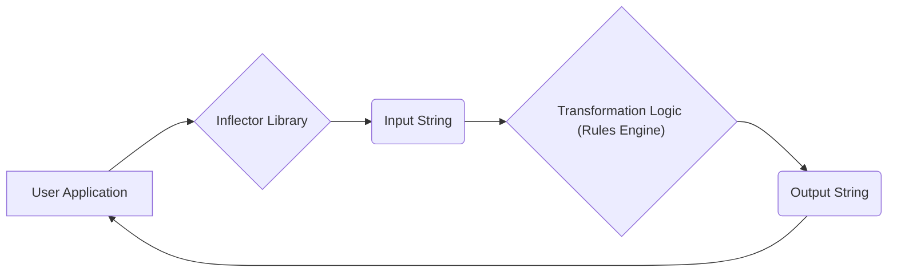
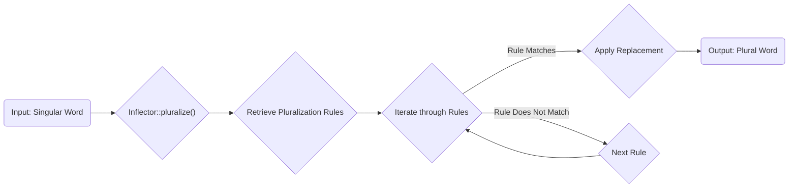

# Project Design Document: Doctrine Inflector Library

**Version:** 1.1
**Date:** October 26, 2023
**Author:** AI Software Architect

## 1. Project Overview

The Doctrine Inflector is a focused PHP library designed for accurate and reliable string transformations, primarily concerning the pluralization and singularization of English words. It also offers functionalities for converting strings between various case formats (e.g., `camelCase`, `snake_case`, `PascalCase`). This library is commonly integrated into other PHP applications, particularly those leveraging the Doctrine ORM or similar data mapping tools, to automate the generation of naming conventions for database tables, entity classes, and related identifiers.

This document details the design of the Doctrine Inflector library with a specific emphasis on providing the necessary context for effective threat modeling. It outlines the library's architecture, data flow, and core components, highlighting potential areas of security concern.

## 2. Goals

* To provide precise and dependable string transformations for pluralization and singularization of English words.
* To maintain a lightweight footprint with minimal external dependencies.
* To offer a straightforward and developer-friendly API.
* To facilitate seamless integration into diverse PHP projects.

## 3. Non-Goals

* Support for natural language processing (NLP) tasks beyond basic pluralization and singularization.
* Providing comprehensive localization or internationalization support for multiple languages (its scope is primarily English).
* Implementing advanced string manipulation features such as complex regular expression operations or sophisticated text parsing.
* Functioning as an independent security component or enforcing security policies (its primary role is string transformation).

## 4. Target Audience

This document is intended for:

* Security engineers and architects tasked with performing threat modeling on applications utilizing the Doctrine Inflector library.
* Software developers seeking a detailed understanding of the library's internal mechanisms and design.
* DevOps engineers involved in the deployment, configuration, and maintenance of applications that include this library.

## 5. System Architecture

The Doctrine Inflector library is structured around a set of static methods encapsulated within a few key classes. Its operation revolves around receiving string inputs and producing transformed string outputs. The library does not involve persistent data storage or external network communication.

* **Core Classes:**
    * `"Inflector"`: The primary interface of the library, offering static methods for various string transformation operations.
    * `"Rules"`:  Houses the regular expression-based rules that govern pluralization and singularization. These rules are structured as arrays of regular expression patterns and corresponding replacement strings.
    * `"(Internal Helper Classes)"`:  Potentially includes internal utility classes responsible for applying the defined rules.

* **Key Functionality Breakdown:**
    * **Pluralization:** Converts a singular word to its plural form by applying a series of regular expression rules defined within the `"Rules"` class. The input word is matched against the patterns, and if a match is found, the corresponding replacement is applied.
    * **Singularization:** Converts a plural word to its singular form, employing a distinct set of regular expression rules similar to pluralization.
    * **Case Conversion:** Offers methods for transforming strings into different case formats:
        * `"camelize"`: Transforms a `snake_case` string into `camelCase`.
        * `"classify"`: Transforms a table name into a class name (e.g., `"user_profiles"` becomes `"UserProfile"`).
        * `"tableize"`: Transforms a class name into a table name (e.g., `"UserProfile"` becomes `"user_profiles"`).
        * `"underscore"`: Transforms a `camelCase` string into `snake_case`.
        * `"humanize"`: Transforms an underscored or camel-cased string into a human-readable format (e.g., `"user_id"` becomes `"User id"`).

* **Dependency Profile:** The library is designed to be self-contained and primarily relies on the core functionalities of PHP itself. No external PHP libraries are strictly required for its basic operation.

## 6. Data Flow

The fundamental data flow within the Doctrine Inflector involves receiving a string as input by one of its static methods and returning a transformed string as the output.

* `"User Application"`: The PHP application that invokes the Inflector library's methods.
* `"Inflector Library"`: The Doctrine Inflector library itself.
* `"Input String"`: The string provided as an argument to an Inflector method (e.g., a word for pluralization).
* `"Transformation Logic (Rules Engine)"`: The core component where regular expressions from the `"Rules"` class are applied to the input string.
* `"Output String"`: The transformed string returned by the Inflector method.

**Detailed Data Flow for Pluralization (Example):**

* `"Input: Singular Word"`: The singular word intended for pluralization.
* `"Inflector::pluralize()"`: The specific static method called for pluralization.
* `"Retrieve Pluralization Rules"`: Accessing the array of pluralization rules from the `"Rules"` class.
* `"Iterate through Rules"`: Looping through each defined pluralization rule.
* `"Rule Matches"`: The current regular expression rule matches the input word.
* `"Apply Replacement"`: The defined replacement string for the matching rule is applied to the input.
* `"Output: Plural Word"`: The resulting pluralized word.
* `"Rule Does Not Match"`: The current rule's pattern does not match the input word.
* `"Next Rule"`: Proceeding to evaluate the next pluralization rule.

The data flow for singularization mirrors this process, utilizing a separate set of singularization rules. Case conversion methods employ different internal string manipulation techniques, often leveraging built-in PHP string functions.

## 7. Security Considerations (For Threat Modeling)

While the Doctrine Inflector primarily serves as a utility library and not a security-focused component, potential vulnerabilities can arise from its string manipulation logic, particularly within the context of a larger, more complex application.

* **Regular Expression Denial of Service (ReDoS):** The pluralization and singularization mechanisms heavily rely on regular expressions. Maliciously crafted input strings can exploit the complexity of these regular expressions, leading to excessive backtracking by the regex engine. This can result in significant CPU resource consumption and potentially cause a denial of service.
    * **Attack Vector:** Supplying unusually long or specifically crafted strings designed to trigger exponential backtracking in the regular expression matching process. For example, a long string consisting of repeating characters that nearly match a complex pattern could cause significant performance degradation.
    * **Affected Components:** The `"Rules"` class containing the regular expressions and the `pluralize()` and `singularize()` methods that apply these rules.

* **Generation of Unexpected Output due to Malformed Input:** While not a direct security vulnerability in isolation, providing unexpected or malformed input strings can lead to incorrect or unpredictable transformations. This can subsequently cause issues in the consuming application's logic, potentially leading to unexpected behavior or even security vulnerabilities in other parts of the system.
    * **Attack Vector:** Providing input strings containing unusual characters, encoding issues, or patterns not anticipated by the defined rules. For instance, inputting strings with excessive special characters or deliberately malformed UTF-8 sequences.
    * **Affected Components:** All transformation methods (`pluralize`, `singularize`, and case conversion methods) are potentially affected.

* **Indirect Injection Vulnerabilities:** If the output of the Inflector is directly incorporated into security-sensitive contexts without proper sanitization or validation (e.g., constructing database queries, generating file paths, or creating URLs), it can indirectly contribute to vulnerabilities like SQL injection, path traversal, or cross-site scripting (XSS) in the *consuming application*. The vulnerability resides in the application's handling of the Inflector's output, not the Inflector itself.
    * **Attack Vector:** Manipulating the input to the Inflector to produce output that, when used in a vulnerable context within the consuming application, enables the injection of malicious code or commands. For example, crafting input that results in Inflector output containing SQL keywords or special characters that bypass inadequate sanitization in a database query builder.
    * **Affected Components:** Indirectly, all transformation methods, as their output could be misused by a vulnerable consuming application.

* **Rule Manipulation (If Rules are Dynamically Loaded or Modifiable):** Although not the standard usage pattern, if the application allows for dynamic loading or modification of the inflector rules at runtime, this could introduce significant security vulnerabilities. An attacker could potentially inject malicious regular expression patterns or replacement strings, leading to ReDoS or the generation of arbitrary output.
    * **Attack Vector:** Compromising the source or storage mechanism of the rule definitions, allowing an attacker to inject malicious rules.
    * **Affected Components:** The `"Rules"` class and any mechanisms responsible for loading, storing, or modifying these rules.

**Important Note:** The actual risk posed by these potential vulnerabilities is highly dependent on how the Doctrine Inflector is integrated and utilized within the encompassing application. Proper input validation and output sanitization within the consuming application are crucial for mitigating these risks.

## 8. Dependencies

* **PHP:** The Doctrine Inflector is a PHP library and necessitates a compatible PHP version for execution. Specific version requirements are detailed in the library's `composer.json` file.
* **No other external PHP libraries are strictly required for its core functionality.**

## 9. Deployment

The Doctrine Inflector is typically deployed as a dependency within a larger PHP project using a package manager like Composer.

* **Installation Process:** Developers include the `doctrine/inflector` package in their project's `composer.json` file and execute the `composer install` command.
* **Usage within Application:** The library's static methods are then directly invoked within the application's PHP code.

The Inflector itself does not have a separate deployment process; it is integrated directly into the consuming application's codebase.

## 10. Future Considerations

* **Enhanced Rule Management:** Exploring more flexible and maintainable approaches to managing pluralization and singularization rules, potentially allowing for easier customization or extension.
* **Performance Analysis and Optimization:** Investigating potential performance bottlenecks, particularly within the regular expression matching engine, to improve efficiency for applications performing a high volume of string transformations.
* **Regular Security Audits:** Conducting periodic security reviews of the regular expression rules and the core transformation logic to proactively identify and address potential ReDoS vulnerabilities or other security concerns.

This document provides a detailed design overview of the Doctrine Inflector library, with a particular focus on aspects relevant to security considerations and future threat modeling efforts. A thorough understanding of the library's architecture, data flow, and potential areas of concern is essential for identifying and mitigating potential risks in applications that incorporate this component.