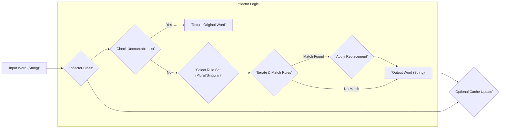
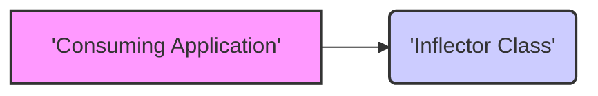
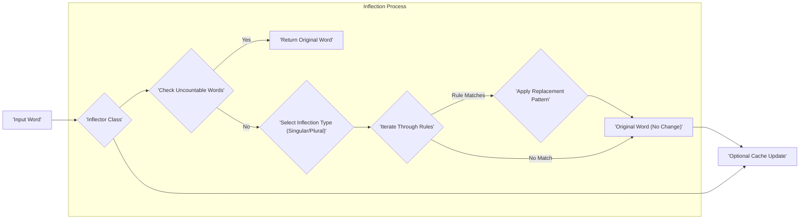

# Project Design Document: Doctrine Inflector

**Version:** 1.1
**Date:** October 26, 2023
**Author:** AI Software Architect

## 1. Introduction

This document provides an enhanced design overview of the Doctrine Inflector library, a PHP library dedicated to the singularization and pluralization of English words. This document is specifically crafted to serve as a comprehensive foundation for subsequent threat modeling activities, detailing the library's functionality, architecture, data flow, and key security considerations.

## 2. Project Overview

The Doctrine Inflector is a lightweight, standalone PHP library designed to transform English words between their singular and plural forms. It achieves this through a predefined set of rules, primarily regular expressions and their corresponding replacements. Its core purpose is to facilitate data manipulation and presentation within PHP applications, particularly in scenarios involving data modeling, database interactions, and user interface generation where consistent and accurate word forms are required. Understanding its role in transforming data is crucial for identifying potential security implications in consuming applications.

## 3. System Architecture

The Doctrine Inflector library maintains a straightforward architecture, centered around the `Inflector` class, which encapsulates all core inflection logic.

### 3.1. Components

*   **`Inflector` Class:** The central class of the library, responsible for the inflection process. It contains the following key elements:
    *   **`pluralize(string $word)` Method:** Accepts a singular word (string) as input and returns its plural form (string).
    *   **`singularize(string $word)` Method:** Accepts a plural word (string) as input and returns its singular form (string).
    *   **Pluralization Rules:** An internal collection (typically an array) of regular expressions and their corresponding replacement patterns used for converting singular words to plural.
    *   **Singularization Rules:** An internal collection (typically an array) of regular expressions and their corresponding replacement patterns used for converting plural words to singular.
    *   **Uncountable Words:** A list of words that are considered uncountable and thus are not subjected to the regular inflection rules.
    *   **Caching Mechanism (Optional):**  An internal cache (often an array) to store previously inflected words and their results, improving performance for repeated calls with the same input.
    *   **Custom Rule Management (Less Common):** Methods to add or modify inflection rules, typically used for extending the library's capabilities.

### 3.2. Data Flow

The data flow within the Inflector library is a linear process of applying rules to the input word:

**Detailed Data Flow:**

*   An input string (the word to be inflected) is passed to either the `pluralize()` or `singularize()` method of the `Inflector` class.
*   The library first checks if the input word exists in the list of uncountable words. If it does, the original word is returned immediately.
*   If the word is countable, the appropriate rule set (pluralization or singularization) is selected based on the method called.
*   The library iterates through the selected rule set, attempting to match the input word against each regular expression in the rules.
*   If a matching rule is found, the corresponding replacement pattern is applied to transform the word.
*   The transformed word is returned as the output. If no rule matches, the original word is typically returned.
*   Optionally, the input word and its inflected form are stored in the internal cache to optimize future requests for the same word.

### 3.3. Dependencies

The Doctrine Inflector library is designed to be self-contained and has **zero external dependencies**. It relies exclusively on built-in PHP functionalities, enhancing its portability and reducing potential points of failure or security vulnerabilities introduced by external code.

## 4. Security Considerations

While the Doctrine Inflector's primary function is string manipulation, its role in data transformation necessitates careful consideration of potential security implications within the context of its usage in larger applications.

### 4.1. Input Handling Vulnerabilities

*   **Maliciously Crafted Input:** Although the `Inflector` itself doesn't execute arbitrary code, passing excessively long strings or strings with unusual character combinations could potentially lead to performance degradation (a form of denial-of-service) within the `Inflector`'s regular expression matching engine or in the consuming application if not handled with appropriate resource limits.
*   **Locale Issues (Potentially):** While primarily focused on English, if the consuming application attempts to use the `Inflector` with non-English words or in a locale-sensitive manner without proper handling, it could lead to unexpected behavior or errors that might be exploitable in certain contexts.

### 4.2. Regular Expression Denial of Service (ReDoS)

*   **Complexity of Rules:** The library's reliance on regular expressions for its inflection rules introduces the risk of ReDoS. If the regular expressions are overly complex or contain backtracking vulnerabilities, a carefully crafted input string could cause the regular expression engine to consume excessive CPU resources, leading to a denial of service. While the current rules are generally considered safe, vigilance is required when adding or modifying rules.

### 4.3. Output Usage and Injection Attacks

*   **SQL Injection:** If the output of the `Inflector` is directly incorporated into SQL queries without proper parameterization or escaping, it could create a significant vulnerability to SQL injection attacks. For example, if a user-provided plural form is singularized and then used in a `WHERE` clause without sanitization.
*   **Cross-Site Scripting (XSS):** If the output of the `Inflector` is displayed in a web page without proper encoding, and the original input contained malicious script fragments (though unlikely in typical inflection scenarios), it could potentially lead to XSS vulnerabilities. This is more of a concern if custom rules or unusual input are involved.
*   **Command Injection (Less Likely):** While less direct, if the output of the `Inflector` is used to construct system commands without proper sanitization, it could theoretically open the door to command injection vulnerabilities, although this is highly dependent on the consuming application's logic.

### 4.4. Risks Associated with Custom Rules

*   **Introduction of Vulnerable Regular Expressions:** Allowing users or untrusted sources to define custom inflection rules poses a significant security risk. Malicious actors could introduce regular expressions specifically designed for ReDoS attacks or that produce unexpected and potentially harmful output.
*   **Unintended Output Manipulation:** Custom rules could be crafted to manipulate the output in ways that could be exploited in the consuming application's logic, leading to unexpected behavior or security flaws.

### 4.5. Cache Poisoning (Low Impact)

*   **Tampering with Cached Data:** While less critical for this specific library, if an attacker could somehow influence the input and observe the cached output, they might be able to subtly manipulate the application's behavior based on incorrect inflection. However, the impact of this is generally low for the Inflector.

## 5. Deployment Considerations

Deploying the Doctrine Inflector involves integrating it as a dependency within a larger PHP application. Security considerations during deployment primarily focus on the security of the consuming application.

*   **Dependency Management Security:** Utilize a secure dependency management tool like Composer and verify the integrity of the `doctrine/inflector` package to prevent the introduction of compromised versions.
*   **Secure Coding Practices in Consuming Application:** The application using the `Inflector` must implement robust security measures, including:
    *   **Input Validation and Sanitization:** Thoroughly validate and sanitize all user-provided input *before* passing it to the `Inflector`.
    *   **Output Encoding:** Properly encode the output of the `Inflector` before displaying it in web pages to prevent XSS.
    *   **Parameterized Queries:** Use parameterized queries or prepared statements when incorporating the `Inflector`'s output into database queries to prevent SQL injection.
    *   **Principle of Least Privilege:** Ensure the application runs with the minimum necessary permissions.

## 6. Future Considerations

*   **Regular Expression Review and Hardening:** Periodically review the existing regular expressions for potential ReDoS vulnerabilities and consider hardening them.
*   **Security Audits:** Conduct regular security audits of the library, especially if significant changes are made to the rule sets or core logic.
*   **Consider Alternative Approaches (If Necessary):** If performance or security concerns around regular expressions become significant, explore alternative inflection algorithms or data structures.

## 7. Diagrams

### 7.1. Component Diagram

### 7.2. Detailed Data Flow Diagram

## 8. Conclusion

The Doctrine Inflector, while a seemingly simple utility, plays a crucial role in data transformation within PHP applications. Understanding its internal workings and potential security implications, particularly concerning input handling, regular expression complexity, and output usage, is essential for building secure applications. This enhanced design document provides a more detailed foundation for conducting thorough threat modeling and implementing appropriate security measures when utilizing the Doctrine Inflector library.