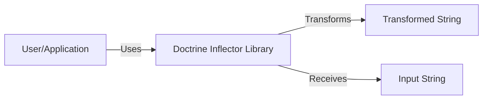
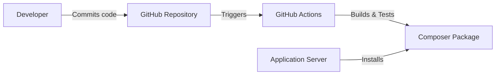
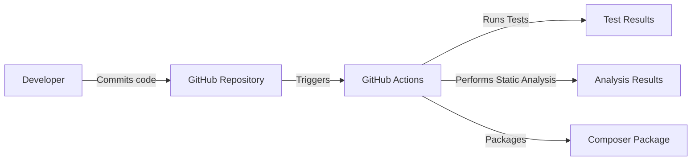

# BUSINESS POSTURE

Business Priorities and Goals:

*   Provide a lightweight, reusable library for string manipulation, specifically focusing on pluralization, singularization, and other related transformations.
*   Minimize external dependencies to ensure ease of integration and reduce potential conflicts.
*   Maintain high performance and efficiency, as the library is likely to be used in performance-sensitive contexts.
*   Ensure broad compatibility across different PHP versions.
*   Provide clear and comprehensive documentation to facilitate ease of use.
*   Maintain a stable and predictable API to minimize breaking changes.

Business Risks:

*   Inconsistent or incorrect string transformations leading to application errors or unexpected behavior.
*   Performance bottlenecks impacting the overall application performance.
*   Security vulnerabilities, such as injection attacks, if the library is misused or handles untrusted input improperly.
*   Compatibility issues with different PHP versions or environments.
*   Maintenance overhead and difficulty in evolving the library due to a complex or poorly designed codebase.

# SECURITY POSTURE

Existing Security Controls:

*   security control: Input validation: The library primarily deals with string transformations and doesn't directly handle user input in a way that would typically lead to injection vulnerabilities. However, it's crucial to ensure that the input strings provided to the library are properly validated and sanitized in the calling application. (Implicit in the library's purpose, but enforcement is external)
*   security control: Dependency management: The library has minimal external dependencies, reducing the attack surface and the risk of supply chain vulnerabilities. (Described in `composer.json`)
*   security control: Static analysis: The project uses static analysis tools like PHPStan to identify potential code quality and security issues. (Described in `composer.json` and GitHub Actions workflows)
*   security control: Automated testing: The project includes a comprehensive test suite to ensure the correctness and stability of the library's functionality. (Described in the `phpunit.xml.dist` file and GitHub Actions workflows)

Accepted Risks:

*   accepted risk: The library assumes that the input strings are provided in a safe and expected format. It does not perform extensive input validation or sanitization, relying on the calling application to handle this responsibility.
*   accepted risk: The library's functionality is limited to string transformations, and it does not directly interact with external systems or resources, reducing the scope of potential security risks.

Recommended Security Controls:

*   security control: Regularly update dependencies: Although the library has minimal dependencies, it's crucial to keep them updated to address any potential security vulnerabilities.
*   security control: Conduct periodic security reviews: Perform regular security assessments of the codebase to identify and address any potential vulnerabilities.
*   security control: Fuzz testing: Implement fuzz testing to identify edge cases and unexpected behavior that could lead to security vulnerabilities.

Security Requirements:

*   Authentication: Not applicable, as the library does not handle authentication.
*   Authorization: Not applicable, as the library does not handle authorization.
*   Input Validation: The calling application must ensure that input strings are properly validated and sanitized before being passed to the library. The library itself should document clearly the expected format and limitations of its input.
*   Cryptography: Not applicable, as the library does not perform cryptographic operations.

# DESIGN

## C4 CONTEXT

Element Description:

*   Element:
    *   Name: User/Application
    *   Type: User/System
    *   Description: Represents the user or application that utilizes the Doctrine Inflector library.
    *   Responsibilities:
        *   Provides input strings to the Inflector library.
        *   Consumes the transformed strings returned by the library.
        *   Handles input validation and sanitization.
    *   Security controls:
        *   Input validation and sanitization.

*   Element:
    *   Name: Doctrine Inflector Library
    *   Type: Library
    *   Description: Provides string manipulation functionalities, such as pluralization and singularization.
    *   Responsibilities:
        *   Transforms input strings according to the requested operation.
        *   Maintains a stable and predictable API.
        *   Ensures high performance and efficiency.
    *   Security controls:
        *   Minimal external dependencies.
        *   Static analysis.
        *   Automated testing.

## C4 CONTAINER

Element Description:

*   Element:
    *   Name: User/Application
    *   Type: User/System
    *   Description: Represents the user or application that utilizes the Doctrine Inflector library.
    *   Responsibilities:
        *   Provides input strings to the Inflector library.
        *   Consumes the transformed strings returned by the library.
        *   Handles input validation and sanitization.
    *   Security controls:
        *   Input validation and sanitization.

*   Element:
    *   Name: Doctrine Inflector Library
    *   Type: Library
    *   Description: Provides string manipulation functionalities, such as pluralization and singularization.
    *   Responsibilities:
        *   Transforms input strings according to the requested operation.
        *   Maintains a stable and predictable API.
        *   Ensures high performance and efficiency.
    *   Security controls:
        *   Minimal external dependencies.
        *   Static analysis.
        *   Automated testing.

*   Element:
    *   Name: Transformed String
    *   Type: Data
    *   Description: The output string after being processed by the Inflector library.
    *   Responsibilities: N/A
    *   Security controls: N/A

*   Element:
    *   Name: Input String
    *   Type: Data
    *   Description: The input string provided to the Inflector library.
    *   Responsibilities: N/A
    *   Security controls: N/A

## DEPLOYMENT

Deployment Solutions:

1.  Composer Package: The library is primarily distributed as a Composer package. This is the standard and recommended way to integrate the library into PHP projects.
2.  Manual Integration: While not recommended, it's technically possible to manually download the library's source code and include it in a project. This approach is discouraged due to the lack of dependency management and potential compatibility issues.

Chosen Solution (Composer Package):

Element Description:

*   Element:
    *   Name: Developer
    *   Type: Person
    *   Description: The developer working on the library or the application using the library.
    *   Responsibilities:
        *   Writes and commits code.
        *   Manages dependencies.
    *   Security controls:
        *   Code review.
        *   Secure coding practices.

*   Element:
    *   Name: GitHub Repository
    *   Type: System
    *   Description: The source code repository hosted on GitHub.
    *   Responsibilities:
        *   Stores the library's source code.
        *   Manages version control.
        *   Triggers build and deployment processes.
    *   Security controls:
        *   Access control.
        *   Branch protection rules.

*   Element:
    *   Name: GitHub Actions
    *   Type: System
    *   Description: The CI/CD platform used to automate the build, testing, and packaging processes.
    *   Responsibilities:
        *   Runs automated tests.
        *   Performs static analysis.
        *   Creates the Composer package.
    *   Security controls:
        *   Secure configuration.
        *   Regular updates.

*   Element:
    *   Name: Composer Package
    *   Type: Artifact
    *   Description: The packaged library ready for installation via Composer.
    *   Responsibilities: N/A
    *   Security controls: N/A

*   Element:
    *   Name: Application Server
    *   Type: System
    *   Description: The server where the application using the Inflector library is deployed.
    *   Responsibilities:
        *   Runs the application.
        *   Installs dependencies via Composer.
    *   Security controls:
        *   Server hardening.
        *   Regular security updates.

## BUILD

Build Process Description:

1.  Developer commits code to the GitHub repository.
2.  GitHub Actions is triggered by the commit.
3.  GitHub Actions runs the configured workflows:
    *   Runs the test suite using PHPUnit.
    *   Performs static analysis using PHPStan.
    *   If tests and analysis pass, packages the library for distribution via Composer.
4.  The Composer package is published to Packagist (implicitly, not shown in the diagram).

Security Controls:

*   Automated Testing: The project uses PHPUnit for automated testing, ensuring code quality and preventing regressions.
*   Static Analysis: PHPStan is used for static analysis, identifying potential bugs, security vulnerabilities, and code style issues.
*   Dependency Management: Composer is used for dependency management, ensuring that dependencies are tracked and updated.
*   CI/CD: GitHub Actions provides a secure and automated CI/CD pipeline.

# RISK ASSESSMENT

Critical Business Processes:

*   String transformation: The core functionality of the library is to provide accurate and reliable string transformations. Any failure in this process can directly impact the applications using the library.

Data Protection:

*   Data Sensitivity: The library itself does not handle sensitive data directly. It operates on strings, which may or may not contain sensitive information. The responsibility for protecting sensitive data lies with the application using the library.
*   Data to Protect: The library does not store or manage any data persistently.

# QUESTIONS & ASSUMPTIONS

Questions:

*   Are there any specific performance requirements or benchmarks that the library needs to meet?
*   Are there any specific character encodings or locales that the library needs to support beyond the standard PHP defaults?

Assumptions:

*   BUSINESS POSTURE: The primary goal is to provide a reliable and efficient string transformation library.
*   SECURITY POSTURE: The library relies on the calling application to handle input validation and sanitization.
*   DESIGN: The library is designed to be lightweight and have minimal dependencies.