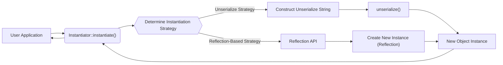

# Project Design Document: Doctrine Instantiator

**Version:** 1.1
**Date:** October 26, 2023
**Author:** AI Software Architect

## 1. Introduction

This document details the design of the Doctrine Instantiator library, a utility designed for creating instances of PHP classes without executing their constructors. This capability is crucial for scenarios like object hydration from data stores, mocking complex objects in testing, and situations where constructor side effects are undesirable. This document serves as a foundational resource for subsequent threat modeling activities, providing a clear understanding of the library's functionality and potential attack surfaces.

## 2. Goals and Objectives

* **Primary Goal:** To enable the instantiation of PHP class objects, irrespective of constructor visibility or logic.
* **Objectives:**
    * Provide a consistent mechanism for bypassing constructor execution.
    * Support instantiation for classes with public, protected, and private constructors.
    * Maintain a simple and easily integrable API for consuming applications.
    * Minimize external dependencies to reduce the attack surface and complexity.
    * Ensure reliable operation across various supported PHP versions.

## 3. Architecture Overview

The Doctrine Instantiator library leverages PHP's reflection capabilities and the `unserialize` mechanism to achieve constructor bypass. The core of the library is the `Instantiator` class, which acts as the primary interface. Internally, it employs different strategies based on the PHP environment to instantiate objects without invoking their constructors. The library aims for a clean separation of concerns, focusing solely on the instantiation process.

## 4. Detailed Design

### 4.1. Core Components

* **`Instantiator` Class:** This is the central and publicly accessible class. It offers the `instantiate(string $className)` method, which is the sole entry point for creating class instances.
* **Instantiation Strategies (Internal):** The `Instantiator` class internally selects and utilizes different strategies to create instances. These strategies are not part of the public API and are subject to change.
    * **`Unserialize` Strategy:** This is the most common approach. The library constructs a specific string representation of the object that, when passed to the `unserialize()` function, creates an uninitialized instance of the target class. This bypasses the constructor.
    * **Reflection-Based Factory (`ReflectionBasedAbstractFactory`):**  While less frequently used internally by the `Instantiator` directly, this component (or similar reflection techniques) might be employed in specific edge cases or for certain PHP versions. It uses the Reflection API to create a new object instance without calling the constructor. This might involve techniques like cloning a default instance or directly allocating memory.

### 4.2. Key Functionality: `Instantiator::instantiate()`

The `instantiate()` method orchestrates the object creation process:

1. **Receives Class Name:** Accepts the fully qualified name of the class to be instantiated as a string argument.
2. **Selects Instantiation Strategy:**  Determines the most appropriate internal strategy based on the current PHP environment and potentially the characteristics of the target class.
3. **Executes Instantiation:**
    * **If using `Unserialize` Strategy:** Constructs a specific string and passes it to `unserialize()`.
    * **If using Reflection-Based Strategy:** Uses the Reflection API to create a new instance.
4. **Returns Instance:** Returns the newly created object instance to the caller. The constructor of the instantiated class will *not* have been executed.

### 4.3. Data Flow

### 4.4. Dependencies

* **PHP Core:** The library's functionality relies on fundamental PHP features:
    * **`unserialize()` Function:**  The primary mechanism for bypassing constructor execution. Understanding the intricacies and potential vulnerabilities of `unserialize` is crucial for threat modeling.
    * **Reflection API (`ReflectionClass`, etc.):** Used for introspecting classes and potentially for direct instantiation in certain scenarios. The security implications of reflection access should be considered.

### 4.5. Error Handling

* The `instantiate()` method will throw a `InvalidArgumentException` if the provided `$className` is not a valid class name or if the class does not exist.
* Other internal exceptions might occur during the instantiation process if unexpected errors arise (e.g., memory issues), but these are generally not explicitly handled by the library and might propagate to the calling application.

## 5. Security Considerations (Pre-Threat Model)

The core functionality of bypassing constructors introduces inherent security considerations. Threat modeling should focus on the following potential areas of risk:

* **Circumvention of Intended Initialization:**  An attacker could leverage this library within a vulnerable application to create objects in an invalid or insecure state by bypassing the constructor's initialization logic. This could lead to unexpected behavior, data corruption, or the exploitation of vulnerabilities that rely on proper object initialization.
* **`unserialize()` Vulnerabilities:** While the library controls the input to `unserialize`, a deep understanding of potential vulnerabilities within the `unserialize()` function itself is crucial. If the library's usage patterns, or vulnerabilities in the PHP engine, allow for manipulation of the internal unserialize string (even indirectly), this could lead to remote code execution or other deserialization attacks.
* **Reflection API Abuse (Indirect):**  Although the library's use of reflection is internal, vulnerabilities in the PHP Reflection API, or unexpected behavior when combined with other application logic, could present risks. For example, unintended side effects of reflection operations could be exploited.
* **Object State Inconsistencies:**  Creating objects without running their constructors can lead to objects that violate their intended internal state and invariants. This can create vulnerabilities in consuming code that assumes objects are always in a valid state after construction. For example, mandatory properties might be null, leading to null pointer exceptions or incorrect logic execution.
* **Impact on Security Features:** If an application relies on constructor logic for security features (e.g., setting up access controls, initializing cryptographic keys), bypassing the constructor using this library could effectively disable those security measures.
* **Potential for Gadget Chains (related to `unserialize`):**  While the library doesn't directly process external serialized data, understanding how the created objects might interact with other parts of the application, especially in the context of `unserialize`, is important. Objects created via the instantiator could potentially be used as gadgets in a larger deserialization attack if they are later serialized and unserialized.

## 6. Deployment Considerations

The Doctrine Instantiator is typically deployed as a dependency within other PHP projects using a package manager like Composer. Its usage is intended for internal application logic, such as:

* **Object-Relational Mappers (ORMs):**  Hydrating entities from database results without re-running constructor logic.
* **Testing Frameworks:** Creating mock objects or stubs without invoking complex constructor dependencies.
* **Dependency Injection Containers:**  Potentially used in advanced scenarios for object creation.

It's crucial that developers understand the security implications of using this library and ensure that its usage does not introduce vulnerabilities into the consuming application.

## 7. Future Considerations

* **Exploring Alternative Instantiation Methods:** Investigating other techniques for bypassing constructors that might offer improved performance or security characteristics.
* **Security Audits and Hardening:**  Regular security reviews of the library's code to identify and mitigate potential vulnerabilities.
* **Documentation on Security Best Practices:** Providing clear guidance to developers on how to use the library securely and avoid common pitfalls.

This improved design document provides a more detailed and nuanced understanding of the Doctrine Instantiator library, specifically focusing on aspects relevant to threat modeling. It highlights potential attack surfaces and areas of concern that should be thoroughly investigated during the threat modeling process.
