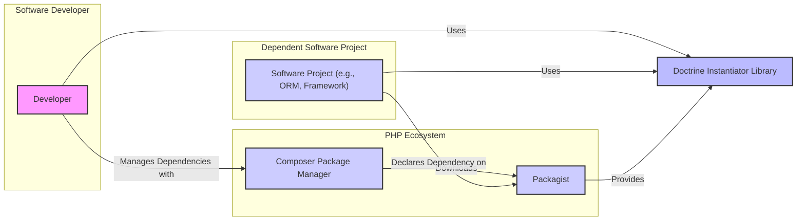
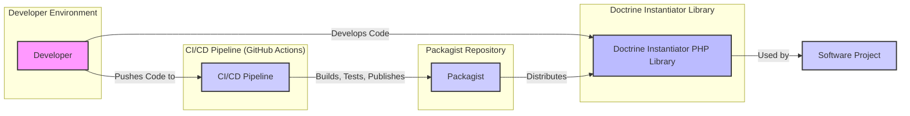
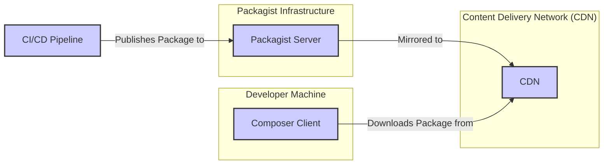
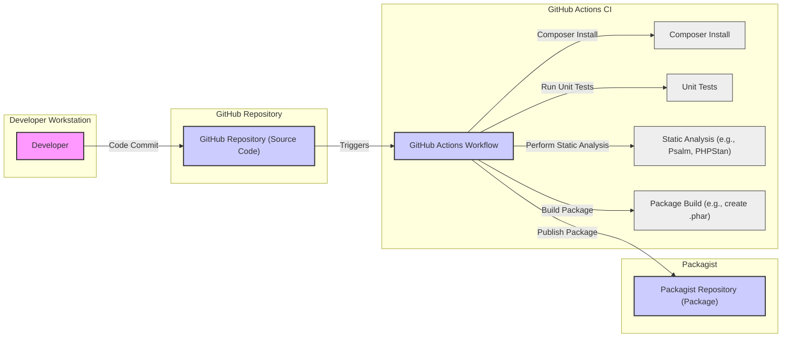

# BUSINESS POSTURE

This project, Doctrine Instantiator, is a PHP library designed to instantiate classes without invoking their constructors. It serves as a foundational component for other software, particularly within the PHP ecosystem, often used in Object-Relational Mappers (ORMs), testing frameworks, and dependency injection containers.

Business Priorities and Goals:
- Provide a stable and reliable mechanism for object instantiation in PHP.
- Offer a performant solution to avoid constructor execution when not needed.
- Maintain compatibility with various PHP versions and environments.
- Ensure ease of integration and use for developers.
- Foster community adoption and contribution to ensure long-term viability.

Business Risks:
- Vulnerabilities in the library could be exploited by dependent software, leading to security issues in applications using Doctrine Instantiator.
- Instability or bugs could disrupt the functionality of dependent software, impacting application reliability.
- Poor performance could negatively affect the performance of applications relying on the library.
- Lack of maintenance or community support could lead to the library becoming outdated and unusable over time.
- Supply chain attacks targeting the library could compromise applications that depend on it.

# SECURITY POSTURE

Existing Security Controls:
- security control: Open Source Code - The source code is publicly available on GitHub, allowing for community review and scrutiny. Implemented: GitHub repository.
- security control: Version Control - Git is used for version control, providing history and traceability of changes. Implemented: GitHub repository.
- security control: Issue Tracking - GitHub Issues are used for bug reports and feature requests, allowing for community feedback and vulnerability reporting. Implemented: GitHub repository.
- security control: Testing - Unit tests are included in the repository to ensure code quality and prevent regressions. Implemented: `tests/` directory and CI configuration.
- security control: Static Analysis - Likely performed by developers locally and potentially integrated into CI pipelines (though not explicitly stated in the repository). Implemented: Developer practices and potential CI integration.
- security control: Dependency Management - Composer is used for managing dependencies. Implemented: `composer.json` and `composer.lock`.

Accepted Risks:
- accepted risk: Reliance on Community Security Contributions - Security depends on the vigilance of the open-source community to identify and report vulnerabilities.
- accepted risk: Dependency Vulnerabilities - Vulnerabilities in third-party dependencies could indirectly affect the library.
- accepted risk: Lack of Formal Security Audits -  No explicit mention of regular professional security audits.

Recommended Security Controls:
- security control: Automated Dependency Scanning - Implement automated scanning of dependencies for known vulnerabilities in the CI/CD pipeline.
- security control: SAST (Static Application Security Testing) - Integrate SAST tools into the CI/CD pipeline to automatically detect potential code-level vulnerabilities.
- security control: Security Policy - Define and publish a security policy outlining how vulnerabilities should be reported and handled.
- security control: Regular Security Audits - Consider periodic security audits by security professionals to identify potential weaknesses.
- security control: Signed Releases - Sign releases to ensure integrity and prevent tampering.

Security Requirements:
- Authentication: Not directly applicable to a library. Authentication is relevant for systems that *use* this library, but not the library itself.
- Authorization: Not directly applicable to a library. Authorization is relevant for systems that *use* this library.
- Input Validation: While the library's primary function is instantiation, input validation is crucial in the context of how the library is *used*.  Applications using this library must ensure that class names and other inputs provided to the instantiator are properly validated to prevent unexpected behavior or vulnerabilities in the application itself. The library should be robust against invalid class names or unexpected input types, failing gracefully and predictably.
- Cryptography: Not directly applicable to the core functionality of the instantiator library itself. However, if future features or dependencies introduce cryptographic operations, they must be implemented securely, following best practices and using well-vetted cryptographic libraries.

# DESIGN

## C4 CONTEXT

Context Diagram Elements:

- Element:
    - Name: Developer
    - Type: Person
    - Description: Software developers who use Doctrine Instantiator in their PHP projects.
    - Responsibilities: Integrate and utilize the library in their software projects. Report issues and contribute to the library.
    - Security controls: Secure development practices on their local machines. Code review processes within their teams.

- Element:
    - Name: Composer Package Manager
    - Type: Software System
    - Description: PHP dependency management tool used by developers to include Doctrine Instantiator in their projects.
    - Responsibilities: Resolve and download dependencies, including Doctrine Instantiator, from package repositories.
    - Security controls: Secure download and installation processes. Verification of package integrity (through checksums, signatures - if available).

- Element:
    - Name: Packagist
    - Type: Software System
    - Description: The main package repository for PHP packages, where Doctrine Instantiator is published and distributed.
    - Responsibilities: Host and distribute PHP packages, including Doctrine Instantiator. Ensure package availability and integrity.
    - Security controls: Package integrity checks. Vulnerability scanning of hosted packages. Access controls to package publishing.

- Element:
    - Name: Software Project (e.g., ORM, Framework)
    - Type: Software System
    - Description:  Various PHP applications and libraries that depend on Doctrine Instantiator for object instantiation functionality.
    - Responsibilities: Utilize Doctrine Instantiator to instantiate classes within their own codebase.
    - Security controls: Secure coding practices. Input validation when using the instantiator. Dependency management and vulnerability monitoring.

- Element:
    - Name: Doctrine Instantiator Library
    - Type: Software System
    - Description: PHP library providing functionality to instantiate classes without invoking constructors.
    - Responsibilities: Provide a reliable and secure mechanism for object instantiation. Maintain code quality and address reported issues.
    - Security controls: Unit testing. Static analysis. Potential future security audits. Secure development practices by maintainers.

## C4 CONTAINER

Container Diagram Elements:

- Element:
    - Name: Doctrine Instantiator PHP Library
    - Type: Library
    - Description:  The core PHP library providing the object instantiation functionality. It's the deployable unit distributed via Packagist.
    - Responsibilities:  Provide the core logic for instantiating classes without constructors. Expose a public API for use by other PHP projects.
    - Security controls: Code reviews. Unit testing. Static analysis. Input validation within the library (handling class names, etc.).

- Element:
    - Name: CI/CD Pipeline (GitHub Actions)
    - Type: Automation System
    - Description:  Automated system for building, testing, and publishing the library. Likely implemented using GitHub Actions.
    - Responsibilities: Automate the build process. Run unit tests. Perform static analysis. Package the library for distribution. Publish releases to Packagist.
    - Security controls: Secure CI/CD configuration. Access control to CI/CD pipelines. Secrets management for publishing credentials. Automated testing and security checks within the pipeline.

- Element:
    - Name: Packagist
    - Type: Package Repository
    - Description:  The PHP package repository where the compiled and packaged library is hosted for distribution.
    - Responsibilities: Store and serve the library package. Manage versions and releases.
    - Security controls: Infrastructure security. Access controls. Package integrity checks.

- Element:
    - Name: Developer Environment
    - Type: Development Environment
    - Description:  The local environment used by developers to write, test, and contribute to the library's code.
    - Responsibilities: Code development. Local testing. Contribution to the project.
    - Security controls: Secure developer workstations. Code review processes.

## DEPLOYMENT

Deployment Architecture: Packagist Distribution

Deployment Diagram Elements:

- Element:
    - Name: Packagist Server
    - Type: Server
    - Description:  The main server infrastructure hosting the Packagist package repository.
    - Responsibilities: Store package metadata and package files. Manage package versions and releases. Serve package information to Composer clients.
    - Security controls: Infrastructure security. Access controls. Regular security updates and patching.

- Element:
    - Name: CDN
    - Type: Content Delivery Network
    - Description:  A network of geographically distributed servers used to cache and deliver package files to developers with low latency.
    - Responsibilities: Cache package files. Serve package downloads to Composer clients. Improve download speed and availability.
    - Security controls: CDN infrastructure security. Protection against DDoS attacks. Secure content delivery.

- Element:
    - Name: Composer Client
    - Type: Client Application
    - Description:  The Composer command-line tool running on developer machines, used to download and install PHP packages.
    - Responsibilities: Resolve dependencies. Download packages from Packagist (via CDN). Install packages into PHP projects.
    - Security controls: Secure communication channels (HTTPS). Package integrity verification (checksums, signatures - if available).

- Element:
    - Name: CI/CD Pipeline
    - Type: Automation System
    - Description:  The CI/CD pipeline responsible for building and publishing the library package to Packagist.
    - Responsibilities: Package the library. Authenticate with Packagist. Upload the package to Packagist.
    - Security controls: Secure credentials management for Packagist access. Secure pipeline execution environment.

## BUILD

Build Process: GitHub Actions with Composer

Build Diagram Elements:

- Element:
    - Name: Developer
    - Type: Person
    - Description:  Software developer writing and committing code changes.
    - Responsibilities: Write code. Run local tests. Commit code to the GitHub repository.
    - Security controls: Secure coding practices. Local development environment security. Code review before committing.

- Element:
    - Name: GitHub Repository (Source Code)
    - Type: Code Repository
    - Description:  GitHub repository hosting the source code of Doctrine Instantiator.
    - Responsibilities: Store source code. Manage code versions. Trigger CI/CD pipelines on code changes.
    - Security controls: Access controls to the repository. Branch protection. Audit logging.

- Element:
    - Name: GitHub Actions Workflow
    - Type: CI/CD System
    - Description:  GitHub Actions workflow defined in the repository to automate the build, test, and publish process.
    - Responsibilities: Orchestrate the build process. Execute build steps. Report build status.
    - Security controls: Secure workflow definition. Access control to workflow configuration. Secrets management for publishing credentials.

- Element:
    - Name: Composer Install
    - Type: Build Step
    - Description:  Step in the CI/CD pipeline that installs PHP dependencies using Composer.
    - Responsibilities: Download and install dependencies defined in `composer.json`.
    - Security controls: Dependency integrity checks by Composer.

- Element:
    - Name: Unit Tests
    - Type: Build Step
    - Description:  Step in the CI/CD pipeline that executes unit tests to verify code functionality.
    - Responsibilities: Run unit tests. Report test results. Ensure code quality and prevent regressions.
    - Security controls: Well-written and comprehensive unit tests.

- Element:
    - Name: Static Analysis (e.g., Psalm, PHPStan)
    - Type: Build Step
    - Description:  Step in the CI/CD pipeline that performs static analysis to detect potential code defects and vulnerabilities.
    - Responsibilities: Analyze code for potential issues. Report static analysis findings. Improve code quality and security.
    - Security controls: Properly configured static analysis tools. Review and address findings.

- Element:
    - Name: Package Build (e.g., create .phar)
    - Type: Build Step
    - Description:  Step in the CI/CD pipeline that packages the library for distribution (e.g., creating a .phar archive or preparing files for Packagist).
    - Responsibilities: Package the library. Prepare distribution files.
    - Security controls: Secure packaging process. Integrity of the packaged artifacts.

- Element:
    - Name: Packagist Repository (Package)
    - Type: Package Repository
    - Description:  Packagist repository where the built package is published.
    - Responsibilities: Host and distribute the library package.
    - Security controls: Access controls to package publishing. Package integrity checks on Packagist.

# RISK ASSESSMENT

Critical Business Processes:
- Software development within the PHP ecosystem that relies on object instantiation without constructor invocation.
- Functionality of ORMs, frameworks, testing tools, and other libraries that depend on Doctrine Instantiator.

Data to Protect and Sensitivity:
- Source code of Doctrine Instantiator: Intellectual property, contains logic and potential vulnerabilities. High sensitivity.
- Packaged library (distributed via Packagist):  Integrity and availability are crucial for dependent projects. High sensitivity.
- Build artifacts and CI/CD pipeline configurations:  Secrets and configurations that could be exploited to compromise the build or publishing process. High sensitivity.

# QUESTIONS & ASSUMPTIONS

Questions:
- Is there a formal security policy for reporting and handling vulnerabilities?
- Are there any plans for regular security audits?
- Are releases signed to ensure integrity?
- What static analysis tools are currently used, if any?
- Is dependency vulnerability scanning currently implemented in the CI/CD pipeline?

Assumptions:
- The project is intended for use in production environments and requires a reasonable level of security.
- The project maintainers are committed to addressing security vulnerabilities.
- The project uses GitHub Actions for CI/CD.
- Developers using the library are responsible for input validation in their own applications.
- Packagist provides a reasonably secure platform for package distribution.