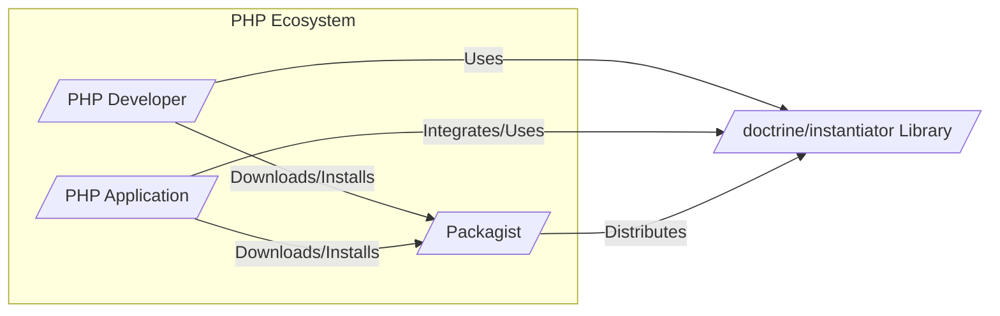
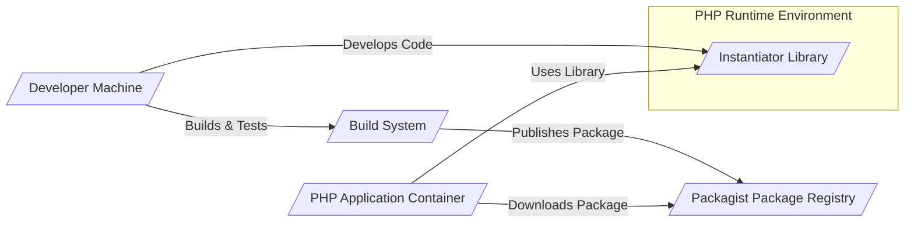
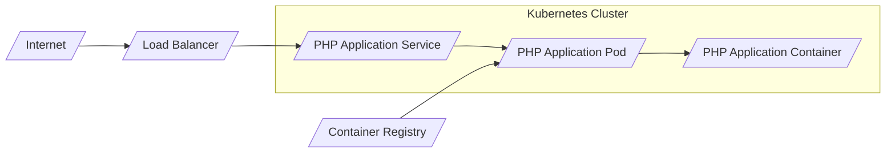
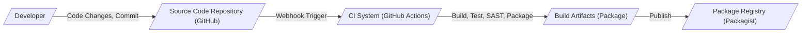

# BUSINESS POSTURE

This project, `doctrine/instantiator`, is a PHP library designed to instantiate classes without invoking their constructors. This is primarily useful in scenarios such as:

- Object-relational mappers (ORMs) needing to hydrate objects from databases without triggering constructor logic.
- Dependency injection containers needing to create instances without specific constructor arguments.
- Testing frameworks needing to create mock objects or instances for testing purposes without side effects from constructors.
- Deserialization processes where objects need to be created from serialized data structures.

The primary business priority this library addresses is to provide a utility for controlled object instantiation in PHP, enabling more flexible and efficient software development in the contexts mentioned above.

Key business risks associated with this project include:

- Risk of unexpected object states: Instantiating objects without constructors might bypass initialization logic, leading to objects in invalid or unexpected states if not handled carefully by the consuming application.
- Risk of dependency vulnerability: If this library contains vulnerabilities, applications depending on it could be affected. This is especially relevant if the library is used in critical business applications.
- Risk of misuse: Developers might misuse this library in contexts where constructor invocation is actually necessary, leading to application errors or unexpected behavior.
- Risk of supply chain compromise: If the library's distribution channel (e.g., Packagist) or build process is compromised, malicious code could be injected, affecting all applications that depend on it.

# SECURITY POSTURE

Existing security controls for this project are primarily focused on standard open-source development practices:

- security control: Public code repository on GitHub, allowing for community review and scrutiny. Implemented: GitHub repository.
- security control: Use of GitHub Actions for continuous integration, potentially including basic static analysis or testing. Implemented: `.github/workflows` directory in the repository.
- security control: Distribution via Packagist, a widely used PHP package repository, which has its own security measures. Implemented: Packagist.

Accepted risks for this project, based on the information available, might include:

- accepted risk: Reliance on community contributions for security vulnerability identification and patching.
- accepted risk: Limited dedicated security team actively monitoring and securing the project.
- accepted risk: Potential vulnerabilities in dependencies used by the library itself (though it aims to be dependency-free).

Recommended security controls to enhance the security posture:

- recommended security control: Implement automated dependency scanning to detect vulnerabilities in any development-time dependencies.
- recommended security control: Integrate static application security testing (SAST) tools into the CI/CD pipeline to automatically detect potential code-level vulnerabilities.
- recommended security control: Consider code signing the released packages to ensure integrity and authenticity of the distributed library.
- recommended security control: Establish a clear security vulnerability reporting process to allow users to report potential issues responsibly.

Security requirements for this project:

- Authentication: Not directly applicable as this is a library. Authentication is relevant for the systems that *use* this library, but not the library itself.
- Authorization: Not directly applicable as this is a library. Authorization is relevant for the systems that *use* this library.
- Input Validation: Input validation is important. The library takes class names as input. While not directly user-provided input in most cases, validating that the input is a valid class name and handling potential errors gracefully is necessary to prevent unexpected behavior or potential abuse if class names are dynamically determined based on external factors.
- Cryptography: Cryptography is not a core requirement for this library as it does not handle sensitive data directly. However, if code signing is implemented for distribution, cryptographic keys and processes will be involved.

# DESIGN

## C4 CONTEXT

### C4 Context Elements

- Name: PHP Developer
  - Type: Person
  - Description: Software developers who use PHP and might utilize the `doctrine/instantiator` library in their projects.
  - Responsibilities: Develops and maintains PHP applications, integrates and uses the `doctrine/instantiator` library, reports issues and contributes to the library.
  - Security controls: Follows secure coding practices when using the library, keeps dependencies updated, reports potential security vulnerabilities.

- Name: PHP Application
  - Type: Software System
  - Description: PHP applications that integrate and use the `doctrine/instantiator` library to instantiate objects without constructors. These applications can range from simple scripts to complex web applications, ORMs, and frameworks.
  - Responsibilities: Utilizes the library for object instantiation, manages dependencies, handles potential exceptions from the library, ensures secure usage of instantiated objects.
  - Security controls: Input validation of data used to determine which classes to instantiate (if dynamically determined), secure configuration and deployment, regular security audits and updates of dependencies.

- Name: Packagist
  - Type: Software System
  - Description: The primary package repository for PHP. It hosts and distributes the `doctrine/instantiator` library as a Composer package.
  - Responsibilities: Hosts and distributes the library, manages package versions, provides download statistics, ensures package integrity.
  - Security controls: Package signing, malware scanning, access controls for package maintainers, infrastructure security.

- Name: doctrine/instantiator Library
  - Type: Software System
  - Description: A PHP library that provides functionality to instantiate PHP classes without invoking their constructors.
  - Responsibilities: Provides a reliable and secure mechanism for constructor-less instantiation, maintains code quality, addresses reported issues, releases new versions, ensures compatibility.
  - Security controls: Secure coding practices, input validation (of class names), static analysis, testing, potentially code signing of releases, vulnerability reporting process.

## C4 CONTAINER

### C4 Container Elements

- Name: Instantiator Library
  - Type: Container - Library
  - Description: The core PHP library code that provides the functionality to instantiate classes without constructors. It's a set of PHP classes and functions.
  - Responsibilities: Provides the core instantiation logic, handles different PHP versions and instantiation methods, manages potential errors during instantiation.
  - Security controls: Input validation of class names, secure coding practices, static analysis, unit and integration testing.

- Name: Build System
  - Type: Container - Automation
  - Description: An automated system (e.g., GitHub Actions) that builds, tests, and packages the library. It's responsible for CI/CD processes.
  - Responsibilities: Automates build process, runs tests, performs static analysis, packages the library for distribution, publishes releases to Packagist.
  - Security controls: Secure CI/CD pipeline configuration, access control to pipeline configuration and secrets, dependency scanning, SAST integration, build artifact integrity checks.

- Name: Packagist Package Registry
  - Type: Container - Package Registry
  - Description: The Packagist package registry where the compiled and packaged library is stored and distributed.
  - Responsibilities: Stores and distributes the library package, manages versions, provides download access.
  - Security controls: Package signing, malware scanning, access controls, infrastructure security.

- Name: Developer Machine
  - Type: Container - Development Environment
  - Description: The local development environment used by developers to write, test, and build the library.
  - Responsibilities: Code development, local testing, version control, contribution to the project.
  - Security controls: Secure development practices, code review, local security tools, secure access to development environment.

- Name: PHP Application Container
  - Type: Container - Application Runtime
  - Description: The runtime environment where PHP applications that use the `doctrine/instantiator` library are executed. This could be a web server, CLI environment, etc.
  - Responsibilities: Executes PHP applications, loads and uses the `doctrine/instantiator` library, manages application dependencies.
  - Security controls: Secure application deployment, dependency management, runtime environment security, input validation in applications using the library.

## DEPLOYMENT

The `doctrine/instantiator` library itself is not "deployed" in the traditional sense of applications. It's distributed as a package and then integrated into other PHP applications. Therefore, the deployment context is primarily about how applications that *use* this library are deployed.

For applications using `doctrine/instantiator`, typical PHP deployment environments include:

- **Shared Hosting:**  Less common for modern applications, but still exists. Deployment usually involves uploading files via FTP or control panels.
- **Virtual Private Servers (VPS):** More control than shared hosting. Deployment often involves manual server configuration and file transfer (e.g., using SSH and rsync).
- **Cloud Platforms (AWS, GCP, Azure):** Highly scalable and automated. Deployment can use various services like EC2, Compute Engine, Azure VMs, container services (ECS, GKE, AKS), and serverless functions.
- **Containerized Environments (Docker, Kubernetes):** Increasingly popular for modern applications. Deployment involves building Docker images and orchestrating containers using Kubernetes or similar platforms.

Let's focus on a **Containerized Environment (Kubernetes)** deployment as a representative modern approach.

### Deployment Elements

- Name: Internet
  - Type: Environment - Network
  - Description: The public internet, representing external users accessing the PHP application.
  - Responsibilities: Provides network connectivity for users to access the application.
  - Security controls: General internet security measures, DDoS protection at the infrastructure level.

- Name: Load Balancer
  - Type: Infrastructure - Network Component
  - Description: Distributes incoming traffic across multiple instances of the PHP application for scalability and availability.
  - Responsibilities: Load balancing, traffic routing, SSL termination, basic security filtering.
  - Security controls: SSL/TLS encryption, rate limiting, web application firewall (WAF) integration, access logs.

- Name: PHP Application Service
  - Type: Kubernetes - Service
  - Description: A Kubernetes Service that exposes the PHP application pods within the cluster.
  - Responsibilities: Service discovery, load balancing within the cluster, abstracting underlying pods.
  - Security controls: Network policies to control traffic flow, service account management, RBAC for access control.

- Name: PHP Application Pod
  - Type: Kubernetes - Pod
  - Description: A Kubernetes Pod that encapsulates one or more containers running the PHP application.
  - Responsibilities: Running the application containers, managing container lifecycle within the pod.
  - Security controls: Pod security policies/Pod security admission, resource limits, security context settings, network policies.

- Name: PHP Application Container
  - Type: Container - Application Runtime
  - Description: A Docker container running the PHP application that uses the `doctrine/instantiator` library.
  - Responsibilities: Executing the PHP application code, using the `doctrine/instantiator` library, handling requests.
  - Security controls: Container image security scanning, least privilege user within the container, application-level security controls (authentication, authorization, input validation).

- Name: Container Registry
  - Type: Infrastructure - Registry
  - Description: A container registry (e.g., Docker Hub, private registry) that stores and distributes Docker images for the PHP application.
  - Responsibilities: Storing container images, providing access control to images, ensuring image integrity.
  - Security controls: Access control to the registry, image scanning for vulnerabilities, content trust/image signing.

## BUILD

### Build Elements

- Name: Developer
  - Type: Person
  - Description: A software developer contributing to the `doctrine/instantiator` project.
  - Responsibilities: Writes code, commits changes, creates pull requests, performs code reviews.
  - Security controls: Secure coding practices, code review process, access control to the source code repository.

- Name: Source Code Repository (GitHub)
  - Type: System - Version Control
  - Description: GitHub repository hosting the source code of `doctrine/instantiator`.
  - Responsibilities: Version control, code storage, collaboration platform, pull request management.
  - Security controls: Access control (authentication and authorization), branch protection, audit logs, vulnerability scanning for repository settings.

- Name: CI System (GitHub Actions)
  - Type: System - CI/CD
  - Description: GitHub Actions workflow configured to automatically build, test, and package the library upon code changes.
  - Responsibilities: Automated build process, running unit tests, performing static analysis, creating distributable packages, publishing releases.
  - Security controls: Secure workflow configuration, secret management, access control to workflow configuration and secrets, dependency scanning, SAST integration, build artifact integrity checks.

- Name: Build Artifacts (Package)
  - Type: Data - Package
  - Description: The packaged library (e.g., a ZIP or PHAR archive) produced by the build system.
  - Responsibilities: Contains the compiled and packaged library code, ready for distribution.
  - Security controls: Integrity checks (checksums, signatures), secure storage during the build process.

- Name: Package Registry (Packagist)
  - Type: System - Package Registry
  - Description: Packagist, the PHP package registry, where the built library package is published for distribution.
  - Responsibilities: Hosting and distributing the library package, managing versions, providing download access.
  - Security controls: Package signing, malware scanning, access controls for package maintainers, infrastructure security.

# RISK ASSESSMENT

Critical business processes we are trying to protect indirectly are the functionalities of PHP applications that rely on `doctrine/instantiator`. If the library is compromised or has vulnerabilities, it could impact the integrity and security of these applications. Directly, we are protecting the integrity and availability of the `doctrine/instantiator` library itself, ensuring it remains a trustworthy component for the PHP ecosystem.

Data we are trying to protect:

- Source code of `doctrine/instantiator`: Sensitivity - Public, but integrity is crucial. Modification by unauthorized parties or injection of malicious code would be a high-impact security incident.
- Build artifacts (packages): Sensitivity - Public, but integrity is crucial. Compromised packages distributed to users would have a high impact.
- Secrets used in the build process (e.g., Packagist API keys): Sensitivity - Confidential. Exposure could allow unauthorized package releases.

Sensitivity levels:

- Source code: Publicly available, but integrity is critical.
- Build artifacts: Publicly distributed, but integrity is critical.
- Secrets: Confidential, high sensitivity.

# QUESTIONS & ASSUMPTIONS

Questions:

- What is the intended scope of security for this design document? Is it primarily focused on the library itself, or also on the applications that consume it? (Assumption: Primarily focused on the library and its build/distribution, with considerations for consumers).
- Are there any specific compliance requirements or security standards that the `doctrine/instantiator` project needs to adhere to? (Assumption: No specific compliance requirements beyond general good security practices for open-source projects).
- What is the expected threat model for this library? Who are the potential adversaries and what are their motivations? (Assumption: Potential adversaries could be malicious actors attempting to inject vulnerabilities into the library for supply chain attacks, or opportunistic attackers exploiting existing vulnerabilities).
- Is there a dedicated security team or point of contact for security-related issues for this project? (Assumption: Likely relies on community contributions and maintainers for security).

Assumptions:

- BUSINESS POSTURE: The primary business goal is to provide a utility library for PHP developers. The main business risk is related to supply chain security and potential misuse of the library.
- SECURITY POSTURE: Current security posture relies on standard open-source practices. Recommended security controls are focused on enhancing automated security checks and distribution integrity.
- DESIGN: The library is distributed as a Composer package. The build process is automated using GitHub Actions. Deployment context is primarily about applications that use the library, with a focus on containerized deployments as a modern example.