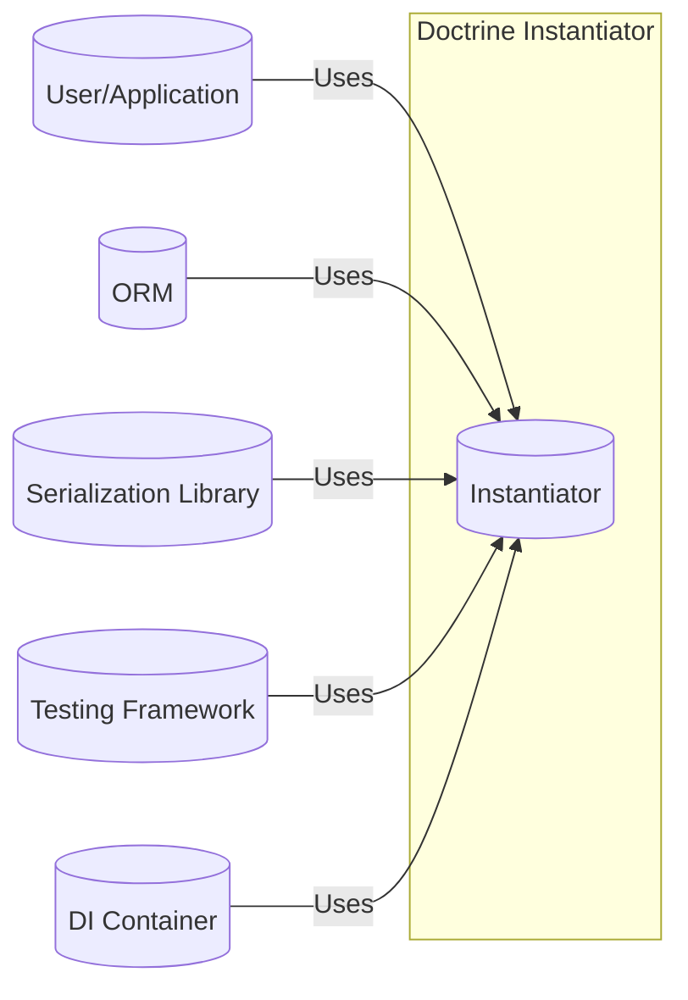
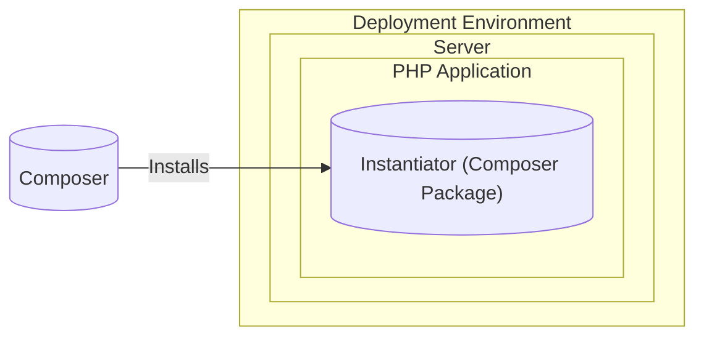
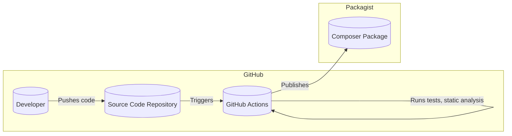

# BUSINESS POSTURE

Business Priorities and Goals:

The Doctrine Instantiator project aims to provide a lightweight and efficient way to instantiate objects in PHP without invoking their constructors. This is particularly useful in scenarios like:

*   Object-relational mapping (ORM): When hydrating objects from a database, ORMs often bypass the constructor to avoid unintended side effects or mandatory constructor arguments.
*   Serialization/Deserialization: Reconstructing objects from serialized data (e.g., JSON, XML) without re-running the constructor logic.
*   Mocking/Testing: Creating mock objects or test doubles where the constructor behavior needs to be controlled or avoided.
*   Dependency Injection: In some advanced DI container implementations, constructor invocation might be undesirable.

The primary goal is to offer a performant and portable solution that works consistently across different PHP versions and platforms.

Business Risks:

*   Compatibility Issues: Failure to maintain compatibility with new PHP versions or specific platforms could render the library unusable for a segment of users, impacting its adoption and reputation.
*   Performance Bottlenecks: If the instantiation process is not highly optimized, it could introduce performance overhead in applications that rely heavily on object creation, especially in ORM-heavy applications.
*   Security Vulnerabilities: While the library's scope is limited, any potential security flaws (e.g., related to unserialization or reflection) could be exploited in larger systems that use the Instantiator.
*   Maintenance Overhead: As a foundational library, the Instantiator requires ongoing maintenance and updates to address bug fixes, security patches, and compatibility issues. Lack of active maintenance could lead to project abandonment.
*   Adoption Risk: If the library fails to gain sufficient traction within the PHP community, it may become less relevant over time, especially if alternative solutions emerge or become more widely adopted.

# SECURITY POSTURE

Existing Security Controls:

*   security control: The project uses GitHub Actions for continuous integration, which includes running unit tests on every push and pull request. This helps ensure that new code changes do not introduce regressions or break existing functionality. (Described in .github/workflows directory)
*   security control: The project has a comprehensive test suite that covers various scenarios and edge cases. This helps to identify and prevent potential bugs, including those that could have security implications. (Described in tests directory)
*   security control: The project follows semantic versioning, which helps users understand the impact of updates and whether they contain breaking changes or security fixes.
*   security control: The project is open source, which allows for community review and contributions. This can help identify and address security vulnerabilities more quickly.
*   security control: The project is relatively small and focused, which reduces the attack surface and makes it easier to audit and maintain.
*   security control: The project uses static analysis tools (e.g., PHPStan) to identify potential code quality issues and security vulnerabilities. (Described in phpstan.neon.dist)

Accepted Risks:

*   accepted risk: The library relies on PHP's reflection and serialization mechanisms, which can have inherent security risks if used improperly. However, the library itself does not directly handle user input or external data, mitigating these risks.
*   accepted risk: The library's primary purpose is to bypass constructors, which could potentially lead to unexpected object states if misused. However, this is an intentional design decision, and users are expected to understand the implications.

Recommended Security Controls:

*   security control: Implement a security policy that outlines the process for reporting and handling security vulnerabilities.
*   security control: Regularly update dependencies to address any known security vulnerabilities in third-party libraries.
*   security control: Consider adding more fuzzing tests to identify potential edge cases and vulnerabilities.

Security Requirements:

*   Authentication: Not applicable, as the library does not handle authentication.
*   Authorization: Not applicable, as the library does not handle authorization.
*   Input Validation: Not directly applicable, as the library does not directly handle user input. However, users of the library should ensure that any data used to instantiate objects is properly validated.
*   Cryptography: Not applicable, as the library does not perform cryptographic operations.
*   Output Encoding: Not applicable.
*   Session Management: Not applicable.
*   Error Handling: The library should handle errors gracefully and provide informative error messages.
*   Data Protection: Not directly applicable, but users of the library should ensure sensitive data is not exposed during object instantiation.

# DESIGN

## C4 CONTEXT

Element Descriptions:

*   Element:
    *   Name: User/Application
    *   Type: Person
    *   Description: A developer or an application that uses the Doctrine Instantiator library.
    *   Responsibilities: Uses the Instantiator to create objects without calling their constructors.
    *   Security controls: Not directly applicable.

*   Element:
    *   Name: Instantiator
    *   Type: Software System
    *   Description: The Doctrine Instantiator library.
    *   Responsibilities: Provides a mechanism to instantiate objects without invoking their constructors.
    *   Security controls: Unit tests, static analysis, semantic versioning, open-source codebase.

*   Element:
    *   Name: ORM
    *   Type: Software System
    *   Description: An Object-Relational Mapper (e.g., Doctrine ORM, Eloquent).
    *   Responsibilities: Uses the Instantiator to hydrate objects from database records.
    *   Security controls: Relies on the security controls of the ORM itself.

*   Element:
    *   Name: Serialization Library
    *   Type: Software System
    *   Description: A library for serializing and deserializing objects (e.g., Symfony Serializer, JMS Serializer).
    *   Responsibilities: Uses the Instantiator to reconstruct objects from serialized data.
    *   Security controls: Relies on the security controls of the serialization library itself.

*   Element:
    *   Name: Testing Framework
    *   Type: Software System
    *   Description: A framework for writing and running tests (e.g., PHPUnit, Mockery).
    *   Responsibilities: Uses the Instantiator to create mock objects or test doubles.
    *   Security controls: Relies on the security controls of the testing framework itself.

*   Element:
    *   Name: DI Container
    *   Type: Software System
    *   Description: A Dependency Injection container (e.g., Symfony DI, PHP-DI).
    *   Responsibilities: In some advanced cases, might use the Instantiator to create objects without constructor invocation.
    *   Security controls: Relies on the security controls of the DI container itself.

## C4 CONTAINER

Element Descriptions:

*   Element:
    *   Name: User/Application
    *   Type: Person
    *   Description: A developer or an application that uses the Doctrine Instantiator library.
    *   Responsibilities: Uses the Instantiator to create objects without calling their constructors.
    *   Security controls: Not directly applicable.

*   Element:
    *   Name: Instantiator
    *   Type: Software System / Library
    *   Description: The Doctrine Instantiator library. Single component.
    *   Responsibilities: Provides a mechanism to instantiate objects without invoking their constructors.
    *   Security controls: Unit tests, static analysis, semantic versioning, open-source codebase.

*   Element:
    *   Name: ORM
    *   Type: Software System
    *   Description: An Object-Relational Mapper (e.g., Doctrine ORM, Eloquent).
    *   Responsibilities: Uses the Instantiator to hydrate objects from database records.
    *   Security controls: Relies on the security controls of the ORM itself.

*   Element:
    *   Name: Serialization Library
    *   Type: Software System
    *   Description: A library for serializing and deserializing objects (e.g., Symfony Serializer, JMS Serializer).
    *   Responsibilities: Uses the Instantiator to reconstruct objects from serialized data.
    *   Security controls: Relies on the security controls of the serialization library itself.

*   Element:
    *   Name: Testing Framework
    *   Type: Software System
    *   Description: A framework for writing and running tests (e.g., PHPUnit, Mockery).
    *   Responsibilities: Uses the Instantiator to create mock objects or test doubles.
    *   Security controls: Relies on the security controls of the testing framework itself.

*   Element:
    *   Name: DI Container
    *   Type: Software System
    *   Description: A Dependency Injection container (e.g., Symfony DI, PHP-DI).
    *   Responsibilities: In some advanced cases, might use the Instantiator to create objects without constructor invocation.
    *   Security controls: Relies on the security controls of the DI container itself.

## DEPLOYMENT

Deployment Solutions:

1.  Composer Package: The primary and recommended way to deploy the Doctrine Instantiator is as a Composer package. This allows for easy integration into PHP projects and manages dependencies effectively.
2.  Manual Download: While not recommended, users could manually download the source code from GitHub and include it in their project. This approach is discouraged as it bypasses dependency management and version control.

Chosen Solution (Composer Package):

Element Descriptions:

*   Element:
    *   Name: Composer
    *   Type: Tool
    *   Description: PHP's dependency management tool.
    *   Responsibilities: Downloads and installs the Instantiator package and its dependencies.
    *   Security controls: Composer uses checksums to verify the integrity of downloaded packages.

*   Element:
    *   Name: Instantiator (Composer Package)
    *   Type: Library
    *   Description: The Doctrine Instantiator library, installed as a Composer package.
    *   Responsibilities: Provides the functionality to instantiate objects.
    *   Security controls: Inherits security controls from the build process and the library's code.

*   Element:
    *   Name: PHP Application
    *   Type: Application
    *   Description: The application that uses the Instantiator library.
    *   Responsibilities: Uses Instantiator.
    *   Security controls: Application specific.

*   Element:
    *   Name: Server
    *   Type: Server
    *   Description: Server that hosts PHP application.
    *   Responsibilities: Provides environment to run PHP application.
    *   Security controls: Server specific.

## BUILD

Build Process Description:

1.  Developer: Developers write code and push changes to the GitHub repository.
2.  Source Code Repository: The GitHub repository stores the source code, tests, and configuration files.
3.  GitHub Actions: GitHub Actions is used as the CI/CD system.  Workflows are defined in `.github/workflows`.
    *   On every push and pull request, GitHub Actions automatically:
        *   Runs the test suite (using PHPUnit).
        *   Performs static analysis (using PHPStan).
        *   Checks code style and formatting.
4.  Composer Package: Upon successful builds and tagging, GitHub Actions can be configured to publish the library as a Composer package on Packagist. This makes it easily installable via Composer.

Security Controls in Build Process:

*   security control: Automated Testing: The test suite ensures that the code functions as expected and helps prevent regressions.
*   security control: Static Analysis: PHPStan helps identify potential code quality issues and security vulnerabilities before they reach production.
*   security control: Continuous Integration: GitHub Actions ensures that all code changes are automatically tested and analyzed, reducing the risk of introducing errors.
*   security control: Dependency Management: Composer ensures that dependencies are managed securely and that their integrity is verified.

# RISK ASSESSMENT

Critical Business Processes:

*   Object Instantiation: The core process is the ability to reliably and efficiently instantiate PHP objects without invoking their constructors. This is critical for the proper functioning of ORMs, serialization libraries, and other tools that rely on this capability.

Data Protection:

*   Data Sensitivity: The Instantiator library itself does not handle sensitive data directly. However, it is used in contexts where sensitive data might be present (e.g., within ORM entities or serialized objects). Therefore, the security of the systems that *use* the Instantiator is paramount. The library should not introduce any vulnerabilities that could lead to the exposure or compromise of this data.

# QUESTIONS & ASSUMPTIONS

Questions:

*   Are there any specific performance benchmarks or targets that the Instantiator must meet?
*   Are there any specific PHP extensions or configurations that are known to be incompatible with the Instantiator?
*   Are there plans to support any specific new PHP features in the future?

Assumptions:

*   BUSINESS POSTURE: It is assumed that the primary users of the Instantiator are developers who are familiar with PHP and understand the implications of bypassing object constructors.
*   BUSINESS POSTURE: It is assumed that maintaining compatibility with a wide range of PHP versions is a priority.
*   SECURITY POSTURE: It is assumed that the library will be used in environments where security is a concern, and therefore, any potential security risks should be minimized.
*   DESIGN: It is assumed that the library should remain small, focused, and easy to maintain.
*   DESIGN: It is assumed that Composer is the primary method for distributing the library.