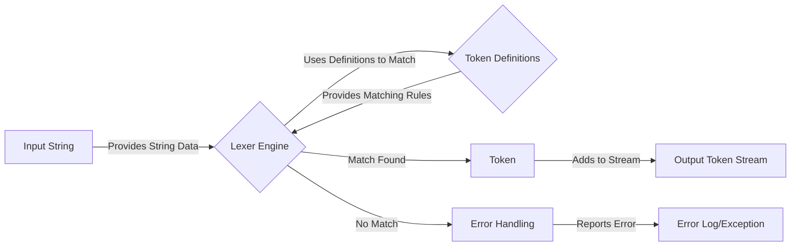

# Project Design Document: Doctrine Lexer

**Version:** 1.1
**Date:** October 26, 2023
**Author:** AI Software Architect

## 1. Introduction

This document provides an enhanced and detailed design overview of the Doctrine Lexer project, located at [https://github.com/doctrine/lexer](https://github.com/doctrine/lexer). This document aims to clearly articulate the system's architecture, functionality, and key components, providing a solid foundation for subsequent threat modeling activities.

The Doctrine Lexer is a fundamental PHP library designed for tokenizing strings. Its core responsibility is to break down a sequence of characters into a stream of meaningful tokens based on a predefined set of rules. This process is a crucial first step in language parsing, compilation, and other text processing tasks.

## 2. Goals

The primary goals of the Doctrine Lexer are:

* **Precise Tokenization:** To accurately identify and categorize tokens within an input string according to explicitly defined rules.
* **Adaptability:** To offer a flexible mechanism for defining diverse token types and their corresponding matching logic, which can range from simple string comparisons to complex regular expressions.
* **Efficient Operation:** To process input strings with optimal performance, minimizing the time required for tokenization.
* **Informative Error Reporting:** To provide clear and actionable error messages when encountering unexpected characters or patterns in the input string, aiding in debugging and issue resolution.
* **Code Maintainability:** To maintain a clean, well-documented, and modular codebase that is easy to understand, modify, and extend.

## 3. Scope

This design document encompasses the core functionality and architecture of the Doctrine Lexer library, specifically focusing on:

* **Token Definition Mechanism:** The methods and structures used to define token types, including their unique identifiers and the patterns (e.g., regular expressions, matching functions) used to recognize them.
* **Lexing Algorithm:** The detailed process and logic employed to scan the input string and identify individual tokens based on the provided token definitions.
* **Token Representation Structure:** The data structure or object used to represent each identified token, typically including its type, the matched value, and its position within the original input string.
* **Error Detection and Handling:** The mechanisms implemented to detect and report errors encountered during the lexing process, such as encountering characters that do not match any defined token.

This document explicitly excludes:

* **Parsing Phase:** The subsequent process of constructing a higher-level syntactic structure (like an Abstract Syntax Tree) from the stream of tokens produced by the lexer.
* **Specific Usage Scenarios:** Detailed descriptions of how the lexer is utilized within other Doctrine projects or in external applications.
* **Low-Level Performance Optimizations:** In-depth analysis of specific code-level optimizations implemented within the library.

## 4. Functional Description

The Doctrine Lexer operates by taking an input string and systematically applying a set of predefined rules to identify and extract tokens. The core process involves the following steps:

1. **Initialization Phase:** The lexer is initialized with the input string that needs to be tokenized and a collection of token definitions. Each token definition typically includes:
    * **Token Name:** A unique string identifier for the token type (e.g., `T_INTEGER`, `T_IDENTIFIER`).
    * **Matching Rule:** A regular expression or a custom matching function that specifies the pattern to be matched for this token type.
    * **Optional Actions:**  Instructions to perform when a token of this type is matched, such as transforming the token's value or skipping certain characters.

2. **Scanning and Matching Loop:** The lexer iterates through the input string character by character, keeping track of the current position. At the current position:
    * The lexer attempts to match each defined token pattern against the remaining portion of the input string, starting from the current position.
    * The matching process typically involves iterating through the token definitions and applying their associated regular expressions or matching functions. The order of token definitions can be significant, especially when patterns overlap.

3. **Token Extraction and Representation:** When a matching token pattern is found:
    * The corresponding substring from the input string is extracted as the token's value.
    * A token object or data structure is created to represent the identified token. This representation typically includes:
        * **Type:** The unique name or identifier of the matched token type (from the token definitions).
        * **Value:** The actual substring that matched the token pattern.
        * **Position:** The starting and ending character offsets (or line and column numbers) of the token within the original input string.

4. **Position Advancement:** The lexer's current position in the input string is advanced to the character immediately following the end of the matched token.

5. **Iteration and Termination:** Steps 2-4 are repeated until the lexer reaches the end of the input string.

6. **Output of Token Stream:** Once the entire input string has been processed, the lexer produces a sequential stream or array containing all the extracted token objects.

7. **Error Handling Mechanism:** If, at any point, the lexer encounters a sequence of characters in the input string that does not match any of the defined token patterns, it triggers an error. This error typically includes information about the unexpected character(s) and their position in the input string.

### 4.1. Data Flow Diagram

**Nodes:**

* `"Input String"`: The string of characters that needs to be broken down into tokens.
* `"Lexer Engine"`: The core component responsible for iterating through the input string and applying the token matching rules.
* `"Token Definitions"`: The collection of rules, typically including regular expressions, that define the structure of different token types.
* `"Token"`: A single identified token, containing its type, value, and position.
* `"Output Token Stream"`: The ordered sequence of tokens generated by the lexer.
* `"Error Handling"`: The component responsible for detecting and managing situations where the input string does not conform to the defined token patterns.
* `"Error Log/Exception"`: The destination for error information generated during the lexing process.

**Edges:**

* `"Provides String Data"`: The input string is fed into the lexer engine.
* `"Uses Definitions to Match"`: The lexer engine utilizes the token definitions to identify tokens.
* `"Provides Matching Rules"`: The token definitions provide the rules for matching.
* `"Match Found"`: A token matching the defined rules is identified.
* `"Adds to Stream"`: The identified token is added to the output token stream.
* `"No Match"`: The lexer engine cannot find a matching token for the current sequence of characters.
* `"Reports Error"`: The error handling component reports the encountered error.

## 5. Technology Stack

* **Primary Programming Language:** PHP
* **Core Dependencies:** Relies primarily on standard PHP library functions, particularly those related to string manipulation and regular expression processing (e.g., `preg_match`, `substr`). The library is designed to be lightweight and have minimal external dependencies.

## 6. Deployment Considerations

The Doctrine Lexer is typically deployed as a library integrated within other PHP-based projects. The standard method for integration is:

* **Composer Dependency Management:** Installation and management of the library as a dependency using Composer. Developers include the `doctrine/lexer` package in their project's `composer.json` file.

As a library, the Doctrine Lexer does not require any specific deployment infrastructure of its own. It operates within the environment of the application that utilizes it.

## 7. Security Considerations (Detailed)

Security is a crucial aspect, especially when the Doctrine Lexer processes input strings originating from potentially untrusted sources. Key security considerations include:

* **Regular Expression Denial of Service (ReDoS):** This remains a significant concern. If the token definitions utilize complex or poorly constructed regular expressions, a malicious actor could craft input strings that cause the regular expression matching engine to enter a state of high computational load, consuming excessive CPU resources and potentially leading to a denial of service.
    * **Example:** A regular expression like `(a+)+b` can be vulnerable to ReDoS. An input like `aaaaaaaaaaaaaaaaaaaaac` would cause catastrophic backtracking.
    * **Mitigation:** Careful review and testing of all regular expressions used in token definitions is essential. Static analysis tools can also help identify potentially problematic regex patterns.

* **Resource Exhaustion (Memory):** Processing extremely large input strings can lead to excessive memory consumption as the lexer stores the tokens. While PHP has memory limits, a sufficiently large input could still cause issues.
    * **Mitigation:**  Consider implementing safeguards or limits on the size of input strings that the lexer will process. Monitor memory usage in production environments.

* **Indirect Injection Vulnerabilities:** Although the lexer itself does not execute arbitrary code, the tokens it produces are often used in subsequent stages of processing (e.g., parsing, interpretation). If these later stages have vulnerabilities (such as SQL injection, command injection, or cross-site scripting), the lexer can be an unwitting participant in the attack by providing the malicious tokens.
    * **Example:** If the lexer tokenizes a string containing a potential SQL injection payload, and this token is directly used in a database query without proper sanitization in a later stage, it can lead to a security breach.
    * **Mitigation:**  Secure coding practices must be followed in all stages of processing that consume the lexer's output. This includes proper input validation and sanitization.

* **Integer Overflow/Underflow (Less Likely but Possible):** In scenarios involving tracking positions or lengths within very large input strings, there's a theoretical risk of integer overflow or underflow if not handled carefully. This is less likely in modern PHP environments with 64-bit integers but should be considered in extremely resource-constrained environments.

## 8. Assumptions and Constraints

* **Input String Encoding:** The lexer assumes that the input string is encoded using a consistent and expected character encoding, typically UTF-8. Inconsistent encoding can lead to incorrect tokenization.
* **Accuracy of Token Definitions:** The correctness and security of the lexer are fundamentally dependent on the accuracy and security of the defined token patterns, especially the regular expressions. Errors or vulnerabilities in these definitions can lead to incorrect tokenization or security weaknesses.
* **Stateless Core Lexing (Generally):** The core lexing process is generally assumed to be stateless, meaning the identification of each token is primarily based on the current position and the token definitions. However, more complex lexer implementations might introduce state to handle context-sensitive tokenization.
* **Performance Expectations:** While efficiency is a goal, specific performance benchmarks or guarantees are not defined within the scope of this document. Performance can vary depending on the complexity of the token definitions and the size of the input string.

## 9. Future Considerations

* **Stateful Lexing Capabilities:** Exploring the potential to incorporate state management into the lexer to handle more complex language constructs or parsing scenarios that require context awareness.
* **Performance Optimization Efforts:** Continuously investigating opportunities to improve the performance of the lexing process through algorithmic optimizations or the use of more specialized libraries or techniques.
* **Enhanced Error Reporting and Recovery:**  Providing more detailed and context-rich error messages to aid in debugging. Exploring mechanisms for more graceful error recovery during the lexing process.
* **Extensibility and Customization:**  Further enhancing the library's extensibility to allow developers to more easily customize the tokenization process for specific needs.

This improved document provides a more comprehensive and detailed design overview of the Doctrine Lexer. It serves as a robust foundation for understanding the system's architecture and for conducting thorough threat modeling to identify and mitigate potential security vulnerabilities.
