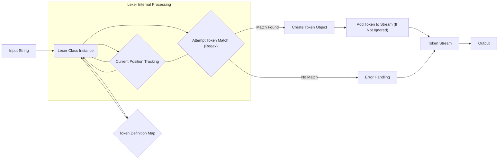

# Project Design Document: Doctrine Lexer

**Version:** 1.1
**Date:** October 26, 2023
**Author:** AI Software Architect

## 1. Introduction

This document provides an enhanced and detailed design overview of the Doctrine Lexer project, a PHP library dedicated to the process of tokenizing strings. This revised document aims to provide an even clearer and more comprehensive articulation of the architecture, components, and data flow within the Lexer. Its primary purpose remains to serve as a robust foundation for subsequent threat modeling activities, enabling a thorough security analysis.

The Doctrine Lexer is a foundational component frequently employed in the development of parsers and compilers. Its core responsibility is to decompose a sequence of characters (the input string) into a structured sequence of meaningful units called tokens. These tokens, enriched with metadata, are then utilized by higher-level components for the crucial tasks of syntactic and semantic analysis.

## 2. Goals

The primary goals of this enhanced design document are:

*   To provide an even more detailed and precise description of the architecture and individual components of the Doctrine Lexer.
*   To illustrate the data flow within the Lexer during the tokenization process with greater clarity and granularity.
*   To explicitly identify key areas, data interactions, and components that are particularly relevant for security considerations and the threat modeling process.
*   To ensure all stakeholders involved in security analysis possess a comprehensive and unambiguous understanding of the system's internal workings.

## 3. Overview

The Doctrine Lexer's fundamental operation involves accepting a string as input and producing an ordered stream of tokens as its output. The central functionality revolves around systematically traversing the input string, identifying patterns that correspond to pre-defined token types, and extracting these tokens along with essential metadata. This metadata typically includes the token's type, its actual string value, and its precise location (offset) within the original input string.

The Lexer's ability to recognize and categorize tokens is governed by a set of rules. These rules are often expressed using regular expressions, providing a flexible and powerful mechanism for defining token patterns. The Lexer maintains an internal state, which includes the current position of the processing cursor within the input string, to effectively manage the iterative tokenization process.

## 4. Detailed Design

### 4.1. Components

*   **`Lexer` Class:** This is the central class orchestrating the entire tokenization process. It encapsulates the input string being processed, the current processing position within that string, and the collection of defined token types along with their associated matching rules (typically regular expressions).
*   **`Token` Class/Object:** Represents a single, semantically meaningful unit extracted from the input string. Each `Token` instance typically holds the following attributes:
    *   `type`: A string or integer constant representing the category or classification of the token (e.g., `'T_IDENTIFIER'`, `'T_INTEGER'`, `'T_WHITESPACE'`).
    *   `value`: The exact sequence of characters from the input string that constitutes this token.
    *   `position`: An integer indicating the starting character index (offset) of this token within the original input string.
*   **Token Definition Map (Internal):** An internal data structure, often implemented as an associative array or map, that stores the crucial mapping between symbolic token type names (e.g., `'T_KEYWORD'`) and their corresponding matching logic (e.g., a regular expression like `'/SELECT|FROM|WHERE/'`).
*   **Input String:** The raw string of characters that is the subject of the tokenization process. This string is provided as an argument when instantiating the `Lexer` class.
*   **Token Stream (Output):** The resulting ordered sequence of `Token` objects generated by the `Lexer` as it processes the input string. This stream is typically returned as an array or an iterable object.

### 4.2. Key Functionality

The core functionality of the `Lexer` class can be dissected into the following more granular steps:

1. **Initialization:** An instance of the `Lexer` class is created, and the input string to be tokenized is provided as an argument during instantiation.
2. **Token Definition Loading/Configuration:** The `Lexer` loads or is configured with the definitions of all the distinct token types it needs to recognize. This involves associating each token type with a specific matching rule, often a regular expression.
3. **Start of Processing Loop:** The `Lexer` begins iterating through the input string, starting from the initial position (typically index 0).
4. **Advance Position:** The `Lexer` maintains an internal pointer or index representing the current position in the input string being examined.
5. **Attempt Token Match:** At the current position, the `Lexer` attempts to match each of the defined token patterns (regular expressions) against the remaining portion of the input string, starting from the current position.
6. **Identify Longest Match:** If multiple token patterns match at the current position, the `Lexer` typically selects the match that consumes the longest sequence of characters.
7. **Token Creation (If Match Found):** If a matching token pattern is found:
    *   A new `Token` object is instantiated.
    *   The `type` of the token is set based on the matched pattern.
    *   The `value` of the token is set to the actual matched substring from the input string.
    *   The `position` of the token is recorded as the starting position of the match.
8. **Advance Position (After Match):** The internal processing position in the input string is advanced by the length of the matched token.
9. **Skip Ignored Tokens:** The `Lexer` may be configured to skip certain types of tokens (e.g., whitespace, comments). If the matched token is of a type to be ignored, it is not added to the output stream.
10. **Token Stream Accumulation:** If the matched token is not to be ignored, the newly created `Token` object is added to the output token stream.
11. **Error Handling (If No Match):** If no defined token pattern matches at the current position, the `Lexer` needs to handle this situation. This might involve throwing an exception, logging an error, or attempting some form of error recovery.
12. **Loop Termination:** The processing loop continues until the internal processing position reaches the end of the input string.
13. **Output Token Stream:** Once the entire input string has been processed, the `Lexer` returns the complete, ordered sequence of `Token` objects (the token stream).

### 4.3. Configuration

The behavior and capabilities of the `Lexer` can be customized and configured through various mechanisms:

*   **Defining Token Types and Patterns:** The core configuration involves specifying the different categories of tokens the Lexer should recognize and providing the corresponding matching rules (typically regular expressions) for each token type. This is often done through an array or map passed to the `Lexer` during initialization or through dedicated methods.
*   **Ignoring Tokens:** The `Lexer` can be configured to explicitly ignore certain types of tokens, such as whitespace or comments, preventing them from appearing in the output token stream. This is often achieved by defining these token types but not including them in the final output.
*   **Case Sensitivity:** The configuration might allow specifying whether the token matching process should be case-sensitive or case-insensitive. This often depends on the regular expression flags used for matching.
*   **Lexer Modes/States:** More advanced lexers might support different modes or states, where the active set of token definitions changes based on the current context within the input string. This allows for handling more complex grammars.

## 5. Data Flow Diagram

**Explanation of Data Flow:**

*   **Input String:** The initial string to be processed is provided to the `Lexer` instance.
*   **Lexer Class Instance:** The `Lexer` object manages the tokenization process.
*   **Token Definition Map:** The `Lexer` consults the map of token types and their matching rules.
*   **Current Position Tracking:** The `Lexer` maintains an internal pointer to the current processing position in the input string.
*   **Attempt Token Match (Regex):** The `Lexer` attempts to match defined token patterns (often regular expressions) at the current position.
*   **Match Found:** If a match is found, a `Token` object is created.
*   **No Match:** If no match is found, error handling logic is invoked.
*   **Create Token Object:** A new `Token` object is instantiated with type, value, and position information.
*   **Add Token to Stream (If Not Ignored):** The created `Token` is added to the output stream, unless it's a token type configured to be ignored.
*   **Error Handling:** Handles situations where no token matches the input.
*   **Token Stream:** The accumulating sequence of `Token` objects.
*   **Output:** The final token stream is returned as the result of the tokenization process.

## 6. Security Considerations (For Threat Modeling)

The following aspects are particularly relevant for security considerations and should be carefully examined during threat modeling:

*   **Regular Expression Denial of Service (ReDoS) Vulnerabilities:** If regular expressions are used for defining token patterns, carefully analyze the complexity of these expressions. Overly complex or poorly constructed regexes can be susceptible to ReDoS attacks, where a malicious input string can cause the regex engine to consume excessive CPU time and resources, leading to denial of service.
*   **Vulnerability to Malicious Input due to Lack of Input Validation:** While the Lexer's primary role is tokenization, consider the source of the input string. If the input originates from an untrusted source, ensure that appropriate input validation and sanitization are performed *before* passing the string to the Lexer. This can prevent unexpected behavior or the exploitation of vulnerabilities in subsequent processing stages.
*   **Error Handling and Information Disclosure:** Scrutinize how the Lexer handles invalid or unexpected input. Ensure that error messages do not inadvertently disclose sensitive information about the system's internal workings or the structure of the input being processed. Robust and secure error handling is crucial.
*   **State Management and Potential for Manipulation:** Evaluate the security of the Lexer's internal state management (e.g., the current processing position). Ensure there are no vulnerabilities that could allow an attacker to manipulate this state, leading to incorrect tokenization or other unexpected behavior.
*   **Security of Token Type Definitions and Matching Rules:**  Assess the security implications of how token types and their associated matching rules are defined. Ambiguous or overly permissive rules could potentially lead to misinterpretation of the input string or the creation of unexpected token sequences.
*   **Resource Consumption and Input Size Limits:** Consider the potential for resource exhaustion when processing extremely large input strings. Implement appropriate limits on the size of the input string to prevent excessive memory or CPU usage that could lead to denial of service.
*   **Injection Vulnerabilities (Context Dependent):** While the Lexer itself doesn't directly execute code, the tokens it produces are often used in subsequent stages (e.g., parsing, interpretation). Consider if the tokenization process could inadvertently create tokens that, when used later, could lead to injection vulnerabilities (e.g., SQL injection if the tokens are used to build SQL queries).

## 7. Assumptions and Constraints

*   The `Lexer` operates primarily in memory. Processing very large inputs might require careful memory management considerations in the calling application.
*   Token definitions are typically loaded at the time of `Lexer` instantiation or configured shortly thereafter. Changes to token definitions during the tokenization process are generally not supported or expected.
*   The primary output of the `Lexer` is a linear, ordered sequence of tokens. The Lexer itself does not inherently build an Abstract Syntax Tree (AST) or perform higher-level parsing.
*   The `Lexer` focuses solely on the lexical analysis phase. It does not perform semantic analysis or validation of the input beyond the identification of individual tokens.

## 8. Future Considerations

*   Exploring performance optimization techniques for handling extremely large input strings more efficiently, potentially involving streaming or lazy evaluation of tokens.
*   Adding support for more flexible and expressive token definition formats beyond simple regular expressions.
*   Integrating more sophisticated error reporting and error recovery mechanisms to provide better feedback to users and potentially allow for more resilient parsing.
*   Investigating the potential for parallelizing the tokenization process for improved performance on multi-core systems.

This enhanced document provides a more detailed and refined design overview of the Doctrine Lexer, with a strong emphasis on aspects relevant to security threat modeling. By thoroughly understanding the architecture, data flow, and potential security considerations outlined in this document, security analysts can more effectively identify, assess, and mitigate potential vulnerabilities within systems that utilize the Doctrine Lexer.