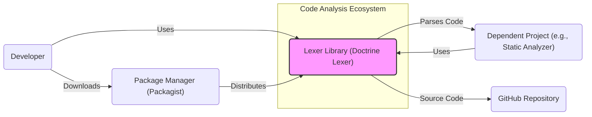
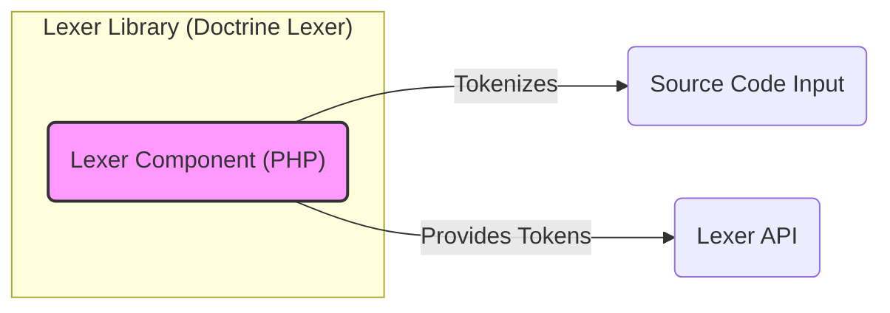
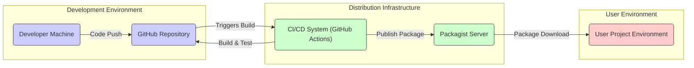

# BUSINESS POSTURE

This project is a PHP Lexer library. Its primary business goal is to provide a robust, reliable, and performant lexical analysis tool for PHP and related languages (DocBlock, Twig, CSS, JavaScript). This library is intended to be used by other software projects, likely in the domain of code analysis, IDEs, templating engines, and potentially security scanning tools.

Business Priorities:
- Stability: The library must be stable and reliable, as other projects will depend on it.
- Performance: Lexical analysis is often a performance-critical part of software processing, so the library should be performant.
- Compatibility: The library should be compatible with various PHP versions and environments.
- Maintainability: The library should be well-maintained and updated to address bugs and security vulnerabilities.
- Community Adoption:  As an open-source library, wider adoption increases its value and sustainability.

Business Risks:
- Security Vulnerabilities:  A vulnerability in the lexer could impact all projects that use it, leading to potential security breaches in those dependent systems.
- Lack of Maintenance: If the library is not actively maintained, bugs and security issues may not be addressed, reducing its reliability and security.
- Performance Bottlenecks:  Poor performance of the lexer can negatively impact the performance of dependent projects.
- Compatibility Issues:  Incompatibility with newer PHP versions or environments can limit the library's usability and adoption.
- Supply Chain Risks:  Compromise of the library's source code or distribution channels could lead to malicious code being injected into dependent projects.

# SECURITY POSTURE

Existing Security Controls:
- security control: Open Source Development: The project is developed openly on GitHub, allowing for community review and scrutiny of the code. Implemented in: GitHub repository.
- security control: Version Control: Git is used for version control, providing history and traceability of changes. Implemented in: GitHub repository.
- security control: Unit Testing:  Likely unit tests are in place to ensure the correctness of the lexer's functionality. Implemented in: Project codebase (tests directory).
- security control: Code Review:  Pull requests are likely used for code review, although the extent and rigor of review are unknown. Implemented in: GitHub pull request process.
- accepted risk: Reliance on Community Contributions: Security depends on the vigilance and security awareness of community contributors.
- accepted risk: Open Source Vulnerabilities:  Like any software, open-source libraries can have vulnerabilities that are publicly disclosed.

Recommended Security Controls:
- security control: Automated Security Scanning: Implement automated static analysis security testing (SAST) and dependency scanning in the CI/CD pipeline to detect potential vulnerabilities early.
- security control: Dependency Management:  Carefully manage and review dependencies, ensuring they are from trusted sources and are regularly updated.
- security control: Input Fuzzing:  Implement fuzz testing to identify potential parsing vulnerabilities by providing a wide range of invalid and unexpected inputs.
- security control: Secure Release Process:  Establish a secure release process, including signing releases to ensure integrity and authenticity.
- security control: Security Audits:  Consider periodic security audits by external security experts to identify and address potential weaknesses.

Security Requirements:
- Authentication: Not directly applicable to the library itself, as it's a passive component. Authentication is relevant for the development and distribution infrastructure (e.g., GitHub, Packagist).
- Authorization: Not directly applicable to the library itself. Authorization is relevant for controlling access to the development and distribution infrastructure.
- Input Validation: Critical. The lexer must robustly handle all possible inputs, including malformed or malicious input, without crashing or producing incorrect output that could be exploited by dependent systems. Input validation should be implemented throughout the lexing process to ensure that the input stream conforms to expected formats and constraints.
- Cryptography: Not directly applicable to the core functionality of a lexer. Cryptography might be relevant if the lexer were to handle encrypted code or data, which is not the case here. However, secure communication channels (HTTPS) should be used for distribution and dependency management.

# DESIGN

## C4 CONTEXT

Context Diagram Elements:

- Element:
    - Name: Lexer Library (Doctrine Lexer)
    - Type: Software System
    - Description: The Doctrine Lexer library, responsible for tokenizing source code in PHP, DocBlock, Twig, CSS, and JavaScript.
    - Responsibilities:
        - Accept source code as input.
        - Tokenize the source code into a stream of tokens.
        - Provide an API for accessing the token stream.
    - Security controls:
        - Input validation to handle potentially malicious or malformed input.
        - Robust error handling to prevent crashes or unexpected behavior.

- Element:
    - Name: Developer
    - Type: Person
    - Description: Software developers who use the Lexer library in their projects.
    - Responsibilities:
        - Integrate the Lexer library into their software projects.
        - Provide valid source code to the Lexer library.
        - Handle tokens produced by the Lexer library.
    - Security controls:
        - Secure development practices in their own projects.
        - Responsible use of the Lexer library API.

- Element:
    - Name: Package Manager (Packagist)
    - Type: Software System
    - Description: A package manager for PHP (Packagist), used to distribute and manage PHP libraries, including the Doctrine Lexer.
    - Responsibilities:
        - Host and distribute the Lexer library package.
        - Provide a mechanism for developers to download and install the library.
        - Ensure the integrity and availability of packages.
    - Security controls:
        - Package integrity checks (e.g., checksums).
        - Security scanning of packages (potentially).
        - Access controls to package publishing.

- Element:
    - Name: Dependent Project (e.g., Static Analyzer)
    - Type: Software System
    - Description:  Software projects that utilize the Lexer library for lexical analysis, such as static analysis tools, IDEs, or templating engines.
    - Responsibilities:
        - Utilize the Lexer library to process source code.
        - Implement further processing and analysis based on the tokens provided by the Lexer.
        - Ensure secure handling of tokens and derived information.
    - Security controls:
        - Secure coding practices in the dependent project.
        - Proper handling of tokens and potential vulnerabilities in the Lexer.

- Element:
    - Name: GitHub Repository
    - Type: Software System
    - Description: The GitHub repository hosting the source code of the Doctrine Lexer library.
    - Responsibilities:
        - Store and manage the source code of the Lexer library.
        - Facilitate collaboration and contribution to the project.
        - Provide version control and issue tracking.
    - Security controls:
        - Access controls to the repository.
        - Code review processes.
        - Vulnerability scanning of the repository infrastructure (GitHub).

## C4 CONTAINER

Container Diagram Elements:

- Element:
    - Name: Lexer Component (PHP)
    - Type: Container (PHP Component)
    - Description: The main PHP component of the Doctrine Lexer library, containing the core lexical analysis logic.
    - Responsibilities:
        - Implement the lexical analysis algorithms for supported languages.
        - Manage the internal state of the lexer.
        - Generate tokens from the input source code.
    - Security controls:
        - Input validation logic within the component.
        - Error handling mechanisms to prevent exceptions and crashes.
        - Memory management to avoid memory leaks or buffer overflows.

- Element:
    - Name: Source Code Input
    - Type: Data Store (Conceptual)
    - Description: Represents the source code being input to the Lexer component for tokenization.
    - Responsibilities:
        - Provide the source code to be analyzed.
        - Can be from various sources (files, strings, streams).
    - Security controls:
        - Source of input should be considered trusted or input validation should be performed before passing to the lexer.

- Element:
    - Name: Lexer API
    - Type: Interface (PHP API)
    - Description: The public API of the Lexer library, providing methods for developers to interact with the lexer and obtain tokens.
    - Responsibilities:
        - Expose the functionality of the Lexer component to external users.
        - Define the interface for token retrieval and lexer configuration.
    - Security controls:
        - API design should prevent misuse or unintended behavior.
        - Documentation should guide developers on secure usage of the API.

## DEPLOYMENT

Deployment is not directly applicable to a library in the same way as a standalone application. However, we can consider the "deployment" as the distribution and inclusion of the library in dependent projects.

Deployment Architecture: Package Distribution

Deployment Diagram Elements:

- Element:
    - Name: Developer Machine
    - Type: Infrastructure (Developer Workstation)
    - Description: The development machine used by developers to write and test code for the Lexer library.
    - Responsibilities:
        - Code development and testing.
        - Committing and pushing code changes to the GitHub repository.
    - Security controls:
        - Developer workstation security practices (OS hardening, antivirus, etc.).
        - Secure access to development tools and repositories.

- Element:
    - Name: GitHub Repository
    - Type: Infrastructure (Code Repository)
    - Description: The GitHub repository hosting the source code of the Lexer library.
    - Responsibilities:
        - Version control and source code management.
        - Hosting Git repository.
        - Access control and permissions.
    - Security controls:
        - GitHub's security controls (access management, audit logs, etc.).
        - Branch protection policies.

- Element:
    - Name: CI/CD System (GitHub Actions)
    - Type: Infrastructure (Automation Server)
    - Description:  A CI/CD system, likely GitHub Actions, used to automate the build, test, and release process of the Lexer library.
    - Responsibilities:
        - Automated building of the library.
        - Running unit tests and security checks.
        - Publishing releases to Packagist.
    - Security controls:
        - Secure configuration of CI/CD pipelines.
        - Secrets management for credentials used in CI/CD.
        - Build artifact integrity checks.

- Element:
    - Name: Packagist Server
    - Type: Infrastructure (Package Registry)
    - Description: The Packagist server, a package registry for PHP, used to host and distribute the Lexer library package.
    - Responsibilities:
        - Hosting and serving the Lexer library package.
        - Managing package metadata and versions.
        - Providing download access to developers.
    - Security controls:
        - Packagist's security controls (infrastructure security, access management).
        - Package integrity verification (checksums, signatures).

- Element:
    - Name: User Project Environment
    - Type: Infrastructure (User Application Environment)
    - Description: The environment where a developer's project is running, which includes the Lexer library as a dependency.
    - Responsibilities:
        - Running the user's application.
        - Utilizing the Lexer library for lexical analysis within the application.
    - Security controls:
        - Security controls of the user's project environment.
        - Dependency management practices in the user's project.

## BUILD

Build Process Diagram:

```mermaid
flowchart LR
    DEVELOPER("Developer") --> CODE_CHANGES("Code Changes (Git)")
    CODE_CHANGES --> GITHUB_REPO("GitHub Repository")
    GITHUB_REPO --> GITHUB_ACTIONS("GitHub Actions (CI/CD)")
    GITHUB_ACTIONS --> BUILD_PROCESS("Build Process")
    BUILD_PROCESS --> UNIT_TESTS("Unit Tests")
    UNIT_TESTS --> SAST("SAST Scanners")
    SAST --> DEPENDENCY_CHECK("Dependency Check")
    DEPENDENCY_CHECK --> BUILD_ARTIFACTS("Build Artifacts (Package)")
    BUILD_ARTIFACTS --> PACKAGIST("Packagist")

    style DEVELOPER fill:#ccf,stroke:#333,stroke-width:1px
    style GITHUB_REPO fill:#ccf,stroke:#333,stroke-width:1px
    style GITHUB_ACTIONS fill:#cfc,stroke:#333,stroke-width:1px
    style PACKAGIST fill:#cfc,stroke:#333,stroke-width:1px
    style BUILD_ARTIFACTS fill:#fcc,stroke:#333,stroke-width:1px
```

Build Process Description and Security Controls:

- Developer:
    - Description: Developers write code and commit changes.
    - Security Controls: Developer workstation security, secure coding practices, code review.

- Code Changes (Git):
    - Description: Code changes are tracked using Git version control.
    - Security Controls: Git commit signing, branch protection in GitHub.

- GitHub Repository:
    - Description: Central repository for source code.
    - Security Controls: Access controls, audit logs, branch protection.

- GitHub Actions (CI/CD):
    - Description: Automates the build, test, and release process.
    - Security Controls: Secure pipeline configuration, secrets management, workflow permissions.

- Build Process:
    - Description: Compiles (if necessary for PHP, though less common), packages the library.
    - Security Controls: Use of trusted build environments, build process isolation.

- Unit Tests:
    - Description: Automated unit tests to verify functionality.
    - Security Controls: Comprehensive test suite to catch regressions and unexpected behavior.

- SAST Scanners:
    - Description: Static Application Security Testing tools to scan code for vulnerabilities.
    - Security Controls: Integration of SAST tools in the CI pipeline, configuration of relevant security rules.

- Dependency Check:
    - Description: Checks for known vulnerabilities in dependencies.
    - Security Controls: Dependency scanning tools, vulnerability database updates, policy enforcement.

- Build Artifacts (Package):
    - Description: The packaged library ready for distribution.
    - Security Controls: Signing of packages, checksum generation, secure storage of artifacts before publishing.

- Packagist:
    - Description: Package registry for distribution.
    - Security Controls: Packagist's infrastructure security, package integrity checks.

# RISK ASSESSMENT

Critical Business Processes:
- Software projects that depend on the Doctrine Lexer for core functionality (e.g., parsing, analysis).
- Distribution of the library through package managers to developers.
- Continued maintenance and development of the library.

Data to Protect:
- Source code of the Lexer library: Sensitivity - High (Confidentiality, Integrity, Availability). Compromise could lead to malicious modifications or loss of intellectual property.
- Integrity of distributed packages: Sensitivity - High (Integrity, Availability). Compromised packages could introduce vulnerabilities into dependent projects.
- Development and build infrastructure: Sensitivity - Medium (Confidentiality, Integrity, Availability). Compromise could disrupt development or lead to supply chain attacks.

Data Sensitivity:
- Source code: High - Intellectual property, potential for vulnerability exploitation if exposed or modified maliciously.
- Build artifacts: High - Integrity is critical to prevent supply chain attacks.
- Test data (if any): Low to Medium - Depending on the nature of test data, potential for information disclosure.
- Configuration data (build scripts, CI/CD config): Medium - Could expose build process details or credentials if leaked.

# QUESTIONS & ASSUMPTIONS

Questions:
- What is the current level of automated security testing (SAST, dependency scanning) in the project's CI/CD pipeline?
- Are there any specific security concerns or past vulnerabilities that have been identified in the Lexer library?
- What is the process for handling and disclosing security vulnerabilities in the library?
- Are there any plans for formal security audits or penetration testing of the library?
- What is the expected risk appetite for this project? Is it for a startup or Fortune 500 company? (Assuming a moderate risk appetite for a widely used open-source library).

Assumptions:
- BUSINESS POSTURE: The primary goal is to provide a reliable and secure lexer library for the PHP ecosystem. Stability and security are high priorities.
- SECURITY POSTURE:  Basic security practices are in place (open development, version control, unit tests), but there is room for improvement in automated security testing and secure release processes.
- DESIGN: The library is a relatively simple component focused on lexical analysis. The deployment model is package distribution via Packagist. The build process likely involves standard CI/CD practices.
- RISK ASSESSMENT: The library is a critical component for dependent projects, and vulnerabilities could have a wide impact. Source code and package integrity are the most critical assets to protect.