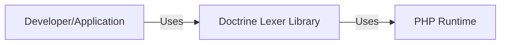
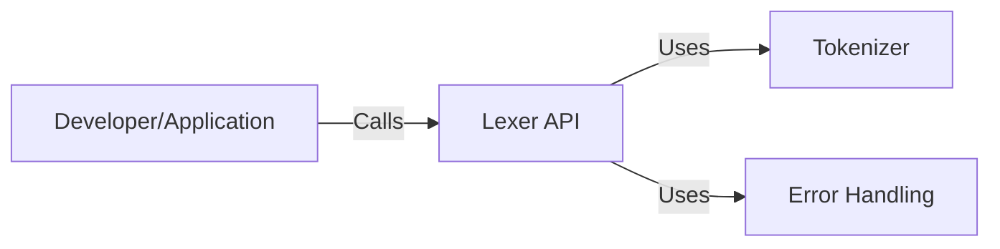
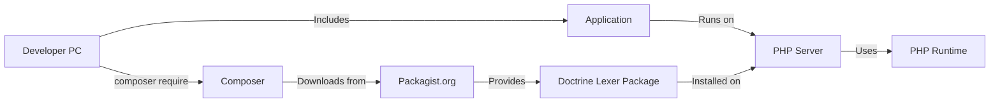
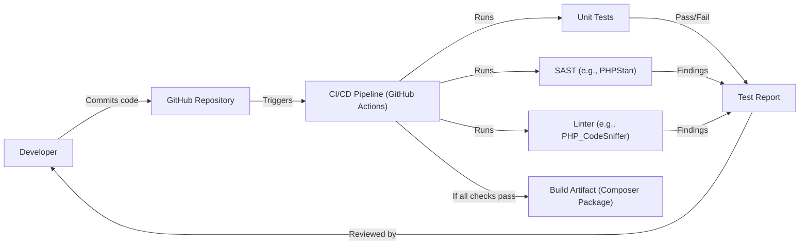

# BUSINESS POSTURE

Business Priorities and Goals:

*   Provide a stable and reliable lexer library for PHP projects.
*   Ensure the library is easy to use and integrate into existing projects.
*   Maintain high performance and efficiency for tokenizing code.
*   Support a wide range of PHP versions.
*   Foster a community-driven development model through GitHub.

Business Risks:

*   Vulnerabilities in the lexer could lead to incorrect parsing of code, potentially causing application errors or security exploits in projects that use it.
*   Performance bottlenecks in the lexer could impact the performance of applications that rely on it.
*   Lack of compatibility with newer PHP versions could limit the library's adoption and usefulness.
*   Inadequate documentation or support could hinder developer adoption and usage.

# SECURITY POSTURE

Existing Security Controls:

*   security control: Code reviews are performed as part of the pull request process on GitHub (implied by the open-source nature and contribution guidelines).
*   security control: Static analysis is likely used, although the specific tools are not mentioned in the repository's root (implied by the nature of the project and common practices).
*   security control: Unit tests are present, covering various aspects of the lexer's functionality (visible in the `tests/` directory).
*   security control: The library is relatively simple and self-contained, reducing the attack surface.
*   security control: Issue tracking on GitHub allows for reporting and addressing security vulnerabilities.

Accepted Risks:

*   accepted risk: The library relies on the correctness of the PHP grammar it implements. Errors in the grammar definition could lead to misinterpretations of code.
*   accepted risk: The library's security is ultimately dependent on the security of the PHP runtime environment.
*   accepted risk: There might be unknown vulnerabilities that haven't been discovered or reported yet.

Recommended Security Controls:

*   security control: Integrate a dedicated SAST (Static Application Security Testing) tool into the CI/CD pipeline (e.g., PHPStan, Psalm, Phan).
*   security control: Implement fuzz testing to identify potential edge cases and vulnerabilities that might not be caught by unit tests.
*   security control: Establish a clear security policy and vulnerability disclosure process.
*   security control: Regularly update dependencies to address any known vulnerabilities in third-party libraries (although this project has minimal external dependencies).
*   security control: Consider using a Software Composition Analysis (SCA) tool to identify and manage any dependencies and their associated vulnerabilities.

Security Requirements:

*   Authentication: Not applicable, as the library is not an authentication system.
*   Authorization: Not applicable, as the library does not handle authorization.
*   Input Validation: The library's primary function is to process input (PHP code). Input validation, in this context, means correctly handling valid and invalid PHP syntax according to the language specification. The library should gracefully handle syntax errors without crashing or creating vulnerabilities.
*   Cryptography: Not directly applicable, as the library does not perform cryptographic operations. However, if the lexer is used to process code that *contains* cryptographic operations, it should not interfere with or weaken those operations.
*   Error Handling: The library should handle errors, such as invalid input, in a predictable and secure manner. It should not expose sensitive information in error messages or logs.

# DESIGN

## C4 CONTEXT

Element Description:

*   Element:
    *   Name: Developer/Application
    *   Type: User
    *   Description: A PHP developer or an application that utilizes the Doctrine Lexer library for tokenizing PHP code.
    *   Responsibilities: Integrates and uses the Doctrine Lexer library in their PHP projects. Provides the input (PHP code) to be lexed.
    *   Security controls: Relies on the security controls implemented within the Doctrine Lexer and PHP Runtime.

*   Element:
    *   Name: Doctrine Lexer Library
    *   Type: System
    *   Description: The core component, a PHP library that provides lexical analysis functionality.
    *   Responsibilities: Tokenizes PHP code input, providing a stream of tokens for further processing by parsers or other tools.
    *   Security controls: Code reviews, unit tests, static analysis (implied and recommended), fuzz testing (recommended), security policy (recommended).

*   Element:
    *   Name: PHP Runtime
    *   Type: System
    *   Description: The PHP runtime environment required to execute the Doctrine Lexer library.
    *   Responsibilities: Executes the PHP code of the library and the application using it.
    *   Security controls: Relies on the security of the specific PHP version and its configuration.

## C4 CONTAINER

Element Description:

*   Element:
    *   Name: Developer/Application
    *   Type: User
    *   Description: A PHP developer or an application that utilizes the Doctrine Lexer library.
    *   Responsibilities: Integrates and uses the Doctrine Lexer library in their PHP projects.
    *   Security controls: Relies on the security controls implemented within the Lexer API.

*   Element:
    *   Name: Lexer API
    *   Type: Container (Library Interface)
    *   Description: The public API of the Doctrine Lexer library, providing methods for lexing input.
    *   Responsibilities: Exposes methods for initiating the lexing process, retrieving tokens, and handling errors.
    *   Security controls: Input validation (handling of valid and invalid PHP syntax), error handling.

*   Element:
    *   Name: Tokenizer
    *   Type: Container (Component)
    *   Description: The core logic for converting PHP code into a stream of tokens.
    *   Responsibilities: Implements the lexical analysis algorithm, recognizing different types of tokens based on the PHP grammar.
    *   Security controls: Code reviews, unit tests, static analysis, fuzz testing (recommended).

*   Element:
    *   Name: Error Handling
    *   Type: Container (Component)
    *   Description: Handles errors encountered during the lexing process.
    *   Responsibilities: Detects and reports syntax errors, providing informative error messages.
    *   Security controls: Secure error handling (no sensitive information leakage).

## DEPLOYMENT

Possible Deployment Solutions:

1.  Composer Package: The library is primarily distributed as a Composer package. Developers include it in their projects using `composer require doctrine/lexer`.
2.  Manual Download: Developers can download the source code directly from GitHub and manually include it in their projects. This is less common.
3.  Part of a Larger Framework/ORM: The lexer might be indirectly included as a dependency of a larger framework or ORM (like Doctrine ORM) that uses it internally.

Chosen Deployment Solution (Composer Package):

Element Description:

*   Element:
    *   Name: Developer PC
    *   Type: Node
    *   Description: The developer's local machine where they write and manage their code.
    *   Responsibilities: Initiates the installation of the Doctrine Lexer package using Composer.
    *   Security controls: Relies on the security of the developer's machine and their Composer setup.

*   Element:
    *   Name: Composer
    *   Type: Software System
    *   Description: PHP's dependency management tool.
    *   Responsibilities: Resolves and downloads the Doctrine Lexer package and its dependencies.
    *   Security controls: Relies on the security of Composer itself and the integrity of the Packagist repository.

*   Element:
    *   Name: Packagist.org
    *   Type: Software System
    *   Description: The main Composer package repository.
    *   Responsibilities: Hosts the Doctrine Lexer package and its metadata.
    *   Security controls: Packagist.org's internal security measures.

*   Element:
    *   Name: Doctrine Lexer Package
    *   Type: Software
    *   Description: The packaged version of the Doctrine Lexer library.
    *   Responsibilities: Provides the lexer functionality to the application.
    *   Security controls: Inherits security controls from the development process (code reviews, testing, etc.).

*   Element:
    *   Name: Application
    *   Type: Software System
    *   Description: The PHP application that uses the Doctrine Lexer library.
    *   Responsibilities: Utilizes the lexer for its specific purposes (e.g., parsing code).
    *   Security controls: Depends on the application's overall security posture.

*   Element:
    *   Name: PHP Server
    *   Type: Node
    *   Description: The server environment where the PHP application runs (e.g., Apache, Nginx with PHP-FPM).
    *   Responsibilities: Hosts and executes the PHP application.
    *   Security controls: Relies on the server's configuration and security measures.

*   Element:
    *   Name: PHP Runtime
    *   Type: Software System
    *   Description: The PHP interpreter that executes the code.
    *   Responsibilities: Executes the PHP code of the application and the Doctrine Lexer library.
    *   Security controls: Relies on the security of the specific PHP version and its configuration.

## BUILD

Build Process Description:

1.  **Code Commit:** A developer commits code changes to the Doctrine Lexer repository on GitHub.
2.  **CI/CD Trigger:** GitHub Actions (or a similar CI/CD system) is triggered by the commit.
3.  **Unit Tests:** The CI pipeline runs the unit tests to ensure the code functions as expected.
4.  **SAST:** A Static Application Security Testing (SAST) tool (e.g., PHPStan, Psalm) is executed to analyze the code for potential security vulnerabilities.
5.  **Linting:** A linter (e.g., PHP_CodeSniffer) is run to check for code style and potential errors.
6.  **Reporting:** The results of the tests, SAST, and linting are reported.
7.  **Artifact Creation:** If all checks pass, a build artifact (the Composer package) is created. This artifact is not directly deployed but is made available for use via Composer and Packagist.org.

Security Controls in Build Process:

*   security control: Code reviews on GitHub before merging changes.
*   security control: Unit tests to verify functionality and prevent regressions.
*   security control: SAST tool integration to identify potential security vulnerabilities.
*   security control: Linter to enforce code style and identify potential errors.
*   security control: Automated CI/CD pipeline to ensure consistent and repeatable builds.

# RISK ASSESSMENT

Critical Business Processes:

*   Providing a reliable and accurate lexing service for PHP code. This is critical for any application that relies on the library for parsing or analyzing PHP code.

Data Protection:

*   The library itself does not handle sensitive data directly. It processes PHP code, which *could* contain sensitive information (e.g., hardcoded credentials, API keys – although this is bad practice). The library's primary security concern is to avoid introducing vulnerabilities that could be exploited to *access* or *manipulate* the code it processes.
*   Data Sensitivity: The sensitivity of the data handled by the library is entirely dependent on the code being processed by the applications that use it. The library itself does not define data sensitivity.

# QUESTIONS & ASSUMPTIONS

Questions:

*   Are there any specific compliance requirements (e.g., OWASP, PCI DSS) that the library needs to adhere to, even indirectly?
*   What is the expected usage context of the library? Is it primarily used in security-sensitive applications, or in a broader range of contexts?
*   What is the long-term maintenance plan for the library? How will security updates and patches be handled?

Assumptions:

*   BUSINESS POSTURE: The primary goal is to provide a robust and reliable lexer for the PHP community. Security is a high priority, but performance and ease of use are also important.
*   SECURITY POSTURE: The development team follows secure coding practices, even if they are not explicitly documented. The library is assumed to be relatively low-risk due to its limited scope and functionality.
*   DESIGN: The library is designed to be simple and efficient. The provided C4 diagrams are a reasonable representation of the library's structure. The deployment process via Composer is the standard and most relevant method. The build process includes basic security checks, and it is assumed that GitHub Actions (or a similar CI/CD system) is used.