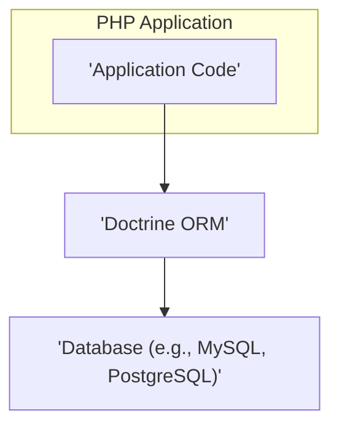
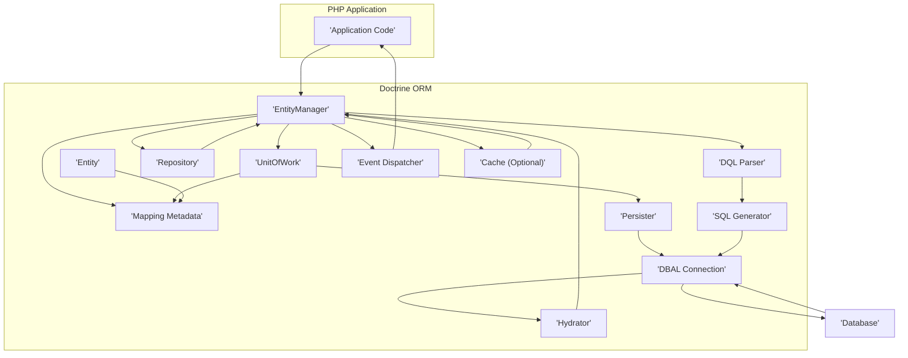
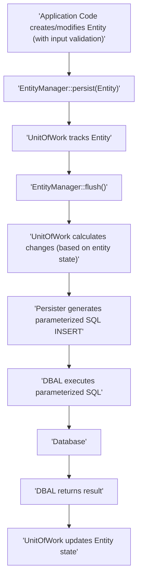
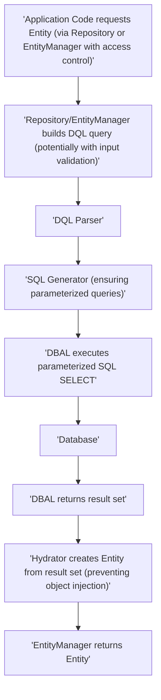

# Project Design Document: Doctrine ORM

**Version:** 1.1
**Date:** October 26, 2023
**Author:** AI Software Architect

## 1. Project Overview

This document provides an enhanced design overview of the Doctrine Object-Relational Mapper (ORM), a PHP library facilitating data mapping and database abstraction. This detailed design serves as a crucial foundation for understanding the system's architecture and is specifically intended as input for subsequent threat modeling activities. The focus remains on core components and their interactions, with an increased emphasis on areas relevant to security vulnerabilities and attack vectors.

## 2. Goals

* Deliver a clear, concise, and more detailed overview of the Doctrine ORM architecture.
* Provide in-depth descriptions of key components, outlining their functionalities and potential security implications.
* Illustrate the data flow within the ORM during various operations, highlighting potential security checkpoints.
* Establish a robust and comprehensive understanding for threat modeling and security analysis.
* Document key assumptions and constraints with a security focus.

## 3. Target Audience

This document is primarily intended for:

* Security engineers conducting thorough threat modeling and security assessments.
* Developers actively working with or extending the functionalities of Doctrine ORM.
* Architects designing complex systems that integrate with Doctrine ORM, requiring a deep understanding of its security posture.
* Anyone requiring a detailed and security-focused understanding of the ORM's internal workings.

## 4. System Architecture

Doctrine ORM acts as a vital bridge between PHP application objects and relational databases. It enables the persistence and retrieval of objects without the need for writing extensive raw SQL queries. The fundamental architecture can be visualized as follows:

The core components within Doctrine ORM, with a focus on their security relevance, are:

* **EntityManager:** The central hub for managing entities, offering methods for persistence, retrieval, and removal. It also manages caching, which has security implications.
* **UnitOfWork:**  Meticulously tracks changes to entities during a request lifecycle, orchestrating the secure persistence of these changes to the database.
* **Mapping Metadata:** Defines the crucial relationships between PHP classes (entities) and database tables. This configuration is a potential target for manipulation.
* **Entity:** A PHP object representing a database row. Security considerations include data validation within entities.
* **Repository:** Provides structured methods for querying and retrieving entities based on specific criteria, potentially exposing data based on access controls.
* **Query Language (DQL):** Doctrine's object-oriented query language, which is translated into native SQL. Improper DQL construction can lead to vulnerabilities.
* **Database Abstraction Layer (DBAL):** Offers a consistent and hopefully secure interface for interacting with diverse database systems.
* **Hydrator:** Responsible for securely converting database result sets into PHP objects, preventing object injection vulnerabilities.
* **Persister:** Manages the secure interaction with the database for creating, updating, and deleting entities, focusing on parameterized queries.
* **Event System:** Allows for hooking into various stages of the ORM's lifecycle, enabling custom logic and extensions, which can introduce security risks if not implemented carefully.
* **Cache (Optional):**  Doctrine supports various caching mechanisms (e.g., Memcached, Redis). Improperly secured caches can lead to data leaks.

A more detailed view of the internal components and their interactions, highlighting potential security boundaries:

## 5. Key Components

* **EntityManager:** The central point of interaction. Its role in managing entity state and caching makes it a critical component for security considerations.
    * Responsibilities: Managing entity lifecycle, persisting, updating, and removing entities, finding entities, flushing changes, **managing entity and query caches (potential for cache poisoning or data leaks if not secured)**.
* **UnitOfWork:**  Responsible for tracking changes and orchestrating persistence, making its integrity crucial for data consistency and security.
    * Responsibilities: Tracking entity changes, managing entity identity, orchestrating persistence operations, **ensuring only authorized changes are persisted**.
* **Mapping Metadata:** Defines the structure and relationships of entities. Vulnerabilities here could lead to incorrect data interpretation or manipulation.
    * Responsibilities: Providing information about entity structure and relationships, **potential for injection or manipulation of mapping data leading to unexpected behavior**.
* **Entity:** Represents data. Security considerations include input validation and preventing mass assignment vulnerabilities.
    * Responsibilities: Holding application data, potentially containing business logic, **requires careful handling of user input and validation to prevent data integrity issues**.
* **Repository:** Provides query methods. Secure implementation is essential to prevent unauthorized data access.
    * Responsibilities: Providing methods for finding entities based on criteria, **potential for insecure query construction leading to data leaks or manipulation**.
* **Query Language (DQL):**  While offering abstraction, insecure DQL can still lead to SQL injection.
    * Responsibilities: Expressing data retrieval requirements, **vulnerable to DQL injection if input is not properly sanitized or parameterized**.
* **Database Abstraction Layer (DBAL):**  Its security relies on proper implementation to prevent bypassing security measures.
    * Responsibilities: Providing a consistent API for database interaction, **potential for vulnerabilities if the abstraction layer itself has flaws or allows direct SQL execution without proper sanitization**.
* **Hydrator:** Converts database results to objects. Secure hydration prevents object injection attacks.
    * Responsibilities: Converting database result sets into entity instances, **must be implemented securely to prevent object injection vulnerabilities**.
* **Persister:** Translates entity changes to database operations. Parameterized queries are crucial here.
    * Responsibilities: Executing database queries for persistence operations, **critical for preventing SQL injection through parameterized queries**.
* **Event System:** Offers extensibility but requires careful security considerations for event listeners.
    * Responsibilities: Providing extension points for customizing ORM behavior, **event listeners can introduce vulnerabilities if not implemented securely, allowing for unauthorized actions or data manipulation**.
* **Cache (Optional):** If used, the cache itself needs to be secured to prevent data leaks or manipulation.
    * Responsibilities: Caching entity data and query results for performance, **vulnerable to cache poisoning or unauthorized access if not properly secured**.

## 6. Data Flow

A typical data flow for securely persisting a new entity involves several security checkpoints:

A typical data flow for securely fetching an entity also has key security considerations:

## 7. Security Considerations

Doctrine ORM, while providing abstraction, requires careful attention to security at various levels:

* **SQL Injection Prevention:**
    * **Parameterized Queries:** Doctrine's reliance on parameterized queries is a primary defense. Ensure all queries, including those built dynamically, utilize parameter binding.
    * **DQL Injection:**  Carefully sanitize or validate any user input that influences DQL query construction. Avoid concatenating user input directly into DQL strings.
    * **Native SQL:**  Minimize the use of native SQL queries. If necessary, rigorously sanitize and parameterize all inputs.
* **Data Integrity and Validation:**
    * **Entity Validation:** Implement robust validation rules within entities to ensure data consistency and prevent invalid data from being persisted.
    * **Type Hinting and Casting:** Utilize PHP's type hinting and casting features to enforce data types and prevent unexpected data manipulation.
* **Access Control and Authorization:**
    * **ORM-Level Authorization (Limited):** Doctrine itself doesn't handle user authentication. Implement authorization logic at the application level to control which users can access and modify specific entities.
    * **Query-Level Filtering:**  Dynamically add conditions to queries based on user roles and permissions to restrict data access.
* **Information Disclosure:**
    * **Error Handling:** Avoid displaying detailed database error messages to end-users, as these can reveal sensitive information. Implement proper logging for debugging purposes.
    * **Logging Sensitivity:**  Be mindful of what data is logged by the ORM and the application. Avoid logging sensitive information in production environments.
    * **Caching Security:** Secure any caching mechanisms used by Doctrine to prevent unauthorized access to cached data.
* **Denial of Service (DoS):**
    * **Query Performance:** Optimize DQL queries to prevent long-running queries that could strain database resources.
    * **Pagination and Limits:** Implement pagination and limits on queries that could potentially return large datasets.
* **Cross-Site Scripting (XSS):**
    * **Output Encoding:** While the ORM focuses on backend persistence, remember to properly encode data retrieved from the ORM before displaying it in web views to prevent XSS vulnerabilities.
* **Mass Assignment Vulnerabilities:**
    * **Explicit Property Setting:** Avoid directly assigning user input to entity properties without proper validation. Use setter methods with validation logic or utilize mechanisms to control which properties can be modified.
* **Object Injection Vulnerabilities:**
    * **Secure Hydration:** Ensure the Hydrator component correctly instantiates entities from database results, preventing the injection of malicious objects.
* **Security of Event Listeners:**
    * **Careful Implementation:**  Thoroughly review and test any custom event listeners to ensure they do not introduce security vulnerabilities.

## 8. Deployment Considerations

Secure deployment of applications using Doctrine ORM requires attention to several factors:

* **Database Security Hardening:**
    * **Strong Credentials:** Use strong, unique passwords for database users.
    * **Principle of Least Privilege:** Grant database users only the necessary permissions.
    * **Network Segmentation:** Isolate the database server on a private network.
    * **Regular Security Updates:** Keep the database server software up-to-date with security patches.
* **PHP Environment Security:**
    * **Secure Configuration:** Configure PHP with security best practices (e.g., disabling dangerous functions, setting appropriate `open_basedir` restrictions).
    * **Regular Updates:** Keep the PHP interpreter and extensions updated.
* **ORM Configuration Management:**
    * **Secure Storage of Credentials:** Avoid storing database credentials directly in code. Use environment variables or secure configuration management tools.
    * **Restrict Access to Configuration Files:** Limit access to configuration files containing sensitive information.
* **Code Reviews:** Conduct regular code reviews to identify potential security vulnerabilities in the application's use of Doctrine ORM.
* **Dependency Management:** Keep Doctrine ORM and its dependencies updated to benefit from security fixes.

## 9. Assumptions and Constraints

* **Secure Hosting Environment:** It is assumed that the PHP application utilizing Doctrine ORM is deployed in a secure hosting environment with appropriate security controls in place.
* **Secure Database Infrastructure:**  It is assumed that the underlying database system is properly secured and maintained.
* **Security-Aware Development Practices:** Developers using Doctrine ORM are expected to adhere to secure coding practices and be aware of common web application vulnerabilities.
* **Proper Configuration is Crucial:** The security of the ORM is heavily dependent on its correct and secure configuration. Misconfiguration can introduce significant vulnerabilities.
* **Focus on Core ORM Functionality:** This document primarily addresses the security aspects of the core Doctrine ORM library. Security considerations for specific extensions or third-party bundles may vary.
* **No Implicit Security Guarantees:** While Doctrine ORM provides tools for secure data handling, it does not inherently guarantee security. Developers are responsible for implementing secure practices.

This enhanced design document provides a more detailed and security-focused overview of the Doctrine ORM architecture. The in-depth descriptions of components, data flows, and expanded security considerations will be invaluable for conducting thorough threat modeling and implementing robust security measures.