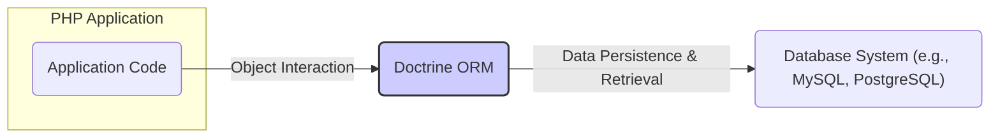
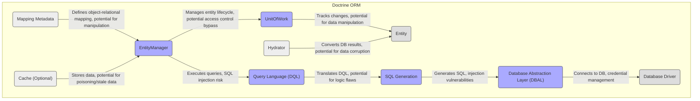
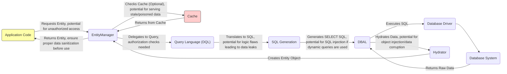

# Project Design Document: Doctrine ORM for Threat Modeling (Improved)

**Version:** 1.1
**Date:** October 26, 2023
**Author:** AI Software Architect

## 1. Introduction

This document provides an enhanced design overview of the Doctrine Object-Relational Mapper (ORM) project, specifically tailored for effective threat modeling. Building upon the previous version, this document further clarifies key components, architecture, data flow, and critically, explicitly links these elements to potential security vulnerabilities. The aim is to provide a robust foundation for identifying and mitigating threats within systems utilizing Doctrine ORM.

## 2. Goals and Objectives

The primary goal remains to provide a clear and concise architectural understanding of Doctrine ORM to facilitate effective threat modeling. The enhanced objectives are to:

*   Clearly illustrate the high-level architecture of Doctrine ORM and its boundaries.
*   Detail the key components and their interactions, emphasizing potential attack surfaces.
*   Visually represent the data flow within the ORM, highlighting sensitive data paths.
*   Explicitly connect architectural elements and data flows to specific security considerations and potential attack scenarios.
*   Provide actionable information to guide threat modeling exercises and inform security controls.

## 3. System Overview

Doctrine ORM acts as a crucial intermediary between the PHP application and the database. It abstracts away the complexities of direct database interaction, allowing developers to work with data as objects. This abstraction, while beneficial for development, introduces its own set of security considerations that need careful examination during threat modeling.

## 4. Architectural Design

### 4.1. High-Level Architecture

*   **PHP Application:** The application layer that initiates data operations using Doctrine ORM. This is the primary point of interaction for users and external systems.
*   **Doctrine ORM:** The core mapping library. Its responsibility for translating object operations to database queries makes it a critical component for security analysis.
*   **Database System:** The persistent storage layer. Security here focuses on access control and data protection at rest.

### 4.2. Component Architecture

*   **EntityManager:**  The central point for managing entities. Improperly secured access to the `EntityManager` could lead to unauthorized data manipulation.
*   **UnitOfWork:** Tracks changes to entities. Vulnerabilities here could allow for bypassing business logic or corrupting data integrity.
*   **Entity:** Represents data. While not a direct component of the ORM's logic, the structure and relationships of entities are crucial for understanding data flow and potential vulnerabilities.
*   **Query Language (DQL):**  Used to query data. A primary area for SQL injection vulnerabilities if input is not properly handled.
*   **SQL Generation:** Translates DQL to SQL. Flaws in the translation logic could lead to unexpected or malicious SQL being generated.
*   **Database Abstraction Layer (DBAL):** Provides a database-agnostic interface. While it adds a layer of abstraction, vulnerabilities in the DBAL itself or its interaction with drivers can be exploited.
*   **Database Driver:**  Specific to the database system. Security depends on the driver's implementation and proper configuration.
*   **Mapping Metadata:** Defines how objects map to the database. If this metadata is compromised, attackers could manipulate data interpretation or even gain code execution in some scenarios.
*   **Hydrator:** Converts database results into objects. Vulnerabilities here could lead to object injection or data corruption.
*   **Cache (Optional):**  Stores query results or metadata. If not properly secured, it can be a target for data poisoning or lead to the use of stale, potentially incorrect data.

## 5. Data Flow

Understanding how data moves through Doctrine ORM is crucial for identifying potential interception points and vulnerabilities.

### 5.1. Persisting a New Entity

```mermaid
flowchart LR
    A("Application Code") -- "Creates/Modifies Entity, potential for malicious data injection" --> B("EntityManager")
    B -- "Schedules for insertion, authorization checks needed" --> C("UnitOfWork")
    C -- "Analyzes changes, relies on accurate mapping" --> D("Mapping Metadata")
    D --> E("SQL Generation")
    E -- "Generates INSERT SQL, primary SQL injection point" --> F("DBAL")
    F -- "Executes SQL, relies on secure driver" --> G("Database Driver")
    G --> H("Database System")
    style A fill:#ffa,stroke:#333,stroke-width:1px
```

*   The application code initiates the persistence process. **Threat:** Malicious data could be injected at this stage if input validation is insufficient.
*   The `EntityManager` manages the persistence. **Threat:** Lack of proper authorization checks could allow unauthorized data creation.
*   The `UnitOfWork` analyzes changes. **Threat:** If mapping metadata is compromised, this analysis could be flawed.
*   `SQL Generation` creates the SQL. **Critical Threat:** This is a primary point for SQL injection if data from previous steps is not properly sanitized.
*   The `DBAL` executes the SQL. **Threat:** Vulnerabilities in the DBAL or its interaction with the driver could be exploited.
*   The `Database Driver` interacts with the database. **Threat:** Security relies on the driver's integrity and secure configuration.

### 5.2. Retrieving an Entity

*   The application requests an entity. **Threat:**  Insufficient authorization checks could lead to unauthorized data access.
*   The `EntityManager` checks the cache. **Threat:**  A compromised cache could serve stale or poisoned data.
*   A query is initiated using `DQL`. **Threat:** Lack of proper authorization at this stage could lead to data leaks.
*   `SQL Generation` creates the SQL. **Threat:**  SQL injection is possible if dynamic queries are constructed based on user input. Logic flaws in DQL translation could also lead to unintended data retrieval.
*   The `Hydrator` converts raw data to objects. **Threat:** Vulnerabilities here could lead to object injection attacks or data corruption if the hydration process is flawed.
*   The application receives the entity. **Recommendation:** Ensure proper sanitization of data retrieved from the ORM before displaying it to users to prevent client-side vulnerabilities.

## 6. Security Considerations and Potential Threats

This section details specific security considerations and potential threats, linking them to the architectural components and data flow described above.

*   **SQL Injection (CWE-89):**  A major risk, particularly when constructing dynamic DQL queries or using native SQL.
    *   **Affected Components:** `EntityManager`, `Query Language (DQL)`, `SQL Generation`, `DBAL`.
    *   **Attack Scenario:** Maliciously crafted input injected into query parameters can alter the intended SQL, allowing attackers to read, modify, or delete data.
    *   **Mitigation:**  Always use parameterized queries or prepared statements. Avoid concatenating user input directly into queries.
*   **Second-Level Cache Poisoning (CWE-74):** If a second-level cache is used, attackers might inject malicious data into the cache.
    *   **Affected Component:** `Cache`.
    *   **Attack Scenario:** An attacker could insert manipulated data into the cache, which would then be served to legitimate users.
    *   **Mitigation:**  Secure the cache infrastructure, implement proper cache invalidation, and consider using signed or encrypted cache entries.
*   **Mapping Metadata Manipulation:** If the source of mapping metadata is accessible or modifiable by attackers.
    *   **Affected Component:** `Mapping Metadata`, `EntityManager`, `UnitOfWork`.
    *   **Attack Scenario:** Attackers could alter the mapping to gain access to sensitive data, modify data in unexpected ways, or even achieve remote code execution in some scenarios depending on how metadata is processed.
    *   **Mitigation:**  Secure the storage and access to mapping files (annotations, XML, YAML).
*   **Database Credentials Exposure (CWE-256, CWE-798):** Insecure storage or handling of database credentials.
    *   **Affected Component:** `DBAL`, `Database Driver`.
    *   **Attack Scenario:** If credentials are hardcoded or stored insecurely, attackers gaining access to the application's codebase or configuration could compromise the database.
    *   **Mitigation:**  Use environment variables, secure configuration management tools (like HashiCorp Vault), and avoid storing credentials directly in code.
*   **Denial of Service (DoS) (CWE-400):**  Crafting complex or inefficient DQL queries that overload the database.
    *   **Affected Component:** `Query Language (DQL)`, `Database System`.
    *   **Attack Scenario:** An attacker could submit queries that consume excessive database resources, leading to performance degradation or service unavailability.
    *   **Mitigation:**  Implement query timeouts, resource limits on the database, and monitor query performance.
*   **Mass Assignment Vulnerabilities (CWE-915):**  Allowing users to modify entity properties they shouldn't have access to.
    *   **Affected Component:** `EntityManager`, `Entity`.
    *   **Attack Scenario:**  If entity properties are directly populated from user input without proper filtering, attackers could modify sensitive data.
    *   **Mitigation:**  Use Data Transfer Objects (DTOs) or explicitly define which entity properties can be modified through user input.
*   **Insecure Deserialization (CWE-502):** If caching mechanisms involve deserialization of untrusted data.
    *   **Affected Component:** `Cache`.
    *   **Attack Scenario:**  Attackers could inject malicious serialized objects into the cache, leading to remote code execution upon deserialization.
    *   **Mitigation:**  Avoid serializing sensitive data in the cache. If necessary, use secure serialization methods and validate data upon deserialization.
*   **Information Disclosure (CWE-200):**  Error messages or logging revealing sensitive information.
    *   **Affected Components:** All components involved in error handling and logging.
    *   **Attack Scenario:** Verbose error messages could expose database schema, internal paths, or other sensitive details to attackers.
    *   **Mitigation:**  Implement proper error handling and logging practices. Avoid displaying detailed error messages in production environments.

## 7. Assumptions and Limitations

*   This document assumes a standard implementation of Doctrine ORM. Custom extensions or modifications might introduce additional security considerations.
*   The security considerations listed are not exhaustive but cover common vulnerabilities associated with ORMs.
*   The focus is on the Doctrine ORM library itself. Security of the underlying PHP environment and database system are separate concerns.

## 8. Conclusion

This improved design document provides a more detailed and security-focused overview of Doctrine ORM. By explicitly linking architectural components and data flows to potential threats, it aims to be a valuable resource for threat modeling activities. Understanding these potential vulnerabilities is crucial for developers and security professionals to build secure applications utilizing Doctrine ORM. This document encourages a proactive approach to security, emphasizing the importance of secure coding practices and robust security controls throughout the application development lifecycle.