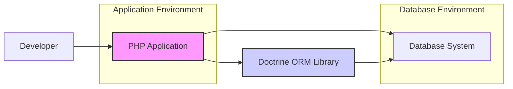
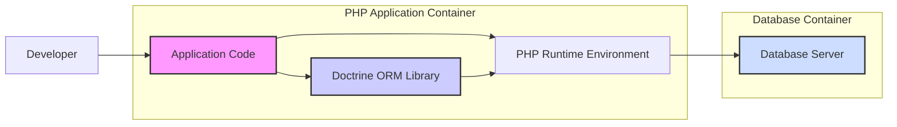

# BUSINESS POSTURE

Doctrine ORM is an Object-Relational Mapper (ORM) for PHP that provides data mapping and data persistence tools. It sits between the application code and the database, allowing developers to interact with the database using object-oriented paradigms instead of writing raw SQL queries.

Business Priorities and Goals:

- Simplify database interactions for PHP developers, increasing development speed and efficiency.
- Improve code maintainability by abstracting database specifics and promoting object-oriented design.
- Enhance data consistency and integrity through ORM features like relationships and validation.
- Reduce the risk of SQL injection vulnerabilities by using parameterized queries and abstraction.
- Provide a flexible and extensible data access layer that can adapt to various database systems and application requirements.
- Support complex data models and relationships, enabling developers to build sophisticated applications.
- Foster a strong community and ecosystem around Doctrine ORM, ensuring long-term support and innovation.

Most Important Business Risks:

- Data breaches due to vulnerabilities in Doctrine ORM or its usage.
- Application downtime caused by performance issues or misconfigurations related to Doctrine ORM.
- Data corruption or inconsistency resulting from incorrect ORM mappings or usage patterns.
- Vendor lock-in to Doctrine ORM, making migration to other ORMs or data access technologies difficult.
- Security vulnerabilities in dependencies used by Doctrine ORM, impacting applications using it.

# SECURITY POSTURE

Existing Security Controls:

- security control: Code Review - Doctrine ORM is an open-source project with community contributions and reviews. Implemented through GitHub pull requests and community oversight.
- security control: Static Analysis - Likely used by contributors and maintainers during development, although not explicitly documented in the repository.
- security control: Input Parameterization - Doctrine ORM uses parameterized queries to prevent SQL injection vulnerabilities. Implemented within the ORM core logic.
- security control: Secure Defaults - Doctrine ORM aims for secure defaults in its configuration and operation.
- accepted risk: Dependency Vulnerabilities - Doctrine ORM relies on third-party libraries, which may contain vulnerabilities. Risk is accepted and mitigated through dependency updates and security advisories.
- accepted risk: Misconfiguration - Incorrect configuration of Doctrine ORM by developers can lead to security vulnerabilities or performance issues. Risk is accepted and mitigated through documentation and best practices.

Recommended Security Controls:

- security control: Dependency Scanning - Implement automated dependency scanning in the development and release pipeline to identify and address vulnerabilities in third-party libraries used by Doctrine ORM.
- security control: Security Audits - Conduct regular security audits of the Doctrine ORM codebase by external security experts to identify potential vulnerabilities.
- security control: Fuzzing - Implement fuzzing techniques to test Doctrine ORM against unexpected or malicious inputs to uncover potential vulnerabilities.
- security control: Security Hardening Guide - Create a comprehensive security hardening guide for developers using Doctrine ORM, outlining best practices for secure configuration and usage.
- security control: Vulnerability Disclosure Program - Establish a clear vulnerability disclosure program to allow security researchers to report vulnerabilities responsibly.

Security Requirements:

- Authentication:
    - Requirement: Doctrine ORM itself does not handle application user authentication. Authentication is the responsibility of the application using Doctrine ORM.
    - Requirement: Doctrine ORM needs to authenticate to the database system. This is typically handled through database connection credentials (username/password, certificates, etc.) configured in the application.
- Authorization:
    - Requirement: Doctrine ORM does not enforce application-level authorization. Authorization logic is implemented within the application code, potentially using Doctrine ORM to manage data access rules.
    - Requirement: Database-level authorization should be configured to restrict Doctrine ORM's database access to the minimum required privileges.
- Input Validation:
    - Requirement: Doctrine ORM helps prevent SQL injection by using parameterized queries, but input validation at the application level is still crucial to ensure data integrity and prevent other types of vulnerabilities.
    - Requirement: Doctrine ORM should provide mechanisms for developers to easily validate data before persisting it to the database, such as entity validation and data type constraints.
- Cryptography:
    - Requirement: Doctrine ORM itself does not provide built-in encryption features. If data encryption is required, it should be implemented at the application level or database level.
    - Requirement: Doctrine ORM should handle sensitive data (e.g., database credentials) securely during configuration and operation, avoiding storing them in plain text and using secure configuration mechanisms.

# DESIGN

## C4 CONTEXT



Context Diagram Elements:

- Element:
    - Name: Developer
    - Type: Person
    - Description: Software developer who uses Doctrine ORM to build and maintain PHP applications.
    - Responsibilities: Writes application code, configures Doctrine ORM, defines data models, and interacts with the database through the ORM.
    - Security controls: Code reviews, secure coding practices, access control to development environment.
- Element:
    - Name: PHP Application
    - Type: Software System
    - Description: The PHP application that utilizes Doctrine ORM for data persistence and database interaction.
    - Responsibilities: Implements business logic, handles user requests, interacts with Doctrine ORM to manage data in the database.
    - Security controls: Input validation, authorization, session management, secure configuration, vulnerability scanning.
- Element:
    - Name: Doctrine ORM Library
    - Type: Software System (Library)
    - Description: The Doctrine ORM library itself, providing object-relational mapping functionality.
    - Responsibilities: Maps PHP objects to database tables, generates SQL queries, manages database connections, provides data persistence and retrieval mechanisms.
    - Security controls: Input parameterization, secure defaults, code reviews, static analysis, dependency scanning.
- Element:
    - Name: Database System
    - Type: Software System
    - Description: The database system (e.g., MySQL, PostgreSQL, etc.) used to store application data.
    - Responsibilities: Stores and manages data, executes SQL queries, enforces data integrity, provides data access control.
    - Security controls: Access control lists, database authentication, encryption at rest and in transit, database auditing, vulnerability patching.

## C4 CONTAINER



Container Diagram Elements:

- Element:
    - Name: PHP Runtime Environment
    - Type: Container (Runtime Environment)
    - Description: The PHP runtime environment (e.g., PHP-FPM, Apache mod_php) that executes the PHP application and Doctrine ORM.
    - Responsibilities: Executes PHP code, manages resources, handles requests, provides necessary PHP extensions for Doctrine ORM and database connectivity.
    - Security controls: Operating system security hardening, PHP configuration hardening, resource limits, vulnerability patching.
- Element:
    - Name: Application Code
    - Type: Container (Application Component)
    - Description: The custom application code written by developers that utilizes Doctrine ORM.
    - Responsibilities: Implements business logic, handles user interactions, uses Doctrine ORM to interact with the database.
    - Security controls: Input validation, authorization logic, secure coding practices, application-level security measures.
- Element:
    - Name: Doctrine ORM Library
    - Type: Container (Library)
    - Description: The Doctrine ORM library, packaged and deployed as part of the PHP application.
    - Responsibilities: Provides ORM functionality, maps objects to database, generates queries, manages connections.
    - Security controls: As listed in Security Posture - Input parameterization, secure defaults, code reviews, static analysis, dependency scanning.
- Element:
    - Name: Database Server
    - Type: Container (Database)
    - Description: The database server (e.g., MySQL, PostgreSQL) that stores and manages the application data.
    - Responsibilities: Data storage, data retrieval, query processing, data integrity, access control.
    - Security controls: As listed in Context Diagram - Access control lists, database authentication, encryption at rest and in transit, database auditing, vulnerability patching.

## DEPLOYMENT

Deployment Scenario: Typical Web Application Deployment

```mermaid
flowchart LR
    subgraph "Development Environment"
        DevWorkstation["Developer Workstation"]
    end
    subgraph "Staging Environment"
        StgWebServer["Staging Web Server"]
        StgAppServer["Staging Application Server"]
        StgDBServer["Staging Database Server"]
    end
    subgraph "Production Environment"
        ProdWebServer["Production Web Server"]
        ProdAppServer["Production Application Server"]
        ProdDBServer["Production Database Server"]
    end

    DevWorkstation --> StgWebServer: Deploy Code
    StgWebServer --> StgAppServer: Application Execution
    StgAppServer --> StgDBServer: Database Access
    StgWebServer --> ProdWebServer: Promote to Production
    ProdWebServer --> ProdAppServer: Application Execution
    ProdAppServer --> ProdDBServer: Database Access

    style DevWorkstation fill:#eee,stroke:#333,stroke-width:1px
    style StgWebServer fill:#eee,stroke:#333,stroke-width:1px
    style StgAppServer fill:#eee,stroke:#333,stroke-width:1px
    style StgDBServer fill:#eee,stroke:#333,stroke-width:1px
    style ProdWebServer fill:#eee,stroke:#333,stroke-width:1px
    style ProdAppServer fill:#eee,stroke:#333,stroke-width:1px
    style ProdDBServer fill:#eee,stroke:#333,stroke-width:1px
```

Deployment Diagram Elements (Production Environment):

- Element:
    - Name: Production Web Server
    - Type: Infrastructure (Server)
    - Description: Web server (e.g., Nginx, Apache) that handles incoming HTTP requests and serves static content, and proxies requests to the application server.
    - Responsibilities: Web request handling, SSL termination, load balancing, reverse proxy, static content serving.
    - Security controls: Web server hardening, SSL/TLS configuration, DDoS protection, web application firewall (WAF).
- Element:
    - Name: Production Application Server
    - Type: Infrastructure (Server)
    - Description: Application server running the PHP runtime environment and the PHP application with Doctrine ORM.
    - Responsibilities: Executes PHP application code, processes business logic, interacts with the database server through Doctrine ORM.
    - Security controls: Application server hardening, PHP runtime security, resource limits, intrusion detection system (IDS), vulnerability scanning.
- Element:
    - Name: Production Database Server
    - Type: Infrastructure (Server)
    - Description: Database server hosting the application database.
    - Responsibilities: Data storage, data management, query processing, data integrity, access control.
    - Security controls: Database server hardening, database access control, encryption at rest and in transit, database auditing, backup and recovery, vulnerability patching.

## BUILD

```mermaid
flowchart LR
    Developer["Developer Workstation"] --> VCS["Version Control System (GitHub)"]: Code Commit
    VCS --> CI["CI/CD System (GitHub Actions)"]: Trigger Build
    CI --> BuildEnv["Build Environment"]: Build & Test
    BuildEnv --> SAST["SAST Scanner"]: Security Scan
    BuildEnv --> ArtifactRepo["Artifact Repository (Packagist)"]: Publish Package

    style Developer fill:#eee,stroke:#333,stroke-width:1px
    style VCS fill:#eee,stroke:#333,stroke-width:1px
    style CI fill:#eee,stroke:#333,stroke-width:1px
    style BuildEnv fill:#eee,stroke:#333,stroke-width:1px
    style SAST fill:#eee,stroke:#333,stroke-width:1px
    style ArtifactRepo fill:#eee,stroke:#333,stroke-width:1px
```

Build Process Description:

1. Developer commits code changes to the Version Control System (GitHub).
2. The CI/CD system (e.g., GitHub Actions, Jenkins) is triggered by code commits.
3. A Build Environment is provisioned to perform the build and test process.
4. The Build Environment compiles the code, runs unit tests, and performs integration tests.
5. A Static Application Security Testing (SAST) scanner is used to analyze the code for potential security vulnerabilities.
6. If the build and security checks are successful, the build artifacts (Doctrine ORM library package) are published to an Artifact Repository (e.g., Packagist for PHP packages).

Build Diagram Elements:

- Element:
    - Name: Developer Workstation
    - Type: Environment
    - Description: Developer's local machine where code is written and tested before committing.
    - Responsibilities: Code development, local testing, code commit.
    - Security controls: Developer workstation security, code review, secure coding practices.
- Element:
    - Name: Version Control System (GitHub)
    - Type: System
    - Description: GitHub repository hosting the Doctrine ORM source code.
    - Responsibilities: Source code management, version control, collaboration, code review.
    - Security controls: Access control, branch protection, audit logs, vulnerability scanning.
- Element:
    - Name: CI/CD System (GitHub Actions)
    - Type: System
    - Description: Automated CI/CD system used to build, test, and publish Doctrine ORM.
    - Responsibilities: Build automation, testing, security scanning, artifact publishing.
    - Security controls: Secure CI/CD pipeline configuration, access control, secret management, build environment security.
- Element:
    - Name: Build Environment
    - Type: Environment
    - Description: Isolated environment used to perform the build and test process.
    - Responsibilities: Code compilation, testing, security scanning.
    - Security controls: Secure build environment configuration, dependency management, isolation, temporary environment.
- Element:
    - Name: SAST Scanner
    - Type: Tool
    - Description: Static Application Security Testing tool used to analyze the codebase for vulnerabilities.
    - Responsibilities: Static code analysis, vulnerability detection, security report generation.
    - Security controls: SAST tool configuration, vulnerability database updates, secure integration with CI/CD.
- Element:
    - Name: Artifact Repository (Packagist)
    - Type: System
    - Description: Repository (like Packagist for PHP) where the built Doctrine ORM library package is published for distribution.
    - Responsibilities: Package storage, versioning, distribution, access control.
    - Security controls: Access control, package signing, vulnerability scanning, repository security.

# RISK ASSESSMENT

Critical Business Processes:

- Data persistence and retrieval for applications using Doctrine ORM.
- Database interaction and data management within applications.
- Development and maintenance of applications relying on Doctrine ORM.
- Distribution and availability of the Doctrine ORM library itself.

Data Sensitivity:

- The sensitivity of data handled by Doctrine ORM depends entirely on the applications that use it. Doctrine ORM itself does not store or process business data directly.
- Sensitive data might include:
    - Personally Identifiable Information (PII)
    - Financial data
    - Healthcare information
    - Intellectual property
    - Application secrets and credentials (handled indirectly through application configuration)
- The sensitivity level varies greatly depending on the application domain and regulatory requirements.

# QUESTIONS & ASSUMPTIONS

Questions:

- What specific database systems are primarily targeted and supported by Doctrine ORM from a security perspective?
- Are there any specific security certifications or compliance standards that Doctrine ORM aims to meet or support?
- What is the process for handling and disclosing security vulnerabilities in Doctrine ORM?
- Are there any specific security features planned for future releases of Doctrine ORM?
- What are the recommended security configurations and best practices for applications using Doctrine ORM?

Assumptions:

- BUSINESS POSTURE:
    - The primary business goal is to provide a robust and reliable ORM solution for PHP developers.
    - Security is a significant concern for users of Doctrine ORM, especially in enterprise environments.
    - The Doctrine ORM project is committed to addressing security vulnerabilities and providing secure software.
- SECURITY POSTURE:
    - Standard secure software development lifecycle practices are followed by the Doctrine ORM project.
    - Security controls are primarily focused on preventing common web application vulnerabilities, especially SQL injection.
    - Developers using Doctrine ORM are responsible for implementing application-level security controls.
- DESIGN:
    - Doctrine ORM is designed to be a library integrated into PHP applications.
    - Deployment scenarios are typical web application deployments with web servers, application servers, and database servers.
    - The build process involves standard CI/CD practices, including testing and artifact publishing.