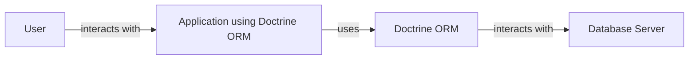
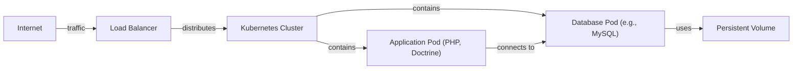
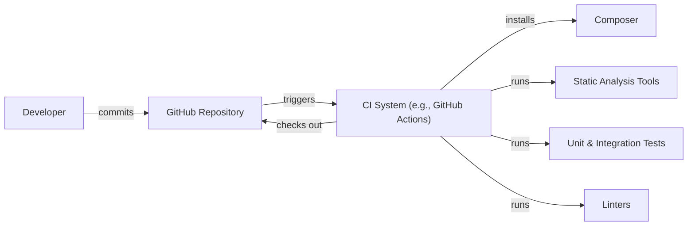

Okay, let's create a design document for the Doctrine ORM project, keeping in mind its purpose and potential security considerations.

# BUSINESS POSTURE

Doctrine ORM is a fundamental library for many PHP applications, providing a crucial layer of abstraction between the application logic and the database.  Its primary business goals are:

*   Provide a robust and reliable object-relational mapping (ORM) solution for PHP developers.
*   Simplify database interactions, allowing developers to focus on business logic rather than SQL.
*   Improve code maintainability and reduce the risk of SQL injection vulnerabilities through the use of prepared statements and query builders.
*   Support a wide range of database systems.
*   Maintain an active and supportive open-source community.

Business priorities:

*   Data Integrity: Ensuring that data stored and retrieved is accurate and consistent.
*   Application Availability:  The ORM should not be a point of failure that brings down applications.
*   Developer Productivity:  The ORM should be easy to use and well-documented.
*   Community Trust:  Maintaining the trust of the PHP community is paramount, as many projects rely on Doctrine.

Most important business risks:

*   Data breaches due to vulnerabilities in the ORM.
*   Application downtime caused by ORM bugs or misconfiguration.
*   Loss of developer productivity due to complex or poorly performing ORM features.
*   Reputational damage due to security incidents or unresolved issues.
*   Data corruption.

# SECURITY POSTURE

Existing security controls (based on the GitHub repository and common practices):

*   security control: Prepared Statements: Doctrine heavily utilizes prepared statements to prevent SQL injection vulnerabilities. (Implemented in the DBAL and ORM layers)
*   security control: Query Builder:  The query builder provides a safer way to construct queries programmatically, reducing the risk of manual SQL errors and injection. (Implemented in the ORM layer)
*   security control: Input Validation: While Doctrine itself doesn't handle direct user input, it encourages developers to validate data before persisting it to the database. (Described in documentation and best practices)
*   security control: Escaping:  The DBAL (Database Abstraction Layer) handles escaping of data for different database systems. (Implemented in the DBAL layer)
*   security control: Code Reviews:  As an open-source project, Doctrine benefits from community code reviews, which can help identify potential security issues. (Implemented in the development process via pull requests)
*   security control: Static Analysis:  The project likely uses static analysis tools to identify potential bugs and vulnerabilities. (Inferred from common practice, not explicitly stated)
*   security control: Security Policy: The project has a security policy, describing how to report vulnerabilities. (SECURITY.md file)

Accepted risks:

*   accepted risk: Third-Party Dependencies: Doctrine relies on external libraries (e.g., database drivers), which could introduce vulnerabilities.
*   accepted risk: Misconfiguration:  Developers can misconfigure Doctrine or the underlying database, leading to security issues. This is mitigated by documentation and best practices.
*   accepted risk: Zero-Day Vulnerabilities:  Like any software, Doctrine is susceptible to unknown vulnerabilities.

Recommended security controls:

*   Implement Regular Security Audits: Conduct periodic security audits by external experts to identify potential vulnerabilities.
*   Implement Dependency Scanning: Integrate automated dependency scanning tools to detect and address known vulnerabilities in third-party libraries.
*   Implement Fuzz Testing: Introduce fuzz testing to identify unexpected behavior and potential vulnerabilities.

Security Requirements:

*   Authentication: Doctrine itself does not handle authentication. Authentication is the responsibility of the application using Doctrine.
*   Authorization: Doctrine does not implement authorization mechanisms directly. Authorization should be handled at the application level, controlling access to entities and operations based on user roles and permissions.
*   Input Validation: While Doctrine provides mechanisms like prepared statements, the application is ultimately responsible for validating user-provided data *before* it reaches the ORM. This includes validating data types, lengths, and formats.
*   Cryptography: Doctrine should support encrypted fields at the database level if the underlying database system supports it. The application is responsible for managing encryption keys and deciding which fields to encrypt. Doctrine should also support secure connections (e.g., TLS) to the database.

# DESIGN

## C4 CONTEXT

Element Description:

*   Element:
    *   Name: User
    *   Type: Person
    *   Description: A user of the application that utilizes Doctrine ORM.
    *   Responsibilities: Interacts with the application, providing input and receiving output.
    *   Security controls: None directly implemented by Doctrine. Relies on application-level security.

*   Element:
    *   Name: Application using Doctrine ORM
    *   Type: Software System
    *   Description: A PHP application that uses Doctrine ORM to interact with a database.
    *   Responsibilities: Handles user requests, business logic, and data persistence.
    *   Security controls: Authentication, authorization, input validation, session management (all implemented at the application level).

*   Element:
    *   Name: Doctrine ORM
    *   Type: Software System
    *   Description: The Doctrine Object Relational Mapper library.
    *   Responsibilities: Provides an abstraction layer between the application and the database, mapping objects to database tables.
    *   Security controls: Prepared statements, query builder, escaping (through DBAL).

*   Element:
    *   Name: Database Server
    *   Type: Software System
    *   Description: The database system (e.g., MySQL, PostgreSQL, etc.) used to store data.
    *   Responsibilities: Stores and retrieves data, enforces data integrity constraints.
    *   Security controls: Database-level access controls, encryption (if configured), auditing.

## C4 CONTAINER

Element Description:

*   Element:
    *   Name: User
    *   Type: Person
    *   Description: A user of the application.
    *   Responsibilities: Interacts with the application.
    *   Security controls: None directly implemented by Doctrine.

*   Element:
    *   Name: Application
    *   Type: Web Application / API / CLI
    *   Description: The application code that utilizes Doctrine.
    *   Responsibilities: Handles user requests, business logic, and interacts with Doctrine's EntityManager.
    *   Security controls: Authentication, authorization, input validation (implemented at the application level).

*   Element:
    *   Name: EntityManager (Doctrine)
    *   Type: Container
    *   Description: The primary interface for interacting with Doctrine ORM.
    *   Responsibilities: Manages entities, persistence, and querying.
    *   Security controls: Uses prepared statements and the query builder (indirectly through UnitOfWork and DBAL).

*   Element:
    *   Name: UnitOfWork (Doctrine)
    *   Type: Container
    *   Description: Tracks changes to entities and manages persistence operations.
    *   Responsibilities: Coordinates database interactions, ensures data consistency.
    *   Security controls: Relies on DBAL for secure database communication.

*   Element:
    *   Name: DBAL (Doctrine)
    *   Type: Container
    *   Description: The Database Abstraction Layer.
    *   Responsibilities: Provides a consistent interface for interacting with different database systems.
    *   Security controls: Handles escaping, prepared statements, and connection security.

*   Element:
    *   Name: Database Server
    *   Type: Database
    *   Description: The database system.
    *   Responsibilities: Stores and retrieves data.
    *   Security controls: Database-level access controls, encryption (if configured).

## DEPLOYMENT

Possible deployment solutions:

1.  Traditional LAMP/LEMP stack: PHP application deployed on a server with Apache/Nginx, MySQL/PostgreSQL, etc.
2.  Containerized deployment: Application and database packaged as Docker containers, orchestrated with Docker Compose or Kubernetes.
3.  Cloud-based deployment: Application deployed on a cloud platform (e.g., AWS, Azure, GCP) using services like EC2, App Service, or Cloud Run, with a managed database service (e.g., RDS, Cloud SQL).
4.  Serverless deployment: Application logic deployed as serverless functions (e.g., AWS Lambda), interacting with a database.

Chosen solution (for detailed description): Containerized deployment using Docker and Kubernetes.

Element Description:

*   Element:
    *   Name: Internet
    *   Type: External
    *   Description: The public internet.
    *   Responsibilities: Source of user requests.
    *   Security controls: None directly managed by the application.

*   Element:
    *   Name: Load Balancer
    *   Type: Load Balancer
    *   Description: Distributes incoming traffic across multiple application pods.
    *   Responsibilities: Handles TLS termination, distributes traffic.
    *   Security controls: TLS encryption, potentially a Web Application Firewall (WAF).

*   Element:
    *   Name: Kubernetes Cluster
    *   Type: Container Orchestrator
    *   Description: Manages the deployment and scaling of containers.
    *   Responsibilities: Schedules pods, manages networking, ensures high availability.
    *   Security controls: Network policies, role-based access control (RBAC), pod security policies.

*   Element:
    *   Name: Application Pod (PHP, Doctrine)
    *   Type: Container
    *   Description: A pod running the PHP application code and Doctrine ORM.
    *   Responsibilities: Handles application logic, interacts with the database.
    *   Security controls: Application-level security controls, secure communication with the database pod.

*   Element:
    *   Name: Database Pod (e.g., MySQL)
    *   Type: Container
    *   Description: A pod running the database server.
    *   Responsibilities: Stores and retrieves data.
    *   Security controls: Database-level access controls, encryption at rest (if configured), secure communication with the application pod.

*   Element:
    *   Name: Persistent Volume
    *   Type: Storage
    *   Description: Persistent storage for the database.
    *   Responsibilities: Provides durable storage for database data.
    *   Security controls: Encryption at rest (if configured).

## BUILD

The Doctrine ORM build process likely involves the following steps:

1.  Developer commits code to the GitHub repository.
2.  A Continuous Integration (CI) system (e.g., GitHub Actions, Travis CI) is triggered.
3.  The CI system checks out the code.
4.  Dependencies are installed (e.g., using Composer).
5.  Static analysis tools (e.g., PHPStan, Psalm) are run to identify potential code quality issues and vulnerabilities.
6.  Unit tests and integration tests are executed.
7.  Code style checks (e.g., linters) are performed.
8.  If all checks and tests pass, the code is considered buildable.  No specific artifacts are "published" in the traditional sense for a library like Doctrine; the repository itself serves as the distribution mechanism.

Security Controls in Build Process:

*   security control: Dependency Management: Composer manages dependencies and helps ensure that specific versions are used.
*   security control: Static Analysis: Tools like PHPStan and Psalm can identify potential vulnerabilities and code quality issues.
*   security control: Automated Testing: Unit and integration tests help ensure that the code functions as expected and can catch regressions.
*   security control: Code Style Checks: Linters enforce consistent coding standards, which can improve code readability and reduce the risk of errors.
*   security control: CI/CD Pipeline: Automating the build process ensures that security checks are consistently applied.

# RISK ASSESSMENT

*   Critical business process we are trying to protect: The core business process is the reliable and secure interaction between PHP applications and databases. This includes data persistence, retrieval, and manipulation.
*   Data we are trying to protect and their sensitivity: Doctrine ORM handles potentially *all* data stored in an application's database. The sensitivity of this data varies greatly depending on the application. It could range from non-sensitive public data to highly sensitive personal information, financial data, or trade secrets. Therefore, Doctrine must be designed to handle the *most sensitive* data securely, assuming that it *will* be used to store such data.

# QUESTIONS & ASSUMPTIONS

Questions:

*   What specific static analysis tools are used in the Doctrine build process?
*   Are there any plans to implement fuzz testing?
*   What is the frequency of external security audits?
*   How are database connection credentials managed in different deployment scenarios?
*   What level of support is provided for database-level encryption?

Assumptions:

*   BUSINESS POSTURE: The Doctrine project prioritizes security and follows secure coding practices.
*   SECURITY POSTURE: Developers using Doctrine are responsible for implementing application-level security controls (authentication, authorization, input validation).
*   DESIGN: The deployment environment will be configured securely, with appropriate network policies and access controls. The database will be configured with strong passwords and secure connection settings.
*   BUILD: The CI system is configured to run all necessary security checks on every code change.