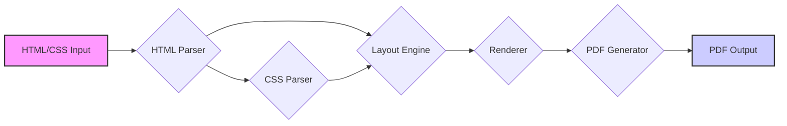
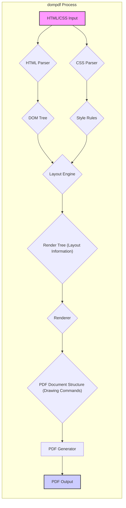

# Project Design Document: dompdf

**Version:** 1.1
**Date:** October 26, 2023
**Prepared By:** Gemini (AI Language Model)

## 1. Introduction

This document provides an enhanced and more detailed design overview of the dompdf library, a PHP library for converting HTML documents into PDF files. This revised document is specifically tailored to serve as a robust foundation for subsequent threat modeling activities. It offers a deeper understanding of the key components, data flow, and architectural nuances relevant to assessing the library's security posture.

## 2. Goals and Objectives

*   Provide a comprehensive and granular description of dompdf's architecture and functionality.
*   Clearly identify key components, their specific responsibilities, and their interactions.
*   Illustrate the data flow within the library with greater precision, highlighting potential transformation points.
*   Emphasize potential areas of security concern with more specific examples for future threat modeling exercises.
*   Serve as a definitive and up-to-date reference point for security assessments, development efforts, and onboarding new team members.

## 3. Scope

This document encompasses the core functionality of the dompdf library, focusing on the intricate process of converting HTML and CSS into PDF documents. It includes:

*   Detailed analysis of input processing (HTML, CSS, and external resources).
*   In-depth explanation of the rendering engine and layout algorithms.
*   Comprehensive overview of font handling mechanisms and considerations.
*   Detailed examination of image handling processes and supported formats.
*   Thorough description of the PDF generation process and structure.
*   Analysis of key configuration options with a strong emphasis on their security implications.

This document continues to exclude:

*   Fine-grained implementation details of individual classes or functions (unless directly relevant to security).
*   A historical account of the project's evolution or its development lifecycle.
*   Detailed performance benchmarking or optimization strategies.

## 4. High-Level Architecture

The following diagram illustrates the high-level architecture of dompdf, providing a clear overview of the major stages:

**Description:**

*   **"HTML/CSS Input"**: Represents the initial HTML and CSS content provided to dompdf for conversion. This can originate from various sources, including user input, database content, or files.
*   **"HTML Parser"**:  The component responsible for parsing the HTML input, validating its structure, and constructing a Document Object Model (DOM) representation. This DOM tree is a hierarchical representation of the HTML elements.
*   **"CSS Parser"**:  This component parses the CSS input, whether inline within the HTML or provided as external stylesheets. It interprets the CSS rules and creates a style sheet object that associates styles with specific HTML elements.
*   **"Layout Engine"**: The central component that orchestrates the layout process. It takes the DOM tree and the style sheet and calculates the precise layout of the document, determining the position, size, and flow of each element on the page.
*   **"Renderer"**:  Responsible for the actual drawing of elements onto the PDF canvas based on the layout information generated by the Layout Engine. This involves rendering text, images, and graphical shapes.
*   **"PDF Generator"**:  This component takes the rendered output and constructs the final PDF document according to the PDF specification. It organizes the content, metadata, and other necessary elements into a valid PDF file.
*   **"PDF Output"**: The resulting PDF file generated by dompdf, ready for storage, download, or further processing.

## 5. Detailed Design

### 5.1. Input Processing

*   **HTML Input:**
    *   dompdf accepts HTML as a string, typically UTF-8 encoded.
    *   It leverages the `Masterminds\HTML5` library for robust and standards-compliant HTML parsing.
    *   Security Considerations:
        *   **Cross-Site Scripting (XSS):**  Malicious HTML input could contain scripts that, if not properly handled, might be inadvertently executed if the PDF is opened in a context that allows JavaScript (though dompdf aims to prevent this).
        *   **Denial-of-Service (DoS):**  Extremely large or deeply nested HTML structures could consume excessive server resources during parsing, leading to DoS.
        *   **HTML Injection:**  If user-provided data is directly embedded into the HTML before processing, it could lead to unintended structural changes or the inclusion of malicious elements.
*   **CSS Input:**
    *   dompdf processes CSS from various sources: inline styles, `<style>` tags, and external stylesheets referenced via `<link>` tags or provided programmatically.
    *   It employs a custom CSS parser.
    *   Security Considerations:
        *   **CSS Injection:**  Malicious CSS could be injected to alter the visual presentation in harmful ways, potentially misleading users or obscuring critical information.
        *   **Resource Exhaustion:**  Complex or excessively large CSS rulesets could strain the parser and layout engine, leading to performance degradation or DoS.
        *   **Information Disclosure:**  While less direct, carefully crafted CSS might be used in conjunction with other vulnerabilities to infer information about the server or application.
        *   **Vulnerabilities in Custom Parser:**  Bugs or oversights in the custom CSS parsing logic could be exploited.
*   **External Resources:**
    *   HTML documents processed by dompdf can reference external resources such as images, stylesheets, and fonts via URLs.
    *   dompdf needs to fetch these resources during the rendering process.
    *   Security Considerations:
        *   **Server-Side Request Forgery (SSRF):** If URLs for external resources are derived from user input without proper validation, an attacker could force the server to make requests to internal or arbitrary external systems.
        *   **Inclusion of Malicious Content:**  dompdf might inadvertently fetch and process malicious images, stylesheets, or fonts from compromised or attacker-controlled servers.
        *   **Exposure of Internal Network:**  If `DOMPDF_ENABLE_REMOTE` is enabled without careful consideration, it could expose internal network resources to external attackers.

### 5.2. Layout Engine

*   The Layout Engine is a critical component responsible for interpreting the parsed HTML structure and CSS styles to determine the precise visual arrangement of elements on the page.
*   It implements various layout algorithms based on CSS specifications (e.g., block layout, inline layout, flexbox, table layout).
*   Security Considerations:
    *   **Algorithmic Complexity Exploitation:**  Attackers might craft specific HTML and CSS combinations that trigger inefficient layout calculations, leading to CPU exhaustion and DoS.
    *   **Integer Overflow/Underflow:**  Bugs in layout calculations, particularly when dealing with very large or very small dimensions, could potentially lead to unexpected behavior or even crashes.
    *   **Memory Exhaustion:**  Extremely complex layouts with a large number of elements could consume excessive memory during the layout process.

### 5.3. Rendering

*   The Renderer takes the layout information generated by the Layout Engine and translates it into drawing commands for the PDF document.
*   Key aspects of rendering include:
    *   **Text Rendering:**  Involves selecting appropriate fonts, rendering glyphs, handling text wrapping, and applying text decorations.
    *   **Image Rendering:**  Handles the decoding and rendering of various image formats (JPEG, PNG, GIF, etc.).
    *   **Shape Rendering:**  Draws borders, backgrounds, and other graphical elements defined by CSS.
*   Security Considerations:
    *   **Font Parsing Vulnerabilities:**  If dompdf uses external libraries for font parsing (though it primarily uses its own and `FontLib`), vulnerabilities in those libraries could be exploited by providing malicious font files.
    *   **Image Processing Vulnerabilities:**  Vulnerabilities in PHP's GD library or the Imagick extension (if used) could be exploited through specially crafted image files, potentially leading to code execution or crashes.
    *   **Denial-of-Service via Large Images:**  Processing extremely large or complex images could consume excessive memory and processing power.

### 5.4. Font Handling

*   dompdf relies on access to font files to render text correctly.
*   It primarily supports TrueType (.ttf) and OpenType (.otf) font formats.
*   Font files can be loaded from:
    *   System font directories (depending on the operating system).
    *   User-defined font directories configured within dompdf.
    *   Remote URLs (if the `DOMPDF_ENABLE_REMOTE` option is enabled).
*   Security Considerations:
    *   **Malicious Font Files:**  Loading and parsing malicious font files could potentially trigger vulnerabilities in font parsing libraries, leading to code execution or other security issues.
    *   **Font Cache Poisoning:**  If the font cache is not properly secured, an attacker might be able to inject malicious font data.
    *   **Denial-of-Service via Large Fonts:**  Processing excessively large or complex font files could lead to resource exhaustion.

### 5.5. Image Handling

*   dompdf supports various image formats, relying on PHP's GD library or the Imagick extension for image processing. Imagick is generally recommended for better performance and format support.
*   Images can be loaded from:
    *   Local file paths on the server.
    *   Remote URLs (if `DOMPDF_ENABLE_REMOTE` is enabled).
    *   Data URIs embedded within the HTML or CSS.
*   Security Considerations:
    *   **Image Processing Vulnerabilities (GD/Imagick):**  Known vulnerabilities in GD or Imagick could be exploited by providing specially crafted image files. This could lead to code execution, crashes, or information disclosure.
    *   **Server-Side Request Forgery (SSRF):**  If remote image URLs are not properly validated, attackers could exploit SSRF vulnerabilities.
    *   **"Image Bomb" Attacks:**  Processing specially crafted images designed to consume excessive memory or processing time could lead to DoS.

### 5.6. PDF Generation

*   The PDF Generator takes the rendered content and constructs the final PDF document according to the PDF specification.
*   This involves creating PDF objects, defining the document structure, embedding fonts and images, and generating metadata.
*   Security Considerations:
    *   **Embedding Malicious JavaScript:** While dompdf aims to avoid this by default, vulnerabilities in the rendering or PDF generation process could potentially lead to the inclusion of malicious JavaScript within the PDF.
    *   **Information Leakage via Metadata:**  PDF metadata might inadvertently reveal sensitive information about the server or the document's origin.
    *   **Malformed PDF Generation:**  Bugs in the PDF generation logic could lead to the creation of malformed PDFs that might crash PDF viewers or be exploited by PDF parsing vulnerabilities.

### 5.7. Key Configuration Options (Security Implications)

*   **`DOMPDF_ENABLE_REMOTE`:**  **CRITICAL SECURITY RISK if enabled without careful control.** Allows fetching of remote resources, opening the door to SSRF vulnerabilities and the inclusion of malicious content. Should be disabled by default or strictly controlled with whitelisting.
*   **`DOMPDF_TEMP_DIR`:**  Specifies the directory for temporary files. Incorrect permissions on this directory could allow attackers to read or write arbitrary files. Ensure this directory has restrictive permissions.
*   **`DOMPDF_CHROOT`:**  A valuable security feature that restricts dompdf's file access to a specific directory. This can mitigate local file inclusion vulnerabilities. Strongly recommended to enable and configure appropriately.
*   **`DOMPDF_ENABLE_PHP`:**  **EXTREME SECURITY RISK.** Allows the execution of embedded PHP code within the HTML. Should **NEVER** be enabled when processing untrusted input.
*   **`DOMPDF_ENABLE_JAVASCRIPT`:**  Controls whether JavaScript within the HTML is processed (primarily for layout calculations). While not intended for executing scripts in the PDF, vulnerabilities in the JavaScript parsing or processing could still pose a risk. Should be disabled if not strictly necessary.
*   **Font Directory Settings:**  Carefully control the directories from which dompdf loads fonts to prevent the loading of malicious font files.

## 6. Data Flow Diagram

The following diagram provides a more detailed illustration of the data flow within the dompdf library, highlighting key transformation points:

**Description:**

1. **"HTML/CSS Input"**: The initial HTML and CSS content.
2. **"HTML Parser"**: Parses the HTML input.
3. **"DOM Tree"**: The hierarchical representation of the HTML structure.
4. **"CSS Parser"**: Parses the CSS input.
5. **"Style Rules"**: The set of CSS rules extracted from the input.
6. **"Layout Engine"**: Combines the DOM Tree and Style Rules.
7. **"Render Tree (Layout Information)"**:  Represents the calculated layout of the document, including element positions and sizes.
8. **"Renderer"**:  Translates the layout information into drawing commands.
9. **"PDF Document Structure (Drawing Commands)"**:  The internal representation of the PDF content and structure.
10. **"PDF Generator"**:  Generates the final PDF file.
11. **"PDF Output"**: The resulting PDF document.

## 7. Security Considerations (Detailed)

Based on the detailed design, potential areas of security concern include:

*   **Strict Input Validation and Sanitization:** Implement robust validation and sanitization for all input, including HTML, CSS, and URLs for external resources. Use allow-lists where possible and escape output appropriately.
*   **Mitigation of Server-Side Request Forgery (SSRF):**  Disable `DOMPDF_ENABLE_REMOTE` by default. If remote resource fetching is necessary, implement strict whitelisting of allowed domains and protocols.
*   **Secure Font Handling:**  Only load fonts from trusted sources. Consider disabling remote font loading entirely. Regularly update font parsing libraries if used.
*   **Secure Image Handling:**  Sanitize image URLs and consider using a dedicated image processing service or sandboxed environment for processing images. Keep GD or Imagick updated with the latest security patches.
*   **Secure Configuration Management:**  Follow the principle of least privilege when configuring dompdf. Disable unnecessary features like `DOMPDF_ENABLE_PHP` and `DOMPDF_ENABLE_JAVASCRIPT`. Use `DOMPDF_CHROOT` to restrict file access.
*   **Dependency Management:**  Maintain up-to-date versions of all dependencies, including `Masterminds\HTML5`, FontLib, and PHP extensions like GD and Imagick, to address known vulnerabilities. Use a dependency management tool and regularly audit dependencies.
*   **Protection Against Algorithmic Complexity Attacks:**  Implement safeguards to prevent excessively complex HTML or CSS from causing resource exhaustion. Consider setting limits on parsing depth or the number of elements.
*   **Output Encoding and Escaping:** Ensure proper encoding and escaping of content when generating the PDF to prevent the injection of malicious content.
*   **Regular Security Audits and Penetration Testing:**  Conduct periodic security assessments to identify and address potential vulnerabilities proactively.

## 8. Dependencies

dompdf relies on the following key dependencies:

*   **PHP (>= 7.1):** The core programming language. Ensure PHP itself is kept up-to-date with security patches.
*   **Masterminds\HTML5 (>= 2.7):**  A robust HTML parsing library. Regularly check for updates and security advisories for this dependency.
*   **FontLib (>= 2.0):**  A library for reading and embedding fonts. Keep this library updated.
*   **PhenX\PhpFontLib (<= 0.5):**  An older font library used in some older versions of dompdf. If using an older version, consider upgrading or ensuring this library is not vulnerable.
*   **Optional PHP Extensions (Recommended for Enhanced Functionality and Security):**
    *   **GD:**  For image processing. Ensure it's compiled with the latest security patches.
    *   **Imagick:** A more feature-rich and often more secure alternative to GD for image processing. Recommended if available.
    *   **mbstring:**  Essential for handling multi-byte character encodings correctly.
    *   **zlib:**  Used for compressing the PDF output, reducing file size.

## 9. Deployment Considerations

Secure deployment of dompdf within a web application is crucial. Consider the following:

*   **Restrict File Permissions:**  Ensure that dompdf's files and directories have the minimum necessary permissions to prevent unauthorized access or modification. The temporary directory (`DOMPDF_TEMP_DIR`) should have particularly restrictive permissions.
*   **Web Server Configuration:**  Configure the web server (e.g., Apache, Nginx) to prevent direct access to dompdf's internal files and configuration.
*   **Secure PHP Configuration:**  Harden the PHP environment by disabling dangerous functions, setting appropriate `open_basedir` restrictions, and enabling security extensions.
*   **Sandboxing:**  Consider running the PDF generation process in a sandboxed environment (e.g., using Docker or a dedicated process with restricted privileges) to limit the impact of potential vulnerabilities.
*   **Input Validation at the Application Level:**  Implement input validation and sanitization not only within dompdf's configuration but also at the application level before passing data to dompdf.

## 10. Future Considerations

*   **Ongoing Security Monitoring and Updates:**  Continuously monitor for new vulnerabilities and security advisories related to dompdf and its dependencies. Implement a process for promptly applying security updates.
*   **Explore Alternative HTML/CSS Parsing Libraries:**  Evaluate other robust and actively maintained HTML and CSS parsing libraries for potential integration to improve security and standards compliance.
*   **Enhance Input Sanitization Techniques:**  Investigate more advanced input sanitization techniques and libraries to further mitigate injection attacks.
*   **Implement Content Security Policy (CSP) for Remote Resources:**  If remote resource loading is necessary, explore ways to integrate CSP to further restrict the sources from which resources can be loaded.
*   **Consider a Security-Focused Code Review:**  Conduct a thorough code review specifically focused on identifying potential security vulnerabilities in dompdf's codebase.

This enhanced design document provides a more comprehensive and detailed understanding of the dompdf library's architecture and security considerations. This information is essential for effective threat modeling and for building secure applications that utilize dompdf.