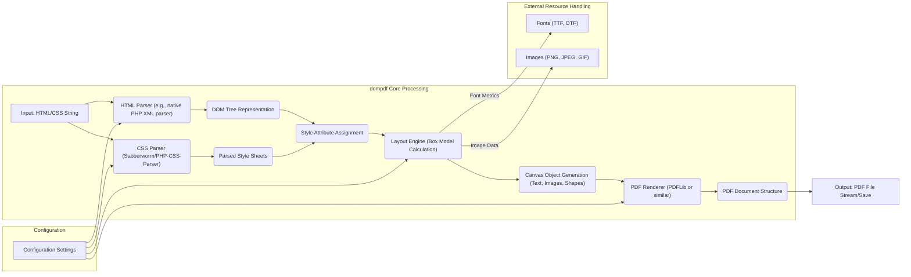
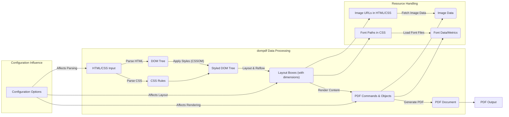

# Project Design Document: dompdf

**Version:** 1.1
**Date:** October 26, 2023
**Author:** AI Software Architect

## 1. Introduction

This document provides an enhanced and more detailed design overview of the dompdf project, a PHP library for converting HTML documents into PDF files. This revised document aims to offer a deeper understanding of the system's architecture, components, and data flow, specifically tailored for effective threat modeling. It builds upon the previous version by providing more granular descriptions and clarifying key interactions.

## 2. Goals and Objectives

The primary goal of dompdf remains to provide a robust and flexible solution for generating PDF documents from HTML input. Key objectives include:

*   Accurate and faithful rendering of HTML structure and CSS styles.
*   Comprehensive support for various PDF features, including encryption, metadata, and accessibility features.
*   Extensibility and customization options to accommodate diverse use cases.
*   Broad compatibility with different PHP environments and versions.
*   Maintainability and a well-structured codebase.

## 3. Scope

This design document focuses on the internal workings and architecture of the core dompdf library responsible for the HTML to PDF conversion process. The scope encompasses the journey of HTML input from its initial reception to the final PDF output. Specifically, this includes:

*   Parsing and interpretation of HTML markup.
*   Parsing and application of CSS styles (inline, embedded, and linked).
*   The layout engine responsible for positioning and sizing elements.
*   The rendering engine that draws content onto the PDF document.
*   The generation of the PDF document structure and its output.
*   Handling and processing of external resources such as images and fonts.
*   Configuration parameters that influence the conversion process.

The scope explicitly excludes:

*   Applications or frameworks that integrate and utilize the dompdf library.
*   The underlying operating system, web server, or PHP interpreter environment in which dompdf operates.
*   User interfaces or external systems that interact with dompdf indirectly.
*   Detailed security hardening measures or specific deployment configurations (these will be informed by the subsequent threat modeling process).

## 4. Architectural Overview

dompdf employs a multi-stage processing pipeline to convert HTML into PDF. The core components and their interactions are illustrated below:

**Component Descriptions:**

*   **Input: HTML/CSS String:** The initial input, consisting of the HTML document to be converted and associated CSS styles.
*   **HTML Parser (e.g., native PHP XML parser):** This component is responsible for parsing the raw HTML string and constructing a hierarchical representation of the document, known as the Document Object Model (DOM) tree. It interprets HTML tags and attributes to build this structure. Configuration settings might influence the parser's behavior (e.g., handling of malformed HTML).
*   **DOM Tree Representation:** An in-memory data structure representing the parsed HTML document. It organizes the HTML elements in a tree-like structure, reflecting their relationships and hierarchy.
*   **CSS Parser (Sabberworm/PHP-CSS-Parser):** This component parses the CSS rules provided, whether inline within the HTML, embedded in `<style>` tags, or linked via external stylesheets. It breaks down the CSS syntax into a structured representation of style declarations. Configuration settings might affect how CSS is parsed (e.g., handling of vendor prefixes).
*   **Parsed Style Sheets:** A collection of parsed CSS rules, organized and ready to be applied to the corresponding elements in the DOM tree.
*   **Style Attribute Assignment:** This stage involves traversing the DOM tree and applying the parsed CSS rules to each element. It determines the final styles that will govern the rendering of each element based on CSS specificity and inheritance rules.
*   **Layout Engine (Box Model Calculation):** This is a crucial component that calculates the position and dimensions of each element on the virtual PDF page. It implements the CSS box model, handling margins, padding, borders, and element positioning (static, relative, absolute, fixed). It interacts with font metrics and image data to determine the space occupied by these resources. Configuration settings can influence layout behavior (e.g., page size, margins).
*   **Canvas Object Generation (Text, Images, Shapes):**  Based on the layout calculations, this component generates abstract representations of the content that will be drawn onto the PDF. This includes objects for text (with font information), images (with image data), and vector shapes.
*   **PDF Renderer (PDFLib or similar):** This component takes the canvas objects and translates them into the specific commands and data structures required by the PDF format. It handles the low-level details of PDF generation, such as drawing text, embedding images, and defining page structures. The specific PDF rendering library used might be configurable.
*   **PDF Document Structure:** The in-memory representation of the PDF document being built, containing pages, content streams, metadata, and other PDF-specific elements.
*   **Fonts (TTF, OTF):** External font files used for rendering text. The layout engine and PDF renderer need access to these files to determine text dimensions and embed font data into the PDF.
*   **Images (PNG, JPEG, GIF):** External image files referenced in the HTML. These files are loaded and their data is used by the layout engine and PDF renderer.
*   **Configuration Settings:**  Various parameters that control the behavior of dompdf, such as page size, orientation, font directory, image handling options, and security settings.
*   **Output: PDF File Stream/Save:** The final stage where the generated PDF document is either streamed to the output or saved to a file.

## 5. Data Flow

The transformation of HTML input into a PDF document follows a distinct data flow path:

**Detailed Data Flow Steps:**

1. **HTML/CSS Input:** The process begins with the raw HTML and CSS content provided to dompdf. Configuration options can influence how this input is initially handled (e.g., character encoding).
2. **Parse HTML:** The HTML parser processes the input string, guided by configuration settings, and generates the DOM Tree.
3. **Parse CSS:** The CSS parser analyzes the CSS rules, also potentially influenced by configuration, and creates a structured representation of the styles.
4. **Apply Styles (CSSOM):** The parsed CSS rules are applied to the DOM Tree, creating a "Styled DOM Tree" where each element has associated style information. This process follows CSS specificity and inheritance rules.
5. **Layout & Reflow:** The layout engine takes the Styled DOM Tree and calculates the position and size of each element based on the CSS box model. This involves fetching image data and font metrics as needed. Configuration options like page size and margins directly impact this stage.
6. **Render Content:** Based on the layout information, the rendering engine generates PDF commands and objects representing the text, images, and shapes to be drawn on the PDF. This involves using the loaded image and font data.
7. **Generate PDF:** The PDF renderer assembles the PDF commands and objects into a valid PDF document structure. Configuration options can influence aspects like PDF version, compression, and metadata.
8. **Fetch Image Data:** When the layout engine encounters image URLs, it attempts to fetch the image data from the specified locations. Configuration settings might control how external resources are handled (e.g., allowing or disallowing remote fetching).
9. **Load Font Files:** When font paths are encountered in the CSS, the system attempts to load the corresponding font files. Configuration options specify where to look for font files.

## 6. Dependencies

dompdf relies on the following key external libraries and PHP extensions:

*   **PHP:** The fundamental runtime environment for the library. Specific PHP extensions are also required.
*   **php-font-lib:** A crucial library for reading, parsing, and subsetting various font file formats (TTF, OTF).
*   **Sabberworm/PHP-CSS-Parser:**  The primary CSS parsing library used to interpret CSS rules.
*   **DOM Extension (PHP):**  Required for working with the Document Object Model.
*   **GD or Imagick Extension (PHP - optional but highly recommended):** Used for image processing, handling various image formats, and potentially improving rendering quality.
*   **mbstring Extension (PHP):** Essential for handling multi-byte character encodings correctly.
*   **PDFLib or similar PDF generation library (potentially):** While dompdf has its own internal PDF rendering capabilities, it might integrate with or offer options to use external PDF libraries.

## 7. Security Considerations (Detailed)

Based on the architecture and data flow, the following security considerations are paramount for threat modeling:

*   **Cross-Site Scripting (XSS) via HTML Input:** If the input HTML originates from untrusted sources, it could contain malicious JavaScript. While the generated PDF itself won't execute JavaScript in most viewers, vulnerabilities in PDF viewers or specific configurations could lead to script execution.
*   **CSS Injection and Potential Exploitation:** Malicious CSS could be crafted to exploit vulnerabilities in the layout or rendering engine. This could lead to unexpected behavior, resource exhaustion, or even information disclosure. For example, carefully crafted `url()` values in CSS could be used for SSRF.
*   **Server-Side Request Forgery (SSRF):** If dompdf is configured to fetch external resources (images, fonts) based on user-provided URLs, an attacker could manipulate these URLs to make requests to internal services or external resources they shouldn't have access to. This is especially critical if no proper validation or sanitization is performed on the URLs.
*   **Local File Inclusion/Path Traversal:** If file paths for fonts or images are not rigorously validated, an attacker might be able to include arbitrary files from the server's filesystem, potentially exposing sensitive information or even allowing code execution if the included file is processed as code.
*   **Denial of Service (DoS):**  Submitting extremely large, deeply nested, or computationally expensive HTML/CSS documents can consume excessive server resources (CPU, memory), leading to a denial of service for legitimate users.
*   **Font Parsing Vulnerabilities:**  Vulnerabilities within the `php-font-lib` library could be exploited by providing specially crafted malicious font files, potentially leading to crashes or even remote code execution.
*   **Image Processing Vulnerabilities:** If the GD or Imagick extensions are used, vulnerabilities within these libraries could be exploited by providing malicious image files, potentially leading to crashes, information disclosure, or remote code execution.
*   **Information Disclosure through Error Messages:** Verbose error messages or improperly handled exceptions could reveal sensitive information about the server's configuration, file paths, or internal workings of dompdf.
*   **Configuration Vulnerabilities:** Insecure default configurations or insufficient hardening of configuration options could expose the system to various attacks (e.g., allowing remote file fetching by default).
*   **PDF Viewer Vulnerabilities:** While not a direct vulnerability in dompdf, the generated PDF might trigger vulnerabilities in the PDF viewer used to open it. This is a downstream risk to consider.

## 8. Future Considerations

Potential future enhancements and areas for further design considerations include:

*   Adopting more modern CSS layout techniques (e.g., Flexbox, Grid) for improved rendering fidelity.
*   Enhancing support for accessibility features in generated PDFs (e.g., tagged PDF).
*   Improving error handling and providing more detailed and actionable logging.
*   Implementing more robust security controls and options for resource loading and input validation.
*   Optimizing performance for handling very large and complex documents.
*   Exploring integration with cloud-based font and image services.
*   Refactoring the codebase for improved maintainability and testability.
*   Providing more granular control over PDF output settings and metadata.

This enhanced design document provides a more detailed and nuanced understanding of the dompdf project's architecture and data flow, specifically tailored to facilitate a comprehensive and effective threat modeling process. The detailed component descriptions and data flow steps aim to highlight potential attack surfaces and vulnerabilities that need careful consideration.