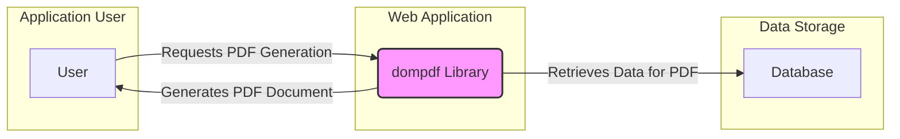
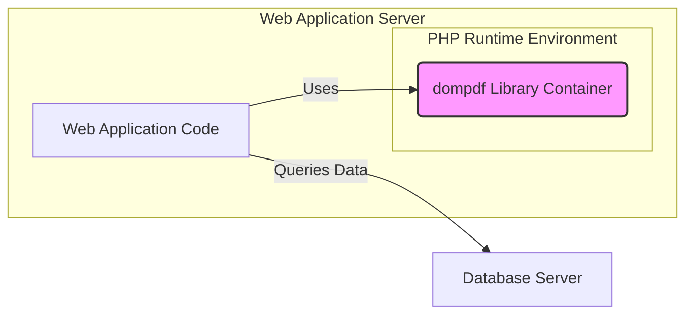

# BUSINESS POSTURE

- Business Priorities and Goals:
 - Goal: Generate PDF documents from HTML input.
 - Priority: Reliability and accuracy of PDF generation.
 - Priority: Performance and speed of PDF generation.
 - Priority: Compatibility with various HTML and CSS standards.
 - Priority: Ease of integration into existing PHP applications.

- Business Risks:
 - Business Risk: Incorrect PDF generation leading to inaccurate reports, invoices, or documents, causing business errors or compliance issues.
 - Business Risk: Performance bottlenecks in PDF generation impacting application responsiveness and user experience.
 - Business Risk: Vulnerabilities in dompdf leading to security breaches in applications using it, potentially exposing sensitive data within generated PDFs or the underlying system.
 - Business Risk: Lack of availability of PDF generation service impacting business operations that rely on document generation.
 - Business Risk: Legal and reputational damage due to insecure or improperly generated documents.

# SECURITY POSTURE

- Existing Security Controls:
 - security control: Input validation is expected to be performed by the application providing HTML to dompdf. (Implemented by application developers using dompdf)
 - security control: Dependency management using Composer to manage third-party libraries. (Described in composer.json and composer.lock)

- Accepted Risks:
 - accepted risk: Reliance on application developers to properly sanitize HTML input before passing it to dompdf.
 - accepted risk: Potential vulnerabilities in third-party libraries used by dompdf.
 - accepted risk: Complexity of HTML and CSS parsing may lead to unforeseen vulnerabilities.

- Recommended Security Controls:
 - security control: Implement automated Static Application Security Testing (SAST) on dompdf codebase to identify potential vulnerabilities.
 - security control: Implement Dependency Scanning to identify known vulnerabilities in third-party libraries used by dompdf and ensure they are regularly updated.
 - security control: Encourage and provide guidelines for secure coding practices for developers using dompdf, focusing on input sanitization and output encoding.
 - security control: Implement regular security audits and penetration testing of applications using dompdf to identify and address potential vulnerabilities in integration and usage.
 - security control: Implement Content Security Policy (CSP) in applications using dompdf to mitigate risks from potential Cross-Site Scripting (XSS) vulnerabilities if PDFs are displayed in web browsers.

- Security Requirements:
 - Authentication:
  - Requirement: Authentication is not directly applicable to dompdf library itself, but applications using dompdf must implement authentication to control who can trigger PDF generation and access generated PDFs.
 - Authorization:
  - Requirement: Authorization is not directly applicable to dompdf library itself, but applications using dompdf must implement authorization to control access to PDF generation functionality and generated PDFs based on user roles and permissions.
 - Input Validation:
  - Requirement: Dompdf must robustly handle and sanitize HTML input to prevent vulnerabilities such as Cross-Site Scripting (XSS) or Server-Side Request Forgery (SSRF) through HTML injection.
  - Requirement: Applications using dompdf must sanitize user-provided data before embedding it into HTML that is passed to dompdf to prevent injection attacks.
 - Cryptography:
  - Requirement: If sensitive data is included in generated PDFs, applications should consider encrypting PDFs at rest and in transit. Dompdf itself does not provide PDF encryption features, this needs to be implemented by the application using dompdf or through post-processing of generated PDFs.
  - Requirement: Ensure secure communication channels (HTTPS) are used when applications using dompdf serve or transmit generated PDFs, especially if they contain sensitive information.

# DESIGN

## C4 CONTEXT



- Context Diagram Elements:
 - Element:
  - Name: User
  - Type: Person
  - Description: End-user of the web application that utilizes dompdf to generate PDF documents.
  - Responsibilities: Requests PDF document generation through the web application. Receives and views generated PDF documents.
  - Security controls: User authentication and authorization implemented by the web application.
 - Element:
  - Name: dompdf Library
  - Type: Software System
  - Description: PHP library responsible for converting HTML and CSS into PDF documents. Integrated into a web application.
  - Responsibilities: Receives HTML input from the web application. Parses HTML and CSS. Generates PDF documents.
  - Security controls: Input validation and sanitization within dompdf (to be verified). Secure coding practices in dompdf development. Dependency scanning of dompdf's dependencies.
 - Element:
  - Name: Database
  - Type: Software System
  - Description: Data storage system used by the web application to store data that is included in the generated PDF documents.
  - Responsibilities: Stores and provides data to the web application for PDF generation.
  - Security controls: Database access controls, encryption at rest and in transit, regular security patching and updates.

## C4 CONTAINER



- Container Diagram Elements:
 - Element:
  - Name: dompdf Library Container
  - Type: Library
  - Description: Represents the dompdf PHP library running within the PHP runtime environment.
  - Responsibilities: HTML to PDF conversion logic. Parsing HTML and CSS. PDF document generation.
  - Security controls: Input validation within dompdf library. Secure coding practices in dompdf development. Dependency scanning. Running within a secured PHP runtime environment.
 - Element:
  - Name: Web Application Code
  - Type: Application
  - Description: The custom web application code written in PHP that integrates and utilizes the dompdf library.
  - Responsibilities: Handles user requests for PDF generation. Retrieves data from the database. Prepares HTML input for dompdf. Serves generated PDFs to users. Implements application-level security controls like authentication and authorization.
  - Security controls: Input sanitization before passing data to dompdf. Output encoding when serving PDFs. Authentication and authorization. Session management. Protection against common web application vulnerabilities (OWASP Top 10).
 - Element:
  - Name: Database Server
  - Type: Database
  - Description: The server hosting the database system used by the web application.
  - Responsibilities: Data storage and retrieval. Data integrity and availability.
  - Security controls: Database access controls. Encryption at rest and in transit. Regular security patching and updates. Database hardening.

## DEPLOYMENT

```mermaid
flowchart LR
    subgraph "Production Environment"
        subgraph "Web Server (e.g., AWS EC2)"
            A[Web Server Instance]
            B[PHP-FPM Processes]
            C[dompdf Library (within PHP-FPM)]
            A --> B
            B --> C
        end
        D[Database Server (e.g., AWS RDS)]
        A -- "Connects to" --> D
        E[Load Balancer (e.g., AWS ELB)]
        F[Internet]
        F -- "HTTPS Requests" --> E
        E -- "Forwards Requests" --> A
    end
    style C fill:#f9f,stroke:#333,stroke-width:2px
```

- Deployment Diagram Elements:
 - Element:
  - Name: Web Server Instance
  - Type: Server
  - Description: Virtual machine or container instance running a web server (e.g., Apache or Nginx).
  - Responsibilities: Handles incoming HTTP/HTTPS requests. Routes requests to PHP-FPM. Serves static content.
  - Security controls: Operating system hardening. Web server configuration hardening. Regular security patching. Network firewalls. Intrusion detection/prevention systems.
 - Element:
  - Name: PHP-FPM Processes
  - Type: Application Runtime
  - Description: FastCGI Process Manager (PHP-FPM) processes running the PHP application code and dompdf library.
  - Responsibilities: Executes PHP application code. Runs dompdf library for PDF generation.
  - Security controls: PHP runtime environment security configuration. Resource limits. Regular security patching of PHP runtime.
 - Element:
  - Name: dompdf Library (within PHP-FPM)
  - Type: Software Component
  - Description: Instance of the dompdf library running within the PHP-FPM processes.
  - Responsibilities: HTML to PDF conversion within the deployed environment.
  - Security controls: Same security controls as in the Container Diagram (Input validation, secure coding, dependency scanning).
 - Element:
  - Name: Database Server
  - Type: Database Server
  - Description: Managed database service or dedicated database server.
  - Responsibilities: Persistent data storage for the application.
  - Security controls: Database security controls provided by the cloud provider or implemented on the database server (Access controls, encryption, patching, backups).
 - Element:
  - Name: Load Balancer
  - Type: Network Device
  - Description: Distributes incoming traffic across multiple web server instances for scalability and availability.
  - Responsibilities: Traffic distribution. SSL termination.
  - Security controls: Load balancer security configuration. DDoS protection.
 - Element:
  - Name: Internet
  - Type: Network
  - Description: Public internet network from where users access the web application.
  - Responsibilities: Provides connectivity for users to access the application.
  - Security controls: N/A - external network. Focus on securing application and infrastructure exposed to the internet.

## BUILD

```mermaid
flowchart LR
    A[Developer] --> B{Code Changes};
    B --> C[Version Control (e.g., GitHub)];
    C --> D[CI/CD Pipeline (e.g., GitHub Actions)];
    D --> E{Build Process};
    E --> F[Dependency Resolution (Composer)];
    E --> G[Static Analysis (SAST, Linters)];
    E --> H[Unit Tests];
    E --> I[Build Artifacts (e.g., packaged library)];
    I --> J[Artifact Repository (e.g., GitHub Packages)];
    style C fill:#ccf,stroke:#333,stroke-width:2px
    style D fill:#ccf,stroke:#333,stroke-width:2px
    style I fill:#ccf,stroke:#333,stroke-width:2px
```

- Build Diagram Elements:
 - Element:
  - Name: Developer
  - Type: Person
  - Description: Software developer contributing to the dompdf project.
  - Responsibilities: Writes code, fixes bugs, implements new features, commits code changes.
  - Security controls: Secure development workstation. Code review process. Security awareness training.
 - Element:
  - Name: Code Changes
  - Type: Data
  - Description: Modifications to the source code of dompdf.
  - Responsibilities: Represents the input to the build process.
  - Security controls: Version control system to track changes and ensure code integrity. Code review to identify potential security issues.
 - Element:
  - Name: Version Control (e.g., GitHub)
  - Type: Software System
  - Description: System for managing and tracking changes to the codebase.
  - Responsibilities: Source code repository. Version history. Collaboration platform.
  - Security controls: Access controls to the repository. Branch protection. Audit logs.
 - Element:
  - Name: CI/CD Pipeline (e.g., GitHub Actions)
  - Type: Software System
  - Description: Automated pipeline for building, testing, and potentially deploying dompdf.
  - Responsibilities: Automates the build process. Runs tests and security checks. Creates build artifacts.
  - Security controls: Secure pipeline configuration. Access controls to the pipeline. Secrets management for credentials.
 - Element:
  - Name: Build Process
  - Type: Process
  - Description: Steps involved in compiling, packaging, and preparing dompdf for distribution.
  - Responsibilities: Compiling code (if necessary). Resolving dependencies. Running tests. Performing security checks. Creating build artifacts.
  - Security controls: Dependency scanning during build. Static Application Security Testing (SAST). Code linters. Unit tests. Build environment security.
 - Element:
  - Name: Dependency Resolution (Composer)
  - Type: Tool
  - Description: Tool used to manage PHP dependencies for dompdf.
  - Responsibilities: Downloads and manages required libraries. Ensures consistent dependency versions.
  - Security controls: Using `composer.lock` to ensure consistent dependencies. Dependency vulnerability scanning.
 - Element:
  - Name: Static Analysis (SAST, Linters)
  - Type: Tool
  - Description: Tools used to automatically analyze the source code for potential security vulnerabilities and code quality issues.
  - Responsibilities: Identifies potential security flaws and coding errors. Enforces coding standards.
  - Security controls: Regularly updated SAST rules and linters. Integration into the CI/CD pipeline.
 - Element:
  - Name: Unit Tests
  - Type: Process
  - Description: Automated tests to verify the functionality of individual components of dompdf.
  - Responsibilities: Ensures code quality and functionality. Helps prevent regressions.
  - Security controls: Tests should include security-relevant test cases (e.g., input validation tests).
 - Element:
  - Name: Build Artifacts (e.g., packaged library)
  - Type: Data
  - Description: Output of the build process, typically a packaged version of the dompdf library ready for distribution or use.
  - Responsibilities: Represents the distributable version of dompdf.
  - Security controls: Integrity checks (e.g., checksums) for build artifacts. Secure storage of artifacts.
 - Element:
  - Name: Artifact Repository (e.g., GitHub Packages)
  - Type: Software System
  - Description: Repository for storing and distributing build artifacts.
  - Responsibilities: Secure storage and distribution of dompdf library packages.
  - Security controls: Access controls to the repository. Integrity checks for artifacts. Audit logs.

# RISK ASSESSMENT

- Critical Business Processes:
 - Critical Business Process: Document generation for reports, invoices, statements, and other business communications.
 - Critical Business Process: Automated workflows that rely on PDF generation for data processing or archival.
 - Critical Business Process: User-facing features that provide PDF download functionality.

- Data to Protect and Sensitivity:
 - Data: Data embedded within generated PDF documents.
  - Sensitivity: Sensitivity depends on the application using dompdf. Could range from public information to highly sensitive personal data, financial records, or confidential business information.
 - Data: Source code of dompdf library.
  - Sensitivity: Medium. Code compromise could lead to vulnerabilities in dompdf and applications using it.
 - Data: Build artifacts of dompdf library.
  - Sensitivity: Medium. Artifact compromise could lead to distribution of malicious versions of dompdf.
 - Data: Configuration and credentials for build and deployment environments.
  - Sensitivity: High. Compromise could lead to unauthorized access and malicious modifications.

# QUESTIONS & ASSUMPTIONS

- Questions:
 - Question: What is the typical deployment environment for applications using dompdf (e.g., cloud, on-premise, specific platforms)?
 - Question: What is the sensitivity of the data typically processed and included in PDFs generated using dompdf in target applications?
 - Question: What are the existing security practices and maturity level of organizations using dompdf?
 - Question: Are there specific compliance requirements (e.g., GDPR, HIPAA, PCI DSS) that applications using dompdf need to adhere to?
 - Question: What is the expected volume and performance requirements for PDF generation in typical use cases?

- Assumptions:
 - Assumption: Dompdf is primarily used as a library integrated into web applications written in PHP.
 - Assumption: Applications using dompdf handle user authentication and authorization independently.
 - Assumption: Data sensitivity varies depending on the application context, but some use cases may involve sensitive data.
 - Assumption: Users of dompdf have varying levels of security awareness and may not always implement best security practices when integrating dompdf.
 - Assumption: Performance and reliability of PDF generation are important considerations for users of dompdf.