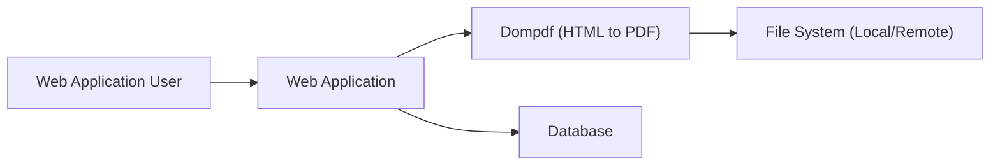
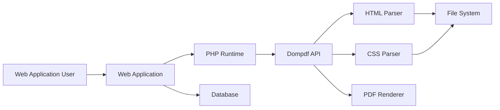
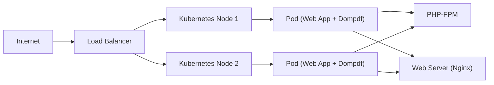
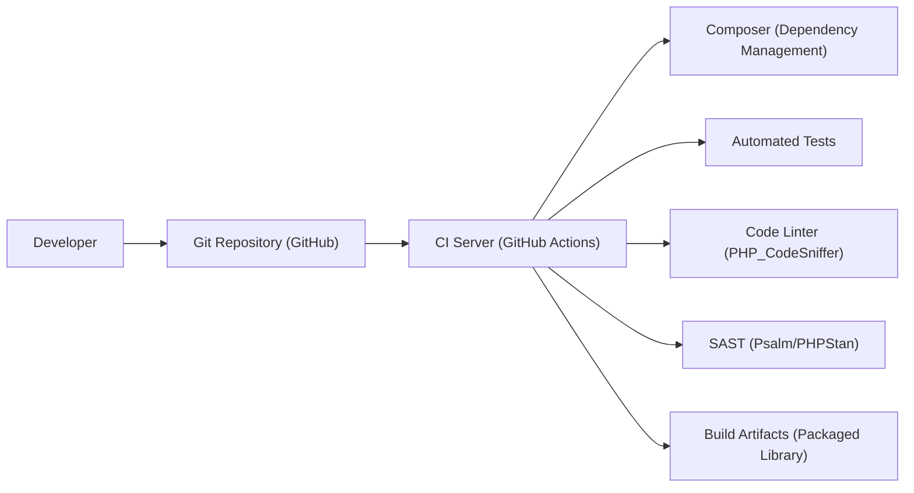

# BUSINESS POSTURE

Dompdf is a widely used, open-source PHP library for converting HTML to PDF. It's primarily used by web applications to generate PDF documents dynamically.

Priorities and Goals:

*   Provide a reliable and consistent HTML to PDF conversion service.
*   Maintain compatibility with a wide range of HTML and CSS standards.
*   Offer a user-friendly API for developers.
*   Ensure the library is performant enough for common use cases (e.g., generating invoices, reports, etc.).
*   Maintain an active and responsive open-source community.

Business Risks:

*   Inconsistent PDF rendering across different HTML/CSS inputs, leading to user dissatisfaction and potential business disruption if the PDFs are used for critical documents.
*   Performance bottlenecks, especially with complex HTML or large documents, impacting application responsiveness.
*   Security vulnerabilities that could allow attackers to compromise the server or leak sensitive data. This is a major risk, given that Dompdf processes potentially untrusted HTML input.
*   Lack of maintenance and updates, leading to incompatibility with newer PHP versions and web standards.
*   Reputational damage due to security breaches or unreliable performance.

# SECURITY POSTURE

Existing Security Controls:

*   security control: Input sanitization: Dompdf attempts to sanitize input HTML to mitigate some risks, but this is not a comprehensive solution. (Described in the source code and documentation).
*   security control: Option to restrict access to local files: Dompdf provides options to control access to local files, limiting the impact of certain vulnerabilities. (Described in the documentation and configuration options).
*   security control: Option to restrict remote file access. (Described in the documentation and configuration options).
*   security control: Community vigilance: Being open-source, the project benefits from community scrutiny and contributions, which can help identify and fix security issues. (Visible in the GitHub repository's issue tracker and pull requests).

Accepted Risks:

*   accepted risk: Complex codebase: The codebase is complex and has evolved over time, making it challenging to audit and ensure complete security.
*   accepted risk: Reliance on external libraries: Dompdf relies on external libraries, which could introduce their own vulnerabilities.
*   accepted risk: Potential for resource exhaustion: Processing very large or maliciously crafted HTML documents could lead to denial-of-service (DoS) due to excessive resource consumption.
*   accepted risk: Limited sandboxing: Dompdf does not operate in a fully sandboxed environment, meaning vulnerabilities could potentially affect the host system.

Recommended Security Controls:

*   Implement a robust content security policy (CSP) to mitigate XSS vulnerabilities.
*   Integrate static application security testing (SAST) tools into the development workflow.
*   Consider using a web application firewall (WAF) to filter malicious input before it reaches Dompdf.
*   Explore options for sandboxing or containerizing Dompdf to limit the impact of potential vulnerabilities.
*   Regularly update dependencies to address known vulnerabilities in external libraries.
*   Perform penetration testing to identify and address potential security weaknesses.

Security Requirements:

*   Authentication: Not directly applicable to Dompdf itself, as it's a library. Authentication should be handled by the application using Dompdf.
*   Authorization: Not directly applicable to Dompdf itself. Authorization should be handled by the application using Dompdf.
*   Input Validation:
    *   Strictly validate and sanitize all HTML input, ideally using a whitelist approach.
    *   Enforce limits on input size and complexity to prevent resource exhaustion.
    *   Validate and sanitize any user-provided CSS.
*   Cryptography:
    *   If Dompdf is used to handle sensitive data, ensure that the data is encrypted in transit and at rest, using appropriate cryptographic protocols and algorithms. This is primarily the responsibility of the application using Dompdf.
*   Output Encoding:
    *   Ensure that any data rendered into the HTML is properly encoded to prevent XSS vulnerabilities.

# DESIGN

## C4 CONTEXT

Element Descriptions:

*   Element:
    *   Name: Web Application User
    *   Type: Person
    *   Description: A user interacting with a web application that utilizes Dompdf.
    *   Responsibilities: Initiates requests that result in PDF generation.
    *   Security controls: Relies on the security controls implemented by the Web Application.

*   Element:
    *   Name: Web Application
    *   Type: Software System
    *   Description: The application that integrates and uses Dompdf to generate PDFs.
    *   Responsibilities: Handles user requests, prepares HTML content, calls Dompdf API, and delivers the generated PDF.
    *   Security controls: Authentication, authorization, input validation, output encoding, session management, and other application-level security measures.

*   Element:
    *   Name: Dompdf (HTML to PDF)
    *   Type: Software System (Library)
    *   Description: The Dompdf library itself.
    *   Responsibilities: Parses HTML and CSS, renders the content, and generates a PDF document.
    *   Security controls: Input sanitization, restrictions on file access (configurable).

*   Element:
    *   Name: File System (Local/Remote)
    *   Type: External System
    *   Description: The file system (local or remote) that Dompdf might access for resources (e.g., images, fonts).
    *   Responsibilities: Provides access to files.
    *   Security controls: File system permissions, access control lists (ACLs).

*   Element:
    *   Name: Database
    *   Type: External System
    *   Description: Database used by Web Application.
    *   Responsibilities: Provides data to Web Application.
    *   Security controls: Authentication, authorization, input validation, encryption.

## C4 CONTAINER

Element Descriptions:

*   Element:
    *   Name: Web Application User
    *   Type: Person
    *   Description: A user interacting with the web application.
    *   Responsibilities: Initiates requests that result in PDF generation.
    *   Security controls: Relies on the security controls implemented by the Web Application.

*   Element:
    *   Name: Web Application
    *   Type: Software System
    *   Description: The application that integrates and uses Dompdf.
    *   Responsibilities: Handles user requests, prepares HTML content, calls Dompdf API, and delivers the generated PDF.
    *   Security controls: Authentication, authorization, input validation, output encoding, session management, and other application-level security measures.

*   Element:
    *   Name: PHP Runtime
    *   Type: Container
    *   Description: The PHP runtime environment.
    *   Responsibilities: Executes the PHP code of the web application and Dompdf.
    *   Security controls: PHP configuration settings (e.g., disable_functions, open_basedir), security extensions.

*   Element:
    *   Name: Dompdf API
    *   Type: Component
    *   Description: The public API of the Dompdf library.
    *   Responsibilities: Provides methods for configuring and using Dompdf.
    *   Security controls: Input validation, configuration options for security.

*   Element:
    *   Name: HTML Parser
    *   Type: Component
    *   Description: Parses the HTML input.
    *   Responsibilities: Converts HTML into an internal representation.
    *   Security controls: Input sanitization (limited).

*   Element:
    *   Name: CSS Parser
    *   Type: Component
    *   Description: Parses the CSS input.
    *   Responsibilities: Converts CSS into an internal representation.
    *   Security controls: Input sanitization (limited).

*   Element:
    *   Name: PDF Renderer
    *   Type: Component
    *   Description: Generates the PDF document.
    *   Responsibilities: Creates the PDF file based on the parsed HTML and CSS.
    *   Security controls: Internal checks to prevent invalid PDF generation.

*   Element:
    *   Name: File System
    *   Type: External System
    *   Description: The file system (local or remote) that Dompdf might access.
    *   Responsibilities: Provides access to files (images, fonts, etc.).
    *   Security controls: File system permissions, ACLs.

*   Element:
    *   Name: Database
    *   Type: External System
    *   Description: Database used by Web Application.
    *   Responsibilities: Provides data to Web Application.
    *   Security controls: Authentication, authorization, input validation, encryption.

## DEPLOYMENT

Possible Deployment Solutions:

1.  Traditional Web Server (Apache/Nginx + PHP-FPM): Dompdf is deployed as part of a web application on a server running Apache or Nginx with PHP-FPM.
2.  Cloud-Based Web Hosting: Platforms like AWS Elastic Beanstalk, Google App Engine, or Azure App Service can be used to deploy the web application and Dompdf.
3.  Containerized Deployment (Docker): The web application and Dompdf can be containerized using Docker and deployed to platforms like Kubernetes, AWS ECS, or Google Kubernetes Engine (GKE).
4.  Serverless Functions: Dompdf could potentially be used within serverless functions (e.g., AWS Lambda, Azure Functions, Google Cloud Functions), although this might require careful consideration of resource limits and dependencies.

Chosen Solution (Containerized Deployment - Docker/Kubernetes):

Element Descriptions:

*   Element:
    *   Name: Internet
    *   Type: External System
    *   Description: The public internet.
    *   Responsibilities: Source of user requests.
    *   Security controls: Firewall, intrusion detection/prevention systems.

*   Element:
    *   Name: Load Balancer
    *   Type: Infrastructure Node
    *   Description: Distributes incoming traffic across multiple Kubernetes nodes.
    *   Responsibilities: Load balancing, SSL termination (optional).
    *   Security controls: SSL/TLS configuration, access control lists.

*   Element:
    *   Name: Kubernetes Node 1, Kubernetes Node 2
    *   Type: Infrastructure Node
    *   Description: Physical or virtual machines that run the application pods.
    *   Responsibilities: Hosting and running containerized applications.
    *   Security controls: Operating system hardening, network security policies, regular security updates.

*   Element:
    *   Name: Pod (Web App + Dompdf)
    *   Type: Container
    *   Description: A Kubernetes pod containing the web application and Dompdf.
    *   Responsibilities: Running the application and generating PDFs.
    *   Security controls: Container image security scanning, resource limits, network policies.

*   Element:
    *   Name: PHP-FPM
    *   Type: Container
    *   Description: PHP FastCGI Process Manager.
    *   Responsibilities: Executes PHP code.
    *   Security controls: PHP configuration hardening, security extensions.

*   Element:
    *   Name: Web Server (Nginx)
    *   Type: Container
    *   Description: Nginx web server.
    *   Responsibilities: Serves static content, proxies requests to PHP-FPM.
    *   Security controls: Nginx configuration hardening, access logs.

## BUILD

The build process for Dompdf involves several steps, from development to the creation of a usable library. Since Dompdf is primarily a PHP library, the "build" process is less about compilation and more about packaging and dependency management.

Build Process Description:

1.  Developer: Developers write code and commit changes to the Git repository (GitHub).
2.  Git Repository (GitHub): The central repository for the Dompdf source code.
3.  CI Server (GitHub Actions): GitHub Actions is used for continuous integration. Workflows are triggered on events like pull requests and pushes.
4.  Composer (Dependency Management): Composer is used to manage Dompdf's dependencies. The CI server runs `composer install` to install the required libraries.
5.  Automated Tests: PHPUnit tests are executed to ensure the code functions correctly and to catch regressions.
6.  Code Linter (PHP_CodeSniffer): A code linter (like PHP_CodeSniffer) is used to enforce coding standards and identify potential style issues.
7.  SAST (Psalm/PHPStan): Static analysis tools like Psalm or PHPStan are used to detect potential bugs, type errors, and security vulnerabilities.
8.  Build Artifacts (Packaged Library): The final "build artifact" is the packaged Dompdf library, typically distributed via Packagist (Composer's repository). This isn't a compiled binary but rather a collection of PHP files and dependencies.

Security Controls in the Build Process:

*   Dependency Management (Composer): Composer helps manage dependencies and ensures that known vulnerable versions are not used (with proper configuration and regular updates).
*   Automated Tests: Unit tests and integration tests help catch bugs early, including potential security-related issues.
*   Code Linter: Enforces coding standards, which can help prevent some common coding errors that could lead to vulnerabilities.
*   SAST: Static analysis tools can identify potential security vulnerabilities in the code before it is deployed.
*   GitHub Actions Security Features: GitHub Actions provides features like secret management and code scanning, which can be used to enhance the security of the build process.

# RISK ASSESSMENT

Critical Business Processes:

*   PDF Generation: The core process is the reliable and accurate generation of PDF documents from HTML input. This is critical for any business using Dompdf to create reports, invoices, or other documents.
*   Application Functionality: The web applications that integrate Dompdf rely on its functionality. Disruptions to Dompdf can impact the overall application.

Data Sensitivity:

*   User-Provided Data: The HTML input provided to Dompdf may contain sensitive data, depending on the application. This could include personally identifiable information (PII), financial data, or other confidential information. The sensitivity depends entirely on how Dompdf is being used.
*   Application Data: The web application itself may handle sensitive data, and vulnerabilities in Dompdf could potentially be exploited to gain access to this data.
*   Configuration Data: Dompdf's configuration may contain sensitive information, such as file paths or access keys (if accessing remote resources).

# QUESTIONS & ASSUMPTIONS

Questions:

*   What specific types of data are commonly processed by Dompdf in the context of its most frequent use cases? (This helps refine the data sensitivity assessment.)
*   Are there any existing security audits or penetration testing reports for Dompdf?
*   What is the current process for handling security vulnerabilities reported by the community or discovered internally?
*   Are there any specific compliance requirements (e.g., GDPR, HIPAA) that apply to the applications using Dompdf?
*   What level of access does Dompdf require to the file system in typical deployments?
*   What are the performance requirements and limitations of Dompdf?

Assumptions:

*   BUSINESS POSTURE: It is assumed that the primary goal is to provide a stable and reliable PDF generation service, balancing functionality with security.
*   SECURITY POSTURE: It is assumed that there is a basic level of security awareness, but there may be limited resources dedicated specifically to Dompdf security.
*   DESIGN: It is assumed that Dompdf is used as a library within a larger web application, and that the web application handles authentication and authorization. It is also assumed that a containerized deployment model is preferred for its scalability and security benefits.
*   BUILD: It is assumed that GitHub Actions is used for CI/CD.