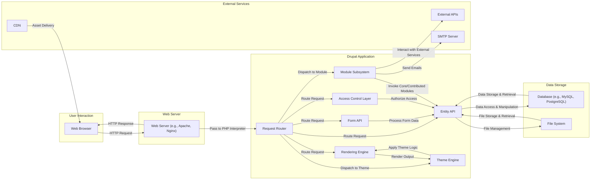
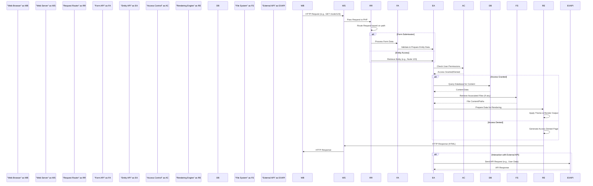

# Project Design Document: Drupal Core for Threat Modeling

**Version:** 1.1
**Date:** October 26, 2023
**Author:** AI Software Architect

## 1. Introduction

This document provides an enhanced and more detailed design overview of the Drupal Core system, specifically tailored for threat modeling activities. Building upon the previous version, this document further elaborates on key components, data flows, and technologies involved in Drupal Core, aiming to provide a more granular and insightful foundation for identifying potential security vulnerabilities.

## 2. System Overview

Drupal Core is a robust and widely used open-source content management system (CMS) built with PHP. Its modular architecture allows for extensive customization and scalability, making it suitable for diverse web applications and websites. The core system provides essential functionalities, which are augmented by a vast ecosystem of contributed modules and themes.

## 3. System Architecture

The following diagram presents a more detailed view of the Drupal Core architecture, breaking down the application layer into key sub-components:

### 3.1. Key Components

*   **Web Browser:** The client-side interface used by users to interact with the Drupal application.
*   **Web Server:**  Receives and processes incoming HTTP requests, serving static content and forwarding dynamic requests to the PHP interpreter. Examples include Apache and Nginx.
*   **Drupal Application:**
    *   **Request Router:**  Analyzes incoming HTTP requests and determines the appropriate controller or handler to process them.
    *   **Form API:**  Provides tools for creating, processing, and validating user input through forms.
    *   **Entity API:**  A core system for managing and manipulating content entities (nodes, users, taxonomy terms, etc.).
    *   **Access Control Layer:**  Manages user authentication, authorization, and permissions to control access to resources and functionalities.
    *   **Rendering Engine:**  Responsible for generating the final output (typically HTML) to be sent to the user's browser, often utilizing the Theme Engine.
    *   **Module Subsystem:**  The framework that allows core and contributed modules to extend Drupal's functionality.
    *   **Theme Engine:**  Processes theme templates and assets to control the visual presentation of the website.
*   **Data Storage:**
    *   **Database:** Stores persistent data, including content, user accounts, configuration settings, and more. Common database systems include MySQL, PostgreSQL, and SQLite.
    *   **File System:** Stores files such as uploaded media, module and theme code, configuration files, and temporary files.
*   **External Services:**
    *   **External APIs:**  Third-party services that Drupal may integrate with for functionalities like social media integration, payment processing, or mapping services.
    *   **CDN (Content Delivery Network):**  A distributed network of servers that caches static assets (images, CSS, JavaScript) to improve loading times for users.
    *   **SMTP Server:**  Used for sending outgoing emails from the Drupal application, such as user registration confirmations or notifications.

## 4. Data Flow

The following sequence diagram provides a more detailed illustration of a typical user request flow within Drupal Core, highlighting the data exchanged between components:

### 4.1. Key Data Flows

*   **User Authentication:** User credentials (username/password or other authentication tokens) are submitted via the web browser, processed by the Form API or a dedicated authentication module, and verified against user data stored in the database. The Access Control layer manages session creation and validation.
*   **Content Creation/Modification:** Users input content through forms managed by the Form API. This data is validated, processed by the Entity API, and then stored in the database. Associated files are uploaded and managed by the File System.
*   **Page Rendering:** The Request Router determines the appropriate content to display. The Entity API retrieves the necessary data from the database and file system. The Rendering Engine, in conjunction with the Theme Engine, generates the HTML output based on templates and data.
*   **Module Interaction:** Modules can intercept and modify data at various stages of the request lifecycle. They can interact with the Entity API, Form API, and other core subsystems to extend functionality.
*   **API Interactions:** Drupal Core can send requests to external APIs, often involving the serialization of data (e.g., JSON, XML) and the handling of API responses. This data may be used to enrich content or trigger external actions.

## 5. Key Technologies

*   **Programming Language:** PHP
*   **Web Servers:** Apache HTTP Server, Nginx
*   **Databases:** MySQL, PostgreSQL, SQLite
*   **Front-end Technologies:** HTML, CSS, JavaScript, potentially including frameworks like React or Vue.js in custom themes or modules.
*   **Templating Engine:** Twig
*   **Caching Mechanisms:** Internal caching (e.g., render cache, data cache), external caching (e.g., Redis, Memcached)
*   **Package Manager:** Composer (for managing PHP dependencies)
*   **Command-Line Interface (CLI):** Drush (Drupal Shell) and Drupal Console for administrative tasks.

## 6. Security Considerations (High-Level)

*   **Authentication and Authorization:**
    *   **Considerations:** Secure storage of user credentials (password hashing), robust session management to prevent hijacking, and granular role-based access control to restrict access to sensitive functionalities and data.
    *   **Potential Threats:** Brute-force attacks, credential stuffing, session fixation, privilege escalation.
*   **Input Validation and Sanitization:**
    *   **Considerations:**  Thorough validation of all user-supplied input to prevent injection attacks. Proper sanitization of output to prevent cross-site scripting (XSS).
    *   **Potential Threats:** SQL injection, cross-site scripting (XSS), command injection, path traversal.
*   **Data Protection:**
    *   **Considerations:**  Secure storage of sensitive data, including encryption of personally identifiable information (PII) and other confidential data at rest and in transit (HTTPS).
    *   **Potential Threats:** Data breaches, unauthorized access to sensitive information.
*   **Session Management:**
    *   **Considerations:**  Secure generation and management of session identifiers, protection against session fixation and hijacking attacks, and appropriate session timeouts.
    *   **Potential Threats:** Session hijacking, session fixation.
*   **Cross-Site Scripting (XSS) Prevention:**
    *   **Considerations:**  Implementation of output encoding and sanitization techniques to prevent the injection of malicious scripts into web pages.
    *   **Potential Threats:**  Stealing user credentials, defacing websites, redirecting users to malicious sites.
*   **Cross-Site Request Forgery (CSRF) Prevention:**
    *   **Considerations:**  Use of anti-CSRF tokens to prevent unauthorized actions on behalf of authenticated users.
    *   **Potential Threats:**  Unauthorized state changes, data manipulation.
*   **Access Control:**
    *   **Considerations:**  Enforcement of the principle of least privilege, ensuring users only have access to the resources and functionalities they need.
    *   **Potential Threats:**  Unauthorized access to sensitive data or functionalities.
*   **Security Updates:**
    *   **Considerations:**  Regularly applying security updates for Drupal Core and contributed modules to patch known vulnerabilities.
    *   **Potential Threats:** Exploitation of known vulnerabilities.
*   **Third-Party Dependencies:**
    *   **Considerations:**  Careful selection and monitoring of third-party libraries and modules for potential vulnerabilities. Utilizing dependency management tools like Composer to track and update dependencies.
    *   **Potential Threats:**  Introduction of vulnerabilities through insecure dependencies.

## 7. Assumptions and Constraints

*   This design document primarily focuses on the security aspects of Drupal Core's architecture.
*   It is assumed that the underlying operating system and network infrastructure are configured with basic security measures in place.
*   The web server and database server are assumed to be configured according to security best practices, including appropriate firewall rules and access controls.
*   This document provides a general overview. Specific configurations, contributed modules, and custom code can introduce additional security considerations.
*   The analysis is based on the current understanding of Drupal Core's architecture and common security practices.

## 8. Out of Scope

The following aspects are explicitly excluded from the scope of this design document, particularly for threat modeling purposes:

*   Detailed analysis of specific contributed modules and their individual security vulnerabilities. While the interaction between core and modules is considered, the internal workings of each contributed module are not in scope.
*   Specific implementations within custom themes beyond their general role in rendering.
*   Detailed configuration specifics of the web server, database, and operating system. These are considered part of the deployment environment.
*   Infrastructure-level security measures for mitigating Denial-of-Service (DoS) and Distributed Denial-of-Service (DDoS) attacks, unless directly related to core Drupal vulnerabilities.
*   In-depth static and dynamic code analysis of the entire Drupal codebase. This document provides a high-level architectural overview.
*   Detailed performance optimization strategies, unless they have direct security implications.
*   Specific content workflows and editorial processes.
