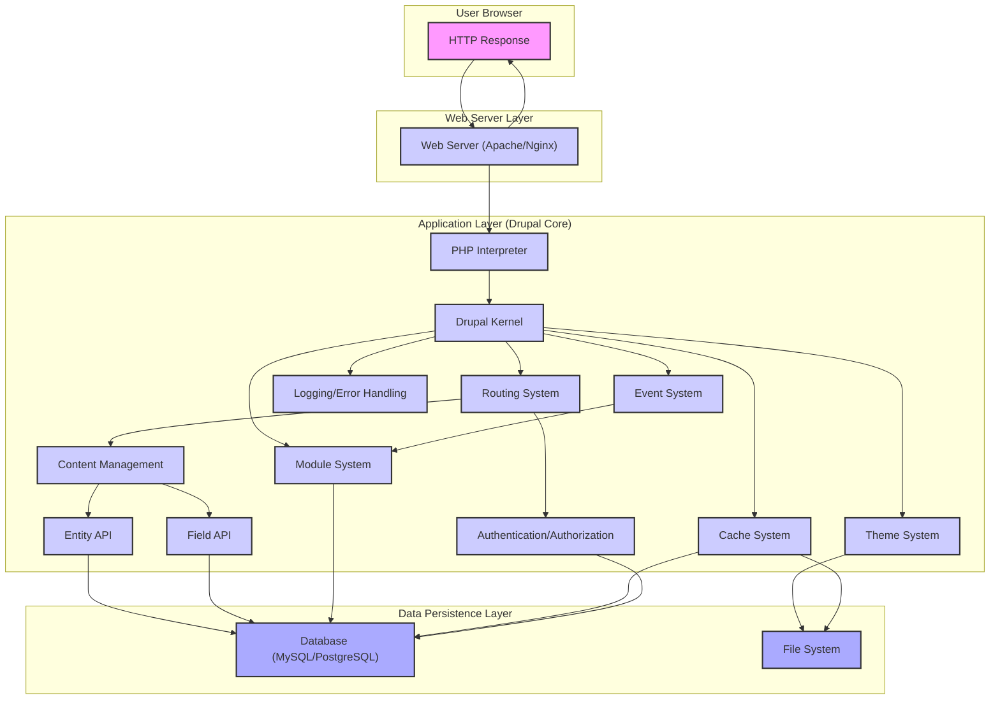
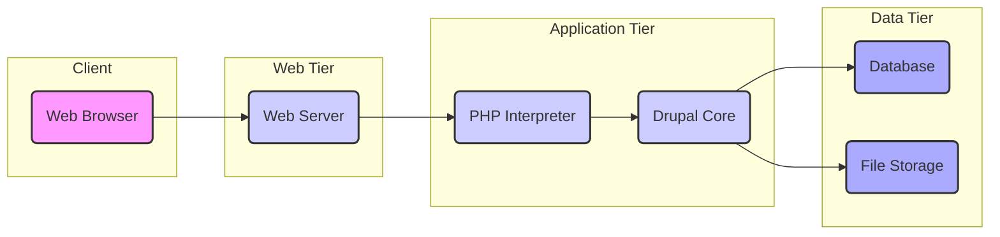

# Project Design Document: Drupal Core

**Version:** 1.1
**Date:** October 26, 2023
**Author:** AI Software Architect

## 1. Introduction

This document provides a detailed design overview of the Drupal Core project, based on the codebase available at [https://github.com/drupal/core](https://github.com/drupal/core). It aims to provide a comprehensive understanding of the system's architecture for subsequent threat modeling activities. This document outlines the key architectural components, their interactions, and the typical data flow within the Drupal Core system.

## 2. Goals

* Provide a clear, concise, and detailed description of the Drupal Core architecture.
* Identify the major components, their responsibilities, and their interactions.
* Outline the typical data flow within the system, including key decision points.
* Highlight specific security considerations relevant for threat modeling, including common vulnerabilities and Drupal's built-in defenses.

## 3. Scope

This document focuses on the core functionalities and architecture of the Drupal Core system. It deliberately excludes detailed discussions of contributed modules or external integrations unless they are fundamental to the core's operation. The scope encompasses:

* Handling of web requests (HTTP).
* User account management, authentication, and authorization.
* Content creation, storage, and retrieval mechanisms.
* Rendering and presentation logic, including theming.
* The core module and theme extension system.
* Core APIs and services provided for module developers.
* Data persistence and caching strategies within the core.

## 4. Target Audience

This document is primarily intended for:

* Security engineers and architects responsible for performing threat modeling and security assessments.
* Software developers requiring a deep understanding of the Drupal Core architecture for development and maintenance.
* DevOps engineers involved in the deployment, configuration, and monitoring of Drupal instances.

## 5. Architectural Overview

Drupal Core employs a modular, event-driven architecture built upon the PHP programming language. It follows a front-controller pattern, where a single entry point handles all incoming HTTP requests. The system can be conceptually divided into the following layers:

* **Web Server Layer:** Receives and manages incoming HTTP requests. Responsible for serving static assets and forwarding dynamic requests to the application layer. Common examples include Apache HTTP Server or Nginx.
* **Application Layer (Drupal Core):** The heart of the system, responsible for request processing, business logic, data manipulation, and rendering. This layer orchestrates the interaction between various core subsystems and modules.
* **Data Persistence Layer:**  Handles the persistent storage of application data. Typically a relational database management system (RDBMS) such as MySQL, MariaDB, or PostgreSQL.
* **Presentation Layer:**  Focuses on the generation and delivery of the user interface (HTML, CSS, JavaScript) to the client's browser. This involves the theme system and template rendering engines.

## 6. Key Components

This section provides a more detailed description of the major components within the Drupal Core architecture:

* **Web Server (e.g., Apache, Nginx):**
    * Listens on specified ports for incoming HTTP requests.
    * Serves static files directly (images, CSS, JavaScript).
    * Passes dynamic requests to the PHP interpreter via protocols like FastCGI.
    * Can provide additional security features like TLS termination and request filtering.

* **PHP Interpreter:**
    * Executes the Drupal Core PHP code.
    * Interacts with the database through PHP's database extensions (e.g., PDO).
    * Handles request processing logic defined within Drupal Core and its modules.
    * Generates HTTP responses to be sent back to the web server.

* **Drupal Kernel:**
    * The central orchestrator of the Drupal application.
    * Handles the bootstrapping process, initializing core services and the environment.
    * Manages the request lifecycle from receiving the request to sending the response.
    * Provides access to core services and facilitates communication between components.

* **Routing System:**
    * Responsible for mapping incoming HTTP requests to specific controllers or request handlers.
    * Uses route definitions to determine which code should be executed for a given URL path.
    * Allows for dynamic route generation and parameter handling.

* **User Authentication and Authorization System:**
    * Manages user accounts, including registration, login, and password management.
    * Authenticates users based on provided credentials (e.g., username/password, OAuth tokens).
    * Authorizes access to resources and functionalities based on user roles and permissions.
    * Provides APIs for custom authentication providers and authorization logic.

* **Content Management System (CMS):**
    * Enables users to create, edit, manage, and organize content.
    * Defines content types (e.g., articles, pages) with configurable fields.
    * Provides a user interface for content administration and workflows.
    * Offers APIs for programmatic content manipulation.

* **Entity API:**
    * A foundational API for managing structured data entities (e.g., nodes, users, taxonomy terms, comments).
    * Provides a consistent interface for creating, reading, updating, and deleting entities.
    * Offers features like revisions, translations, and metadata management.

* **Field API:**
    * Allows attaching custom fields to entities, extending their data structures.
    * Manages the storage, rendering, and validation of field data.
    * Supports various field types (e.g., text, image, entity reference).

* **Module System:**
    * The primary mechanism for extending Drupal's functionality.
    * Modules can introduce new features, modify existing behavior through hooks and events, and integrate with external systems.
    * Follows a plugin-based architecture, allowing for modular development and extensibility.

* **Theme System:**
    * Controls the visual presentation and user experience of the website.
    * Uses template engines (primarily Twig) to render HTML markup.
    * Allows for customization of layouts, styles, and user interface elements.
    * Supports the creation of reusable theme components and libraries.

* **Database Abstraction Layer (Database API):**
    * Provides an abstraction layer for interacting with different database systems.
    * Offers a consistent API for querying and manipulating data, regardless of the underlying database engine.
    * Enhances database portability and security by abstracting away database-specific syntax.

* **Cache System:**
    * Stores frequently accessed data in memory or other fast storage mechanisms (e.g., Redis, Memcached).
    * Improves performance by reducing database load and response times.
    * Includes various caching strategies and invalidation mechanisms.

* **File System:**
    * Stores uploaded files, configuration files, temporary files, and other persistent data.
    * Proper configuration of file permissions and access control is crucial for security.

* **Logging and Error Handling:**
    * Records system events, errors, warnings, and debugging information.
    * Provides mechanisms for developers to log custom messages.
    * Facilitates debugging, monitoring, and security auditing.

* **Event System (Event Dispatcher):**
    * Allows modules to subscribe to and react to specific events within the Drupal system.
    * Enables loose coupling between components and facilitates extensibility.

## 7. Data Flow

The typical data flow for a web request in Drupal Core can be broken down into the following steps:

1. **User Request:** A user initiates a request through their web browser (e.g., by entering a URL or submitting a form).
2. **Web Server Reception:** The web server receives the HTTP request.
3. **Request Forwarding:** The web server forwards the request to the PHP interpreter.
4. **Drupal Kernel Bootstrapping:** The PHP interpreter executes the Drupal Kernel, which initializes the application environment.
5. **Routing:** The Routing System analyzes the request URL and matches it to a defined route.
6. **Controller Invocation:** The controller associated with the matched route is invoked.
7. **Business Logic Execution:** The controller interacts with various Drupal services and APIs (e.g., Entity API, Field API, custom services) to process the request.
8. **Data Retrieval/Manipulation:**  The controller may retrieve data from the database or perform data manipulation operations.
9. **Response Preparation:** The controller prepares the data to be rendered into a response.
10. **Theme Rendering:** The Theme System uses the appropriate theme and templates to generate the HTML markup for the response.
11. **Response Generation:** The PHP interpreter constructs the HTTP response, including headers and the rendered HTML body.
12. **Web Server Delivery:** The PHP interpreter sends the HTTP response back to the web server.
13. **User Response:** The web server sends the HTTP response to the user's browser.
14. **Browser Rendering:** The user's browser renders the HTML and displays the web page.

## 8. Security Considerations

Drupal Core incorporates numerous security features and best practices to mitigate common web application vulnerabilities. Key security considerations include:

* **Input Validation and Sanitization:** Drupal provides APIs like `\Drupal\Component\Utility\Html::escape()` and form API validation to sanitize user input and prevent injection attacks such as:
    * **Cross-Site Scripting (XSS):** By escaping output, Drupal prevents malicious scripts from being injected into web pages.
    * **SQL Injection:**  The Database API encourages the use of prepared statements and parameterized queries to prevent SQL injection vulnerabilities.
* **Authentication and Authorization:**
    * **Secure Password Storage:** Drupal uses strong hashing algorithms for storing user passwords.
    * **Role-Based Access Control (RBAC):**  Permissions are assigned to roles, and users are assigned to roles, providing granular control over access to resources and functionalities.
    * **Two-Factor Authentication (2FA):**  Support for 2FA can be added through contributed modules to enhance account security.
* **Cross-Site Request Forgery (CSRF) Protection:** Drupal automatically includes CSRF tokens in forms to prevent malicious websites from performing unauthorized actions on behalf of logged-in users.
* **Session Management:** Drupal uses secure session handling mechanisms, including HTTP-only and secure flags for cookies.
* **Data Protection:**
    * **HTTPS Enforcement:**  Encouraging the use of HTTPS for encrypting communication between the client and server.
    * **Data Encryption:**  Contributed modules can be used to encrypt sensitive data at rest in the database.
* **Security Updates:**  The Drupal Security Team actively monitors for vulnerabilities and releases regular security updates. Applying these updates promptly is crucial.
* **File System Security:**  Drupal recommends proper file permission configurations to prevent unauthorized access to sensitive files.
* **Error Reporting:**  Drupal's error reporting can be configured to avoid displaying sensitive information to end-users.
* **Security Headers:** Drupal allows configuration of security headers like Content Security Policy (CSP), HTTP Strict Transport Security (HSTS), and X-Frame-Options to enhance client-side security.
* **Protection Against Common Web Attacks:** Drupal incorporates defenses against common attacks like clickjacking and MIME sniffing vulnerabilities.
* **Third-Party Module Security:**  The security of contributed modules relies on the developers' practices and community reviews. It's important to choose reputable and well-maintained modules.

## 9. Diagrams

### 9.1 High-Level Architecture Diagram

## 10. Conclusion

This document provides a detailed design overview of the Drupal Core architecture, outlining its key components, data flow, and security considerations. This information serves as a solid foundation for conducting thorough threat modeling exercises to identify potential security vulnerabilities and design appropriate mitigation strategies. Understanding the interactions between these components is crucial for assessing the overall security posture of a Drupal application.