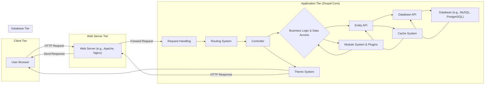

# Project Design Document: Drupal Core

**Version:** 1.1
**Date:** October 26, 2023
**Author:** AI Software Architect

## 1. Introduction

This document provides an enhanced high-level design overview of the Drupal Core project. It details the key architectural components, data flow, and technologies involved, offering a robust foundation for subsequent threat modeling activities and a deeper understanding of potential security vulnerabilities. This version expands on the previous document with more detail and clarity.

## 2. Project Overview

Drupal is a highly flexible and scalable open-source content management system (CMS) written in PHP. It serves as a powerful platform for building diverse web applications, ranging from simple websites and blogs to complex enterprise-level applications and APIs. Drupal Core provides the foundational functionalities, APIs, and a robust framework upon which a vast ecosystem of contributed modules and themes are built, allowing for extensive customization and feature expansion.

## 3. Architectural Overview

Drupal's architecture is inherently modular and layered, promoting extensibility and maintainability. The architecture can be broadly categorized into the following distinct tiers:

*   **Client Tier:** Represents the user's interface, typically a web browser, but can also include other client applications interacting with Drupal's APIs (e.g., mobile apps).
*   **Web Server Tier:** This tier hosts the Drupal application and is responsible for handling incoming HTTP requests and serving static assets. Common web servers used with Drupal include Apache and Nginx, often configured with PHP-FPM for processing PHP code.
*   **Application Tier (Drupal Core):** This is the heart of the Drupal system, encompassing the core PHP codebase. It processes requests, manages content, enforces access control, and interacts with the database and other services. This tier is highly modular, with the core providing essential functionalities and modules extending its capabilities.
*   **Database Tier:** This tier is responsible for the persistent storage of Drupal's data, including content, user information, configuration settings, and more. Supported database systems include MySQL, MariaDB, PostgreSQL, and SQLite. The Database API within the Application Tier provides an abstraction layer, allowing Drupal to work with different database systems.
*   **External Services Tier:** Drupal frequently integrates with various external services to enhance its functionality and capabilities. These services can include:
    *   Dedicated search engines (e.g., Solr, Elasticsearch) for improved search functionality.
    *   Caching systems (e.g., Redis, Memcached) to enhance performance by storing frequently accessed data.
    *   Email servers (SMTP) for sending notifications and transactional emails.
    *   Content Delivery Networks (CDNs) for serving static assets efficiently.
    *   Third-party APIs (e.g., social media platforms, payment gateways, mapping services) for integrating external functionalities.

## 4. Key Components and Subsystems

The Drupal Core application tier is composed of several key components and subsystems that work together to provide its functionality:

*   **Request Handling:**
    *   Receives incoming HTTP requests from the Web Server Tier.
    *   Initiates the Drupal bootstrapping process, loading necessary components.
    *   Sets up the environment for processing the request.
*   **Routing System:**
    *   Analyzes the incoming request path (URL).
    *   Matches the path to a defined route.
    *   Determines the appropriate controller or route handler to process the request.
*   **Controller System:**
    *   Executes the business logic associated with a specific route.
    *   Interacts with other Drupal subsystems and services to fulfill the request.
    *   Prepares data to be rendered by the Theme System.
*   **Entity API:**
    *   Provides a central and structured way to define, manage, and interact with content and other data objects (entities).
    *   Defines various entity types (e.g., nodes for content, users for accounts, taxonomy terms for categorization).
    *   Offers a consistent API for performing CRUD (Create, Read, Update, Delete) operations on entities.
*   **Field API:**
    *   Enables the attachment of custom fields to entities, allowing for flexible data modeling.
    *   Provides a wide range of field types (e.g., text, image, date, entity reference).
    *   Manages the storage, display, and validation of field data.
*   **Block System:**
    *   Manages the display of reusable content blocks in defined regions of a website's layout.
    *   Allows administrators to place various types of content (e.g., menus, custom text, lists of recent content) in different areas of a page.
*   **Theme System:**
    *   Controls the visual presentation and user interface of the Drupal website.
    *   Utilizes the Twig templating engine to render HTML markup based on data provided by controllers.
    *   Allows for customization of the look and feel through themes.
*   **User Management System:**
    *   Handles user registration, login, password management, and authentication processes.
    *   Manages user roles and permissions, controlling access to different functionalities and content.
*   **Module System:**
    *   Provides the primary mechanism for extending Drupal's core functionality.
    *   Modules can add new features, modify existing behavior, integrate with external systems, and define new entity types and field types.
    *   Contributed modules from the Drupal community significantly expand Drupal's capabilities.
*   **Plugin System:**
    *   A more granular extension mechanism within modules, allowing for the creation of reusable components.
    *   Used for various purposes, such as defining different types of blocks, field formatters, image styles, and more.
*   **Database Abstraction Layer (Database API):**
    *   Provides an abstraction layer for interacting with different database systems, making Drupal database agnostic.
    *   Offers a consistent API for querying and manipulating data, regardless of the underlying database.
    *   Helps prevent SQL injection vulnerabilities through parameterized queries.
*   **Cache System:**
    *   Improves performance by storing frequently accessed data in memory or other fast storage mechanisms (e.g., Redis, Memcached).
    *   Various caching strategies are employed at different levels (e.g., page caching, block caching, data caching).
*   **Event System:**
    *   Allows modules to subscribe to and react to specific events that occur within the Drupal system.
    *   Provides a decoupled way for different parts of the system to interact and extend functionality.
*   **Configuration Management System:**
    *   Manages the configuration settings of the Drupal site, including site information, content types, and module settings.
    *   Allows for exporting and importing configuration, facilitating deployment and maintaining consistency across environments.

## 5. Data Flow

The typical data flow for a user request in Drupal can be visualized as follows:

**Detailed Data Flow Steps:**

1. **User Interaction:** A user interacts with the Drupal website through their web browser, initiating an HTTP request (e.g., navigating to a page, submitting a form).
2. **Web Server Reception:** The Web Server Tier (e.g., Apache or Nginx) receives the incoming HTTP request.
3. **Request Forwarding:** The web server forwards the request to the Drupal application, typically through PHP-FPM or a similar PHP processing mechanism.
4. **Request Handling:** Drupal's Request Handling component receives the request and initiates the Drupal bootstrapping process, loading necessary core components and modules.
5. **Routing:** The Routing System analyzes the request path (URL) and matches it to a defined route, determining the appropriate controller to handle the request.
6. **Controller Execution:** The identified Controller executes the associated business logic. This may involve:
    *   Interacting with the Entity API to retrieve, create, update, or delete content or other data.
    *   Interacting with the Database API to query or modify data in the database.
    *   Utilizing the Cache System to retrieve cached data, improving performance.
    *   Invoking functionality provided by the Module System and its plugins to extend core behavior.
    *   Interacting with external services if required.
7. **Business Logic and Data Access:** This step represents the core processing within the controller, involving interactions with various Drupal APIs and potentially external services.
8. **Database Interaction (if needed):** If the controller needs to access or modify persistent data, it interacts with the Entity API, which in turn utilizes the Database API to communicate with the Database Tier.
9. **Cache Interaction (if applicable):** The controller may retrieve data from the Cache System or update the cache with new or modified data.
10. **Module and Plugin Interaction:** Controllers often interact with the Module System and its plugins to leverage extended functionalities and customize behavior.
11. **Theme Rendering:** Once the necessary data has been processed, the Controller passes it to the Theme System. The Theme System uses Twig templates to generate the HTML markup for the response.
12. **Response Generation:** Drupal generates the HTTP response, including the HTML content, HTTP headers, and status code.
13. **Response Delivery:** The Web Server Tier receives the generated HTTP response from Drupal.
14. **User Display:** The web server sends the HTTP response back to the user's browser, which renders the web page.

## 6. Key Technologies

*   **Programming Language:** PHP
*   **Templating Engine:** Twig
*   **Database Systems:** MySQL, MariaDB, PostgreSQL, SQLite
*   **Web Servers:** Apache, Nginx
*   **Operating Systems:** Primarily Linux-based environments for production, with macOS and Windows commonly used for development.
*   **Frontend Technologies:** HTML, CSS, JavaScript (often utilizing libraries and frameworks).
*   **Package Manager:** Composer (for managing PHP dependencies, including Drupal modules and libraries).
*   **Version Control:** Git (used for Drupal Core development and often for managing contributed modules and themes).

## 7. Security Considerations

Drupal Core incorporates numerous built-in security features and promotes security best practices:

*   **Input Sanitization and Output Escaping:** Drupal implements robust mechanisms to sanitize user-provided input and escape output data to prevent cross-site scripting (XSS) attacks.
*   **Database Abstraction Layer with Parameterized Queries:** The Database API utilizes parameterized queries, significantly mitigating the risk of SQL injection vulnerabilities.
*   **Robust Access Control and Permissions System:** Drupal provides a granular system for managing user roles and permissions, allowing administrators to control access to content and functionalities effectively.
*   **Form API with CSRF Protection:** The Form API includes built-in protection against Cross-Site Request Forgery (CSRF) attacks by generating and validating unique tokens.
*   **Regular Security Updates and Security Advisories:** The Drupal Security Team actively monitors for vulnerabilities and releases timely security updates. Public security advisories provide detailed information about identified vulnerabilities and their corresponding fixes.
*   **Strong Password Hashing:** Drupal employs industry-standard strong password hashing algorithms to protect user credentials stored in the database.
*   **HTTPS Enforcement Encouragement:** Drupal strongly encourages the use of HTTPS to ensure secure communication between the client and the server, protecting data in transit.
*   **Built-in Protection Against Common Web Vulnerabilities:** Drupal Core actively addresses common web application vulnerabilities through its architecture and APIs.

Despite these built-in security measures, potential security risks remain and must be carefully considered during threat modeling:

*   **Vulnerabilities in Contributed Modules:** The extensive ecosystem of contributed modules can introduce vulnerabilities if modules are not developed with security best practices or are not regularly maintained and updated. *Example: A contributed module with an unpatched SQL injection vulnerability.*
*   **Configuration Errors and Misconfigurations:** Incorrectly configured Drupal settings or the underlying server environment can create significant security weaknesses. *Example: Leaving debugging mode enabled in a production environment.*
*   **Social Engineering Attacks:** Users can be susceptible to social engineering tactics, potentially leading to the disclosure of sensitive information or unauthorized access. *Example: Phishing attacks targeting administrator credentials.*
*   **Denial of Service (DoS) and Distributed Denial of Service (DDoS) Attacks:** Drupal applications can be targeted by attacks that aim to overwhelm the server's resources, making the site unavailable. *Example: A botnet sending a large volume of requests to the server.*
*   **Broken Access Control:** Improperly configured permissions or flaws in access control logic can lead to unauthorized access to sensitive data or functionalities. *Example: A user with insufficient privileges being able to access administrative pages.*
*   **Third-Party Integration Vulnerabilities:** Security vulnerabilities in external services integrated with Drupal can introduce risks to the Drupal application itself. *Example: A vulnerability in a connected payment gateway.*

## 8. Threat Modeling Scope

The threat modeling exercise for Drupal Core should encompass the following key areas to identify potential security vulnerabilities:

*   **Authentication and Authorization Mechanisms:** Analyze how users are authenticated, the strength of authentication methods, and how access to resources and functionalities is controlled. *Example Threats: Brute-force attacks on login forms, privilege escalation vulnerabilities.*
*   **Input Validation and Output Encoding Processes:** Examine how user-supplied data is validated and sanitized to prevent injection attacks (e.g., SQL injection, XSS). *Example Threats: Malicious scripts injected through form fields, crafted URLs leading to code execution.*
*   **Session Management Implementation:** Evaluate how user sessions are managed, including session ID generation, storage, and expiration, to prevent session hijacking and fixation attacks. *Example Threats: Stealing session cookies, forcing a user to use a known session ID.*
*   **Data Storage and Security Practices:** Assess how sensitive data is stored (e.g., database encryption), accessed, and protected against unauthorized disclosure. *Example Threats: Database breaches, unauthorized access to configuration files.*
*   **Communication Security Protocols:** Analyze the security of communication channels, particularly the enforcement of HTTPS to protect data in transit. *Example Threats: Man-in-the-middle attacks intercepting sensitive data.*
*   **Error Handling and Logging Mechanisms:** Review how errors are handled and logged, ensuring that sensitive information is not exposed in error messages and that logging is sufficient for security auditing. *Example Threats: Information disclosure through verbose error messages.*
*   **Third-Party Integrations and Dependencies:** Evaluate the security risks associated with integrating external services and the security posture of Drupal's dependencies (e.g., contributed modules, libraries). *Example Threats: Vulnerabilities in a connected API, compromised dependencies.*
*   **Common Web Application Vulnerabilities (OWASP Top Ten):** Specifically address common web application vulnerabilities such as SQL Injection, Cross-Site Scripting (XSS), Broken Access Control, Cryptographic Failures, and Security Misconfigurations.
*   **Drupal-Specific Vulnerabilities and Attack Vectors:** Consider attack vectors specific to Drupal's architecture, module system, and common misconfigurations. *Example Threats: Exploiting known vulnerabilities in specific Drupal core subsystems or contributed modules.*

## 9. Conclusion

This enhanced design document provides a more detailed and comprehensive understanding of the Drupal Core project's architecture, key components, and data flow. It highlights the built-in security considerations while also outlining potential areas of risk. This document serves as a valuable resource for conducting thorough threat modeling activities, enabling the identification and mitigation of potential security vulnerabilities, ultimately contributing to a more secure and robust Drupal platform.