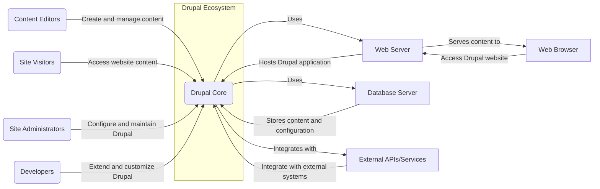
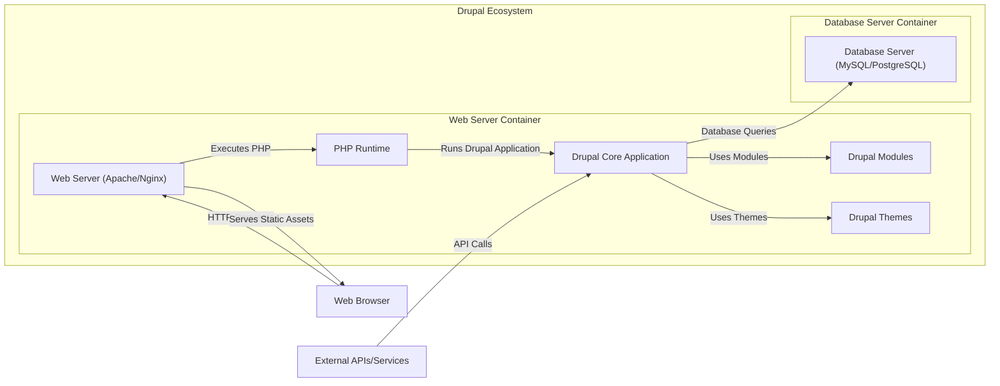
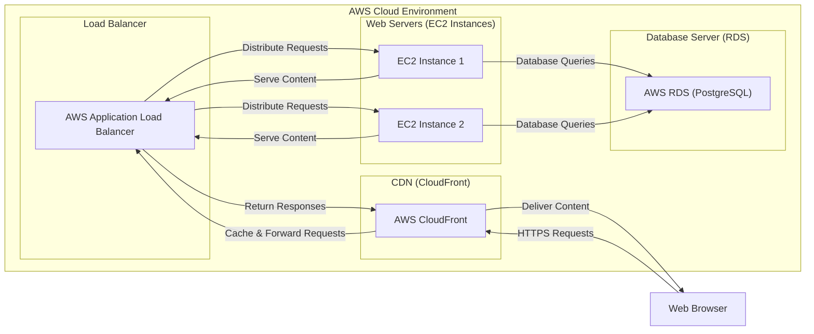
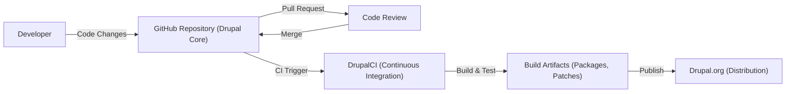

# BUSINESS POSTURE

Drupal core is a free and open-source content management system (CMS). Its primary business priority is to provide a flexible, robust, and secure platform for building and managing websites and web applications of various scales and complexities. The goal is to empower individuals and organizations to create and deliver digital experiences effectively.

Key business goals for Drupal core include:
- Functionality: Offering a wide range of features and capabilities to meet diverse content management needs.
- Flexibility: Providing a modular and extensible architecture that allows customization and adaptation.
- Usability: Ensuring a user-friendly interface for content creators, site administrators, and developers.
- Performance: Delivering fast and efficient website performance for optimal user experience.
- Security: Maintaining a secure platform to protect websites and user data from vulnerabilities and attacks.
- Community: Fostering a strong and active community of contributors and users to support development and adoption.

Most important business risks that need to be addressed:
- Security vulnerabilities in Drupal core could lead to website compromises, data breaches, and reputational damage for organizations using Drupal.
- Lack of backward compatibility in updates could cause disruption and increased maintenance costs for website owners.
- Performance issues could result in slow loading times and poor user experience, impacting website effectiveness.
- Complexity of configuration and customization could hinder adoption and increase the learning curve for new users.
- Dependence on community contributions for modules and themes could lead to inconsistencies in quality and security.

# SECURITY POSTURE

Existing security controls:
- security control: Secure coding practices are generally followed by Drupal core developers, as evidenced by the project's longevity and community scrutiny. (Implemented in: Drupal development process)
- security control: Regular security releases and patches are provided by the Drupal Security Team. (Implemented in: Drupal Security Team processes, Drupal.org)
- security control: Public disclosure of security vulnerabilities and advisories on Drupal.org. (Implemented in: Drupal Security Team processes, Drupal.org)
- security control: Community reporting and triage of security issues through Drupal.org issue queues. (Implemented in: Drupal.org issue queues, Drupal Security Team processes)
- security control: Automated testing framework for core and contributed modules, including unit and functional tests. (Implemented in: Drupal core codebase, DrupalCI)
- security control: Input sanitization and output encoding are implemented in Drupal core to prevent common web vulnerabilities like XSS and SQL injection. (Implemented in: Drupal core codebase)
- security control: Role-based access control (RBAC) system for managing user permissions and access to content and administrative functions. (Implemented in: Drupal core codebase)
- security control: Cryptographic API for secure data handling and storage. (Implemented in: Drupal core codebase)
- security control: Security review process for contributed modules, although the depth and effectiveness can vary. (Implemented in: Drupal.org project application process, Drupal community)
- accepted risk: Security of contributed modules and themes is the responsibility of their respective maintainers, and vulnerabilities can exist. (Accepted risk: Drupal ecosystem model)
- accepted risk: Configuration errors by site administrators can introduce security vulnerabilities. (Accepted risk: User responsibility)
- accepted risk: Outdated Drupal core or modules due to delayed updates can expose sites to known vulnerabilities. (Accepted risk: User responsibility)

Recommended security controls:
- security control: Implement static application security testing (SAST) tools in the Drupal core development pipeline to automatically detect potential vulnerabilities in code changes.
- security control: Integrate dynamic application security testing (DAST) into the Drupal core CI/CD pipeline to regularly scan built Drupal instances for runtime vulnerabilities.
- security control: Enhance security training for Drupal core developers and contributors, focusing on secure coding practices and common web application vulnerabilities.
- security control: Improve the security review process for contributed modules, potentially with automated security scanning and stricter guidelines.
- security control: Provide more guidance and tools for site administrators to securely configure and maintain their Drupal installations.

Security requirements:
- Authentication:
    - Requirement: Secure user authentication mechanisms to verify user identities.
    - Details: Support for username/password authentication, integration with external authentication providers (e.g., OAuth, LDAP, SAML). Protection against brute-force attacks and credential stuffing.
- Authorization:
    - Requirement: Robust authorization system to control user access to content and functionalities based on roles and permissions.
    - Details: Fine-grained permission system, role-based access control, content access control mechanisms, API access control.
- Input validation:
    - Requirement: Comprehensive input validation to prevent injection attacks and ensure data integrity.
    - Details: Validation of user inputs across all forms and APIs, sanitization of user-generated content, protection against SQL injection, cross-site scripting (XSS), and other injection vulnerabilities.
- Cryptography:
    - Requirement: Secure cryptographic functions for protecting sensitive data in transit and at rest.
    - Details: Use of strong encryption algorithms for password hashing, data encryption, and secure communication (HTTPS). Proper key management practices.

# DESIGN

## C4 CONTEXT

### Context Diagram Elements

- Element:
    - Name: Drupal Core
    - Type: Software System
    - Description: The core content management system software, providing the foundation for building websites and web applications.
    - Responsibilities: Content management, user management, workflow management, API provision, security framework.
    - Security controls: Input validation, output encoding, authentication and authorization mechanisms, cryptographic API, security updates.

- Element:
    - Name: Content Editors
    - Type: Person
    - Description: Users who create, edit, and manage content within the Drupal website.
    - Responsibilities: Content creation, content editing, content publishing.
    - Security controls: Authentication to access Drupal, authorization to manage specific content, secure password management.

- Element:
    - Name: Site Visitors
    - Type: Person
    - Description: Public users who access and view content on the Drupal website.
    - Responsibilities: Viewing website content, interacting with website features (e.g., forms, comments).
    - Security controls: Protection against XSS attacks, secure session management, privacy controls.

- Element:
    - Name: Site Administrators
    - Type: Person
    - Description: Users who configure, maintain, and administer the Drupal website.
    - Responsibilities: Site configuration, user management, module and theme management, security updates, performance optimization.
    - Security controls: Strong authentication, multi-factor authentication, role-based access control, audit logging.

- Element:
    - Name: Developers
    - Type: Person
    - Description: Users who extend and customize Drupal core by developing modules, themes, and integrations.
    - Responsibilities: Module development, theme development, custom code development, security testing.
    - Security controls: Secure coding practices, code review, vulnerability scanning, access control to development environments.

- Element:
    - Name: Web Server
    - Type: Software System
    - Description: Web server software (e.g., Apache, Nginx) that hosts the Drupal application and serves web pages to users.
    - Responsibilities: Handling HTTP requests, serving static files, executing PHP code, managing SSL/TLS certificates.
    - Security controls: Web server hardening, access control, DDoS protection, regular security updates.

- Element:
    - Name: Database Server
    - Type: Software System
    - Description: Database server software (e.g., MySQL, PostgreSQL) that stores Drupal's content, configuration, and user data.
    - Responsibilities: Data storage, data retrieval, data integrity, data backup.
    - Security controls: Database access control, encryption at rest, regular security updates, database hardening.

- Element:
    - Name: Web Browser
    - Type: Software System
    - Description: User's web browser used to access the Drupal website.
    - Responsibilities: Rendering web pages, executing client-side JavaScript, handling user interactions.
    - Security controls: Browser security features (e.g., Content Security Policy, XSS protection), user awareness of phishing and malware.

- Element:
    - Name: External APIs/Services
    - Type: Software System
    - Description: External systems and services that Drupal integrates with, such as payment gateways, social media platforms, or third-party APIs.
    - Responsibilities: Providing external functionalities, data exchange, integration with other systems.
    - Security controls: Secure API communication (HTTPS), API authentication and authorization, input validation of external data, rate limiting.

## C4 CONTAINER

### Container Diagram Elements

- Element:
    - Name: Web Server (Apache/Nginx)
    - Type: Container
    - Description: Web server software responsible for handling HTTP requests and serving the Drupal application.
    - Responsibilities: HTTP request handling, static file serving, reverse proxy, SSL/TLS termination.
    - Security controls: Web server hardening, access control, DDoS protection, regular security updates, HTTPS configuration.

- Element:
    - Name: PHP Runtime
    - Type: Container
    - Description: PHP runtime environment that executes the Drupal application code.
    - Responsibilities: PHP code execution, processing Drupal logic, interacting with the database.
    - Security controls: PHP configuration hardening, disabling unnecessary extensions, regular PHP updates.

- Element:
    - Name: Drupal Core Application
    - Type: Container
    - Description: The core Drupal application code, including the framework and base modules.
    - Responsibilities: Content management logic, user management, routing, API handling, security framework.
    - Security controls: Input validation, output encoding, authentication and authorization mechanisms, cryptographic API, security updates.

- Element:
    - Name: Drupal Modules
    - Type: Container
    - Description: Contributed or custom modules that extend Drupal's functionality.
    - Responsibilities: Providing additional features, integrations, and customizations.
    - Security controls: Security review (community-driven, variable effectiveness), module update management, input validation within modules.

- Element:
    - Name: Drupal Themes
    - Type: Container
    - Description: Themes that control the visual presentation and user interface of the Drupal website.
    - Responsibilities: Website styling, layout, user interface rendering.
    - Security controls: Theme security best practices (avoiding insecure JavaScript, proper template handling), theme update management.

- Element:
    - Name: Database Server (MySQL/PostgreSQL)
    - Type: Container
    - Description: Database server software storing Drupal's data.
    - Responsibilities: Data persistence, data retrieval, data integrity, data backup.
    - Security controls: Database access control, encryption at rest, regular security updates, database hardening, backup and recovery procedures.

## DEPLOYMENT

Deployment Solution: Cloud-based Infrastructure as a Service (IaaS) on AWS.

### Deployment Diagram Elements

- Element:
    - Name: AWS Application Load Balancer
    - Type: Load Balancer
    - Description: AWS Application Load Balancer distributing traffic across multiple web server instances.
    - Responsibilities: Traffic distribution, health checks, SSL termination, routing.
    - Security controls: DDoS protection (AWS Shield), SSL/TLS encryption, access logging, security groups.

- Element:
    - Name: EC2 Instances (Web Servers)
    - Type: Virtual Machine
    - Description: Amazon EC2 instances running the web server (Apache/Nginx) and PHP runtime, hosting the Drupal application.
    - Responsibilities: Running web server and PHP, serving Drupal application, processing requests.
    - Security controls: Instance hardening, security groups, regular patching, intrusion detection systems (IDS), access control (IAM roles).

- Element:
    - Name: AWS RDS (PostgreSQL)
    - Type: Managed Database Service
    - Description: AWS Relational Database Service (RDS) providing a managed PostgreSQL database for Drupal.
    - Responsibilities: Database management, data storage, backups, high availability.
    - Security controls: Database encryption at rest and in transit, database access control, regular patching, automated backups, security monitoring.

- Element:
    - Name: AWS CloudFront
    - Type: Content Delivery Network (CDN)
    - Description: AWS CloudFront CDN caching static content and distributing it globally to improve performance and reduce load on web servers.
    - Responsibilities: Content caching, content delivery, DDoS protection, SSL/TLS termination at the edge.
    - Security controls: DDoS protection (AWS Shield), SSL/TLS encryption, access logging, geo-restrictions, WAF integration.

## BUILD

### Build Diagram Elements

- Element:
    - Name: Developer
    - Type: Person
    - Description: Drupal core developers contributing code changes.
    - Responsibilities: Writing code, fixing bugs, implementing features, security testing.
    - Security controls: Secure development practices, code signing (optional for commits), access control to development environments.

- Element:
    - Name: GitHub Repository (Drupal Core)
    - Type: Code Repository
    - Description: GitHub repository hosting the Drupal core source code.
    - Responsibilities: Version control, code storage, collaboration, issue tracking.
    - Security controls: Access control (GitHub permissions), branch protection, audit logging, vulnerability scanning (GitHub Advanced Security).

- Element:
    - Name: Code Review
    - Type: Process
    - Description: Code review process for pull requests submitted by developers.
    - Responsibilities: Ensuring code quality, identifying bugs and security vulnerabilities, knowledge sharing.
    - Security controls: Peer review by experienced developers, security-focused code review guidelines.

- Element:
    - Name: DrupalCI (Continuous Integration)
    - Type: CI System
    - Description: DrupalCI system used for automated building, testing, and quality assurance of Drupal core.
    - Responsibilities: Automated builds, unit testing, functional testing, coding standards checks, security scanning (limited).
    - Security controls: Secure CI/CD pipeline, access control to CI system, vulnerability scanning of build environment.

- Element:
    - Name: Build Artifacts (Packages, Patches)
    - Type: Artifact Storage
    - Description: Packages and patches generated by the build process.
    - Responsibilities: Packaging Drupal core releases, creating patch files for security updates.
    - Security controls: Integrity checks (checksums, signatures), secure storage of artifacts, access control to artifact storage.

- Element:
    - Name: Drupal.org (Distribution)
    - Type: Distribution Platform
    - Description: Drupal.org website used for distributing Drupal core releases and security updates.
    - Responsibilities: Hosting Drupal core downloads, providing security advisories, community communication.
    - Security controls: Secure web hosting, access control, integrity checks for downloads (checksums, signatures), security monitoring.

# RISK ASSESSMENT

Critical business processes we are trying to protect:
- Content creation and management: Ensuring content editors can create, edit, and publish content without data loss or corruption.
- Website availability: Maintaining website uptime and accessibility for site visitors.
- Data integrity: Protecting the integrity of website content, user data, and configuration data.
- Confidentiality of sensitive data: Protecting user data, administrative credentials, and sensitive configuration information from unauthorized access.

Data we are trying to protect and their sensitivity:
- Website content: Publicly accessible content, moderate sensitivity in terms of integrity and availability.
- User accounts: Usernames, email addresses, hashed passwords, roles and permissions. High sensitivity due to potential for account compromise and data breaches.
- Configuration data: Database credentials, API keys, site settings. High sensitivity as compromise can lead to full site takeover.
- Log data: Web server logs, application logs, database logs. Moderate sensitivity, useful for security monitoring and incident response.
- Personally Identifiable Information (PII): Depending on website functionality, Drupal might store PII of website users (e.g., names, addresses, contact information). High sensitivity, requires compliance with privacy regulations (GDPR, CCPA, etc.).

# QUESTIONS & ASSUMPTIONS

Questions:
- What specific SAST/DAST tools are currently used or planned to be used in the Drupal core development and CI/CD pipeline?
- Are there any formal security training programs for Drupal core developers and contributors?
- What is the process for security reviewing contributed modules beyond the basic checks during project application?
- Are there specific guidelines or tools provided to site administrators for secure Drupal configuration and maintenance?
- What are the current incident response procedures in case of a security vulnerability discovered in Drupal core?

Assumptions:
- Drupal core development follows generally accepted secure coding practices.
- The Drupal Security Team is actively involved in identifying and addressing security vulnerabilities.
- Security advisories and updates are communicated effectively to the Drupal community.
- Site administrators are expected to apply security updates and follow security best practices for their Drupal installations.
- The described deployment scenario on AWS is a common and representative example for Drupal websites.