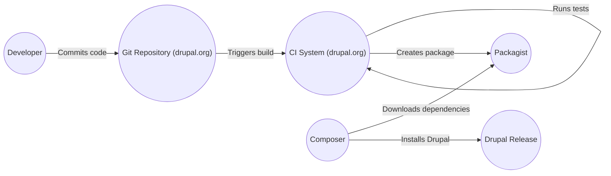

Okay, let's create a design document for the Drupal core project, keeping in mind its purpose and potential security considerations.

# BUSINESS POSTURE

Drupal is a widely-used, open-source Content Management System (CMS).  It powers a significant portion of the web, ranging from personal blogs to large enterprise and government websites.  Therefore, the business posture centers around maintaining trust, ensuring stability, and fostering a vibrant community.

Priorities and Goals:

*   Provide a flexible and extensible platform for building websites and applications.
*   Maintain a high level of security and stability to protect user data and ensure website availability.
*   Foster a strong and active community of developers and contributors.
*   Ensure backwards compatibility and a smooth upgrade path for existing installations.
*   Provide comprehensive documentation and support resources.
*   Adapt to evolving web standards and technologies.

Business Risks:

*   Reputational damage due to security vulnerabilities or data breaches.
*   Loss of user trust and adoption due to instability or poor performance.
*   Decline in community participation, leading to slower development and fewer contributions.
*   Inability to keep up with evolving web standards, leading to obsolescence.
*   Legal and compliance issues related to data privacy and security.
*   Competition from other CMS platforms.

# SECURITY POSTURE

Drupal has a well-established security team and a history of addressing vulnerabilities promptly. However, given its widespread use and the complexity of web applications, ongoing vigilance is crucial.

Existing Security Controls:

*   security control: A dedicated security team that reviews code, responds to vulnerability reports, and releases security advisories. (Documented on Drupal.org security pages).
*   security control: Regular security releases and updates to address known vulnerabilities. (Documented on Drupal.org).
*   security control: A well-defined process for reporting and handling security vulnerabilities. (Documented on Drupal.org).
*   security control: Coding standards and best practices that promote secure development. (Documented in Drupal's coding standards documentation).
*   security control: Input validation and output encoding to mitigate cross-site scripting (XSS) and other injection attacks. (Implemented throughout the codebase).
*   security control: Access control mechanisms to restrict access to sensitive data and functionality. (Implemented in the core user and permission system).
*   security control: Password hashing using strong, one-way algorithms (bcrypt). (Implemented in the user authentication system).
*   security control: Protection against Cross-Site Request Forgery (CSRF) attacks using tokens. (Implemented in the form API).
*   security control: Database abstraction layer to prevent SQL injection vulnerabilities. (Implemented in the database API).
*   security control: Support for HTTPS and other security-related HTTP headers. (Configurable in site settings).
*   security control: File system permissions management to restrict access to sensitive files. (Configurable in site settings and documented).
*   security control: A robust update system to ensure that sites can be easily updated to the latest secure version. (Implemented in the update manager).
*   security control: Session management that uses secure cookies and mitigates session hijacking risks. (Implemented in the session handling system).

Accepted Risks:

*   accepted risk: The inherent risk of zero-day vulnerabilities in any complex software system.
*   accepted risk: The risk of misconfiguration by site administrators, leading to security vulnerabilities.
*   accepted risk: The risk of vulnerabilities in contributed modules or themes that are not maintained by the core Drupal security team.
*   accepted risk: Reliance on third-party libraries and dependencies, which may have their own vulnerabilities.

Recommended Security Controls:

*   Implement a Content Security Policy (CSP) to mitigate XSS and other code injection attacks.
*   Enable HTTP Strict Transport Security (HSTS) to enforce HTTPS connections.
*   Regularly audit and review contributed modules and themes for security vulnerabilities.
*   Implement a robust web application firewall (WAF) to protect against common web attacks.
*   Consider implementing multi-factor authentication (MFA) for administrative users.

Security Requirements:

*   Authentication:
    *   All users must be authenticated before accessing restricted resources.
    *   Strong password policies must be enforced.
    *   Support for multi-factor authentication should be considered.
    *   Session management must be secure and prevent session hijacking.

*   Authorization:
    *   A granular permission system must control access to different functionalities and content.
    *   The principle of least privilege should be applied.
    *   Access control decisions must be logged and auditable.

*   Input Validation:
    *   All user input must be validated and sanitized to prevent injection attacks (XSS, SQLi, etc.).
    *   Input validation should be performed on both the client-side and server-side.
    *   A whitelist approach to input validation should be preferred over a blacklist approach.

*   Cryptography:
    *   Sensitive data, such as passwords, must be stored using strong, one-way hashing algorithms.
    *   All communication between the client and server should be encrypted using HTTPS.
    *   Cryptographic keys must be managed securely.

# DESIGN

## C4 CONTEXT

```mermaid
graph LR
    User(("User"))
    DrupalCore[("Drupal Core")]
    Database[(("Database"))]
    WebServer(("Web Server"))
    ThirdPartyServices(("Third-Party Services"))
    ContribModules(("Contributed Modules"))
    CustomModules(("Custom Modules"))
    Themes(("Themes"))

    User -- "Uses" --> DrupalCore
    DrupalCore -- "Reads/Writes" --> Database
    DrupalCore -- "Serves content" --> WebServer
    WebServer -- "HTTP/HTTPS" --> User
    DrupalCore -- "Integrates with" --> ThirdPartyServices
    DrupalCore -- "Extends" --> ContribModules
    DrupalCore -- "Extends" --> CustomModules
    DrupalCore -- "Uses" --> Themes

```

Element Descriptions:

*   Element:
    *   Name: User
    *   Type: Person
    *   Description: A person interacting with the Drupal website through a web browser.
    *   Responsibilities: Browsing content, submitting forms, interacting with the website's features.
    *   Security controls: Browser security settings, HTTPS connection.

*   Element:
    *   Name: Drupal Core
    *   Type: Software System
    *   Description: The core Drupal CMS software.
    *   Responsibilities: Managing content, users, permissions, modules, themes, and overall website functionality.
    *   Security controls: Input validation, output encoding, access control, password hashing, CSRF protection, database abstraction, session management.

*   Element:
    *   Name: Database
    *   Type: Database
    *   Description: The database used to store Drupal's content, users, configuration, and other data.
    *   Responsibilities: Storing and retrieving data.
    *   Security controls: Database user access control, encryption at rest (if applicable), regular backups.

*   Element:
    *   Name: Web Server
    *   Type: Software System
    *   Description: The web server (e.g., Apache, Nginx) that serves Drupal's content to users.
    *   Responsibilities: Handling HTTP requests, serving static files, and routing requests to Drupal.
    *   Security controls: Web server configuration hardening, HTTPS configuration, WAF (if applicable).

*   Element:
    *   Name: Third-Party Services
    *   Type: Software System
    *   Description: External services that Drupal may integrate with (e.g., payment gateways, social media APIs, analytics services).
    *   Responsibilities: Varies depending on the service.
    *   Security controls: Secure API communication, authentication and authorization with the third-party service.

*   Element:
    *   Name: Contributed Modules
    *   Type: Software System
    *   Description: Modules developed by the Drupal community to extend Drupal's functionality.
    *   Responsibilities: Varies depending on the module.
    *   Security controls: Adherence to Drupal coding standards, security reviews (ideally), regular updates.

*   Element:
    *   Name: Custom Modules
    *   Type: Software System
    *   Description: Modules developed specifically for a particular Drupal site.
    *   Responsibilities: Varies depending on the module.
    *   Security controls: Adherence to Drupal coding standards, security reviews, regular updates.

*   Element:
    *   Name: Themes
    *   Type: Software System
    *   Description: Templates and stylesheets that control the visual appearance of the Drupal site.
    *   Responsibilities: Presenting content to the user.
    *   Security controls: Secure coding practices to prevent XSS and other vulnerabilities.

## C4 CONTAINER

```mermaid
graph LR
    User(("User"))
    WebServer(("Web Server"))
    PHP(("PHP Interpreter"))
    Database[(("Database"))]
    Cache[(("Cache System"))]
    Files(("File System"))]

    User -- "HTTPS" --> WebServer
    WebServer -- "FastCGI/PHP-FPM" --> PHP
    PHP -- "Queries/Updates" --> Database
    PHP -- "Reads/Writes" --> Cache
    PHP -- "Reads/Writes" --> Files
```

Element Descriptions:

*   Element:
    *   Name: User
    *   Type: Person
    *   Description: A person interacting with the Drupal website.
    *   Responsibilities: Browsing, submitting forms, interacting with the site.
    *   Security controls: Browser security, HTTPS.

*   Element:
    *   Name: Web Server
    *   Type: Container (Software)
    *   Description: Handles HTTP requests (e.g., Apache, Nginx).
    *   Responsibilities: Serving static content, routing requests to PHP.
    *   Security controls: HTTPS configuration, WAF, access controls.

*   Element:
    *   Name: PHP Interpreter
    *   Type: Container (Runtime Environment)
    *   Description: Executes Drupal's PHP code.
    *   Responsibilities: Processing requests, interacting with the database, cache, and file system.
    *   Security controls: Secure PHP configuration, input validation, output encoding.

*   Element:
    *   Name: Database
    *   Type: Container (Database)
    *   Description: Stores Drupal's data (e.g., MySQL, PostgreSQL).
    *   Responsibilities: Data storage and retrieval.
    *   Security controls: Database access control, encryption at rest.

*   Element:
    *   Name: Cache System
    *   Type: Container (Cache)
    *   Description: Caches frequently accessed data to improve performance (e.g., Memcached, Redis).
    *   Responsibilities: Storing and retrieving cached data.
    *   Security controls: Access control to the cache system.

*   Element:
    *   Name: File System
    *   Type: Container (File System)
    *   Description: Stores files uploaded by users and managed by Drupal.
    *   Responsibilities: Storing and serving files.
    *   Security controls: File system permissions, secure file uploads.

## DEPLOYMENT

Possible Deployment Solutions:

1.  Traditional LAMP/LEMP stack on a single server.
2.  Cloud-based deployment using managed services (e.g., AWS, Azure, Google Cloud).
3.  Containerized deployment using Docker and Kubernetes.
4.  Platform-as-a-Service (PaaS) solutions (e.g., Acquia, Pantheon).

Chosen Solution (for detailed description): Cloud-based deployment using managed services (AWS).

```mermaid
graph LR
    Internet(("Internet"))
    LoadBalancer(("Load Balancer"))
    WebServer1(("Web Server (EC2)"))
    WebServer2(("Web Server (EC2)"))
    RDS[(("RDS (MySQL)"))]
    EFS(("EFS"))
    ElastiCache(("ElastiCache (Redis)"))

    Internet -- "HTTPS" --> LoadBalancer
    LoadBalancer -- "HTTPS" --> WebServer1
    LoadBalancer -- "HTTPS" --> WebServer2
    WebServer1 -- "SQL" --> RDS
    WebServer2 -- "SQL" --> RDS
    WebServer1 -- "NFS" --> EFS
    WebServer2 -- "NFS" --> EFS
    WebServer1 -- "" --> ElastiCache
    WebServer2 -- "" --> ElastiCache

```

Element Descriptions:

*   Element:
    *   Name: Internet
    *   Type: Network
    *   Description: The global network.
    *   Responsibilities: Routing traffic to the load balancer.
    *   Security controls: Standard internet security protocols.

*   Element:
    *   Name: Load Balancer
    *   Type: Infrastructure Node (AWS ELB)
    *   Description: Distributes traffic across multiple web servers.
    *   Responsibilities: Load balancing, SSL termination.
    *   Security controls: AWS security groups, HTTPS configuration.

*   Element:
    *   Name: Web Server 1 & 2
    *   Type: Infrastructure Node (AWS EC2)
    *   Description: Instances running the web server (e.g., Apache, Nginx) and PHP.
    *   Responsibilities: Serving Drupal content.
    *   Security controls: AWS security groups, OS hardening, web server configuration.

*   Element:
    *   Name: RDS
    *   Type: Infrastructure Node (AWS RDS)
    *   Description: Managed database service (MySQL).
    *   Responsibilities: Data storage and retrieval.
    *   Security controls: AWS security groups, database user access control, encryption at rest.

*   Element:
    *   Name: EFS
    *   Type: Infrastructure Node (AWS EFS)
    *   Description: Shared file system for uploaded files.
    *   Responsibilities: File storage and sharing between web servers.
    *   Security controls: AWS security groups, NFS access control.

*   Element:
    *   Name: ElastiCache
    *   Type: Infrastructure Node (AWS ElastiCache)
    *   Description: Managed caching service (Redis).
    *   Responsibilities: Caching frequently accessed data.
    *   Security controls: AWS security groups, access control to the cache service.

## BUILD

Drupal core doesn't have a traditional "build" process in the same way as compiled languages. However, there's a process for packaging releases and managing dependencies.  This is largely handled by the Drupal community and infrastructure.



Security Controls in the Build Process:

*   Code Review: All code changes are reviewed by other developers before being merged.
*   Automated Testing: Drupal has an extensive suite of automated tests (unit, functional, integration) that are run on every code change.
*   Static Analysis: Static analysis tools are used to identify potential security vulnerabilities and coding standard violations.
*   Dependency Management: Composer is used to manage dependencies and ensure that only trusted and up-to-date packages are used.
*   Release Management: The Drupal security team manages the release process and ensures that security releases are created and distributed promptly.
*   Infrastructure Security: Drupal.org's infrastructure is secured to prevent unauthorized access and modification of the codebase.

# RISK ASSESSMENT

Critical Business Processes:

*   Content delivery and presentation.
*   User authentication and authorization.
*   Content creation and management.
*   Website administration and configuration.
*   Extensibility via modules and themes.

Data Sensitivity:

*   Personally Identifiable Information (PII): Usernames, email addresses, IP addresses, and potentially other personal data stored in user profiles or submitted through forms. (High Sensitivity)
*   Content Data: The content of the website, which may include sensitive or confidential information depending on the nature of the site. (Variable Sensitivity - from Low to High)
*   Configuration Data: Website configuration settings, which may contain sensitive information such as database credentials or API keys. (High Sensitivity)
*   Session Data: User session data, which can be used to hijack user sessions if compromised. (High Sensitivity)
*   Logs: System and application logs, which may contain sensitive information about user activity or system errors. (Medium Sensitivity)

# QUESTIONS & ASSUMPTIONS

Questions:

*   What specific third-party services are commonly integrated with Drupal installations? This will help in assessing the risks associated with those integrations.
*   What is the typical level of technical expertise of Drupal site administrators? This will influence the recommendations for security configuration and best practices.
*   Are there any specific compliance requirements (e.g., GDPR, HIPAA) that need to be considered for typical Drupal installations?

Assumptions:

*   BUSINESS POSTURE: We assume a mid-sized organization or project with a moderate risk appetite. They value security but also need to balance it with usability and functionality.
*   SECURITY POSTURE: We assume that the Drupal core is kept up-to-date with the latest security releases. We also assume that site administrators have a basic understanding of security best practices.
*   DESIGN: We assume a standard Drupal installation with common modules and themes. We also assume that the deployment environment is reasonably secure.