# Project Design Document: Drupal Core - Enhanced

**Version:** 1.1
**Date:** October 26, 2023
**Author:** AI Software Architect

## 1. Introduction

This document provides an enhanced high-level architectural design of the Drupal core system, based on the codebase at [https://github.com/drupal/drupal](https://github.com/drupal/drupal). This revised document aims to provide a more detailed and comprehensive understanding of the system's components, interactions, and data flow, specifically for use in subsequent threat modeling activities. It focuses on the fundamental functionalities of the core and includes key integration points without delving into the specifics of every contributed module or theme.

## 2. Goals and Objectives

*   Provide a clear, concise, and more detailed overview of the Drupal core architecture.
*   Identify key components and their responsibilities with greater granularity.
*   Illustrate the primary data flows within the system with more specific examples.
*   Establish a robust common understanding of the system's structure for thorough security analysis.
*   Serve as a strong foundation for identifying potential threat vectors, attack surfaces, and vulnerabilities.

## 3. High-Level Architecture

Drupal is a modular content management system (CMS) built using PHP. Its architecture is designed for extensibility and flexibility. The core system provides the essential building blocks for content management, user management, and system administration.

```mermaid
graph LR
    subgraph "External Actors"
        A["'Anonymous User'"]
        B["'Authenticated User'"]
        C["'Administrator'"]
        Z["'External API/Service'"]
    end
    subgraph "Web Tier"
        D["'Web Server (e.g., Apache, Nginx)'"]
        E["'PHP Interpreter'"]
    end
    subgraph "Drupal Core Application"
        F["'HTTP Request Listener'"]
        G["'Routing & Menu System'"]
        H["'Module & Theme Engine'"]
        I["'Entity API & Field System'"]
        J["'Database Abstraction Layer (DBAL)'"]
        K["'Cache API'"]
        L["'User & Session Management'"]
        M["'Configuration Management API'"]
        N["'File Management API'"]
        O["'Event Dispatcher'"]
        P["'Queue System'"]
    end
    subgraph "Data & Storage Tier"
        Q["'Database (e.g., MySQL, PostgreSQL)'"]
        R["'File System Storage'"]
        S["'External Storage (Optional)'"]
    end

    A -- "HTTP Request" --> D
    B -- "HTTP Request (with Session/Auth)" --> D
    C -- "HTTP Request (with Admin Session)" --> D
    Z -- "API Request" --> D

    D -- "Pass to PHP" --> E
    E -- "Execute Drupal" --> F

    F -- "Route Request" --> G
    G -- "Load Modules & Themes" --> H
    H -- "Process Entities & Fields" --> I
    I -- "Access Data" --> J
    J -- "Query/Update Data" --> Q
    I -- "Utilize Cache" --> K
    F -- "Manage User Sessions" --> L
    C -- "Manage Configuration" --> M
    F -- "Manage Files" --> N
    F -- "Dispatch Events" --> O
    F -- "Queue Tasks" --> P
    N -- "Store/Retrieve Files" --> R
    I -- "Interact with External Storage" --> S

    style A fill:#f9f,stroke:#333,stroke-width:2px
    style B fill:#ccf,stroke:#333,stroke-width:2px
    style C fill:#fcc,stroke:#333,stroke-width:2px
    style Z fill:#cfc,stroke:#333,stroke-width:2px
    style D fill:#eee,stroke:#333,stroke-width:2px
    style E fill:#eee,stroke:#333,stroke-width:2px
    style F fill:#aaf,stroke:#333,stroke-width:2px
    style G fill:#aaf,stroke:#333,stroke-width:2px
    style H fill:#aaf,stroke:#333,stroke-width:2px
    style I fill:#aaf,stroke:#333,stroke-width:2px
    style J fill:#aaf,stroke:#333,stroke-width:2px
    style K fill:#aaf,stroke:#333,stroke-width:2px
    style L fill:#aaf,stroke:#333,stroke-width:2px
    style M fill:#aaf,stroke:#333,stroke-width:2px
    style N fill:#aaf,stroke:#333,stroke-width:2px
    style O fill:#aaf,stroke:#333,stroke-width:2px
    style P fill:#aaf,stroke:#333,stroke-width:2px
    style Q fill:#ddd,stroke:#333,stroke-width:2px
    style R fill:#ddd,stroke:#333,stroke-width:2px
    style S fill:#ddd,stroke:#333,stroke-width:2px
```

## 4. Key Components

*   **HTTP Request Listener:** The initial point of contact for all incoming web requests. It receives requests from the web server and bootstraps the Drupal application.
*   **Routing & Menu System:**  Responsible for interpreting incoming URLs and mapping them to specific controllers or request handlers within Drupal. It also manages the generation and rendering of navigation menus.
*   **Module & Theme Engine:**  The core of Drupal's extensibility.
    *   **Modules:** Provide features, functionalities, and business logic. They can alter Drupal's behavior, add new features, and integrate with external systems. Core modules are essential for basic operation, while contributed modules offer a vast array of enhancements.
    *   **Themes:** Control the presentation layer, defining the visual appearance and user experience of the website. They consist of templates, stylesheets, and JavaScript.
*   **Entity API & Field System:** A fundamental framework for managing structured content and data.
    *   **Entities:** Represent distinct pieces of content or data, such as nodes, users, taxonomy terms, and comments.
    *   **Fields:**  Define the attributes and data points associated with entities, allowing for flexible content modeling.
*   **Database Abstraction Layer (DBAL):** Provides an interface for interacting with various database systems (e.g., MySQL, PostgreSQL, SQLite) without requiring specific database code in most parts of the application. This promotes database independence.
*   **Cache API:**  A system for storing frequently accessed data in various caching backends (e.g., memory, files, Redis, Memcached) to improve performance and reduce database load. Different caching strategies are employed for different types of data.
*   **User & Session Management:** Handles user registration, login, authentication, and session management. It manages user roles, permissions, and access control.
*   **Configuration Management API:**  Provides a standardized way to manage configuration settings for the Drupal core and its modules. This includes storing, retrieving, and managing configuration data in a structured manner.
*   **File Management API:**  Manages the storage, retrieval, and manipulation of files uploaded to the Drupal site. This includes handling file uploads, managing file paths, and interacting with the underlying file system or external storage.
*   **Event Dispatcher:**  Implements the observer pattern, allowing modules to subscribe to and react to events that occur within the Drupal system. This enables decoupled and extensible behavior.
*   **Queue System:**  Provides a mechanism for deferring and processing tasks asynchronously. This is useful for long-running operations or tasks that don't need to be executed immediately.

## 5. Data Flow

The following outlines the typical data flow for common user interactions and system operations:

*   **Anonymous User Requesting a Content Page:**
    1. An anonymous user sends an HTTP GET request to the web server for a specific URL.
    2. The web server forwards the request to the PHP interpreter.
    3. The **HTTP Request Listener** bootstraps Drupal and passes the request to the **Routing & Menu System**.
    4. The **Routing & Menu System** matches the URL to a defined route and determines the responsible controller.
    5. The controller interacts with the **Entity API & Field System** to load the requested content (a Node entity in this case).
    6. The **Entity API** uses the **Database Abstraction Layer (DBAL)** to query the **Database**.
    7. The retrieved content data might be retrieved from the **Cache API** if available.
    8. The controller passes the content data to the **Theme Engine**.
    9. The **Theme Engine** uses templates and theme functions to render the HTML output.
    10. The rendered HTML is sent back through the PHP interpreter and web server to the user's browser.

*   **Authenticated User Submitting a Form (e.g., creating a comment):**
    1. An authenticated user submits a form via an HTTP POST request. The request includes session information managed by **User & Session Management**.
    2. The web server forwards the request to the PHP interpreter.
    3. The **HTTP Request Listener** bootstraps Drupal.
    4. The **Routing & Menu System** identifies the form submission handler.
    5. The form submission handler validates the submitted data.
    6. The handler interacts with the **Entity API & Field System** to create a new comment entity.
    7. The **Entity API** uses the **Database Abstraction Layer (DBAL)** to insert the new comment data into the **Database**.
    8. The **User & Session Management** component verifies the user's permissions to create comments.
    9. The **Event Dispatcher** might trigger events (e.g., comment creation event) that other modules can react to.
    10. A response (e.g., a redirect or a confirmation message) is generated and sent back to the user's browser.

*   **Administrator Updating System Configuration:**
    1. An administrator interacts with the administrative interface, triggering an HTTP request (often POST). The request includes the administrator's authenticated session.
    2. The request is processed by the **HTTP Request Listener** and routed.
    3. The responsible controller interacts with the **Configuration Management API**.
    4. The **Configuration Management API** validates and saves the new configuration settings to the **Database**.
    5. The **Cache API** is often cleared or updated to reflect the configuration changes.
    6. The **Event Dispatcher** might trigger configuration change events.

*   **Processing a Background Task:**
    1. A module or the system itself adds a task to the **Queue System**.
    2. A separate process (e.g., cron job) triggers the **Queue System** to process queued items.
    3. The **Queue System** retrieves a task and executes the associated logic. This might involve interacting with the **Entity API**, **Database**, **File Management API**, or external services.

## 6. Security Considerations (Detailed)

Drupal incorporates several security mechanisms at different levels:

*   **Input Sanitization and Validation:** Drupal employs various functions and APIs to sanitize user inputs and validate data before processing or storing it, mitigating risks like Cross-Site Scripting (XSS) and SQL Injection.
*   **Authentication and Authorization:**
    *   **Authentication:** Drupal supports various authentication methods, including username/password, OAuth, and SAML. The **User & Session Management** component handles user login and session management.
    *   **Authorization:** Drupal's permission system allows for granular control over user access to different functionalities and data. Roles and permissions are defined and managed through the administrative interface.
*   **Data Protection:**
    *   **Password Hashing:** User passwords are securely hashed using strong hashing algorithms before being stored in the database.
    *   **Secure Data Storage:** Drupal provides APIs and best practices for securely storing sensitive data.
*   **Access Control:** Drupal's access control mechanisms restrict access to administrative interfaces and sensitive data based on user roles and permissions.
*   **Protection Against Common Web Vulnerabilities:** Drupal core actively implements measures to prevent common web vulnerabilities such as Cross-Site Request Forgery (CSRF), clickjacking, and others.
*   **Regular Security Updates:** The Drupal Security Team actively monitors for and addresses security vulnerabilities. Regular updates are crucial for patching these vulnerabilities.
*   **Secure Coding Practices:** The Drupal community emphasizes secure coding practices, and code undergoes review processes to identify potential security flaws.
*   **File System Security:** Drupal's file management system includes measures to prevent unauthorized access to uploaded files and to mitigate risks associated with file uploads.

## 7. Deployment Considerations

Drupal can be deployed in various configurations, ranging from simple single-server setups to complex, multi-tier architectures:

*   **Single Server:**  All components (web server, PHP interpreter, database) reside on a single server. Suitable for small to medium-sized websites.
*   **Load-Balanced Web Servers:** Multiple web servers handle incoming traffic, distributing the load. This requires a shared file system and database.
*   **Dedicated Database Server:** The database server is separated from the web servers for improved performance and scalability.
*   **Content Delivery Network (CDN):**  A CDN can be used to cache static assets (images, CSS, JavaScript) closer to users, improving performance and reducing load on the web servers.
*   **Containerization (e.g., Docker):** Drupal can be deployed using containerization technologies for easier deployment and management.
*   **Cloud Platforms (e.g., AWS, Azure, Google Cloud):** Cloud platforms offer various services that can be used to deploy and scale Drupal applications, including managed databases, load balancers, and auto-scaling capabilities.
*   **Reverse Proxy:** A reverse proxy (e.g., Varnish, Nginx) can be used in front of the web servers for caching, security, and load balancing.

## 8. Future Considerations

This document provides an enhanced overview of the current Drupal core architecture. Future enhancements to this document could include:

*   More detailed sequence diagrams illustrating specific interactions between components.
*   Inclusion of key APIs and services provided by Drupal core.
*   A more detailed breakdown of the different caching layers within Drupal.
*   Specific considerations for decoupled or headless Drupal architectures.
*   Integration with external services and APIs.

This enhanced design document provides a more comprehensive foundation for threat modeling the Drupal core system, enabling a more thorough identification of potential security risks and the development of effective mitigation strategies.
