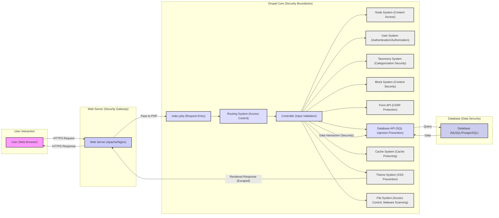
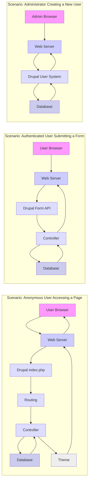

## Project Design Document: Drupal Core for Threat Modeling (Improved)

**1. Introduction**

This document provides a detailed architectural overview of the Drupal content management system (CMS) core, specifically designed to facilitate thorough threat modeling activities. It aims to clearly articulate the key components, data flows, and underlying technologies of Drupal core, highlighting aspects crucial for identifying potential security vulnerabilities and attack vectors. This document serves as the primary reference point for understanding the attack surface of Drupal core, based on the codebase available at [https://github.com/drupal/drupal](https://github.com/drupal/drupal). The insights gained from this document will directly inform the process of identifying, classifying, and prioritizing potential threats.

**2. Goals**

* To provide a comprehensive and easily understandable architectural blueprint of Drupal core for security analysis.
* To explicitly identify key components, their functionalities, and interdependencies relevant to security considerations.
* To meticulously describe the typical data flow pathways within a Drupal application, pinpointing potential interception or manipulation points.
* To clearly outline the technologies and frameworks employed in Drupal core, highlighting potential technology-specific vulnerabilities.
* To establish a solid and well-defined foundation for subsequent, more granular threat modeling exercises and security assessments.

**3. Architectural Overview**

Drupal's architecture is characterized by its modular design, featuring a central core that delivers fundamental functionalities and a rich ecosystem of contributed modules that extend its capabilities. The core is responsible for essential operations including user management, content management, request routing, access control enforcement, and data persistence.

* **Core Components (with Security Relevance):**
    * **Request Handling (`index.php`, HTTP Kernel):**  The initial entry point for all web requests. Security considerations include handling malicious or malformed requests, and preventing information leakage through error handling.
    * **Routing System (Symfony Router):** Maps incoming HTTP requests to specific controllers. Security implications involve ensuring proper access control for different routes and preventing route injection vulnerabilities.
    * **Menu System:** Manages site navigation and access to different functionalities. Security concerns include preventing unauthorized access to administrative or sensitive areas.
    * **Node System (Entity API):** Manages content entities (nodes). Security is crucial in preventing unauthorized content creation, modification, or deletion, and in sanitizing user-provided content to prevent XSS.
    * **User System (Account Management, Authentication, Authorization):** Handles user registration, login, password management, roles, and permissions. This is a critical security area, focusing on preventing unauthorized access and account compromise.
    * **Taxonomy System:** Enables content categorization. Security considerations involve controlling who can create or modify taxonomies and preventing information leakage through taxonomy terms.
    * **Block System:** Allows placement of content blocks. Security implications include preventing malicious code injection through block content and controlling block visibility based on user roles.
    * **Theme System (Twig Templating Engine):** Controls the presentation layer. Security is vital to prevent XSS vulnerabilities through template injection and ensure proper escaping of output data.
    * **Database Abstraction Layer (Database API, PDO):** Provides a secure interface for interacting with the database, mitigating SQL injection risks. Proper use of this API is paramount for data integrity and confidentiality.
    * **Cache System (Various Backends):** Improves performance by storing frequently accessed data. Security concerns involve preventing cache poisoning attacks and ensuring sensitive data is not inadvertently cached.
    * **Form API:** Facilitates secure creation and processing of web forms, including CSRF protection and input validation.
    * **Plugin API (Discovery, Dependency Injection):** Enables the creation of reusable components. Security implications involve ensuring plugins are loaded securely and do not introduce vulnerabilities.
    * **Event System (Symfony Event Dispatcher):** Allows modules to react to system events. Security considerations include preventing malicious event listeners from disrupting system operations or gaining unauthorized access.
    * **Update System:** Manages updates to core and contributed modules/themes. A critical security component for patching vulnerabilities. Secure update mechanisms are essential.
    * **File System (Stream Wrappers, File API):** Handles storage and retrieval of uploaded files. Security is crucial to prevent unauthorized file access, malicious file uploads, and directory traversal vulnerabilities.

* **Key Interactions (with Security Focus):**
    * User interaction with the website through a web browser initiates requests that must be validated and authorized.
    * The web server acts as a gatekeeper, and its configuration is critical for preventing direct access to sensitive files and for enforcing HTTPS.
    * Drupal's routing system must correctly enforce access control policies to prevent unauthorized access to specific functionalities.
    * Controllers handle user input, which must be sanitized and validated to prevent injection attacks.
    * Interactions with the database must utilize the Database API securely to prevent SQL injection.
    * The theme system must properly escape output to prevent XSS vulnerabilities.
    * The user system must securely handle authentication and authorization to protect user accounts and data.

**4. Data Flow (with Security Implications)**

Understanding data flow is crucial for identifying where vulnerabilities might be introduced or exploited. Here are examples of common data flows and associated security concerns:

* **Anonymous User Accessing a Page:**
    * Request from the browser to the web server.
    * Web server forwards the request to Drupal's `index.php`.
    * Routing system determines the appropriate controller based on the URL.
    * Controller retrieves the requested content (e.g., a node) from the database.
    * Theme system renders the content.
    * **Security Considerations:** Ensuring anonymous users only access publicly available content, preventing information leakage, and mitigating XSS risks in displayed content.
* **Authenticated User Submitting a Form:**
    * User fills out and submits a form.
    * Browser sends the form data to the web server.
    * Drupal's form API processes the submission.
    * **Security Considerations:** CSRF protection to prevent unauthorized form submissions, input validation and sanitization to prevent injection attacks, and proper authorization to ensure the user has permission to perform the action.
* **Administrator Creating a New User:**
    * Administrator navigates to the user creation page.
    * Form is displayed (data retrieved from the database for form elements).
    * Administrator submits the new user details.
    * User system processes the request, validates input, and creates the new user account in the database (including secure password hashing).
    * **Security Considerations:** Strong password policies, secure password hashing algorithms, and proper authorization to restrict user creation to administrators.

**5. Key Technologies (and Security Implications)**

* **PHP:** The primary programming language. Security considerations include being aware of common PHP vulnerabilities (e.g., insecure deserialization) and following secure coding practices.
* **Twig Templating Engine:** Used for rendering the user interface. Crucial for preventing XSS vulnerabilities through proper output escaping and avoiding the use of `raw` filters on user-supplied data.
* **Database Systems (MySQL/MariaDB, PostgreSQL, SQLite):** Data storage backend. Security concerns involve preventing SQL injection through the use of parameterized queries and the Database API, and ensuring proper database access controls.
* **Web Servers (Apache, Nginx):** Handle incoming HTTP requests. Security implications involve proper configuration to prevent information disclosure, enforce HTTPS, and mitigate common web server vulnerabilities.
* **Frontend Technologies (HTML, CSS, JavaScript):** Used for the user interface. Security considerations focus on preventing DOM-based XSS vulnerabilities and ensuring secure handling of client-side data.
* **Composer:** Dependency management tool. Security concerns involve ensuring the integrity and security of third-party libraries used by Drupal and regularly updating dependencies to patch vulnerabilities.

**6. Deployment Considerations (and Security Recommendations)**

The deployment environment significantly impacts Drupal's security posture.

* **Traditional LAMP/LEMP Stack:**
    * **Security Recommendations:** Regularly update operating system and server software, configure firewalls, secure database access (strong passwords, restrict access), enforce HTTPS, and properly configure web server directives.
* **Cloud Platforms (AWS, Azure, GCP):**
    * **Security Recommendations:** Utilize cloud-specific security services (e.g., WAF, security groups), implement strong IAM policies, encrypt data at rest and in transit, and follow platform-specific security best practices.
* **Containerized Environments (Docker, Kubernetes):**
    * **Security Recommendations:** Secure container images, implement network policies to restrict container communication, use secrets management for sensitive credentials, and regularly scan container images for vulnerabilities.

**7. Security Considerations (Built-in) - Examples of Threat Mitigation**

Drupal core incorporates several security features designed to mitigate common threats:

* **Input Sanitization (e.g., `\Drupal\Component\Utility\Xss::filter()`):** Mitigates XSS attacks by removing or escaping potentially malicious HTML and JavaScript code from user input.
* **Database Abstraction Layer (PDO with Parameterized Queries):** Prevents SQL injection vulnerabilities by ensuring user-provided data is treated as data, not executable code, when interacting with the database.
* **Form API (CSRF Token Generation and Validation):** Protects against CSRF attacks by ensuring that form submissions originate from the legitimate website and not from malicious third-party sites.
* **Access Control System (Permissions and Roles):** Limits access to sensitive functionalities and data based on user roles and permissions, preventing unauthorized actions.
* **Regular Security Updates:** Addresses identified vulnerabilities promptly, reducing the window of opportunity for attackers.
* **Password Hashing (using robust algorithms):** Securely stores user passwords, making it difficult for attackers to compromise accounts even if the database is breached.

**8. Threat Modeling Scope (Specific Focus Areas)**

The threat modeling activities will specifically focus on the following aspects of Drupal core:

* **Authentication Mechanisms:** Analysis of login processes, password reset flows, and multi-factor authentication (if enabled in core or considered for inclusion).
* **Authorization Controls:** Examination of how permissions are defined, enforced, and potentially bypassed, focusing on access to content, administrative functions, and sensitive data.
* **Input Handling and Validation:** Assessment of how user-supplied data is processed across various core subsystems (e.g., node creation, form submissions, URL parameters) to identify injection vulnerabilities (XSS, SQL injection, command injection).
* **Session Management:** Evaluation of how user sessions are created, maintained, and invalidated, looking for vulnerabilities like session fixation or hijacking.
* **File Handling Processes:** Analysis of file upload mechanisms, storage locations, and access controls to prevent malicious file uploads and unauthorized access to files.
* **Cryptographic Operations:** Review of how Drupal core utilizes cryptography for password hashing, data encryption (if applicable in core), and secure communication.

**9. Out of Scope (Clearly Defined Boundaries)**

To maintain focus and manage the scope of the threat modeling exercise, the following are explicitly excluded:

* **Security of Contributed Modules and Themes:**  The vast ecosystem of third-party extensions introduces its own set of security considerations, which are outside the scope of this core-focused analysis.
* **Infrastructure-Level Security:** Security measures related to the underlying operating system, web server configuration (beyond basic Drupal requirements), network firewalls, and other infrastructure components are not within this scope.
* **Client-Side Security Vulnerabilities:**  Vulnerabilities that reside solely within the user's web browser (e.g., browser extensions) are excluded.
* **Social Engineering and Phishing Attacks:**  Attacks that rely on manipulating users into divulging credentials or performing malicious actions are outside the scope of this technical threat model.
* **Distributed Denial of Service (DDoS) Attacks:** While Drupal has some basic flood control, comprehensive DDoS mitigation is typically an infrastructure concern.
* **Highly Specific Configuration Issues:** Security misconfigurations in a particular Drupal installation (e.g., weak file permissions set by an administrator) are not the primary focus, but rather inherent vulnerabilities within the core codebase itself.

This improved document provides a more detailed and security-focused architectural overview of Drupal core. It serves as a robust foundation for conducting effective threat modeling, enabling a deeper understanding of potential vulnerabilities and informing the development of appropriate mitigation strategies.