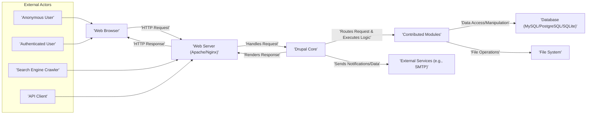
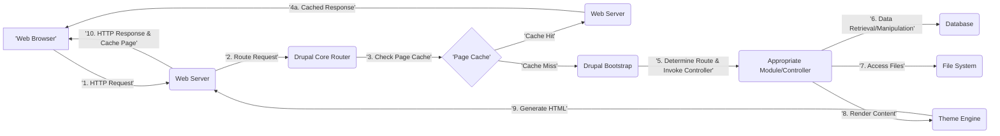

# Project Design Document: Drupal Core

**Version:** 1.1
**Date:** October 26, 2023
**Author:** AI Software Architect

## 1. Introduction

This document provides a comprehensive architectural design of the Drupal core system. It details the key components, their interactions, and the overall structure of the platform. This document serves as a foundational resource for understanding the system's architecture and is intended for use as input for subsequent threat modeling activities. It aims to provide sufficient detail for security analysis while remaining accessible to a broad technical audience.

## 2. Goals and Objectives

*   Provide a clear, concise, and detailed overview of the Drupal core architecture.
*   Identify and describe the responsibilities and key functionalities of each major component.
*   Illustrate the primary data flows within the system, including variations for different types of requests.
*   Establish a shared understanding of the system's structure for development, security analysis, and operational teams.
*   Serve as a precise and informative basis for identifying potential security vulnerabilities during threat modeling exercises.

## 3. High-Level Architecture

Drupal operates as a modular content management system (CMS) built upon a standard web request-response cycle. It relies on a web server to handle incoming requests, a database for persistent storage, and a file system for assets and code.



## 4. Key Components

This section provides a detailed breakdown of the major components within the Drupal core system, outlining their specific roles and functionalities.

*   **Web Server (Apache/Nginx):**
    *   Accepts incoming HTTP/HTTPS requests from users' web browsers, API clients, and other external systems.
    *   Serves static assets (images, CSS, JavaScript files) directly.
    *   For dynamic requests, it forwards them to the PHP interpreter via protocols like FastCGI or PHP-FPM.
    *   Handles SSL/TLS termination for secure connections.
    *   May implement load balancing and caching mechanisms.

*   **PHP Interpreter:**
    *   Executes the Drupal codebase written in PHP.
    *   Processes incoming requests based on Drupal's routing logic.
    *   Interacts with the database and file system.
    *   Generates the HTML, JSON, or other response formats to be sent back to the client.

*   **Drupal Core:**
    *   The foundational software providing the essential functionalities of the CMS.
    *   **Request Handling:** Receives requests from the web server and initiates the Drupal bootstrap process.
    *   **Routing System:** Determines which module and controller should handle the current request based on the URL.
    *   **User Authentication and Authorization:** Manages user accounts, login sessions, and permissions to control access to content and functionalities.
    *   **Content Management Framework:** Provides the base structures for creating, storing, and managing content (Nodes, Entities, Fields).
    *   **Module Management:** Loads and manages enabled modules, allowing them to extend Drupal's functionality.
    *   **Theme Engine:** Processes theme templates and renders the final output for the user interface.
    *   **API (Application Programming Interface):** Exposes a rich set of functions, hooks, events, and services that modules can use to interact with the core system.
    *   **Configuration Management:** Handles the storage and retrieval of system-wide and module-specific configuration settings.
    *   **Batch API:** Provides a framework for processing long-running tasks in chunks to avoid timeouts.
    *   **Queue API:** Enables asynchronous processing of tasks.

*   **Modules (Core and Contributed):**
    *   Extend and customize the functionality of Drupal.
    *   **Core Modules:** Modules included with the Drupal installation, providing essential features like content types, user management, taxonomy, and block management. These are maintained by the Drupal core development team.
    *   **Contributed Modules:** Modules developed and maintained by the Drupal community, offering a vast array of additional features, integrations, and customizations. Their quality and security can vary.
    *   Modules interact with Drupal Core through its API to register routes, define content types, implement business logic, and interact with other parts of the system.

*   **Themes:**
    *   Control the visual presentation and user experience of the website.
    *   Define the HTML structure, CSS styling, JavaScript behavior, and overall layout of the front-end.
    *   Utilize the Twig templating engine to render dynamic content.
    *   Can be customized through theme settings, template overrides, and sub-theming.

*   **Database (MySQL/PostgreSQL/SQLite):**
    *   Provides persistent storage for all website data, including:
        *   Content (nodes, revisions, fields)
        *   User accounts and roles
        *   Taxonomy terms
        *   Configuration settings
        *   Session data
        *   Cache data
    *   Drupal uses a database abstraction layer (Database API) to provide a consistent interface for interacting with different database systems, abstracting away database-specific syntax.

*   **File System:**
    *   Stores various files required for the Drupal installation:
        *   Drupal core codebase
        *   Contributed modules and themes
        *   Uploaded files (images, documents, videos) managed by Drupal
        *   Configuration files (e.g., `settings.php`)
        *   Temporary files and caches
    *   Proper file permissions are critical for security to prevent unauthorized access and modification.

*   **Caching System:**
    *   Improves performance and reduces database load by storing frequently accessed data in memory or on disk.
    *   **Page Cache:** Stores fully rendered HTML pages for anonymous users.
    *   **Block Cache:** Stores rendered output of individual blocks.
    *   **Database Cache:** Caches results of database queries.
    *   **Render Cache:** Caches the render arrays of entities and other renderable elements.
    *   Drupal supports various caching backends like Memcached, Redis, and the default database caching.

*   **API (Application Programming Interface):**
    *   Provides a comprehensive set of interfaces for developers to interact with Drupal's functionalities.
    *   **Hooks:** Allow modules to alter or react to events within the Drupal core workflow.
    *   **Events:** A more modern approach to allowing modules to subscribe to and react to system events.
    *   **Services:** Reusable components that provide specific functionalities and can be injected into other parts of the system.
    *   **RESTful Web Services:** Drupal provides core modules for building and consuming RESTful APIs, allowing integration with external applications.

*   **Administrative Interface:**
    *   A web-based interface accessible to authorized users for managing the Drupal website.
    *   Provides tools for:
        *   Content creation and editing
        *   User management and permissions
        *   Module and theme installation and management
        *   Configuration settings
        *   Reporting and logging
        *   Running updates
    *   Access is controlled by Drupal's permission system.

## 5. Data Flow

The following diagrams illustrate typical data flows for different types of user interactions with a Drupal website.

### 5.1. Anonymous User Page Request



**Detailed Data Flow Steps (Anonymous Page Request):**

1. **HTTP Request:** An anonymous user's web browser sends an HTTP request to the web server.
2. **Route Request:** The web server passes the request to Drupal. The Drupal core router analyzes the request URL.
3. **Check Page Cache:** Drupal checks if a cached version of the requested page exists.
4. **Cache Hit:** If a cached version exists, the web server serves the cached response directly to the browser (4a).
5. **Cache Miss:** If no cached version exists, Drupal proceeds with the request handling.
6. **Drupal Bootstrap:** Drupal initializes its core components and loads necessary modules.
7. **Determine Route & Invoke Controller:** Based on the URL, the router determines the appropriate module and controller (or function) to handle the request.
8. **Data Retrieval/Manipulation:** The invoked module interacts with the database to retrieve or manipulate data as needed.
9. **Access Files:** The module may access files from the file system (e.g., images, configuration files).
10. **Render Content:** The module passes data to the theme engine, which uses templates to generate the HTML. The web server sends the generated HTML response back to the user's browser and potentially caches the page for future requests.

### 5.2. Authenticated User Action (e.g., Submitting a Form)

```mermaid
graph LR
    A["'Web Browser'"] --> |'1. HTTP Request (Form Submission)'| B("Web Server")
    B --> |'2. Route Request'| C("Drupal Core Router")
    C --> |'3. Authenticate User & Check Permissions'| D("User Authentication & Access Control")
    D --> |'4. Determine Route & Invoke Form Handler'| E("Appropriate Module/Form Handler")
    E --> |'5. Validate Form Data'| E
    E -- 'Validation Success' --> F("Data Processing & Logic")
    F --> |'6. Data Update/Manipulation'| G("Database")
    F --> |'7. File Operations (if applicable)'| H("File System")
    F --> |'8. Generate Response (e.g., Redirect, Confirmation)'| B
    B --> |'9. HTTP Response'| A
    E -- 'Validation Failure' --> B
    B --> |'9. HTTP Response (with Error Messages)'| A
```

**Detailed Data Flow Steps (Authenticated User Action):**

1. **HTTP Request (Form Submission):** An authenticated user's web browser sends an HTTP request (typically a POST request) to the web server, submitting a form.
2. **Route Request:** The web server passes the request to Drupal. The Drupal core router analyzes the request URL.
3. **Authenticate User & Check Permissions:** Drupal authenticates the user based on session cookies or other credentials and verifies if the user has the necessary permissions to perform the requested action.
4. **Determine Route & Invoke Form Handler:** The router determines the appropriate module and form handler to process the submitted data.
5. **Validate Form Data:** The form handler validates the submitted data against defined rules.
6. **Data Processing & Logic:** If validation is successful, the form handler executes the necessary business logic.
7. **Data Update/Manipulation:** The form handler interacts with the database to update or manipulate data based on the submitted information.
8. **File Operations (if applicable):** The form handler may interact with the file system (e.g., to save uploaded files).
9. **Generate Response:** Drupal generates an appropriate HTTP response, which might be a redirect to another page, a confirmation message, or an error message if validation failed. The web server sends the response back to the user's browser.

## 6. Security Considerations

This section outlines key security considerations within the Drupal core architecture. These areas will be the focus of more detailed analysis during the threat modeling process.

*   **Input Sanitization and Validation:** Drupal provides APIs and best practices for sanitizing user input to prevent cross-site scripting (XSS) attacks and validating input to prevent SQL injection and other injection vulnerabilities. The Form API plays a crucial role in this.
*   **Authentication and Authorization:** Drupal's user authentication system supports various methods, including username/password, and integrates with external authentication providers. The permission system allows granular control over user access to different functionalities and content.
*   **Protection Against Cross-Site Request Forgery (CSRF):** Drupal automatically includes CSRF tokens in forms to prevent malicious requests originating from other websites.
*   **Secure Password Handling:** Drupal uses strong hashing algorithms (currently Argon2i) to securely store user passwords.
*   **Database Security:** Drupal relies on secure database configurations and parameterized queries (through its Database API) to prevent SQL injection vulnerabilities.
*   **File System Security:** Drupal emphasizes proper file permissions to prevent unauthorized access to sensitive files and directories.
*   **Session Management:** Drupal uses secure cookies and session handling mechanisms to protect user sessions from hijacking.
*   **Output Escaping:** Drupal's theme engine automatically escapes output to prevent XSS vulnerabilities. Developers are encouraged to use appropriate escaping functions when rendering dynamic content.
*   **Security Updates:** The Drupal Security Team actively monitors for and addresses security vulnerabilities in core and contributed modules. Regular updates are crucial for maintaining a secure Drupal installation.
*   **Access Control for Administrative Interface:** Access to the administrative interface is restricted to authorized users with specific permissions.
*   **Protection Against Common Web Attacks:** Drupal incorporates mechanisms to mitigate common web attacks, such as clickjacking and MIME sniffing vulnerabilities.
*   **Content Security Policy (CSP):** Drupal allows administrators to configure CSP headers to further enhance security by controlling the resources the browser is allowed to load.

## 7. Deployment Considerations

*   **Environment Setup:** Drupal typically requires a web server (Apache or Nginx), a PHP interpreter, and a database server (MySQL, PostgreSQL, or SQLite).
*   **Installation Process:** The installation process involves downloading Drupal, configuring the database connection, and running the web-based installer.
*   **Configuration Files:** Key configuration settings, including database credentials and trusted host patterns, are stored in the `settings.php` file. Securely managing this file is critical.
*   **File Permissions:** Setting appropriate file system permissions is essential for security. Web server users should have limited write access to Drupal's files.
*   **Virtual Hosts/Server Blocks:** Configuring virtual hosts or server blocks on the web server is necessary to host Drupal websites.
*   **SSL/TLS Configuration:** Implementing HTTPS by configuring SSL/TLS certificates is crucial for securing communication between the browser and the server.
*   **Caching Configuration:** Configuring Drupal's caching mechanisms (page cache, block cache, etc.) is important for performance.
*   **Cron Jobs:** Drupal relies on cron jobs for running background tasks, such as clearing caches and processing updates.
*   **Security Hardening:** Implementing security hardening measures, such as disabling unnecessary PHP functions and configuring web server security headers, is recommended.
*   **Environment Variables:** Sensitive information like database credentials can be managed using environment variables instead of directly in configuration files.
*   **Reverse Proxies and CDNs:** Using reverse proxies (like Varnish) and Content Delivery Networks (CDNs) can improve performance and security.

## 8. Technologies Used

*   **Programming Language:** PHP
*   **Database:** MySQL, PostgreSQL, SQLite
*   **Web Server:** Apache, Nginx
*   **Front-end Technologies:** HTML, CSS, JavaScript
*   **Templating Engine:** Twig
*   **JavaScript Frameworks/Libraries:** Primarily vanilla JavaScript, with some components potentially using libraries.
*   **Dependency Management:** Composer

## 9. Future Considerations

*   This document provides a comprehensive overview of the current Drupal core architecture. As Drupal continues to evolve, this document will require periodic updates to reflect significant architectural changes and new features.
*   More detailed design documents may be created for specific sub-systems or complex modules as needed.
*   The information presented here will be used as the foundation for conducting thorough threat modeling exercises to identify and mitigate potential security risks.