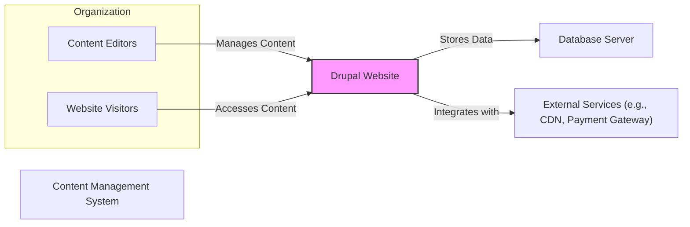
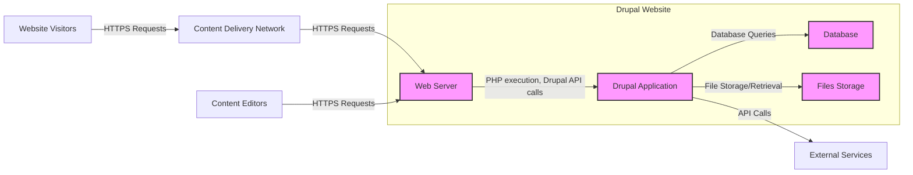
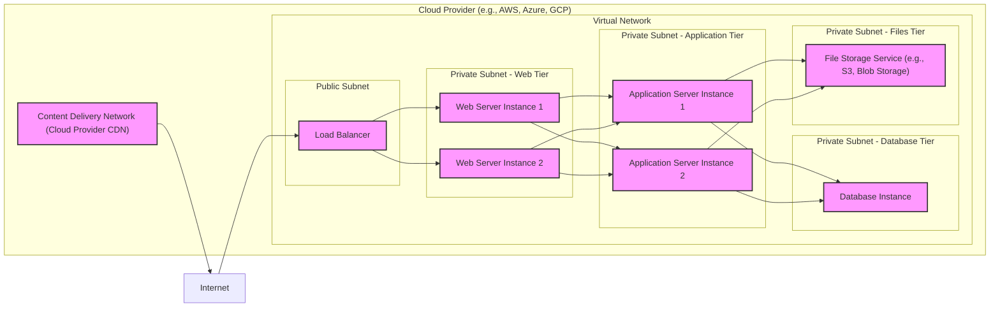
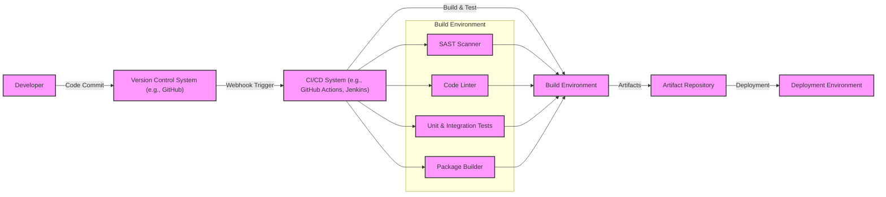

# BUSINESS POSTURE

Drupal is a powerful open-source content management system (CMS) that enables organizations to build and manage websites and digital experiences. The primary business goal for adopting Drupal is to create, manage, and deliver content effectively to various audiences, supporting business objectives such as marketing, communication, e-commerce, and community engagement.

Business Priorities and Goals:
- Content Creation and Management: Empower content creators to easily publish and update website content.
- Digital Experience Delivery: Provide engaging and personalized digital experiences to users across different channels and devices.
- Scalability and Performance: Ensure the website can handle increasing traffic and content volume while maintaining optimal performance.
- Extensibility and Flexibility: Offer a platform that can be customized and extended to meet evolving business needs through modules and integrations.
- Community and Ecosystem: Leverage a large and active open-source community for support, innovation, and security updates.

Business Risks:
- Data Breach and Data Loss: Sensitive content and user data could be compromised, leading to financial loss, reputational damage, and legal liabilities.
- Website Defacement and Malware Injection: Unauthorized modification of the website or injection of malicious code can damage brand reputation and user trust.
- Service Disruption and Downtime: Website unavailability can lead to loss of revenue, customer dissatisfaction, and missed business opportunities.
- Complexity and Maintenance Overhead: Managing a complex CMS like Drupal can require specialized skills and resources, potentially increasing operational costs.
- Supply Chain Vulnerabilities: Security vulnerabilities in contributed modules or third-party integrations can introduce risks to the Drupal platform.

# SECURITY POSTURE

Existing Security Controls:
- security control: Drupal core and contributed modules undergo community security reviews and are regularly updated to address vulnerabilities. (Source: Drupal Security Team and release notes)
- security control: Drupal provides a robust permission system for managing user access and roles. (Source: Drupal documentation)
- security control: Drupal supports secure password hashing and storage. (Source: Drupal core code)
- security control: Drupal core includes protection against common web vulnerabilities like Cross-Site Scripting (XSS) and SQL Injection. (Source: Drupal security documentation and code)
- security control: Drupal community provides security advisories and best practices documentation. (Source: Drupal.org/security)
- security control: Hosting providers often offer infrastructure-level security controls such as firewalls and intrusion detection systems. (Source: General cloud hosting practices)

Accepted Risks:
- accepted risk: Reliance on community-driven security updates may introduce a delay in patching newly discovered vulnerabilities.
- accepted risk: Security of contributed modules depends on the module maintainers and may vary in quality and security rigor.
- accepted risk: Misconfiguration of Drupal or its modules can introduce security vulnerabilities.
- accepted risk: Third-party integrations may introduce security risks if not properly vetted and maintained.

Recommended Security Controls:
- security control: Implement a Web Application Firewall (WAF) to protect against common web attacks.
- security control: Conduct regular security audits and penetration testing to identify and address vulnerabilities proactively.
- security control: Implement a Security Information and Event Management (SIEM) system for security monitoring and incident response.
- security control: Enforce strong password policies and multi-factor authentication (MFA) for administrative accounts.
- security control: Implement a robust backup and disaster recovery plan to ensure data availability and business continuity.
- security control: Utilize automated security scanning tools (SAST/DAST) in the development and deployment pipeline.
- security control: Implement a Content Security Policy (CSP) to mitigate XSS attacks.
- security control: Regularly review and update contributed modules and themes to their latest secure versions.

Security Requirements:
- Authentication:
    - Requirement: Securely authenticate users accessing the Drupal administrative interface.
    - Requirement: Support different authentication methods, including username/password, and potentially integration with external identity providers (e.g., LDAP, SAML, OAuth).
    - Requirement: Implement session management to maintain user sessions securely.
- Authorization:
    - Requirement: Implement a granular role-based access control (RBAC) system to manage user permissions and access to content and functionalities.
    - Requirement: Enforce the principle of least privilege, granting users only the necessary permissions to perform their tasks.
    - Requirement: Audit user access and authorization activities.
- Input Validation:
    - Requirement: Validate all user inputs to prevent injection attacks (e.g., SQL Injection, XSS, Command Injection).
    - Requirement: Sanitize user-generated content before displaying it on the website.
    - Requirement: Implement input validation on both client-side and server-side.
- Cryptography:
    - Requirement: Use HTTPS to encrypt all communication between users and the Drupal website.
    - Requirement: Securely store sensitive data, such as passwords and API keys, using strong encryption algorithms.
    - Requirement: Implement cryptographic measures to protect data at rest and in transit.

# DESIGN

## C4 CONTEXT

Context Diagram Elements:
- Name: Content Editors
  - Type: Actor
  - Description: Users responsible for creating, managing, and publishing content on the Drupal website.
  - Responsibilities: Creating and updating website content, managing website structure, configuring website settings.
  - Security controls: Authentication to access the Drupal admin interface, authorization based on roles and permissions within Drupal.
- Name: Website Visitors
  - Type: Actor
  - Description: Public users who access and consume content on the Drupal website.
  - Responsibilities: Browsing website content, interacting with website features (e.g., forms, comments).
  - Security controls: Rate limiting to prevent abuse, CAPTCHA to prevent bot activity, secure communication over HTTPS.
- Name: Drupal Website
  - Type: Software System
  - Description: The Drupal content management system, responsible for managing content, serving web pages, and interacting with other systems.
  - Responsibilities: Content management, web page rendering, user authentication and authorization, data storage and retrieval, integration with external services.
  - Security controls: Input validation, output encoding, access control, security updates, session management, HTTPS enforcement.
- Name: Database Server
  - Type: Software System
  - Description: Database system used by Drupal to store content, user data, and configuration information.
  - Responsibilities: Data storage, data retrieval, data persistence, data integrity.
  - Security controls: Access control lists, database user authentication, encryption at rest, regular backups.
- Name: External Services (e.g., CDN, Payment Gateway)
  - Type: Software System
  - Description: External services integrated with Drupal to enhance functionality, performance, or provide specific services. Examples include Content Delivery Networks (CDNs), payment gateways, marketing automation platforms.
  - Responsibilities: Content delivery (CDN), payment processing (Payment Gateway), email marketing (Marketing Automation).
  - Security controls: Secure API communication (HTTPS, API keys), input validation, adherence to security best practices of each external service.

## C4 CONTAINER

Container Diagram Elements:
- Name: Web Server
  - Type: Container
  - Description: Web server (e.g., Apache, Nginx) responsible for handling HTTP requests, serving static content, and proxying requests to the Drupal application.
  - Responsibilities: HTTP request handling, static content serving, TLS termination, reverse proxying.
  - Security controls: Web server hardening, access control, TLS configuration, DDoS protection, request filtering.
- Name: Drupal Application
  - Type: Container
  - Description: The Drupal PHP application code, responsible for content management logic, business logic, and interacting with the database and file storage.
  - Responsibilities: Content processing, user authentication and authorization, business logic execution, data access, API endpoint handling.
  - Security controls: Input validation, output encoding, access control, secure coding practices, vulnerability scanning, security updates.
- Name: Database
  - Type: Container
  - Description: Relational database system (e.g., MySQL, PostgreSQL) storing Drupal's data.
  - Responsibilities: Data persistence, data integrity, data retrieval, transaction management.
  - Security controls: Database access control, database user authentication, encryption at rest, regular backups, database hardening.
- Name: Files Storage
  - Type: Container
  - Description: File system or object storage for storing uploaded files, media assets, and Drupal's code files.
  - Responsibilities: File storage, file retrieval, file system access control.
  - Security controls: File system permissions, access control lists, malware scanning for uploaded files, secure file storage configuration.
- Name: Content Delivery Network (CDN)
  - Type: External Container
  - Description: Optional CDN to cache static content and improve website performance and availability.
  - Responsibilities: Content caching, content delivery, DDoS mitigation, global content distribution.
  - Security controls: CDN provided security features (e.g., DDoS protection, WAF), secure CDN configuration, HTTPS delivery.
- Name: External Services
  - Type: External Container
  - Description: Various external services integrated with Drupal, such as payment gateways, marketing platforms, etc.
  - Responsibilities: Providing specific functionalities and services to Drupal.
  - Security controls: Secure API integration, API key management, adherence to security best practices of each external service.

## DEPLOYMENT

Deployment Architecture Option: Cloud-based Infrastructure as a Service (IaaS)

Deployment Diagram Elements:
- Name: Load Balancer
  - Type: Infrastructure
  - Description: Distributes incoming traffic across multiple web server instances for high availability and scalability.
  - Responsibilities: Traffic distribution, health checks, TLS termination.
  - Security controls: DDoS protection, access control lists, TLS configuration, security monitoring.
- Name: Web Server Instance 1 & 2
  - Type: Infrastructure (Virtual Machine)
  - Description: Virtual machines running the web server software (e.g., Apache, Nginx).
  - Responsibilities: Web request handling, serving static content, proxying requests to application servers.
  - Security controls: Operating system hardening, web server hardening, security patching, intrusion detection system.
- Name: Application Server Instance 1 & 2
  - Type: Infrastructure (Virtual Machine)
  - Description: Virtual machines running the Drupal application code and PHP runtime.
  - Responsibilities: Drupal application execution, business logic processing, data access.
  - Security controls: Operating system hardening, application server hardening, security patching, intrusion detection system, application-level firewalls.
- Name: Database Instance
  - Type: Infrastructure (Managed Database Service)
  - Description: Managed database service provided by the cloud provider (e.g., AWS RDS, Azure SQL Database, GCP Cloud SQL).
  - Responsibilities: Data storage, data management, database operations.
  - Security controls: Database access control, encryption at rest and in transit, automated backups, security patching provided by the cloud provider.
- Name: File Storage Service
  - Type: Infrastructure (Managed Storage Service)
  - Description: Managed file storage service provided by the cloud provider (e.g., AWS S3, Azure Blob Storage, GCP Cloud Storage).
  - Responsibilities: File storage, file retrieval, scalability, durability.
  - Security controls: Access control lists, encryption at rest, data lifecycle management, versioning.
- Name: Content Delivery Network (Cloud Provider CDN)
  - Type: Infrastructure (Managed CDN Service)
  - Description: CDN service provided by the cloud provider to cache and deliver static content globally.
  - Responsibilities: Content caching, content delivery, performance optimization, DDoS mitigation.
  - Security controls: CDN security features, secure CDN configuration, HTTPS delivery.

## BUILD

Build Process Description:
The build process for Drupal typically involves the following steps, focusing on security and automation:

1. Developer Code Commit: Developers commit code changes to a Version Control System (VCS) like Git hosted on GitHub.
2. CI/CD Trigger: A webhook in the VCS triggers the Continuous Integration/Continuous Delivery (CI/CD) system (e.g., GitHub Actions, Jenkins) upon code changes.
3. Build Environment Setup: The CI/CD system sets up a clean and isolated build environment.
4. Security Checks:
    - SAST Scanner: Static Application Security Testing (SAST) tools are used to scan the codebase for potential security vulnerabilities.
    - Code Linter: Code linters are used to enforce code quality and coding standards, which can indirectly improve security.
5. Automated Testing: Unit and integration tests are executed to ensure code functionality and prevent regressions.
6. Package Building: The build environment packages the Drupal application and its dependencies into deployable artifacts (e.g., tar.gz, Docker image).
7. Artifact Repository: The build artifacts are stored in a secure artifact repository (e.g., Nexus, Artifactory, cloud storage).
8. Deployment: The artifacts from the repository are deployed to the target deployment environment (e.g., staging, production).

Build Diagram Elements:
- Name: Developer
  - Type: Actor
  - Description: Software developers who write and maintain the Drupal codebase.
  - Responsibilities: Writing code, fixing bugs, implementing new features, committing code changes.
  - Security controls: Secure development practices, code reviews, access control to VCS.
- Name: Version Control System (VCS)
  - Type: Tool
  - Description: System for managing and tracking changes to the codebase (e.g., Git, GitHub).
  - Responsibilities: Code versioning, change tracking, collaboration, code repository.
  - Security controls: Access control, branch protection, audit logging, secure hosting.
- Name: CI/CD System
  - Type: Tool
  - Description: Automation system for building, testing, and deploying software (e.g., Jenkins, GitHub Actions, GitLab CI).
  - Responsibilities: Build automation, testing automation, deployment automation, pipeline orchestration.
  - Security controls: Access control, secure pipeline configuration, secret management, audit logging.
- Name: Build Environment
  - Type: Environment
  - Description: Isolated environment where the build process takes place, including tools for building, testing, and security scanning.
  - Responsibilities: Code compilation, dependency management, testing execution, security scanning, artifact packaging.
  - Security controls: Isolated environment, secure build tools, access control, vulnerability scanning of build tools.
- Name: SAST Scanner
  - Type: Tool
  - Description: Static Application Security Testing tool to analyze source code for security vulnerabilities.
  - Responsibilities: Static code analysis, vulnerability detection, security rule enforcement.
  - Security controls: Regularly updated vulnerability rules, secure configuration, access control.
- Name: Code Linter
  - Type: Tool
  - Description: Code linting tool to enforce coding standards and code quality.
  - Responsibilities: Code style checking, code quality analysis, coding standard enforcement.
  - Security controls: Secure configuration, rule customization.
- Name: Unit & Integration Tests
  - Type: Process
  - Description: Automated tests to verify code functionality and integration between components.
  - Responsibilities: Code verification, regression prevention, quality assurance.
  - Security controls: Secure test data management, test environment isolation.
- Name: Package Builder
  - Type: Tool
  - Description: Tool to package the built artifacts into deployable formats.
  - Responsibilities: Artifact packaging, dependency bundling, artifact signing.
  - Security controls: Secure packaging process, artifact integrity checks, secure key management for signing.
- Name: Artifact Repository
  - Type: System
  - Description: Secure repository for storing and managing build artifacts.
  - Responsibilities: Artifact storage, artifact versioning, artifact access control, artifact distribution.
  - Security controls: Access control, encryption at rest, audit logging, vulnerability scanning of repository.
- Name: Deployment Environment
  - Type: Environment
  - Description: Target environment where the application is deployed and runs (e.g., staging, production).
  - Responsibilities: Application execution, service delivery, runtime environment.
  - Security controls: Environment hardening, access control, security monitoring, intrusion detection system.

# RISK ASSESSMENT

Critical Business Processes:
- Content Publishing and Management: The ability to create, update, and publish content is critical for maintaining website freshness and relevance. Disruption to this process can impact marketing campaigns, communication efforts, and overall website effectiveness.
- Website Availability: Website uptime is crucial for user access and business operations. Downtime can lead to loss of revenue, customer dissatisfaction, and reputational damage.
- User Account Management: Secure management of user accounts, especially administrative accounts, is essential to prevent unauthorized access and maintain website integrity.
- Data Collection and Processing (if applicable): If the Drupal website collects user data (e.g., through forms, e-commerce transactions), the secure processing and storage of this data are critical for compliance and user trust.

Data Sensitivity:
- Content Data: Website content itself may vary in sensitivity. Public-facing content is generally low sensitivity, while internal documentation or proprietary information would be considered more sensitive.
- User Data: User accounts, personal information collected through forms, and potentially e-commerce transaction data are considered sensitive data. The sensitivity level depends on the type of data collected and applicable privacy regulations (e.g., GDPR, CCPA).
- Configuration Data: Drupal configuration data, including database credentials, API keys, and server settings, is highly sensitive. Compromise of this data can lead to full system compromise.
- Log Data: Logs may contain sensitive information and are important for security monitoring and incident response. Log data sensitivity depends on the level of detail and type of information logged.

# QUESTIONS & ASSUMPTIONS

Questions:
- What is the specific business context for this Drupal project? (e.g., public website, intranet, e-commerce platform, etc.)
- What are the specific compliance requirements for this project? (e.g., GDPR, PCI DSS, HIPAA)
- What is the organization's risk appetite? (e.g., startup vs. Fortune 500)
- Are there any existing security policies or standards that need to be followed?
- What is the budget and timeline for implementing security controls?
- What external services will be integrated with Drupal?
- What type of data will be collected and processed by the Drupal website?

Assumptions:
- Drupal is being used as a general-purpose CMS for a public-facing website.
- The organization values website security and data protection.
- A cloud-based deployment environment is being considered.
- Standard web application security best practices are applicable.
- The organization has a basic understanding of security principles and is willing to invest in security controls.
- The project aims to achieve a reasonable level of security posture appropriate for a public-facing website.