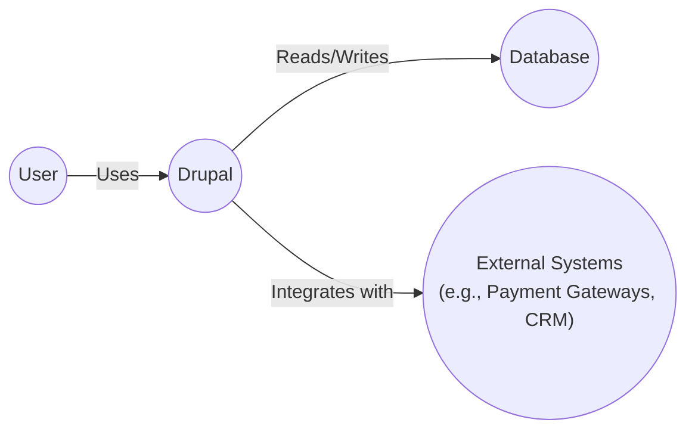
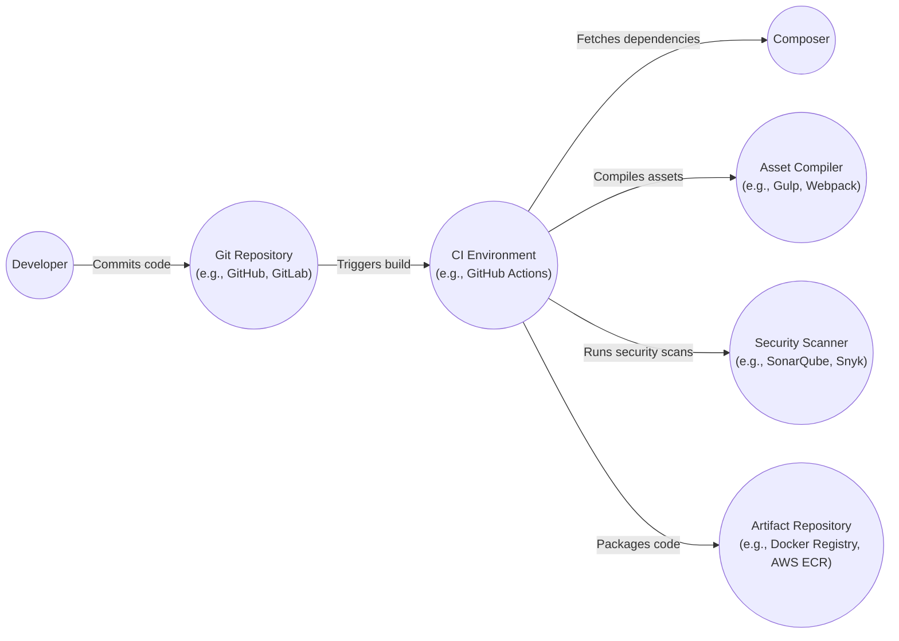

# BUSINESS POSTURE

Drupal is a well-established, open-source content management system (CMS) used by a wide range of organizations, from small businesses to large enterprises and government entities. The business priorities and goals for Drupal as a project and platform include:

*   Maintainability: Ensuring the codebase is easy to maintain and update over time.
*   Extensibility: Allowing developers to easily extend and customize the platform through modules and themes.
*   Community: Fostering a strong and active community of contributors and users.
*   Adoption: Encouraging widespread adoption of Drupal across various sectors.
*   Security: Providing a secure platform for building and managing websites.
*   Performance: Delivering fast and efficient website performance.
*   Accessibility: Making Drupal accessible to users with disabilities.
*   Usability: Providing a user-friendly interface for content creators and administrators.

Business risks that need to be addressed, based on these priorities and goals:

*   Security vulnerabilities in core or contributed modules could lead to website compromises, data breaches, and reputational damage.
*   Lack of maintainability could make it difficult to address security vulnerabilities and keep the platform up-to-date.
*   Poor performance could lead to user dissatisfaction and loss of traffic.
*   Lack of accessibility could exclude users with disabilities and lead to legal issues.
*   A decline in community engagement could slow down development and innovation.
*   Competition from other CMS platforms could lead to a loss of market share.

# SECURITY POSTURE

Drupal has a mature security posture with a dedicated security team and well-defined processes for handling vulnerabilities.

Existing security controls:

*   security control: A dedicated security team responsible for identifying, addressing, and disclosing security vulnerabilities.
*   security control: A well-defined security release process, including security advisories and regular security updates. Described: Drupal Security Team documentation.
*   security control: Coding standards and best practices to minimize security risks. Described: Drupal Coding Standards.
*   security control: Input validation and output encoding to prevent cross-site scripting (XSS) and other injection attacks. Described: Drupal API documentation.
*   security control: Access control mechanisms to restrict access to sensitive data and functionality. Described: Drupal User Permissions documentation.
*   security control: Password hashing and storage mechanisms to protect user credentials. Described: Drupal API documentation.
*   security control: Protection against common web vulnerabilities, such as SQL injection, cross-site request forgery (CSRF), and session management issues. Described: Drupal API documentation and security advisories.
*   security control: A robust update system to ensure that security patches are applied promptly. Described: Drupal Update Manager documentation.
*   security control: Extensive documentation and community support to help users implement security best practices. Described: Drupal Security Best Practices documentation.

Accepted risks:

*   accepted risk: The reliance on contributed modules and themes introduces a risk of vulnerabilities in third-party code. While the security team reviews contributed modules, they cannot guarantee the security of all code.
*   accepted risk: The complexity of the platform can make it challenging for users to configure and maintain it securely.
*   accepted risk: Zero-day vulnerabilities may exist and could be exploited before patches are available.

Recommended security controls:

*   Implement a Web Application Firewall (WAF) to provide an additional layer of protection against common web attacks.
*   Regularly conduct security audits and penetration testing to identify and address potential vulnerabilities.
*   Implement a Content Security Policy (CSP) to mitigate the risk of XSS attacks.
*   Implement Subresource Integrity (SRI) to ensure that loaded resources haven't been tampered with.

Security Requirements:

*   Authentication:
    *   Strong password policies.
    *   Support for multi-factor authentication (MFA).
    *   Secure session management.
*   Authorization:
    *   Granular access control based on roles and permissions.
    *   Principle of least privilege.
*   Input Validation:
    *   Strict validation of all user inputs.
    *   Whitelist validation where possible.
    *   Output encoding to prevent XSS.
*   Cryptography:
    *   Use of strong, industry-standard cryptographic algorithms.
    *   Secure storage of cryptographic keys.
    *   Proper implementation of HTTPS.

# DESIGN

## C4 CONTEXT



Element Descriptions:

*   Element:
    *   Name: User
    *   Type: Person
    *   Description: Represents a user interacting with the Drupal website. This could be a content editor, administrator, or a visitor browsing the site.
    *   Responsibilities: Accessing and interacting with the website content, managing content (for editors and administrators).
    *   Security controls: Authentication, authorization, session management.

*   Element:
    *   Name: Drupal
    *   Type: Software System
    *   Description: The Drupal content management system.
    *   Responsibilities: Managing content, users, and website functionality. Rendering web pages. Handling user requests.
    *   Security controls: Input validation, output encoding, access control, password hashing, protection against common web vulnerabilities.

*   Element:
    *   Name: External Systems
    *   Type: Software System
    *   Description: Represents external systems that Drupal might interact with, such as payment gateways, CRM systems, or other APIs.
    *   Responsibilities: Providing specific services or data to Drupal.
    *   Security controls: Secure communication protocols (HTTPS), API authentication and authorization.

*   Element:
    *   Name: Database
    *   Type: Software System
    *   Description: The database used by Drupal to store content, user data, and configuration.
    *   Responsibilities: Storing and retrieving data.
    *   Security controls: Database access control, encryption at rest, regular backups.

## C4 CONTAINER

```mermaid
graph LR
    User(("User"))
    WebServer(("Web Server\n(e.g., Apache, Nginx)"))
    PHPRuntime(("PHP Runtime"))
    DrupalCore(("Drupal Core"))
    ContributedModules(("Contributed Modules"))
    Themes(("Themes"))
    Database(("Database"))
    ExternalSystems(("External Systems"))

    User -- "HTTPS" --> WebServer
    WebServer -- "PHP" --> PHPRuntime
    PHPRuntime -- "" --> DrupalCore
    PHPRuntime -- "" --> ContributedModules
    PHPRuntime -- "" --> Themes
    DrupalCore -- "SQL" --> Database
    ContributedModules -- "SQL" --> Database
    DrupalCore -- "API Calls" --> ExternalSystems
    ContributedModules -- "API Calls" --> ExternalSystems
```

Element Descriptions:

*   Element:
    *   Name: User
    *   Type: Person
    *   Description: Represents a user interacting with the Drupal website.
    *   Responsibilities: Accessing and interacting with the website content.
    *   Security controls: Authentication, authorization, session management.

*   Element:
    *   Name: Web Server
    *   Type: Container
    *   Description: The web server (e.g., Apache, Nginx) that receives requests from users and forwards them to the PHP runtime.
    *   Responsibilities: Handling HTTP requests, serving static files, and routing requests to the appropriate PHP handler.
    *   Security controls: Web server configuration hardening, HTTPS configuration, WAF (if applicable).

*   Element:
    *   Name: PHP Runtime
    *   Type: Container
    *   Description: The PHP runtime environment that executes Drupal's PHP code.
    *   Responsibilities: Executing PHP code, managing memory, and interacting with the web server.
    *   Security controls: Secure PHP configuration, disabling unnecessary functions, regular updates.

*   Element:
    *   Name: Drupal Core
    *   Type: Container
    *   Description: The core components of Drupal, including the core modules and libraries.
    *   Responsibilities: Providing the base functionality of the CMS, including content management, user management, and system administration.
    *   Security controls: Input validation, output encoding, access control, password hashing, protection against common web vulnerabilities.

*   Element:
    *   Name: Contributed Modules
    *   Type: Container
    *   Description: Modules developed by the Drupal community to extend the functionality of Drupal core.
    *   Responsibilities: Providing additional features and functionality.
    *   Security controls: Adherence to Drupal coding standards, security reviews (ideally), regular updates.

*   Element:
    *   Name: Themes
    *   Type: Container
    *   Description: Templates and stylesheets that control the visual appearance of the Drupal website.
    *   Responsibilities: Defining the look and feel of the website.
    *   Security controls: Secure coding practices to prevent XSS vulnerabilities, regular updates.

*   Element:
    *   Name: Database
    *   Type: Container
    *   Description: The database used by Drupal to store content, user data, and configuration.
    *   Responsibilities: Storing and retrieving data.
    *   Security controls: Database access control, encryption at rest, regular backups.

*   Element:
    *   Name: External Systems
    *   Type: Software System
    *   Description: Represents external systems that Drupal might interact with.
    *   Responsibilities: Providing specific services or data to Drupal.
    *   Security controls: Secure communication protocols (HTTPS), API authentication and authorization.

## DEPLOYMENT

Drupal can be deployed in various ways, including:

1.  Traditional hosting: Deploying Drupal on a single server or a cluster of servers managed by the user.
2.  Cloud hosting: Deploying Drupal on a cloud platform like AWS, Azure, or Google Cloud Platform, using services like virtual machines, containers, or platform-as-a-service (PaaS) offerings.
3.  Managed hosting: Using a specialized Drupal hosting provider that manages the infrastructure and provides support.

Chosen deployment solution: Cloud hosting using Kubernetes on AWS.

```mermaid
graph LR
    Internet(("Internet"))
    AWSRegion(("AWS Region"))
    VPC(("VPC"))
    PublicSubnet(("Public Subnet"))
    PrivateSubnet(("Private Subnet"))
    LoadBalancer(("Load Balancer\n(ELB)"))
    AutoScalingGroup(("Auto Scaling Group\n(ASG)"))
    EKS(("Amazon EKS\n(Kubernetes)"))
    WorkerNodes(("Worker Nodes"))
    DrupalPods(("Drupal Pods"))
    RDS(("Amazon RDS\n(MySQL)"))
    EFSElasticFileSystem(("Amazon EFS"))

    Internet -- "HTTPS" --> LoadBalancer
    LoadBalancer -- "" --> AutoScalingGroup
    AutoScalingGroup -- "" --> EKS
    EKS -- "" --> WorkerNodes
    WorkerNodes -- "" --> DrupalPods
    DrupalPods -- "SQL" --> RDS
    DrupalPods -- "Mount" --> EFSElasticFileSystem
    LoadBalancer -..-> VPC
    AutoScalingGroup -..-> VPC
    EKS -..-> VPC
    WorkerNodes -..-> VPC
    DrupalPods -..-> PrivateSubnet
    RDS -..-> PrivateSubnet
    EFSElasticFileSystem -..-> PrivateSubnet
    LoadBalancer -..-> PublicSubnet
```

Element Descriptions:

*   Element:
    *   Name: Internet
    *   Type: External
    *   Description: The public internet.
    *   Responsibilities: Routing traffic to the load balancer.
    *   Security controls: Network firewalls, DDoS protection.

*   Element:
    *   Name: AWS Region
    *   Type: Deployment Environment
    *   Description: The AWS region where the infrastructure is deployed.
    *   Responsibilities: Providing the physical infrastructure for the deployment.
    *   Security controls: AWS security best practices, compliance certifications.

*   Element:
    *   Name: VPC
    *   Type: Network
    *   Description: Amazon Virtual Private Cloud, a logically isolated section of the AWS Cloud.
    *   Responsibilities: Providing a private network for the Drupal deployment.
    *   Security controls: Network ACLs, security groups.

*   Element:
    *   Name: Public Subnet
    *   Type: Network
    *   Description: A subnet that has a route to the internet gateway.
    *   Responsibilities: Hosting the load balancer.
    *   Security controls: Network ACLs, security groups.

*   Element:
    *   Name: Private Subnet
    *   Type: Network
    *   Description: A subnet that does not have a route to the internet gateway.
    *   Responsibilities: Hosting the Drupal pods and the database.
    *   Security controls: Network ACLs, security groups.

*   Element:
    *   Name: Load Balancer (ELB)
    *   Type: Infrastructure
    *   Description: Elastic Load Balancer, distributes incoming traffic across multiple targets.
    *   Responsibilities: Distributing traffic to the Drupal pods, providing high availability.
    *   Security controls: HTTPS termination, SSL/TLS certificates.

*   Element:
    *   Name: Auto Scaling Group (ASG)
    *   Type: Infrastructure
    *   Description: Ensures that the desired number of EC2 instances are running.
    *   Responsibilities: Scaling the number of worker nodes based on demand.
    *   Security controls: IAM roles, security groups.

*   Element:
    *   Name: Amazon EKS (Kubernetes)
    *   Type: Container Orchestration
    *   Description: Managed Kubernetes service.
    *   Responsibilities: Managing the Drupal containers.
    *   Security controls: Kubernetes RBAC, network policies, pod security policies.

*   Element:
    *   Name: Worker Nodes
    *   Type: Infrastructure
    *   Description: EC2 instances that run the Drupal pods.
    *   Responsibilities: Running the Drupal containers.
    *   Security controls: IAM roles, security groups, regular patching.

*   Element:
    *   Name: Drupal Pods
    *   Type: Container
    *   Description: Kubernetes pods running the Drupal containers.
    *   Responsibilities: Running the Drupal application.
    *   Security controls: Container image security scanning, resource limits.

*   Element:
    *   Name: Amazon RDS (MySQL)
    *   Type: Database
    *   Description: Managed MySQL database service.
    *   Responsibilities: Storing and retrieving Drupal data.
    *   Security controls: Database access control, encryption at rest, regular backups, automated patching.

*   Element:
    *   Name: Amazon EFS
    *   Type: Storage
    *   Description: Shared file storage for Drupal.
    *   Responsibilities: Storing files that need to be shared across multiple Drupal pods (e.g., uploaded files).
    *   Security controls: Network file system (NFS) access control, encryption at rest.

## BUILD

Drupal's build process typically involves managing dependencies, compiling assets, and packaging the code for deployment. While Drupal core itself doesn't have a traditional "build" process in the same way as compiled languages, contributed modules and themes often do.  A common approach is to use Composer for dependency management and a task runner like Gulp or Webpack for asset compilation.  Continuous Integration (CI) systems like GitHub Actions, GitLab CI, or Jenkins are often used to automate these processes.



Build Process Description:

1.  Developers commit code changes to a Git repository (e.g., GitHub, GitLab).
2.  The commit triggers a build process in a CI environment (e.g., GitHub Actions, Jenkins).
3.  The CI environment fetches dependencies using Composer.
4.  The CI environment compiles assets (e.g., CSS, JavaScript) using an asset compiler (e.g., Gulp, Webpack).
5.  The CI environment runs security scans on the codebase and dependencies using tools like SonarQube or Snyk.
6.  If all checks pass, the CI environment packages the code and any build artifacts (e.g., Docker images) and pushes them to an artifact repository (e.g., Docker Registry, AWS ECR).

Security Controls:

*   Dependency management with Composer, including checking for known vulnerabilities in dependencies.
*   Static Application Security Testing (SAST) using tools like SonarQube to identify code vulnerabilities.
*   Software Composition Analysis (SCA) using tools like Snyk to identify vulnerabilities in third-party libraries.
*   Container image security scanning (if applicable) to identify vulnerabilities in Docker images.
*   Automated build process to ensure consistency and repeatability.
*   Use of signed commits to verify the integrity of code changes.
*   Least privilege access control for CI/CD pipelines.

# RISK ASSESSMENT

Critical Business Processes:

*   Content delivery and presentation: Ensuring that website content is accessible to users.
*   Content creation and management: Enabling content editors and administrators to create, edit, and publish content.
*   User management: Managing user accounts and access control.
*   E-commerce (if applicable): Processing transactions and managing customer data.
*   Community features (if applicable): Facilitating user interaction and engagement.

Data to Protect and Sensitivity:

*   User data (e.g., usernames, email addresses, passwords): Sensitive, subject to privacy regulations (e.g., GDPR, CCPA).
*   Content data (e.g., articles, pages, comments): Varies in sensitivity, may include confidential or proprietary information.
*   Configuration data (e.g., database credentials, API keys): Highly sensitive, must be protected from unauthorized access.
*   Financial data (if applicable, e.g., credit card numbers, transaction details): Highly sensitive, subject to PCI DSS compliance.
*   Personal data (if applicable): Sensitive, subject to privacy regulations.

# QUESTIONS & ASSUMPTIONS

Questions:

*   What specific contributed modules and themes are being used? This is crucial for assessing the overall security posture, as third-party code is a significant risk factor.
*   What is the specific deployment environment? (e.g., specific cloud provider, hosting configuration). This is needed for a more detailed deployment diagram and security recommendations.
*   Are there any specific compliance requirements (e.g., HIPAA, PCI DSS)?
*   What is the expected traffic volume and performance requirements?
*   Are there any integrations with external systems? If so, what are the security considerations for those integrations?
*   What is the process for managing and applying security updates?
*   What is the disaster recovery plan?

Assumptions:

*   BUSINESS POSTURE: The primary goal is to maintain a secure, stable, and performant website.
*   SECURITY POSTURE: Drupal core is kept up-to-date with the latest security patches.  Basic security best practices are followed (e.g., strong passwords, regular backups).
*   DESIGN: A standard Drupal installation is used, with a MySQL database.  The deployment environment is a cloud-based infrastructure.  Composer is used for dependency management.