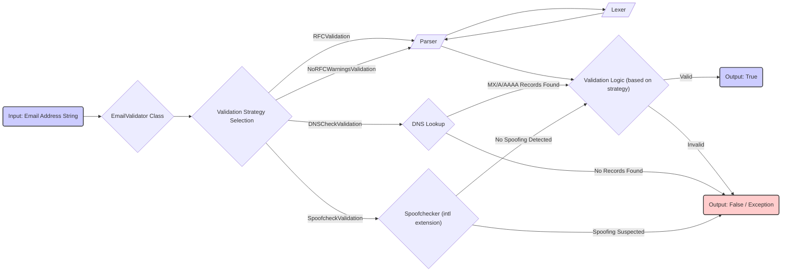

# Project Design Document: EmailValidator Library

**Version:** 1.1
**Date:** October 26, 2023
**Author:** Gemini (AI Language Model)

## 1. Introduction

This document provides an enhanced and more detailed design overview of the `EmailValidator` library (available at [https://github.com/egulias/EmailValidator](https://github.com/egulias/EmailValidator)). This revised document aims to provide a more robust foundation for subsequent threat modeling activities by offering a deeper understanding of the library's internal workings, data flow, and potential security considerations.

## 2. Project Overview

The `EmailValidator` library is a PHP library dedicated to the crucial task of validating email addresses. It goes beyond simple pattern matching, offering validation against various RFC specifications and accommodating common, real-world email address formats. The library provides a range of validation strategies, from basic syntax checks to more rigorous verifications involving DNS lookups and spoof detection. Its primary purpose is to be integrated into PHP applications to ensure the integrity of user-provided email addresses, thereby mitigating data entry errors, improving data quality, and preventing potential security vulnerabilities.

## 3. System Architecture

The `EmailValidator` library employs a modular architecture centered around a core parsing and validation mechanism, with distinct components responsible for specific aspects of the validation process.

### 3.1. Components

*   **`EmailValidator\Parser\Parser`:**
    *   The central component responsible for dissecting the input email address string.
    *   Implements a state machine to methodically analyze the email structure, identifying different parts like the local part, domain, and subdomains.
    *   Handles complex email address syntax, including quoted strings, escaped characters, and comments.
    *   Relies on the `Lexer` to provide a stream of tokens.
    *   Key methods include parsing the local part and domain.
*   **`EmailValidator\Lexer\Lexer`:**
    *   The lexical analyzer that breaks down the raw email address string into a sequence of meaningful tokens.
    *   Identifies elements like atoms, dot separators, at signs, and quoted strings.
    *   Provides the `Parser` with a structured representation of the email address.
    *   Maintains the current state and position within the email string.
*   **`EmailValidator\Validation\Validation` Interface:**
    *   Defines the blueprint for different email validation strategies.
    *   Ensures that all validation methods adhere to a common interface, promoting flexibility and extensibility.
    *   The core method is typically a `isValid(string $email, ValidationResult $result): bool` or similar, indicating the validity of the email.
*   **Concrete `Validation` Implementations:**
    *   **`EmailValidator\Validation\RFCValidation`:** Enforces strict adherence to RFC specifications (e.g., RFC 5322), rejecting emails that deviate from these standards.
    *   **`EmailValidator\Validation\NoRFCWarningsValidation`:** Offers a more lenient validation, accepting some email formats that might be considered obsolete or non-standard by strict RFC interpretations but are commonly used.
    *   **`EmailValidator\Validation\SpoofcheckValidation`:** Detects potential email address spoofing attempts, particularly those involving internationalized domain names (IDNs) that might visually resemble legitimate ASCII characters. This component relies on the `intl` PHP extension for Unicode processing.
    *   **`EmailValidator\Validation\DNSCheckValidation`:** Performs live DNS queries to verify the existence of the email domain. It checks for MX records (indicating mail servers) and A/AAAA records (resolving the domain to an IP address). This introduces network dependencies and potential latency.
    *   **`EmailValidator\Validation\MultipleValidation`:** A composite validator that allows combining multiple validation strategies. This enables applying a series of checks, for example, first performing a basic RFC validation and then a DNS check.
*   **`EmailValidator\EmailLexer` (Potentially Present in Older Versions):**
    *   An earlier implementation of the lexer. Understanding its functionality might be relevant for analyzing the security of older versions of the library.
*   **Exception Classes (e.g., `InvalidEmail`, `ParsingFailure`):**
    *   Used to signal errors during the parsing or validation process. These exceptions provide information about the specific reason for the failure.

### 3.2. Data Flow

**Detailed Data Flow Description:**

1. The process begins when an application provides an **"Input: Email Address String"** (Node A) to the `EmailValidator` class (Node B).
2. The `EmailValidator` class (Node B) determines the **"Validation Strategy Selection"** (Node C) to be used, based on the application's configuration or the specific validation method called.
3. Depending on the selected strategy:
    *   For **"RFCValidation"** or **"NoRFCWarningsValidation"**, the email string is passed to the **"Parser"** (Node D).
    *   For **"SpoofcheckValidation"**, the email is sent to the **"Spoofchecker (intl extension)"** (Node E).
    *   For **"DNSCheckValidation"**, a **"DNS Lookup"** (Node F) is initiated.
4. The **"Parser"** (Node D) utilizes the **"Lexer"** (Node G) to tokenize the email string. The **"Lexer"** breaks the string into meaningful units, which are then consumed by the **"Parser"**. This is a cyclical process where the **"Lexer"** feeds tokens back to the **"Parser"**.
5. The **"Parser"** (Node D) applies the core **"Validation Logic (based on strategy)"** (Node H), checking the structure and syntax of the email address according to the selected RFC rules or relaxed criteria.
6. The **"Spoofchecker (intl extension)"** (Node E) analyzes the domain part of the email address to detect potential spoofing attempts using Unicode characters. If **"Spoofing Suspected"**, the flow goes to **"Output: False / Exception"** (Node J). Otherwise, it proceeds to the general **"Validation Logic"** (Node H).
7. The **"DNS Lookup"** (Node F) queries DNS servers for MX and A/AAAA records associated with the email's domain. If **"MX/A/AAAA Records Found"**, it indicates a valid domain, and the flow proceeds to the **"Validation Logic"** (Node H). If **"No Records Found"**, the flow goes to **"Output: False / Exception"** (Node J).
8. The **"Validation Logic"** (Node H) determines if the email is valid based on all applied checks.
9. Finally, the process results in either **"Output: True"** (Node I) if the email is valid, or **"Output: False / Exception"** (Node J) if the email is invalid or an error occurred during parsing or validation.

### 3.3. Dependencies

*   **PHP Core:** The library relies on standard PHP functionalities available in most installations.
*   **`intl` Extension (Conditional):** The `SpoofcheckValidation` component necessitates the `intl` PHP extension to be enabled for its spoof detection capabilities. If this extension is not available, this specific validation strategy will not function.
*   **Network Connectivity (Conditional):** The `DNSCheckValidation` component requires the PHP environment to have network access to perform DNS queries. Firewalls or network restrictions could prevent this validation strategy from working correctly.

## 4. Security Considerations

This section details potential security considerations relevant to the `EmailValidator` library, providing a more granular view for threat modeling.

*   **Regular Expression Denial of Service (ReDoS):** The `Parser` component likely utilizes regular expressions for pattern matching. Complex or poorly optimized regular expressions could be vulnerable to ReDoS attacks. An attacker could provide specially crafted, long email addresses that cause the regex engine to backtrack excessively, leading to high CPU consumption and potential denial of service. *Example: An email with deeply nested comments or excessive repetition of certain characters might trigger this.*
*   **Input Sanitization and Encoding Issues:** While primarily focused on validation, the library's handling of various character encodings and potentially malicious characters within the email address string is crucial. Improper handling could lead to vulnerabilities if the validated email is later used in other parts of the application. *Example: Failure to properly handle null bytes or control characters could lead to unexpected behavior in downstream systems.*
*   **DNS Lookup Vulnerabilities (with `DNSCheckValidation`):**
    *   **DNS Spoofing:** If the application using `DNSCheckValidation` does not implement DNSSEC validation, it could be susceptible to DNS spoofing attacks. An attacker could manipulate DNS responses to make the library believe a non-existent domain is valid.
    *   **Denial of Service (Amplification):** An attacker could potentially trigger a large number of DNS lookups by providing numerous requests with different email domains, potentially causing a DoS on the application or the targeted DNS servers. This is especially concerning if the application doesn't implement rate limiting.
    *   **Information Disclosure:** The DNS queries themselves might reveal information about the application's infrastructure or the domains being validated.
*   **`intl` Extension Vulnerabilities (with `SpoofcheckValidation`):** If the `SpoofcheckValidation` is employed, any vulnerabilities present in the underlying `intl` PHP extension could directly impact the security of the application. This includes potential bugs in Unicode handling or spoof detection algorithms.
*   **Bypass Vulnerabilities:** Attackers might attempt to craft email addresses that exploit subtle differences between the library's validation logic and the acceptance criteria of downstream systems (e.g., mail servers). Understanding the specific validation level used is critical. *Example: An email with unusual but technically valid syntax might pass a lenient validation but be rejected by a stricter mail server.*
*   **Error Handling and Information Disclosure:** Verbose error messages or stack traces generated by the library during validation failures could inadvertently reveal sensitive information about the application's internal workings to potential attackers.
*   **Dependency Chain Vulnerabilities:** While the library has few direct dependencies, vulnerabilities in the PHP core or the `intl` extension (if used) could indirectly affect the library's security. Keeping these dependencies updated is essential.

## 5. Deployment Considerations

The `EmailValidator` library is typically integrated into PHP applications as a dependency, with its usage varying depending on the application's architecture and requirements.

*   **Web Applications (Most Common):** Used extensively in web applications to validate user input in forms (registration, contact forms, etc.), during account creation, and in data processing pipelines.
*   **Command-Line Interface (CLI) Tools:** Can be incorporated into CLI scripts that process email addresses from files or user input.
*   **Microservices:** In microservice architectures, the library can be used within individual services responsible for handling user data or communication.
*   **Integration with PHP Frameworks:** Commonly used within popular PHP frameworks like Symfony, Laravel, and others, often integrated through service providers or dependency injection containers.
*   **Email Marketing Platforms:** Used to validate recipient email addresses before sending campaigns.

The specific deployment context significantly influences the potential attack vectors and the impact of vulnerabilities. For instance, in a public-facing web application, vulnerabilities could be exploited by malicious users, while in an internal microservice, the risk might be lower but still present.

## 6. Future Considerations

*   **Regular Security Audits and Penetration Testing:** Conducting regular security assessments, including penetration testing, is crucial to proactively identify and address potential vulnerabilities in the library's code and logic.
*   **Integration of Static Analysis Tools:** Employing static analysis tools can help identify potential code flaws, including those related to regular expressions and input handling.
*   **Dependency Scanning:** Regularly scanning the library's dependencies (including the PHP core and `intl` extension) for known vulnerabilities is essential.
*   **Performance Benchmarking and Optimization:** Continuously monitoring and optimizing the performance of the parsing and validation logic, especially concerning regular expressions, is important for preventing DoS attacks.
*   **Enhanced Documentation on Security Best Practices:** Providing clear guidance to users on how to use the library securely, including recommendations on choosing appropriate validation levels and handling potential errors, is crucial.
*   **Staying Up-to-Date with RFC Standards:** Continuously monitoring and incorporating updates to relevant RFC specifications related to email addresses is necessary to maintain accuracy and prevent bypass vulnerabilities.

This enhanced design document provides a more in-depth understanding of the `EmailValidator` library, offering a stronger foundation for comprehensive threat modeling and security analysis.