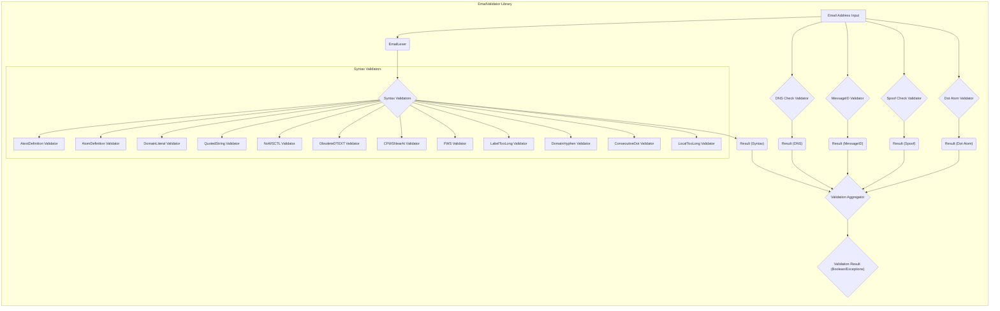

## Project Design Document: EmailValidator Library (Improved)

**1. Introduction**

This document provides an enhanced design overview of the `egulias/emailvalidator` library, a PHP library dedicated to robustly validating email addresses against a comprehensive set of RFC specifications and practical considerations. This detailed design serves as a critical foundation for subsequent threat modeling activities, enabling a thorough assessment of potential security vulnerabilities.

**2. Goals**

* To present a clear and detailed explanation of the `emailvalidator` library's internal structure and operation.
* To meticulously describe the library's architecture, highlighting key components and their interactions.
* To elucidate the complete data flow within the library during the email validation process.
* To provide concrete examples of how the library integrates with various application types.
* To establish a solid basis for identifying and analyzing potential security threats through structured threat modeling techniques.

**3. Scope**

This document specifically focuses on the internal design and functionality of the `egulias/emailvalidator` library. The scope explicitly excludes:

* The design and architecture of applications that consume or integrate with this library.
* Granular implementation details of individual validation rules or specific code implementations within the library.
* The historical evolution of the library's codebase or specific versioning details.
* Deployment procedures or infrastructure considerations for applications utilizing the library.
* Performance benchmarking or optimization strategies for the library.

**4. Architectural Overview**

The `emailvalidator` library employs a modular and extensible architecture centered around the `EmailValidator` class, which acts as the primary orchestrator of the validation workflow. The core validation logic is distributed across a range of specialized validators and configurable validation strategies, allowing for flexible and comprehensive email address verification.

**5. Key Components**

* **`EmailValidator`:** The central coordinating class. It receives the email address string as input and, based on the selected validation strategy, orchestrates the execution of relevant validators. It ultimately returns a boolean indicating validity or throws an exception upon validation failure.
* **`EmailLexer`:** This component is responsible for the lexical analysis of the email address string. It breaks down the input into a stream of tokens representing the different parts of the email address (e.g., local part, `@` symbol, domain part, dots, etc.). This tokenization is a prerequisite for subsequent syntactic validation.
* **Syntax Validators:** A diverse set of individual validators, each responsible for verifying specific aspects of the email address syntax according to RFC specifications. These validators work on the token stream produced by the `EmailLexer`. Examples include:
    * `AtextDefinition Validator`: Checks if characters conform to the `atext` definition (alphanumeric and certain symbols).
    * `AtomDefinition Validator`: Validates the structure of "atoms" (sequences of `atext` characters).
    * `DomainLiteral Validator`: Verifies the correctness of domain literals (IP addresses enclosed in square brackets).
    * `QuotedString Validator`: Validates the syntax of quoted strings within the local part.
    * `NoWSCTL Validator`: Checks for the presence of control characters (disallowed in certain parts).
    * `ObsoleteDTEXT Validator`: Detects obsolete domain text.
    * `CFWSNearAt Validator`: Checks for comments or whitespace near the "@" symbol.
    * `FWS Validator`: Validates folding whitespace.
    * `LabelTooLong Validator`: Ensures individual domain labels do not exceed the maximum length.
    * `DomainHyphen Validator`: Checks for hyphens at the beginning or end of domain labels.
    * `ConsecutiveDot Validator`: Detects consecutive dots in the domain part.
    * `LocalTooLong Validator`: Checks if the local part exceeds the maximum allowed length.
* **DNS Check Validator:** This validator performs Domain Name System (DNS) lookups to verify the existence and mail exchange capabilities of the domain part of the email address. It typically checks for MX records and may fall back to A/AAAA records.
* **MessageID Validator:** A specialized validator that enforces the stricter requirements for email addresses used as Message-IDs, as defined in relevant RFCs.
* **Spoof Check Validator:** This component attempts to detect potential email address spoofing by identifying visually similar characters from different scripts (e.g., Cyrillic 'а' vs. Latin 'a').
* **Dot Atom Validator:** Specifically validates email addresses that adhere to the "dot-atom" format, a common and widely accepted structure.
* **Validation Strategies:**  These define pre-configured sets of validators to be executed. They allow users to select different levels of validation rigor. The library offers several built-in strategies:
    * `RFCValidation`: Enforces strict adherence to relevant RFC specifications.
    * `NoRFCWarningsValidation`: Performs RFC validation but treats warnings as passing conditions, not throwing exceptions for them.
    * `SpoofCheckValidation`: Includes the `Spoof Check Validator` in the validation process.
    * `MessageIDValidation`:  Utilizes the `MessageID Validator` for Message-ID specific validation.
* **Exceptions:** The library uses exceptions to signal validation failures, providing specific exception types and messages that indicate the reason for the invalidity. This allows integrating applications to handle validation errors in a structured manner.

**6. Data Flow**

The process of validating an email address within the `emailvalidator` library follows these steps:

1. An email address string is provided as input to either the `EmailValidator::isValid()` method (which returns a boolean) or the `EmailValidator::validate()` method (which throws an exception on failure).
2. The `EmailLexer` receives the input string and performs lexical analysis, breaking it down into a sequence of tokens representing the email address's components.
3. Based on the validation strategy selected (either explicitly or by default), the `EmailValidator` determines the set of validators to execute.
4. The token stream from the `EmailLexer` is passed to the relevant Syntax Validators. Each validator checks for specific syntactic rules violations.
5. If the selected strategy includes DNS checks, the DNS Check Validator performs DNS lookups for the domain part of the email address.
6. If the selected strategy includes spoof checks, the Spoof Check Validator analyzes the email address for potential character spoofing.
7. The MessageID Validator is invoked if the `MessageIDValidation` strategy is used.
8. Each executed validator returns a result (success or failure).
9. The `Validation Aggregator` within the `EmailValidator` collects the results from all executed validators.
10. If all validators pass, `EmailValidator::isValid()` returns `true`, and `EmailValidator::validate()` completes without throwing an exception.
11. If any validator fails, `EmailValidator::isValid()` returns `false`, and `EmailValidator::validate()` throws a specific exception detailing the validation error encountered.

**7. Integration Points**

The `emailvalidator` library is designed for seamless integration into a wide array of PHP applications and systems requiring robust email address validation. Common integration scenarios include:

* **Web Application User Input Validation:**  Validating email addresses entered by users in registration forms, login forms, contact forms, profile updates, and other data submission points within web applications. This is a crucial step in preventing malformed data and potential security issues.
* **REST API Request Validation:**  Verifying the format and validity of email addresses submitted as parameters in API requests. This ensures data integrity and prevents backend processing of invalid data.
* **Command-Line Interface (CLI) Tools:** Validating email addresses provided as command-line arguments or input to CLI scripts that process or interact with email data.
* **Email Marketing and Communication Platforms:**  Validating recipient email lists before sending out marketing campaigns or transactional emails. This improves deliverability rates, reduces bounce rates, and helps maintain sender reputation.
* **Data Import and Processing Pipelines:**  Validating email addresses within datasets during data import, cleaning, transformation, or migration processes. This ensures data quality and consistency.
* **User Authentication and Authorization Systems:**  Validating email addresses during user registration and account creation processes.
* **Content Management Systems (CMS):** Validating email addresses associated with user accounts, comments, or contact forms within CMS platforms.

**8. Security Considerations (Pre-Threat Modeling)**

Prior to formal threat modeling, several security considerations are apparent based on the library's design and functionality:

* **Input Validation as a Security Control:** The library's core purpose is to perform input validation, which is a fundamental security control. Proper validation helps prevent various attack vectors, including:
    * **Injection Attacks (e.g., Command Injection, SQL Injection):** By ensuring email addresses conform to expected formats, the library can prevent attackers from injecting malicious code through email fields that might be processed by backend systems.
    * **Cross-Site Scripting (XSS):** While less direct, validating email formats can prevent the storage of malformed data that could later be displayed without proper sanitization, potentially leading to XSS vulnerabilities.
    * **Data Integrity Violations:**  Validation ensures that email addresses stored in databases or used in other systems are in a consistent and valid format, maintaining data integrity.
    * **Denial of Service (DoS):** Robust parsing and validation logic can help prevent DoS attacks that might exploit vulnerabilities in how the application handles malformed email addresses.
* **Risks Associated with DNS Lookups:** The DNS Check Validator relies on external DNS servers, introducing potential security risks:
    * **DNS Spoofing/Cache Poisoning:** If the DNS resolution process is compromised, the validator might incorrectly validate email addresses associated with malicious domains. This could lead to accepting emails from illegitimate sources.
    * **Man-in-the-Middle (MITM) Attacks:**  If the communication between the validator and DNS servers is not secured, an attacker could intercept and modify DNS responses.
    * **Performance and Availability Issues:**  Excessive or poorly managed DNS lookups can impact application performance and potentially lead to temporary unavailability if DNS servers are overloaded or unresponsive.
* **Effectiveness of Spoof Detection:** The Spoof Check Validator attempts to mitigate email spoofing, but its effectiveness is limited by:
    * **Character Coverage:** The mapping of visually similar characters might not be exhaustive, potentially missing some spoofing attempts.
    * **New Spoofing Techniques:** Attackers may develop new spoofing techniques that are not yet accounted for by the validator.
    * **False Positives:**  Legitimate email addresses might be flagged as potential spoofs due to the presence of certain characters.
* **Importance of Exception Handling:** Applications integrating the library must implement proper exception handling for validation failures. Failure to do so can lead to:
    * **Information Disclosure:**  Error messages might reveal sensitive information about the application's internal workings.
    * **Unexpected Application Behavior:** Unhandled exceptions can cause application crashes or unpredictable behavior.
    * **Security Vulnerabilities:**  In some cases, unhandled exceptions could be exploited by attackers.

**9. Technologies Used**

* **Primary Programming Language:** PHP
* **Adherence to Standards:** The library implements validation rules based on various Internet Engineering Task Force (IETF) Request for Comments (RFC) specifications related to email address formats (e.g., RFC 5322, RFC 6531, and others).

**10. Deployment Considerations**

As a library, `emailvalidator` is typically deployed by including it as a dependency within a PHP project, commonly managed using Composer. Deployment considerations primarily focus on the integrating application:

* **Resource Management:**  Be mindful of the resource consumption associated with DNS lookups, especially in high-volume applications. Consider caching DNS results to reduce latency and load on DNS servers.
* **Error Handling and User Feedback:** Implement clear and informative error handling to guide users when they enter invalid email addresses. Avoid exposing technical details in error messages.
* **Configuration and Customization:**  Understand the library's configuration options to tailor the validation behavior to the specific requirements of the application. Choose appropriate validation strategies based on the desired level of rigor.
* **Security Updates:** Regularly update the `emailvalidator` library to benefit from bug fixes and security patches.
* **Logging and Monitoring:** Implement logging to track validation attempts and failures, which can be helpful for debugging and security monitoring.

This improved design document provides a more detailed and comprehensive understanding of the `egulias/emailvalidator` library. This enhanced information will be invaluable for conducting a thorough and effective threat modeling exercise, enabling the identification and mitigation of potential security vulnerabilities.
