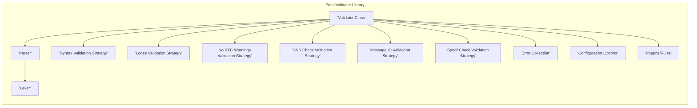
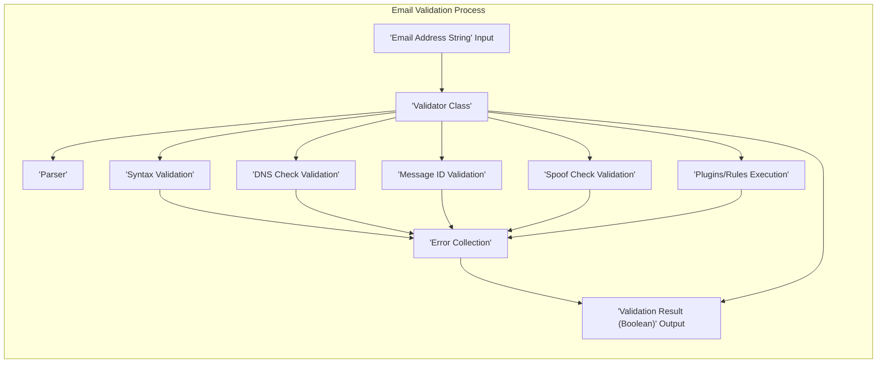

# Project Design Document: EmailValidator Library

**Version:** 1.1
**Date:** October 26, 2023
**Author:** AI Software Architect

## 1. Introduction

This document provides an enhanced and detailed design overview of the `emailvalidator` library (referenced from [https://github.com/egulias/emailvalidator](https://github.com/egulias/emailvalidator)). This revised document aims to provide a more robust foundation for subsequent threat modeling activities. It elaborates on the library's purpose, architecture, data flow, and key components, with a stronger emphasis on areas relevant to security considerations and potential attack vectors.

## 2. Goals and Scope

The primary goal of the `emailvalidator` library is to offer comprehensive and accurate email address validation adhering to various RFC specifications, established standards, and best practices. The scope of this document encompasses the core functionalities of the library, including but not limited to:

*   Rigorous syntax validation of email addresses, covering various allowed formats and edge cases.
*   DNS-based validation, including MX record lookups to verify mail server existence and optional A/AAAA record lookups for domain resolution.
*   Validation against specific, configurable formats and constraints, allowing for tailored validation rules.
*   Extensibility through a plugin system and diverse validation strategies, enabling adaptation to specific needs.
*   Support for Internationalized Domain Names (IDN).

This document focuses on the design aspects directly relevant to security analysis and threat identification. Implementation details are discussed only where they have a direct bearing on security.

## 3. Target Audience

This document is primarily intended for:

*   Security engineers and architects tasked with performing threat modeling and security assessments of systems utilizing this library.
*   Software developers contributing to the `emailvalidator` library or integrating it into their applications.
*   Technical stakeholders requiring a detailed understanding of the library's architecture and its security implications.

## 4. System Overview

The `emailvalidator` library is a PHP-based solution for validating email addresses. It employs a multi-layered validation approach, allowing developers to select the appropriate level of validation stringency for their specific requirements. The library performs fundamental syntax checks, validates against defined formats, and can optionally conduct DNS lookups to confirm the validity of the email domain. Its modular design promotes flexibility and extensibility.

## 5. Architectural Design

The library's architecture is modular, clearly separating different validation concerns into distinct, well-defined components. This separation of concerns enhances maintainability and allows for targeted security analysis of individual components. Key architectural elements include:

*   **Validator Class:** The central entry point for initiating the validation process. It acts as an orchestrator, delegating validation tasks to specific strategies based on the configured validation level.
*   **Validation Strategies:** Concrete implementations of individual validation checks. These strategies encapsulate specific validation logic. Examples include:
    *   **Syntax Validation Strategy:**  Implements checks based on email address syntax rules defined in RFCs. This may involve regular expressions or state machine-based parsing.
    *   **Loose Validation Strategy:** A less strict syntax validation, allowing for some deviations from strict RFC compliance.
    *   **No RFC Warnings Validation Strategy:**  Focuses on core syntax without flagging minor RFC violations as errors.
    *   **DNS Check Validation Strategy:** Performs DNS queries (MX, A, AAAA records) to verify the existence and reachability of the email domain's mail servers.
    *   **Message ID Validation Strategy:** Specifically designed for validating the format of email message IDs, which have different syntax requirements than regular email addresses.
    *   **Spoof Check Validation Strategy:**  Attempts to identify potential email spoofing attempts by checking for inconsistencies or suspicious patterns in the email address structure.
*   **Parser:** Responsible for dissecting the email address string into its constituent parts, such as the local part, the domain part, and any comments or display names.
    *   **Lexer:** A sub-component of the `Parser`, responsible for the lexical analysis of the email address string, breaking it down into tokens for easier processing.
*   **Error Collection:** A dedicated component for accumulating and managing validation errors encountered during the validation process. This allows for detailed reporting of validation failures.
*   **Configuration Options:**  Provide mechanisms for customizing the validation behavior, such as enabling or disabling specific validation strategies (e.g., DNS checks), setting timeouts, and configuring allowed deviations from strict RFC compliance.
*   **Plugins/Rules:** An extension mechanism allowing developers to introduce custom validation logic or rules that are executed as part of the validation process.

## 6. Data Flow

The typical flow of data during email address validation proceeds as follows:

1. An email address string is provided as input to the `Validator Class`.
2. The `Validator Class` may initially utilize the `Parser` (and its `Lexer`) to decompose the email address string into its constituent parts for structured analysis.
3. The `Validator Class` then iterates through the configured `Validation Strategies`, executing each one in a defined order.
4. **Syntax Validation:** The selected syntax validation strategy (e.g., `'Syntax Validation Strategy'`, `'Loose Validation Strategy'`, `'No RFC Warnings Validation Strategy'`) examines the email address structure against predefined syntax rules, checking for the presence of required elements (e.g., `@` symbol), valid characters, and correct formatting.
5. **DNS Check Validation (Optional):** If enabled in the `'Configuration Options'`, the `'DNS Check Validation Strategy'` performs DNS lookups on the domain part of the email address:
    *   An MX record lookup is performed to verify the existence of mail exchanger servers responsible for accepting emails for the domain.
    *   Optionally, A or AAAA record lookups can be performed to confirm that the domain resolves to a valid IP address.
6. **Message ID Validation (Optional):** If the input is intended to be an email message ID rather than a standard email address, the `'Message ID Validation Strategy'` applies specific validation rules relevant to message ID formats.
7. **Spoof Check Validation (Optional):** The `'Spoof Check Validation Strategy'` analyzes the email address for patterns or inconsistencies that might indicate a potential spoofing attempt.
8. **Plugins/Rules Execution:** Any registered custom validation logic or rules defined in the `'Plugins/Rules'` are executed, allowing for application-specific validation checks.
9. If any of the validation strategies encounter an error or a violation of the validation rules, details of the error are recorded in the `'Error Collection'`.
10. Finally, the `'Validator Class'` returns a boolean value indicating the overall validity of the email address. The `'Error Collection'`, containing details of any validation failures, may also be returned for more granular error reporting.

## 7. Security Considerations

Several aspects of the `emailvalidator` library's design have direct implications for security and require careful consideration during threat modeling:

*   **Regular Expression Denial of Service (ReDoS):** If regular expressions are employed within the syntax validation strategies, particularly in the `'Syntax Validation Strategy'`, poorly constructed or overly complex expressions could be susceptible to ReDoS attacks. An attacker could provide a specially crafted email address that causes the regex engine to consume excessive CPU resources, leading to a denial of service.
*   **DNS Lookup Security:** The `'DNS Check Validation Strategy'` relies on external DNS lookups, introducing potential vulnerabilities:
    *   **DNS Spoofing/Poisoning:** If the application does not adequately protect against DNS spoofing or poisoning attacks, malicious DNS responses could lead to incorrect validation results, potentially allowing invalid emails to be accepted.
    *   **Resource Exhaustion:** An attacker could potentially trigger a large volume of DNS lookups, either directly or indirectly, leading to resource exhaustion on the server running the validation process or on external DNS resolvers.
    *   **Information Disclosure:** DNS queries themselves can potentially leak information about the application and the validation process.
*   **Input Sanitization and Validation:** The library must robustly handle potentially malicious input strings. Failure to properly sanitize or validate the input email address before processing could lead to unexpected behavior or vulnerabilities in downstream components.
*   **Error Handling and Information Disclosure:** Verbose or overly detailed error messages returned by the `'Error Collection'` could inadvertently reveal sensitive information about the application's internal workings or validation logic, which could be exploited by attackers.
*   **Dependency Vulnerabilities:** The security of the `emailvalidator` library is dependent on the security of its dependencies. Vulnerabilities in libraries like `php-idn-convert` could directly impact the security of `emailvalidator`. Regular security audits and updates of dependencies are crucial.
*   **Plugin Security:** The plugin architecture introduces a potential attack surface. If plugins are not properly vetted or sandboxed, malicious plugins could execute arbitrary code within the application's context, leading to severe security breaches.
*   **Internationalized Domain Names (IDN) and Homograph Attacks:** The handling of IDNs is critical to prevent homograph attacks, where visually similar but distinct domain names are used for malicious purposes. The library's reliance on `php-idn-convert` for IDN handling means vulnerabilities in that library related to homographs could affect `emailvalidator`.
*   **Bypass Vulnerabilities:**  Attackers may attempt to craft email addresses that exploit edge cases or inconsistencies in the validation logic to bypass intended security checks. Thorough testing with a wide range of valid and invalid email addresses, including boundary cases, is essential.

## 8. Dependencies

The `emailvalidator` library relies on external PHP packages to provide certain functionalities. Identifying these dependencies is crucial for assessing the overall security posture. A key dependency, as indicated in the project's `composer.json` file, is:

*   `php-idn-convert`: This library is used for converting Internationalized Domain Names (IDN) between different encoding formats. Any vulnerabilities present in `php-idn-convert` could potentially affect the security of `emailvalidator`, particularly in the context of homograph attacks.

## 9. Deployment Considerations

The manner in which the `emailvalidator` library is deployed within a larger PHP application can influence its security. Key deployment considerations include:

*   **Secure Configuration:** Ensuring that the library is configured with appropriate security settings. This might involve disabling overly permissive validation strategies or enabling stricter checks based on the application's security requirements and risk assessment.
*   **Regular Updates:** Maintaining the `emailvalidator` library and all its dependencies with the latest security patches is essential to mitigate known vulnerabilities.
*   **Contextual Input Validation:** Understanding the context in which the email validation is being performed is crucial. Validating user-provided email addresses from untrusted sources requires a higher level of scrutiny than validating email addresses from internal systems.
*   **Rate Limiting:** Implementing rate limiting on email validation requests can help mitigate potential abuse, such as attempts to trigger ReDoS vulnerabilities or excessive DNS lookups.

## 10. Future Considerations

Potential future developments or modifications to the `emailvalidator` library that could impact its design and security include:

*   **Enhanced Spoofing Detection Mechanisms:** Incorporating more advanced techniques for identifying and preventing email spoofing, potentially leveraging external services or more sophisticated analysis of email headers (if applicable to the validation context).
*   **Integration with External Validation Services:** Exploring integration with external email validation services that provide additional checks, such as reputation scoring or disposable email address detection.
*   **Performance Optimization with Security in Mind:** Continuously optimizing the performance of validation checks, particularly those involving regular expressions or external lookups, while ensuring that security is not compromised.
*   **Improved Plugin Security and Sandboxing:** Implementing more robust mechanisms for securing and sandboxing plugins to prevent malicious code execution.

This revised document provides a more detailed and security-focused design overview of the `emailvalidator` library. This enhanced information will be invaluable for conducting comprehensive threat modeling exercises and identifying potential vulnerabilities that need to be addressed.