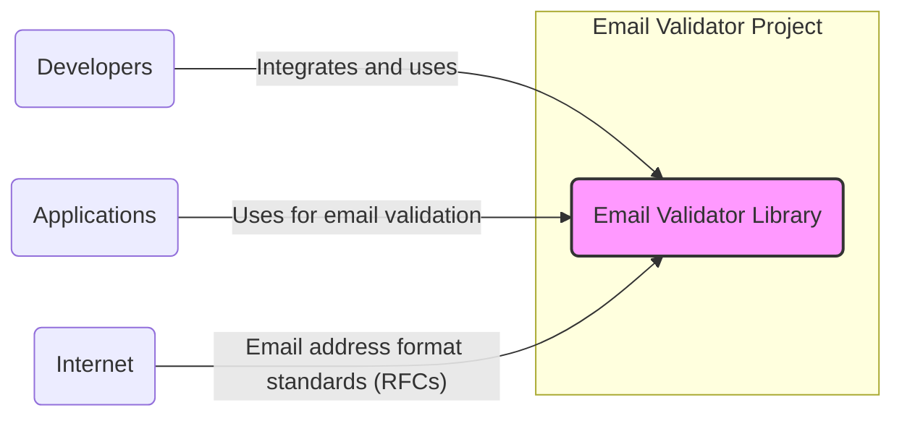
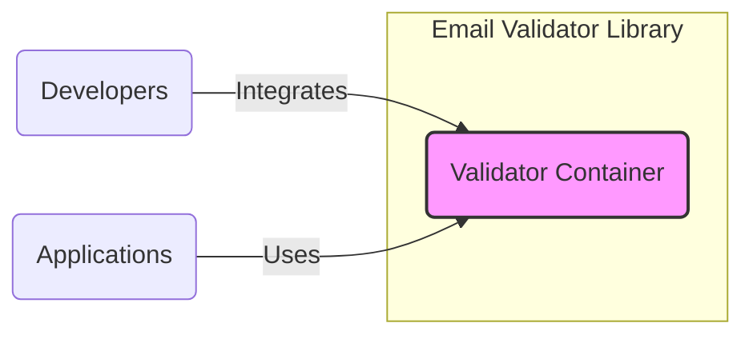
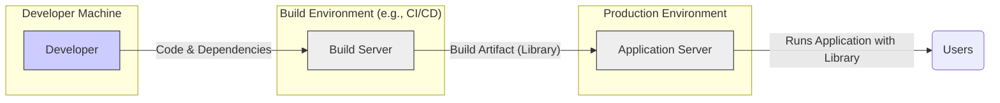

# BUSINESS POSTURE

This project is an email validator library. Its primary business purpose is to provide a robust and reliable mechanism for software developers to validate email addresses within their applications.

Business priorities for this project are:
- Ensuring data quality by preventing invalid email addresses from being processed.
- Reducing system errors and improving application stability by validating input data.
- Enhancing user experience by providing immediate feedback on email address validity.

Most important business risks associated with this project are:
- Introduction of vulnerabilities into applications that use this library, potentially leading to security breaches.
- Incorrect validation logic leading to rejection of valid email addresses or acceptance of invalid ones, impacting user experience and data integrity.
- Supply chain risks associated with using an external dependency, including potential compromise of the library itself.

# SECURITY POSTURE

Existing security controls:
- security control: Source code hosted on GitHub, providing transparency and version control. Implemented in: GitHub repository.
- security control: Open-source license, allowing community review and contributions. Implemented in: LICENSE file in repository.
- accepted risk: Reliance on community contributions for security fixes and updates.
- accepted risk: Potential vulnerabilities in dependencies used by the library.

Recommended security controls:
- recommended security control: Implement automated dependency scanning to identify and address vulnerabilities in third-party libraries used by this project.
- recommended security control: Integrate static analysis security testing (SAST) tools into the development pipeline to identify potential code-level vulnerabilities.
- recommended security control: Establish a clear process for reporting and addressing security vulnerabilities, including a security policy and contact information.

Security requirements:
- Authentication: Not applicable for a library. Authentication is the responsibility of the applications using this library.
- Authorization: Not applicable for a library. Authorization is the responsibility of the applications using this library.
- Input validation: The library itself is designed for input validation. It must rigorously validate email addresses according to relevant standards (e.g., RFC 5322).
- Cryptography: Not directly applicable. Email validation does not inherently require cryptography. However, if the library handles email addresses in a sensitive context, applications using it should employ appropriate encryption for storage and transmission.

# DESIGN

## C4 CONTEXT

Context Diagram elements:

- Name: Email Validator Library
  - Type: Software System
  - Description: A software library designed to validate email addresses according to established standards.
  - Responsibilities: Provide functions and methods for validating email address formats.
  - Security controls: Input validation logic within the library itself.

- Name: Developers
  - Type: Person
  - Description: Software developers who integrate and use the Email Validator Library in their applications.
  - Responsibilities: Integrate the library correctly, handle validation results appropriately, and ensure secure usage within their applications.
  - Security controls: Secure coding practices, input validation in their own applications in addition to using the library.

- Name: Applications
  - Type: Software System
  - Description: Various software applications (e.g., web applications, mobile apps, backend services) that utilize the Email Validator Library.
  - Responsibilities: Collect user input, use the library to validate email addresses, and process valid email addresses securely.
  - Security controls: Authentication, authorization, input validation (using this library), secure data handling.

- Name: Internet
  - Type: External System
  - Description: Represents the source of email address format standards and best practices (RFCs).
  - Responsibilities: Define and maintain email address format standards.
  - Security controls: Not applicable. Internet is an external environment.

## C4 CONTAINER

Container Diagram elements:

- Name: Validator Container
  - Type: Library
  - Description: The Email Validator Library itself, containing the code and logic for email validation.
  - Responsibilities: Implement email validation algorithms, provide API for developers to use, and handle different validation scenarios.
  - Security controls: Input validation logic, code review, static analysis.

## DEPLOYMENT

The Email Validator Library is not deployed as a standalone application. It is deployed as a dependency within other applications.

Deployment Scenario: Library as a dependency in a Web Application

Deployment Diagram elements (Library as dependency in Web Application):

- Name: Developer
  - Type: Person
  - Description: Software developer working on an application that uses the Email Validator Library.
  - Responsibilities: Integrate the library into the application, write code that utilizes the library, and test the application.
  - Security controls: Secure coding practices on the application side.

- Name: Build Server
  - Type: Infrastructure
  - Description: A server in a CI/CD pipeline responsible for building the application and its dependencies, including the Email Validator Library.
  - Responsibilities: Automate the build process, compile code, package dependencies, and run automated tests.
  - Security controls: Access control to build server, secure build pipelines, dependency scanning during build.

- Name: Application Server
  - Type: Infrastructure
  - Description: Server in the production environment where the application, including the Email Validator Library, is deployed and running.
  - Responsibilities: Host and run the application, serve user requests, and execute email validation logic using the library.
  - Security controls: Server hardening, network security, application security controls (authentication, authorization, input validation).

- Name: Users
  - Type: Person
  - Description: End-users interacting with the application that uses the Email Validator Library.
  - Responsibilities: Provide input to the application, including email addresses.
  - Security controls: User awareness training, secure password practices (unrelated to the library itself, but general application security).

## BUILD

```mermaid
flowchart LR
    developer["Developer"] --> code_repo["Code Repository (GitHub)"]
    code_repo --> build_server["Build Server (CI/CD)"]
    build_server -- "Dependency Scan, SAST, Build" --> artifacts["Build Artifacts (Library Package)"]
    artifacts --> package_registry["Package Registry (e.g., npm, Maven)"]
    package_registry --> application["Applications (via dependency management)"]

    style developer fill:#ccf,stroke:#333,stroke-width:1px
    style code_repo fill:#eee,stroke:#333,stroke-width:1px
    style build_server fill:#eee,stroke:#333,stroke-width:1px
    style artifacts fill:#eee,stroke:#333,stroke-width:1px
    style package_registry fill:#eee,stroke:#333,stroke-width:1px
```

Build Process Description:

1. Developer writes code and commits it to the Code Repository (GitHub).
2. Build Server (CI/CD system like GitHub Actions) is triggered by code changes.
3. Build Server performs security checks:
    - Dependency scanning: Checks for known vulnerabilities in dependencies.
    - Static Analysis Security Testing (SAST): Analyzes the code for potential security flaws.
    - Code linting and style checks.
    - Unit tests and integration tests.
4. Build Server compiles the code and creates Build Artifacts (e.g., a library package in a specific format like JAR, npm package, etc.).
5. Build Artifacts are published to a Package Registry (e.g., npm, Maven Central, GitHub Packages).
6. Applications then consume the library from the Package Registry as a dependency.

Security controls in the build process:
- security control: Secure code repository (GitHub) with access controls and audit logs. Implemented in: GitHub.
- security control: Automated build process using CI/CD to ensure consistent and repeatable builds. Implemented in: CI/CD system (e.g., GitHub Actions).
- security control: Dependency scanning to detect and prevent vulnerable dependencies. Implemented in: CI/CD pipeline.
- security control: Static Analysis Security Testing (SAST) to identify code-level vulnerabilities. Implemented in: CI/CD pipeline.
- security control: Code review process to identify potential security and logic flaws. Implemented in: Development workflow.
- security control: Signing of build artifacts to ensure integrity and authenticity. Implemented in: Build and release process.

# RISK ASSESSMENT

Critical business process we are trying to protect:
- Data integrity of applications using the library, specifically ensuring that email addresses stored and processed are valid.
- Availability and reliability of applications using the library, preventing crashes or errors due to invalid email input.
- Reputation of applications using the library, avoiding negative user experiences due to incorrect email validation.

Data we are trying to protect and their sensitivity:
- Email addresses: Sensitivity can vary. In some contexts, email addresses are considered Personally Identifiable Information (PII). The sensitivity depends on the application and the data associated with the email address. For the library itself, it primarily handles the format of the email address, not the content or associated data. However, applications using the library must consider the sensitivity of email addresses they process.

# QUESTIONS & ASSUMPTIONS

Questions:
- What is the intended use case for this library? Is it primarily for web applications, or are there other use cases?
- What are the performance requirements for email validation?
- Are there specific compliance requirements that the library needs to adhere to (e.g., GDPR, HIPAA)?
- What is the expected frequency of updates and maintenance for the library?
- Is there a process for reporting and handling security vulnerabilities in the library?

Assumptions:
- BUSINESS POSTURE: The primary business goal is to provide a reliable and accurate email validation library for general use.
- SECURITY POSTURE: Security is a concern, and basic security practices like dependency scanning and static analysis are recommended. The library is intended to be used in applications that will implement their own authentication, authorization, and broader security controls.
- DESIGN: The library is designed as a standalone component to be integrated into other applications. Deployment is as a dependency within those applications. The build process involves standard CI/CD practices with security checks.