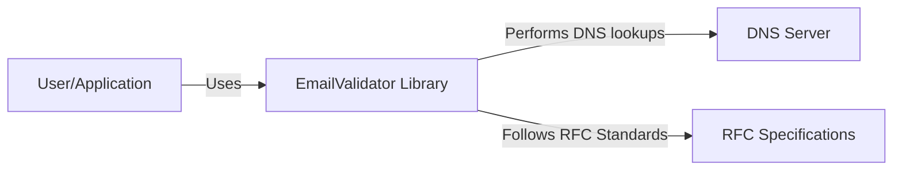
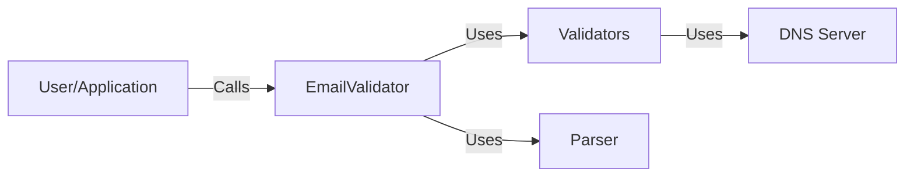
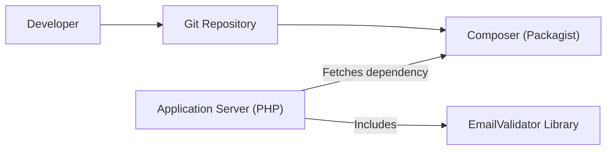
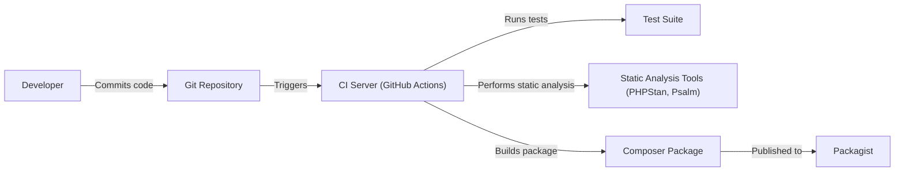

# BUSINESS POSTURE

Business Priorities and Goals:

*   Provide a robust and reliable email validation library for PHP applications.
*   Ensure high accuracy in email validation, minimizing false positives and false negatives.
*   Maintain compatibility with a wide range of PHP versions.
*   Offer a flexible and extensible architecture to accommodate various validation rules and standards.
*   Provide clear and comprehensive documentation for ease of use and integration.
*   Foster a community-driven approach to development and maintenance.

Business Risks:

*   Inaccurate email validation leading to:
    *   Acceptance of invalid email addresses, resulting in failed delivery and potential data quality issues.
    *   Rejection of valid email addresses, causing user frustration and potential loss of communication.
*   Security vulnerabilities within the library, potentially allowing for exploitation (e.g., injection attacks).
*   Lack of maintainability and updates, leading to incompatibility with newer PHP versions or email standards.
*   Performance bottlenecks impacting application responsiveness.
*   Lack of adoption due to complexity or insufficient documentation.

# SECURITY POSTURE

Existing Security Controls:

*   security control: Adherence to multiple RFC specifications for email validation (RFC 5322, 6530, 6531, 6532, 1123).
*   security control: Implementation of various validation checks, including:
    *   Syntax validation based on RFC specifications.
    *   DNS validation to check for the existence of MX records.
    *   Detection of common typos and disposable email addresses.
    *   Customizable validation rules through warnings and error codes.
*   security control: Extensive test suite to ensure the correctness and reliability of the validation logic.
*   security control: Code style checks and static analysis using tools like PHPStan and Psalm.

Accepted Risks:

*   accepted risk: The library relies on external DNS resolution, which can be a potential point of failure or performance bottleneck.
*   accepted risk: The library does not perform real-time mailbox verification (e.g., SMTP connection checks), which means it cannot guarantee the actual deliverability of an email address.
*   accepted risk: Full coverage of all possible email address variations and edge cases is practically impossible.

Recommended Security Controls:

*   security control: Implement stricter input sanitization to prevent potential injection vulnerabilities.
*   security control: Consider adding support for DNSSEC to enhance the security of DNS lookups.
*   security control: Regularly review and update dependencies to mitigate potential supply chain vulnerabilities.
*   security control: Provide clear guidelines on how to securely configure and use the library in different application contexts.

Security Requirements:

*   Authentication: Not directly applicable to this library, as it primarily deals with email validation, not user authentication.
*   Authorization: Not directly applicable.
*   Input Validation:
    *   The library MUST strictly validate email addresses against the configured RFC specifications and custom rules.
    *   The library SHOULD provide mechanisms to customize validation rules and error handling.
    *   The library MUST prevent any form of injection attacks through the input email address.
*   Cryptography: Not directly applicable, as the library does not handle sensitive data or encryption.
*   Data Protection: Not directly applicable.

# DESIGN

## C4 CONTEXT

Element Description:

*   Element:
    *   Name: User/Application
    *   Type: External Entity (User or Application)
    *   Description: Represents the user or application that utilizes the EmailValidator library.
    *   Responsibilities:
        *   Provides email addresses for validation.
        *   Handles the results of the validation (e.g., displaying error messages, storing valid addresses).
    *   Security controls:
        *   Input validation before passing data to the library.
        *   Secure handling of validation results.

*   Element:
    *   Name: EmailValidator Library
    *   Type: Software System
    *   Description: The PHP library for validating email addresses.
    *   Responsibilities:
        *   Validates email addresses according to RFC specifications and custom rules.
        *   Performs DNS lookups to check for MX records.
        *   Provides feedback on the validity of email addresses.
    *   Security controls:
        *   RFC compliance.
        *   Input sanitization.
        *   Extensive test suite.
        *   Static analysis.

*   Element:
    *   Name: DNS Server
    *   Type: External System
    *   Description: A DNS server used for resolving domain names and retrieving MX records.
    *   Responsibilities:
        *   Resolves domain names to IP addresses.
        *   Provides MX record information for email domains.
    *   Security controls:
        *   DNSSEC (recommended).
        *   Standard DNS security practices.

*   Element:
    *   Name: RFC Specifications
    *   Type: External Resource
    *   Description: The set of RFC documents that define the standards for email address syntax and validation.
    *   Responsibilities:
        *   Defines the rules and guidelines for email address formatting.
    *   Security controls: N/A (These are specifications, not implementations).

## C4 CONTAINER

Element Description:

*   Element:
    *   Name: User/Application
    *   Type: External Entity
    *   Description: Represents the user or application that utilizes the EmailValidator library.
    *   Responsibilities:
        *   Provides email addresses for validation.
        *   Handles the results of the validation.
    *   Security controls:
        *   Input validation before passing data to the library.
        *   Secure handling of validation results.

*   Element:
    *   Name: EmailValidator
    *   Type: Container (Main Class)
    *   Description: The main entry point for the library.
    *   Responsibilities:
        *   Coordinates the validation process.
        *   Provides the public API for email validation.
    *   Security controls:
        *   Input sanitization.

*   Element:
    *   Name: Validators
    *   Type: Container (Component)
    *   Description: A collection of different validators that perform specific checks (e.g., syntax, DNS, disposable).
    *   Responsibilities:
        *   Implements various validation rules.
        *   Performs DNS lookups.
    *   Security controls:
        *   RFC compliance.
        *   Input sanitization.

*   Element:
    *   Name: Parser
    *   Type: Container (Component)
    *   Description: Responsible to parse email.
    *   Responsibilities:
        *   Parse email.
    *   Security controls:
        *   RFC compliance.
        *   Input sanitization.

*   Element:
    *   Name: DNS Server
    *   Type: External System
    *   Description: A DNS server used for resolving domain names.
    *   Responsibilities:
        *   Resolves domain names to IP addresses.
        *   Provides MX record information.
    *   Security controls:
        *   DNSSEC (recommended).
        *   Standard DNS security practices.

## DEPLOYMENT

Possible Deployment Solutions:

1.  Composer Dependency: The library is typically included as a dependency in PHP projects using Composer.
2.  Manual Installation: The library files can be manually downloaded and included in a project.
3.  Docker Container: While not the primary deployment method, the library could be part of a larger application deployed within a Docker container.

Chosen Deployment Solution (Composer Dependency):

Element Description:

*   Element:
    *   Name: Developer
    *   Type: Person
    *   Description: The developer who integrates the EmailValidator library into their application.
    *   Responsibilities:
        *   Adds the library as a dependency using Composer.
        *   Configures and uses the library in their application code.
    *   Security controls:
        *   Follows secure coding practices.

*   Element:
    *   Name: Git Repository
    *   Type: System
    *   Description: Version control system.
    *   Responsibilities:
        *   Store code.
    *   Security controls:
        *   Access control.

*   Element:
    *   Name: Composer (Packagist)
    *   Type: System
    *   Description: The package manager for PHP, which hosts the EmailValidator library on Packagist.
    *   Responsibilities:
        *   Manages project dependencies.
        *   Downloads and installs the library and its dependencies.
    *   Security controls:
        *   Package signing (recommended).
        *   Dependency verification (recommended).

*   Element:
    *   Name: Application Server (PHP)
    *   Type: System
    *   Description: The server environment where the PHP application runs.
    *   Responsibilities:
        *   Executes the application code, including the EmailValidator library.
    *   Security controls:
        *   Secure server configuration.
        *   Regular security updates.
        *   Web application firewall (WAF).

*   Element:
    *   Name: EmailValidator Library
    *   Type: Library
    *   Description: The EmailValidator library files.
    *   Responsibilities:
        *   Provides email validation functionality.
    *   Security controls:
        *   (See previous sections)

## BUILD

Build Process Description:

1.  Developer commits code changes to the Git repository.
2.  A CI server (e.g., GitHub Actions) is triggered by the commit.
3.  The CI server runs the test suite to ensure code correctness.
4.  The CI server performs static analysis using tools like PHPStan and Psalm to identify potential code quality and security issues.
5.  If all tests and checks pass, the CI server builds the Composer package.
6.  The package is published to Packagist, making it available for installation via Composer.

Security Controls in Build Process:

*   Automated Testing: The test suite ensures that the library functions as expected and helps prevent regressions.
*   Static Analysis: PHPStan and Psalm help identify potential code quality and security vulnerabilities before deployment.
*   Dependency Management: Composer manages dependencies, but it's crucial to regularly review and update them to mitigate supply chain risks.
*   CI/CD Pipeline: Using a CI/CD pipeline (like GitHub Actions) automates the build and deployment process, reducing the risk of manual errors and ensuring consistency.

# RISK ASSESSMENT

Critical Business Processes:

*   User registration and account creation.
*   Email communication with users (e.g., newsletters, notifications, password resets).
*   Data quality management.

Data to Protect:

*   Email addresses (PII): Sensitivity - Medium. While email addresses are considered PII, the library itself doesn't store or persist this data. The primary concern is ensuring the accuracy of the validation process to prevent data quality issues and communication failures. The application using the library is responsible for the secure storage and handling of email addresses.

# QUESTIONS & ASSUMPTIONS

Questions:

*   Are there any specific compliance requirements (e.g., GDPR, CCPA) that need to be considered? (Assumption: Standard email validation practices are sufficient, but specific compliance needs should be addressed by the application using the library.)
*   Are there any performance requirements or limitations for the library? (Assumption: The library should be performant enough for typical use cases, but performance testing may be needed for high-volume applications.)
*   Are there any plans to extend the library's functionality beyond email validation? (Assumption: The current focus is on email validation, but future extensions should be considered separately.)

Assumptions:

*   Business Posture: The primary goal is to provide a reliable and accurate email validation library.
*   Security Posture: The library relies on external DNS resolution and does not perform real-time mailbox verification.
*   Design: The library is used as a dependency in PHP applications, primarily through Composer. The build process includes automated testing and static analysis.