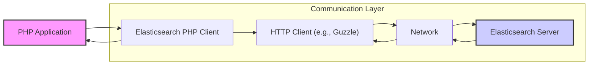
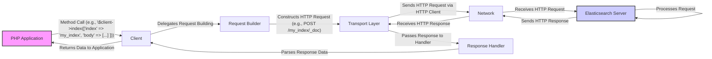

# Project Design Document: Elasticsearch PHP Client

**Version:** 1.1
**Date:** October 26, 2023
**Author:** AI Software Architect

## 1. Introduction

This document provides an enhanced and detailed design overview of the `elasticsearch-php` client library. This library is crucial for enabling seamless communication between PHP applications and Elasticsearch clusters by abstracting the complexities of the Elasticsearch REST API. The primary goal of this document is to offer a clear and comprehensive understanding of the library's architecture, internal components, data flow mechanisms, and critical security considerations. This detailed design will serve as a solid foundation for subsequent threat modeling activities.

## 2. Goals and Objectives

*   To present a refined and more detailed design of the `elasticsearch-php` library, enhancing clarity and understanding.
*   To provide a deeper insight into the responsibilities and interactions of the library's core components.
*   To meticulously describe the flow of data during various operations, highlighting key transformation points.
*   To expand on potential security vulnerabilities and attack vectors, offering a more comprehensive perspective for threat modeling.

## 3. Architectural Overview

The `elasticsearch-php` library operates as a bridge, translating PHP method calls into the HTTP requests that the Elasticsearch REST API understands. It manages the entire lifecycle of communication, from constructing requests based on user input to parsing and interpreting the responses received from the Elasticsearch server.

*   **PHP Application:** The custom application developed in PHP that leverages the `elasticsearch-php` library to interact with the Elasticsearch service. This application initiates all communication.
*   **Elasticsearch PHP Client:** The core library. It encapsulates the logic for interacting with the Elasticsearch API, managing request construction, response handling, and error management.
*   **HTTP Client (e.g., Guzzle):** An external, robust HTTP client library that `elasticsearch-php` utilizes for the low-level task of sending and receiving HTTP requests over the network.
*   **Network:** Represents the underlying network infrastructure facilitating communication between the PHP application's environment and the Elasticsearch server.
*   **Elasticsearch Server:** The backend distributed search and analytics engine responsible for storing, indexing, and searching data.

## 4. Component Design

The `elasticsearch-php` library is composed of several interconnected components, each with specific responsibilities:

*   **Client Builder:**
    *   Purpose: To provide a fluent interface for configuring and instantiating the main `Client` object.
    *   Functionality:
        *   Allows setting connection parameters, including hostnames/IP addresses, ports, and connection protocols (HTTP/HTTPS).
        *   Enables the configuration of authentication mechanisms (e.g., basic authentication, API keys, cloud IDs).
        *   Manages the setup of SSL/TLS settings, including certificate verification and client certificates.
        *   Facilitates the selection and configuration of the underlying HTTP transport (e.g., specifying Guzzle options).
*   **Client:**
    *   Purpose: The primary interface for PHP applications to interact with Elasticsearch.
    *   Functionality:
        *   Exposes methods that directly correspond to the Elasticsearch REST API endpoints (e.g., `index`, `search`, `get`, `bulk`).
        *   Orchestrates the process of building requests, sending them via the transport layer, and handling responses.
        *   Provides a consistent and user-friendly API for common Elasticsearch operations.
*   **Transport Layer:**
    *   Purpose: To handle the actual communication with the Elasticsearch server over HTTP(S).
    *   Functionality:
        *   Abstracts the underlying HTTP client library (e.g., Guzzle).
        *   Manages connection pooling to optimize performance by reusing connections.
        *   Implements retry mechanisms for handling transient network errors or server issues.
        *   Handles request signing and authentication headers based on the configured authentication method.
        *   Provides middleware capabilities for intercepting and modifying requests and responses.
*   **Request Builder:**
    *   Purpose: To construct well-formed HTTP requests that adhere to the Elasticsearch REST API specification.
    *   Functionality:
        *   Takes parameters provided to the `Client` methods and translates them into the appropriate HTTP method (GET, POST, PUT, DELETE), URL, and query parameters.
        *   Serializes request bodies into JSON format when required for operations like indexing or searching.
        *   Sets necessary HTTP headers, including `Content-Type`, `Authorization`, and custom headers.
*   **Response Handler:**
    *   Purpose: To process the HTTP responses received from the Elasticsearch server.
    *   Functionality:
        *   Parses the HTTP response status code to determine the success or failure of the operation.
        *   Deserializes the JSON response body into PHP data structures (arrays or objects).
        *   Handles and throws exceptions for different types of errors returned by Elasticsearch, providing informative error messages.
*   **Namespaces and API Abstraction:**
    *   Purpose: To organize the API methods logically and provide a more intuitive interface.
    *   Functionality:
        *   Groups related API methods under namespaces (e.g., `Indices` for index-related operations, `Documents` for document operations).
        *   Offers a more PHP-centric way of interacting with the Elasticsearch API compared to directly constructing HTTP requests.
*   **Connection Pool:**
    *   Purpose: To efficiently manage persistent connections to Elasticsearch servers.
    *   Functionality:
        *   Maintains a pool of active connections, reducing the overhead of establishing new connections for each request.
        *   Improves performance by reusing existing connections.
        *   Handles connection failures and attempts to re-establish connections automatically.
        *   Allows configuration of pool size and connection timeouts.
*   **Serializers:**
    *   Purpose: To handle the conversion between PHP data structures and formats suitable for communication with Elasticsearch.
    *   Functionality:
        *   Encodes PHP arrays and objects into JSON format for request bodies.
        *   Decodes JSON responses from Elasticsearch back into PHP data structures.
        *   May support other serialization formats if needed in the future.
*   **Loggers:**
    *   Purpose: To provide a mechanism for recording library activity for debugging and monitoring.
    *   Functionality:
        *   Integrates with standard PHP logging interfaces (e.g., PSR-3 loggers).
        *   Logs important events, such as request details, response status codes, and errors.
        *   Allows configuration of the logging level and output destination.

## 5. Data Flow

The following illustrates the typical flow of data when a PHP application interacts with Elasticsearch using the `elasticsearch-php` client:

*   The PHP application initiates an action by calling a specific method on the `Client` object, providing necessary data as arguments.
*   The `Client` delegates the task of constructing the HTTP request to the `Request Builder`.
*   The `Request Builder` transforms the provided parameters into a well-formed HTTP request, including the appropriate method, endpoint URL, headers, and request body (if needed).
*   The `Transport Layer` takes the constructed HTTP request and sends it to the Elasticsearch server over the network using the configured HTTP client.
*   The Elasticsearch server receives the request, processes it according to the API endpoint called, and generates an HTTP response.
*   The HTTP response is sent back over the network to the PHP application's environment.
*   The `Transport Layer` receives the HTTP response and passes it to the `Response Handler`.
*   The `Response Handler` parses the response, checking the status code and deserializing the response body.
*   The parsed data (or an error) is then returned to the `Client`.
*   Finally, the `Client` returns the processed data or throws an exception back to the calling PHP application.

## 6. Security Considerations

A robust understanding of potential security vulnerabilities is crucial for applications using `elasticsearch-php`. Here are key areas to consider for threat modeling:

*   **Connection Security (TLS/SSL):**
    *   **Risk:** Man-in-the-middle attacks, eavesdropping on sensitive data transmitted between the client and the Elasticsearch server.
    *   **Mitigation:** Enforce HTTPS for all communication. Implement strict certificate verification to ensure connection to the legitimate Elasticsearch server. Configure appropriate TLS versions (e.g., TLS 1.2 or higher) and strong cipher suites.
*   **Authentication and Authorization:**
    *   **Risk:** Unauthorized access to Elasticsearch data and operations.
    *   **Mitigation:** Utilize Elasticsearch's built-in security features. Configure strong authentication mechanisms (e.g., API keys, username/password with role-based access control). Securely store and manage authentication credentials, avoiding hardcoding them in the application. Leverage Elasticsearch's authorization framework to restrict access based on user roles and permissions.
*   **Input Validation and Sanitization:**
    *   **Risk:** Injection vulnerabilities (e.g., Elasticsearch query injection) if user-provided data is directly incorporated into queries without proper sanitization.
    *   **Mitigation:**  Always validate and sanitize user input before using it in Elasticsearch queries or operations. Utilize parameterized queries or the library's query DSL to prevent injection attacks. Avoid constructing raw queries from user input.
*   **Dependency Management:**
    *   **Risk:** Exploiting known vulnerabilities in the underlying HTTP client library (e.g., Guzzle) or other dependencies.
    *   **Mitigation:** Regularly update the `elasticsearch-php` library and all its dependencies to the latest stable versions. Implement a robust dependency management strategy using tools like Composer and security scanning tools to identify and address vulnerabilities.
*   **Error Handling and Information Disclosure:**
    *   **Risk:** Leaking sensitive information about the Elasticsearch cluster or application internals through overly verbose error messages.
    *   **Mitigation:** Implement proper error handling within the application. Avoid displaying raw error messages from Elasticsearch to end-users. Log errors securely for debugging purposes, ensuring sensitive data is not included in logs accessible to unauthorized individuals.
*   **Logging:**
    *   **Risk:** Exposure of sensitive data (e.g., authentication credentials, query parameters containing personal information) if logging is not configured securely.
    *   **Mitigation:** Configure logging carefully, ensuring that sensitive information is not logged. Implement secure storage and access controls for log files. Consider using structured logging to facilitate secure analysis and filtering.
*   **Request Forgery (CSRF):**
    *   **Risk:** While less direct for a client library, if the application using the library doesn't implement CSRF protection, malicious requests could be sent to Elasticsearch on behalf of an authenticated user.
    *   **Mitigation:** Implement standard CSRF protection mechanisms within the web application that utilizes the `elasticsearch-php` library.
*   **Denial of Service (DoS):**
    *   **Risk:**  An attacker could potentially overwhelm the Elasticsearch cluster by sending a large number of requests through the client.
    *   **Mitigation:** Implement rate limiting and request throttling within the application. Configure appropriate connection pool settings and timeouts in the `elasticsearch-php` client to prevent resource exhaustion. Monitor Elasticsearch cluster performance and resource utilization.
*   **Code Injection:**
    *   **Risk:** Although less likely within the client library itself, vulnerabilities in the application code that dynamically construct queries or interact with the client could lead to code injection.
    *   **Mitigation:** Follow secure coding practices. Avoid dynamic code execution based on user input. Thoroughly review and test code that interacts with the `elasticsearch-php` library.
*   **Configuration Security:**
    *   **Risk:** Exposure of sensitive configuration parameters (e.g., Elasticsearch hosts, credentials) if not stored and managed securely.
    *   **Mitigation:** Store configuration parameters securely, using environment variables or dedicated configuration management tools. Avoid hardcoding sensitive information in the application code. Implement appropriate access controls for configuration files.

## 7. Dependencies

The `elasticsearch-php` library relies on the following key dependencies:

*   **PHP:**  Requires a specific minimum version of PHP. Refer to the library's documentation for the exact version requirement.
*   **An HTTP Client Library (Recommended: Guzzle):**  Used for making HTTP requests to the Elasticsearch server. Guzzle is a widely used and well-maintained HTTP client for PHP. Ensure you are using a supported and up-to-date version of Guzzle.
*   **Composer:** The standard dependency management tool for PHP. It is used to install and manage the `elasticsearch-php` library and its dependencies.
*   **ext-json:** The JSON extension for PHP, which is typically enabled by default. It is essential for encoding and decoding JSON data exchanged with Elasticsearch.

## 8. Deployment Considerations

When deploying applications that utilize the `elasticsearch-php` library, consider the following:

*   **Installation:** Install the library using Composer by adding it to your project's `composer.json` file and running `composer install`.
*   **Configuration:** Configure the `Client` object with the necessary connection details for your Elasticsearch cluster. This typically involves specifying the hostnames/IP addresses and ports of your Elasticsearch nodes. Consider using environment variables for sensitive configuration like credentials.
*   **Secure Connection:** Ensure that the connection to Elasticsearch is secured using HTTPS. Configure the client to verify the server's SSL certificate.
*   **Authentication:** Configure the appropriate authentication mechanism based on your Elasticsearch setup (e.g., API keys, basic authentication).
*   **Error Handling:** Implement robust error handling in your application to gracefully manage potential communication errors with Elasticsearch.
*   **Logging:** Configure logging for the `elasticsearch-php` client to aid in debugging and monitoring. Integrate with your application's logging framework.
*   **Performance:** Consider the performance implications of your Elasticsearch interactions. Utilize features like connection pooling and bulk requests where appropriate.
*   **Resource Limits:** Be mindful of resource limits on both the application server and the Elasticsearch cluster to prevent performance issues or denial of service.

## 9. Future Considerations

The `elasticsearch-php` library is continuously evolving. Future development may include:

*   **Support for New Elasticsearch API Features:**  Adding methods and functionality to support the latest features introduced in new versions of Elasticsearch.
*   **Performance Optimizations:**  Further improvements to the library's performance and efficiency.
*   **Enhanced Security Features:**  Incorporating new security best practices and options.
*   **Improved API and Developer Experience:**  Refining the API to make it more intuitive and easier to use.
*   **Asynchronous Operations:**  Potentially adding support for asynchronous request execution.

This enhanced design document provides a more in-depth understanding of the `elasticsearch-php` client library. The detailed descriptions of components, data flow, and security considerations will be invaluable for conducting thorough threat modeling and ensuring the secure and reliable operation of applications interacting with Elasticsearch.
