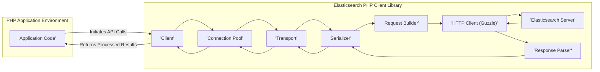

# Project Design Document: Elasticsearch PHP Client Library

**Version:** 1.1
**Date:** October 26, 2023
**Author:** AI Software Architect

## 1. Introduction

This document provides an enhanced design overview of the Elasticsearch PHP client library, as found in the repository: [https://github.com/elastic/elasticsearch-php](https://github.com/elastic/elasticsearch-php). This document is specifically crafted to serve as a comprehensive foundation for threat modeling activities, detailing the library's architecture, components, and data flow with a focus on security-relevant aspects.

## 2. Project Overview

The Elasticsearch PHP client is a foundational library enabling PHP applications to communicate with an Elasticsearch cluster. It offers a programmatic interface for executing various Elasticsearch operations, including document indexing, searching, updating, and deletion. The library abstracts the complexities of the Elasticsearch REST API, handling request construction, response interpretation, and error management. Its primary function is to facilitate secure and reliable interaction between PHP applications and Elasticsearch.

## 3. Architectural Design

The library employs a modular architecture, separating concerns into distinct, interacting components. This separation aids in understanding potential attack surfaces. The core components and their interactions are visualized below:

### 3.1. Key Components (Security Focus)

*   **Client:** The primary interface for application interaction. It handles authentication configuration and manages the lifecycle of requests. Security considerations include secure storage and handling of authentication credentials passed to the client.
*   **Connection Pool:** Manages connections to the Elasticsearch cluster, potentially implementing strategies like sniffing for node discovery. Security implications involve ensuring connections are established securely (TLS) and that connection failures are handled gracefully without exposing sensitive information.
*   **Transport:** Responsible for the secure transmission of requests and reception of responses. It enforces the use of HTTPS and handles TLS configuration. Vulnerabilities here could involve man-in-the-middle attacks if TLS is not properly configured or enforced.
*   **Serializer:** Converts PHP data structures to JSON for requests and vice-versa for responses. Security concerns include potential vulnerabilities arising from the serialization/deserialization process, such as injection attacks if not handled carefully (though the library primarily *sends* data).
*   **Request Builder:** Constructs the HTTP request, including headers and body. Security considerations involve preventing injection vulnerabilities by properly encoding and escaping data included in the request.
*   **HTTP Client (Guzzle):** An external dependency responsible for the actual HTTP communication. Security relies on the secure configuration and maintenance of the Guzzle library, ensuring it's not vulnerable to known exploits.
*   **Response Parser:** Interprets the HTTP response from the Elasticsearch server. Security considerations include preventing vulnerabilities related to parsing potentially malicious or unexpected responses.
*   **Middlewares (Potential):** The library might support middleware for request/response modification or logging. Security implications involve ensuring that any added middleware does not introduce vulnerabilities (e.g., logging sensitive data insecurely).

### 3.2. Data Flow (Security Perspective)

Understanding the data flow helps identify potential interception or manipulation points.

1. The `'Application Code'` initiates an API call to the `'Client'`, potentially including sensitive data and authentication information.
2. The `'Client'` utilizes the `'Request Builder'` to construct the HTTP request. This stage is crucial for preventing injection vulnerabilities by properly encoding data.
3. The `'Client'` obtains a secure connection from the `'Connection Pool'`. The security of this connection depends on TLS configuration.
4. The request is passed to the `'Transport'`. This component enforces the use of HTTPS to protect data in transit.
5. The `'Transport'` uses the `'Serializer'` to convert the request body into JSON. While primarily sending data, vulnerabilities could arise from improper handling of specific data types.
6. The `'Transport'` uses the configured `'HTTP Client (Guzzle)'` to send the HTTP request to the `'Elasticsearch Server'`. This is where network security and TLS come into play.
7. The `'Elasticsearch Server'` processes the request. Server-side security measures are paramount at this stage.
8. The `'Elasticsearch Server'` sends back an HTTP response.
9. The `'HTTP Client (Guzzle)'` receives the response.
10. The `'Transport'` receives the HTTP response.
11. The `'Transport'` uses the `'Response Parser'` to parse the JSON response. Robust parsing is necessary to prevent issues from malformed responses.
12. The parsed response is returned to the `'Client'`.
13. The `'Client'` returns the processed result to the `'Application Code'`. Care must be taken to avoid exposing sensitive information in error handling or logging at this stage.

## 4. Security Considerations

This section details potential security considerations for the Elasticsearch PHP client library.

*   **Transport Layer Security (TLS):**
    *   Ensuring all communication with the Elasticsearch cluster occurs over HTTPS is paramount to protect data in transit from eavesdropping and manipulation.
    *   Proper configuration of TLS settings, including certificate verification, is crucial.
    *   Vulnerabilities can arise from misconfigured or disabled TLS, allowing man-in-the-middle attacks.
*   **Authentication and Authorization:**
    *   The library must be configured with appropriate credentials to authenticate with the Elasticsearch cluster.
    *   Secure storage and handling of these credentials within the PHP application are critical. Avoid hardcoding credentials.
    *   Supported authentication mechanisms should be evaluated for their security implications (e.g., basic auth vs. API keys vs. token-based).
    *   Vulnerabilities can include credential leakage, insecure storage of credentials, and improper handling of authentication failures.
*   **Input Validation and Output Encoding:**
    *   While the primary responsibility lies with Elasticsearch, the client library should ensure data is encoded correctly when constructing requests to prevent injection vulnerabilities (e.g., although less common in this direction compared to server-side input).
    *   The library should handle responses robustly to avoid issues arising from malformed or unexpected data.
*   **Dependency Management:**
    *   The library depends on external packages like Guzzle. Keeping these dependencies up-to-date is crucial to mitigate known vulnerabilities in those components.
    *   A robust dependency management strategy should be in place.
*   **Error Handling and Information Disclosure:**
    *   Error messages generated by the library should not expose sensitive information about the Elasticsearch cluster or the application's internal workings.
    *   Careful handling of exceptions and error responses is necessary.
*   **Configuration Security:**
    *   Configuration parameters, such as Elasticsearch hostnames, ports, and authentication details, should be managed securely.
    *   Utilize environment variables or secure configuration management systems instead of hardcoding sensitive information.
*   **Logging:**
    *   If logging is implemented, ensure that sensitive data (e.g., request bodies containing personal information, authentication details) is not logged insecurely.
    *   Follow secure logging practices.
*   **Connection Pool Security:**
    *   The process of establishing and managing connections should be secure, especially when using features like node sniffing, which involves retrieving cluster information.
*   **Request and Response Body Handling:**
    *   The serialization and deserialization processes should be robust and not vulnerable to attacks based on specially crafted data.

## 5. Deployment Considerations (Security Impact)

The deployment environment significantly impacts the security of the client library.

*   **Application Environment Security:** The security posture of the environment where the PHP application runs (e.g., web server configuration, container security) directly affects the client library's security. A compromised environment can lead to credential theft or code injection.
*   **Network Security:** Network segmentation and firewall rules should restrict access to the Elasticsearch cluster to authorized applications only. Ensure network traffic between the application and Elasticsearch is protected.
*   **Elasticsearch Cluster Security:** The security configuration of the Elasticsearch cluster is paramount. The client library's security is dependent on the security of the server it connects to (e.g., authentication enforcement, authorization rules, network settings).
*   **Secrets Management:** Securely managing and injecting secrets (like API keys or passwords) into the application environment is crucial. Avoid storing secrets directly in code or configuration files.
*   **Monitoring and Logging:** Implementing monitoring and logging for the application and the Elasticsearch client can help detect and respond to security incidents.

## 6. Assumptions and Dependencies (Security Relevance)

*   **PHP Version Security:**  The security of the underlying PHP runtime environment is a dependency. Ensure the PHP version is up-to-date with security patches.
*   **Guzzle HTTP Client Security:** The security of the Guzzle library is a direct dependency. Regularly update Guzzle to address known vulnerabilities.
*   **Elasticsearch Server Security:** The client library assumes the Elasticsearch server is properly secured with authentication, authorization, and network controls.
*   **Secure Network Infrastructure:** The security of the network infrastructure connecting the application and the Elasticsearch cluster is assumed.

## 7. Future Considerations (Security Enhancements)

*   **Regular Security Audits:** Periodic security audits of the library's codebase and its dependencies are essential to identify and address potential vulnerabilities.
*   **Integration with Security Scanning Tools:**  Consider how the library can be integrated with static and dynamic analysis security tools.
*   **Support for Advanced Elasticsearch Security Features:**  The library should be updated to support new security features introduced in Elasticsearch, such as enhanced authentication mechanisms or encryption at rest.
*   **Improved Error Handling for Security Context:** Enhance error handling to provide more context for security-related issues without revealing sensitive information.
*   **Security Best Practices Documentation:** Provide clear documentation and guidance on secure configuration and usage of the library.

This enhanced design document provides a more detailed and security-focused understanding of the Elasticsearch PHP client library's architecture and components. This information will be instrumental in conducting thorough threat modeling exercises to identify potential security vulnerabilities and develop appropriate mitigation strategies.