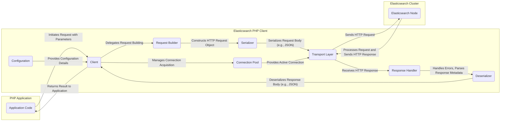

## Project Design Document: Elasticsearch PHP Client (Improved)

**1. Introduction**

This document provides a detailed design overview of the `elasticsearch-php` client library. It serves as a foundation for threat modeling, outlining key components, data flows, and interactions within the library to facilitate the identification of potential security vulnerabilities. This document aims to provide a comprehensive understanding of the library's architecture and functionality from a security perspective.

**2. Project Overview**

The `elasticsearch-php` library is the official low-level PHP client for interacting with Elasticsearch clusters. It provides a programmatic interface for PHP applications to communicate with Elasticsearch via its REST API. The library handles the complexities of constructing and sending HTTP requests, managing connections, serializing and deserializing data, and processing responses, allowing developers to focus on application-specific logic. It offers granular control over interactions with the Elasticsearch API.

**3. Goals**

* Provide a clear and comprehensive description of the `elasticsearch-php` library's architecture and its internal workings.
* Identify the key components of the library and detail their specific responsibilities and interactions.
* Illustrate the flow of data within the library during request and response cycles.
* Highlight potential areas of security concern and attack vectors for future threat modeling exercises.

**4. Target Audience**

This document is intended for:

* Security engineers responsible for performing threat modeling and security assessments.
* Software developers working with or contributing to the `elasticsearch-php` library.
* System architects designing and deploying applications that utilize the `elasticsearch-php` library.

**5. Architectural Overview**

The `elasticsearch-php` library is structured around several key components that work together to facilitate communication with an Elasticsearch cluster:

* **Client:** The primary entry point for interacting with Elasticsearch. It encapsulates the core logic for sending requests and receiving responses. It manages the lifecycle of requests and delegates tasks to other components.
* **Connection Pool:**  Manages a pool of persistent connections to one or more Elasticsearch nodes. This optimizes performance by reusing connections and reducing the overhead of establishing new connections for each request. It implements strategies for selecting healthy nodes and handling connection failures.
* **Transport Layer:** Responsible for the actual HTTP communication with the Elasticsearch cluster. It abstracts away the underlying HTTP client implementation (typically using cURL or PHP's stream wrapper). It handles tasks like setting headers, sending the request body, and receiving the raw HTTP response.
* **Request Builder:**  Constructs HTTP requests based on user-provided parameters and the specific Elasticsearch API endpoint being targeted. It ensures that requests are formatted correctly according to the Elasticsearch API specification.
* **Serializer:**  Handles the conversion of PHP data structures into a format suitable for sending in HTTP request bodies, primarily JSON. It ensures data is correctly formatted for Elasticsearch consumption.
* **Deserializer:**  Performs the reverse operation of the serializer, converting JSON responses received from Elasticsearch back into PHP data structures that can be easily used by the application.
* **Response Handler:** Processes the raw HTTP response received from the Transport Layer. It checks the HTTP status code for errors, extracts relevant headers, and passes the response body to the Deserializer. It also handles potential exceptions and error conditions returned by Elasticsearch.
* **Configuration:**  Manages the configuration options for the client, such as connection details (hosts, ports), authentication credentials, timeouts, and logging settings. This component allows users to customize the client's behavior.
* **Namespace and Class Structure:** Organizes the library's code into logical namespaces and classes, promoting code organization, maintainability, and preventing naming conflicts.

**6. Component Interactions and Data Flow**

**Detailed Data Flow:**

1. **Request Initiation:** The PHP application code initiates an interaction with Elasticsearch by calling a method on the `Client` object. This call includes parameters specifying the desired operation (e.g., indexing a document, performing a search).
2. **Request Building:** The `Client` utilizes the `Request Builder` to construct a structured HTTP request object. This involves determining the correct HTTP method (GET, POST, PUT, DELETE), the target URL endpoint based on the Elasticsearch API, and setting necessary headers.
3. **Request Serialization:** If the request includes a body (e.g., for indexing or searching), the `Serializer` component converts the PHP data structures representing the request body into a suitable format, typically JSON.
4. **Connection Acquisition:** The `Client` interacts with the `Connection Pool` to obtain an active connection to an Elasticsearch node. The connection pool manages a set of persistent connections and employs strategies for selecting healthy nodes.
5. **Transport Layer Communication:** The `Transport Layer` takes the constructed HTTP request (including headers and serialized body) and sends it to the selected Elasticsearch node using an underlying HTTP client implementation (e.g., cURL). This involves establishing a network connection and transmitting the data.
6. **Elasticsearch Processing:** The Elasticsearch node receives the HTTP request, processes it according to the requested operation, and generates an HTTP response containing the result or error information.
7. **Response Reception:** The `Transport Layer` receives the raw HTTP response from the Elasticsearch node, including the HTTP status code, headers, and the response body (typically in JSON format).
8. **Response Handling:** The `Response Handler` processes the raw HTTP response. This includes checking the HTTP status code to determine if the request was successful or if an error occurred. It also extracts relevant headers and passes the response body to the `Deserializer`.
9. **Response Deserialization:** The `Deserializer` converts the JSON response body received from Elasticsearch back into PHP data structures (e.g., arrays, objects) that can be easily used by the application.
10. **Result Return:** The `Client` returns the deserialized response data to the calling PHP application code. If an error occurred, the `Response Handler` might throw an exception.

**7. Security Considerations**

This section outlines potential security considerations and potential vulnerabilities associated with the `elasticsearch-php` library. These points should be further investigated during threat modeling.

* **Authentication and Authorization:**
    * **Credential Management:** How are credentials (e.g., API keys, username/password for Basic Auth, TLS client certificates) for accessing the Elasticsearch cluster configured and managed within the application using this library? Are they stored securely (e.g., using environment variables, secure configuration management)?
    * **Transport Layer Security (TLS):** Is communication between the PHP client and the Elasticsearch cluster enforced to use TLS/SSL to encrypt data in transit and prevent eavesdropping? How is TLS certificate verification handled to prevent man-in-the-middle attacks?
    * **Authorization Bypass:** Could vulnerabilities in the library or its usage allow an attacker to bypass Elasticsearch's authorization mechanisms?
* **Input Validation and Injection Attacks:**
    * **Query Injection:** If user-provided input is directly incorporated into Elasticsearch queries without proper sanitization or parameterization, it could lead to Elasticsearch query injection vulnerabilities, allowing attackers to execute arbitrary queries or modify data.
    * **Header Injection:** Can attackers manipulate HTTP headers sent by the library to the Elasticsearch cluster, potentially leading to security issues?
    * **Data Injection:**  Improper handling of data being indexed into Elasticsearch could lead to the injection of malicious content.
* **Error Handling and Information Disclosure:**
    * **Verbose Error Messages:** Does the library or the application using it expose overly detailed error messages that could reveal sensitive information about the Elasticsearch cluster's configuration or internal workings to an attacker?
    * **Stack Traces:** Are stack traces containing sensitive information exposed in production environments?
* **Dependency Management:**
    * **Vulnerable Dependencies:** The library relies on other PHP packages (e.g., an HTTP client like cURL). Are these dependencies regularly updated to address known security vulnerabilities?
    * **Supply Chain Attacks:** Could compromised dependencies introduce security risks?
* **Serialization/Deserialization Vulnerabilities:**
    * **Insecure Deserialization:** While less likely with standard JSON handling, are there any scenarios where insecure deserialization could be a risk if custom serialization mechanisms are used or if vulnerabilities exist in the underlying JSON handling library?
* **Connection Security:**
    * **Connection Hijacking:** If connections are not properly secured with TLS, could an attacker potentially hijack connections?
    * **Connection Pool Security:** Are there any security implications related to how the connection pool manages and reuses connections?
* **Logging:**
    * **Sensitive Data in Logs:** Does the library or the application log sensitive information (e.g., credentials, query parameters containing sensitive data) that could be exposed if logs are not properly secured?
* **Configuration Security:**
    * **Insecure Defaults:** Are there any default configuration settings that could introduce security vulnerabilities if not properly configured?
    * **Exposure of Configuration:** Is the library's configuration exposed in a way that could be exploited?
* **Rate Limiting and Denial of Service:**
    * **Client-Side Rate Limiting:** Does the library offer any mechanisms to prevent the application from overwhelming the Elasticsearch cluster with requests, potentially leading to a denial-of-service?
* **Code Injection through Plugins/Extensions:** If the library supports any form of plugins or extensions, are there security considerations related to the code being executed within the context of the library?

**8. Deployment Considerations**

* The `elasticsearch-php` library is typically deployed as part of a PHP application running on a web server, worker process, or command-line interface (CLI) environment.
* It requires network connectivity to the target Elasticsearch cluster.
* The underlying HTTP client (e.g., cURL with appropriate TLS support) must be installed and configured on the server.
* PHP version compatibility requirements must be met.
* Security best practices for the deployment environment (e.g., firewall rules, network segmentation) should be followed.

**9. Future Considerations**

* Potential future enhancements to the library that could impact security include:
    * Integration with more advanced authentication mechanisms.
    * Built-in input validation or sanitization features.
    * Enhanced logging and auditing capabilities.
    * Improved error handling and security-focused error reporting.
    * Support for new Elasticsearch security features.

**10. Conclusion**

This improved design document provides a more detailed and comprehensive overview of the `elasticsearch-php` client library, emphasizing its architecture, data flow, and critical security considerations. This information is essential for conducting thorough threat modeling exercises to identify and mitigate potential security risks associated with using this library. By understanding the library's internal workings and potential vulnerabilities, developers and security professionals can collaborate to build more secure and resilient applications that interact with Elasticsearch.