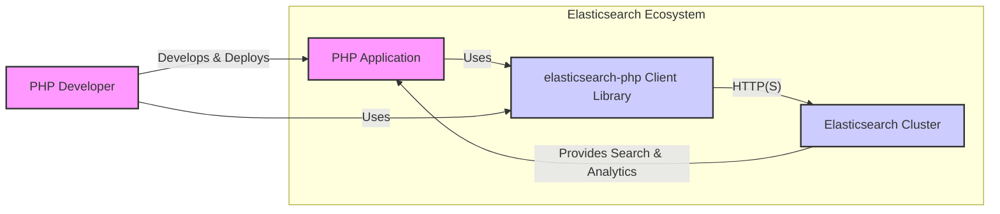
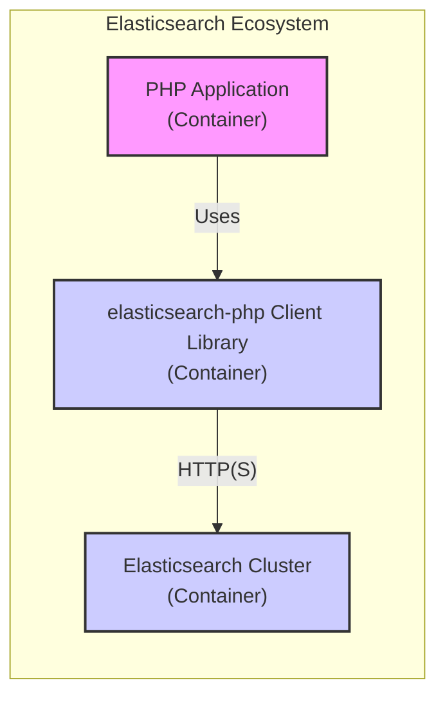
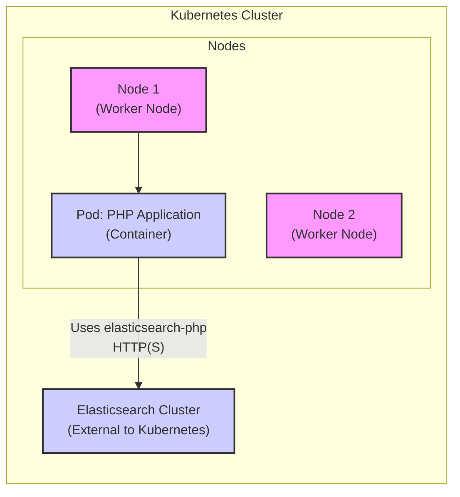

# BUSINESS POSTURE

This project, elasticsearch-php, provides a PHP client library for Elasticsearch.

- Business priorities and goals:
  - Enable PHP developers to easily integrate Elasticsearch into their applications.
  - Provide a reliable, performant, and feature-complete client that supports various Elasticsearch versions.
  - Lower the barrier to entry for PHP developers to utilize Elasticsearch's search and analytics capabilities.
  - Foster the adoption of Elasticsearch within the PHP ecosystem.

- Most important business risks:
  - Security vulnerabilities in the client library could expose applications and Elasticsearch clusters to attacks.
  - Incompatibility issues with different Elasticsearch versions could lead to application failures and developer frustration.
  - Performance bottlenecks in the client could negatively impact application performance.
  - Lack of proper documentation or support could hinder adoption and increase development costs for users.
  - Supply chain attacks targeting dependencies of the client library.

# SECURITY POSTURE

- Existing security controls:
  - security control: Reliance on Elasticsearch security features for authentication, authorization, and data encryption. Described in Elasticsearch documentation.
  - security control: Input validation within the client library to prevent injection attacks. Implemented in the client code.
  - security control: Secure coding practices followed during development. Assumed based on project maturity and community.
  - security control: Usage of HTTPS for communication with Elasticsearch. Configurable in client settings.

- Accepted risks:
  - accepted risk: Vulnerabilities in underlying dependencies. Mitigated by dependency updates and security scanning.
  - accepted risk: Misconfiguration of Elasticsearch security settings by users. User responsibility, documented in Elasticsearch documentation.
  - accepted risk: Client-side vulnerabilities with limited impact due to the nature of a client library. Mitigated by prompt patching and updates.

- Recommended security controls:
  - security control: Automated security scanning of the client library and its dependencies in CI/CD pipeline.
  - security control: Regular dependency updates to address known vulnerabilities.
  - security control: Static Application Security Testing (SAST) to identify potential code-level vulnerabilities.
  - security control: Software Composition Analysis (SCA) to manage and monitor open source dependencies.
  - security control: Security awareness training for developers contributing to the project.

- Security requirements:
  - Authentication:
    - Requirement: The client must support various Elasticsearch authentication mechanisms (e.g., basic authentication, API keys).
    - Requirement: Authentication credentials should be handled securely and not hardcoded in the client code.
  - Authorization:
    - Requirement: The client should respect Elasticsearch's role-based access control (RBAC) and ensure users only access authorized resources.
    - Requirement: The client should not bypass Elasticsearch's authorization mechanisms.
  - Input validation:
    - Requirement: The client must validate user inputs before sending them to Elasticsearch to prevent injection attacks (e.g., Elasticsearch Query DSL injection).
    - Requirement: Input validation should be implemented on both client-side and server-side (Elasticsearch).
  - Cryptography:
    - Requirement: Communication between the client and Elasticsearch should be encrypted using HTTPS to protect data in transit.
    - Requirement: The client should support Elasticsearch's encryption features for data at rest and in transit.

# DESIGN

## C4 CONTEXT

- Context Diagram Elements:
  - - Name: PHP Application
    - Type: Software System
    - Description: A PHP application that requires search and analytics capabilities.
    - Responsibilities: Utilizing the elasticsearch-php client to interact with Elasticsearch, processing data, and presenting results to users or other systems.
    - Security controls: Application-level security controls, such as authentication, authorization, input validation, and secure data handling, depending on the application's specific requirements.
  - - Name: elasticsearch-php Client Library
    - Type: Software System
    - Description: A PHP library that provides an interface for PHP applications to communicate with Elasticsearch clusters.
    - Responsibilities:  Handling communication with Elasticsearch via HTTP(S), serializing and deserializing data, providing a convenient API for common Elasticsearch operations, and implementing client-side input validation.
    - Security controls: Input validation, secure handling of credentials, adherence to secure coding practices, and dependency management.
  - - Name: Elasticsearch Cluster
    - Type: Software System
    - Description: A distributed search and analytics engine that stores and processes data.
    - Responsibilities: Indexing, searching, and analyzing data, managing data storage and retrieval, providing security features like authentication, authorization, and encryption.
    - Security controls: Authentication, authorization (RBAC), data encryption (at rest and in transit), network security, and auditing.
  - - Name: PHP Developer
    - Type: Person
    - Description: A software developer who builds and maintains PHP applications that use Elasticsearch.
    - Responsibilities: Developing PHP applications, integrating the elasticsearch-php client, configuring and deploying applications, and ensuring the application's security and functionality.
    - Security controls: Secure coding practices, secure configuration management, and following security guidelines for application development and deployment.

## C4 CONTAINER

- Container Diagram Elements:
  - - Name: PHP Application Container
    - Type: Container
    - Description: Represents the runtime environment of the PHP application, which could be a web server (e.g., Apache, Nginx with PHP-FPM), a CLI application, or other PHP execution environments.
    - Responsibilities: Executing the PHP application code, handling HTTP requests (if web application), managing application dependencies, and providing resources for the application to run.
    - Security controls: Web server security configurations, application firewalls (WAF), intrusion detection/prevention systems (IDS/IPS), and container security measures if containerized.
  - - Name: elasticsearch-php Client Library Container
    - Type: Container
    - Description:  Represents the PHP library itself as a logical container within the PHP application. It's not a separate deployable container but a component within the application's runtime.
    - Responsibilities: Providing the API for interacting with Elasticsearch, handling HTTP communication, data serialization, and client-side logic.
    - Security controls: Input validation within the library, secure coding practices, dependency management, and potentially code obfuscation (though less common for PHP libraries).
  - - Name: Elasticsearch Cluster Container
    - Type: Container
    - Description: Represents the Elasticsearch cluster as a containerized deployment, although it could also be deployed in other ways (VMs, bare metal).  This highlights the containerized nature of modern Elasticsearch deployments.
    - Responsibilities:  Storing and indexing data, handling search queries, managing cluster nodes, and providing Elasticsearch services.
    - Security controls: Elasticsearch security features (authentication, authorization, encryption), container security, network security groups, and security monitoring.

## DEPLOYMENT

Deployment of the elasticsearch-php client library is inherently tied to the deployment of the PHP application that uses it.  Possible deployment architectures for PHP applications include:

- On-Premise Servers: Traditional deployment on physical or virtual servers within a company's data center.
- Cloud VMs (e.g., AWS EC2, Azure VMs, GCP Compute Engine): Deployment on virtual machines in the cloud.
- Containerized Environments (e.g., Docker, Kubernetes): Deployment within containers orchestrated by platforms like Kubernetes.
- Serverless Platforms (e.g., AWS Lambda, Azure Functions, GCP Cloud Functions):  Less common for full applications but possible for specific use cases.
- Platform-as-a-Service (PaaS) (e.g., Heroku, AWS Elastic Beanstalk): Deployment on PaaS platforms that manage the underlying infrastructure.

Let's consider a common deployment scenario: **Containerized Environment (Kubernetes)**

- Deployment Diagram Elements:
  - - Name: Kubernetes Cluster
    - Type: Infrastructure
    - Description: A container orchestration platform managing the deployment and scaling of containerized applications.
    - Responsibilities: Orchestrating containers, managing networking, storage, and resource allocation for applications.
    - Security controls: Kubernetes RBAC, network policies, pod security policies/admission controllers, secrets management, and security monitoring.
  - - Name: Nodes (Worker Nodes)
    - Type: Infrastructure
    - Description: Worker machines in the Kubernetes cluster where containers are deployed and run.
    - Responsibilities: Running container workloads, providing compute resources, and interacting with the Kubernetes control plane.
    - Security controls: Operating system security hardening, node security configurations, and network security.
  - - Name: Pod: PHP Application (Container)
    - Type: Deployment Unit
    - Description: A pod in Kubernetes that encapsulates the PHP application container, including the elasticsearch-php client library.
    - Responsibilities: Running the PHP application, utilizing the elasticsearch-php client to interact with Elasticsearch, and serving application functionalities.
    - Security controls: Container image security scanning, least privilege principles for container users, resource limits, and network policies.
  - - Name: Elasticsearch Cluster (External to Kubernetes)
    - Type: Infrastructure
    - Description: The Elasticsearch cluster, deployed separately from the Kubernetes cluster, providing search and analytics services.  It could be on-premise, cloud-managed, or also containerized but outside this specific Kubernetes deployment.
    - Responsibilities: Storing and indexing data, handling search queries, and providing Elasticsearch services to the PHP application.
    - Security controls: Elasticsearch security features, network security, and infrastructure security controls for the Elasticsearch deployment environment.

## BUILD

```mermaid
flowchart LR
    A["PHP Developer"] --> B["Code Changes\n(GitHub)"]
    B --> C["GitHub Actions\n(CI Pipeline)"]
    subgraph "GitHub Actions CI Pipeline"
    C --> D["Checkout Code"]
    D --> E["Install Dependencies\n(Composer)"]
    E --> F["Run Linters & SAST"]
    F --> G["Run Unit Tests"]
    G --> H["Build Artifacts\n(PHP Library Package)"]
    H --> I["Publish Artifacts\n(GitHub Packages, Packagist)"]
    end
    style A fill:#f9f,stroke:#333,stroke-width:2px
    style B fill:#ccf,stroke:#333,stroke-width:2px
    style C fill:#ccf,stroke:#333,stroke-width:2px
    style D fill:#ccf,stroke:#333,stroke-width:2px
    style E fill:#ccf,stroke:#333,stroke-width:2px
    style F fill:#ccf,stroke:#333,stroke-width:2px
    style G fill:#ccf,stroke:#333,stroke-width:2px
    style H fill:#ccf,stroke:#333,stroke-width:2px
    style I fill:#ccf,stroke:#333,stroke-width:2px
```

- Build Process Description:
  - Developer commits code changes to the GitHub repository.
  - GitHub Actions CI pipeline is triggered on code changes (e.g., push, pull request).
  - CI pipeline stages:
    - Checkout Code: Retrieves the latest code from the repository.
    - Install Dependencies (Composer): Installs PHP dependencies using Composer.
    - Run Linters & SAST: Executes linters and Static Application Security Testing (SAST) tools to identify code quality and potential security issues.
    - Run Unit Tests: Executes unit tests to ensure code functionality and prevent regressions.
    - Build Artifacts (PHP Library Package): Packages the library into a distributable format (e.g., a Composer package).
    - Publish Artifacts (GitHub Packages, Packagist): Publishes the built package to package repositories like GitHub Packages and Packagist for distribution to users.

- Build Security Controls:
  - security control: Automated CI/CD pipeline using GitHub Actions to ensure consistent and repeatable builds. Implemented using GitHub Actions workflows.
  - security control: Dependency management using Composer to track and manage project dependencies. Implemented using composer.json and composer.lock.
  - security control: Static Application Security Testing (SAST) tools integrated into the CI pipeline to detect potential code vulnerabilities. To be implemented in GitHub Actions workflow.
  - security control: Code linters to enforce code quality and coding standards. Implemented in GitHub Actions workflow.
  - security control: Unit tests to verify code functionality and prevent regressions. Implemented as part of the project's test suite and executed in GitHub Actions workflow.
  - security control: Secure artifact publishing to trusted package repositories (GitHub Packages, Packagist). Managed by GitHub Actions workflows and repository settings.
  - security control: Code review process before merging code changes to the main branch. Implemented as part of the development workflow.
  - security control: Branch protection rules in GitHub to prevent unauthorized code changes. Configured in GitHub repository settings.

# RISK ASSESSMENT

- Critical business processes we are trying to protect:
  - For the elasticsearch-php client itself, the critical process is providing a secure and reliable way for PHP applications to interact with Elasticsearch.
  - For applications using the client, critical processes depend on the application's purpose. Examples include: e-commerce search, application logging and monitoring, data analytics dashboards, content management system search.

- Data we are trying to protect and their sensitivity:
  - The elasticsearch-php client itself does not store data. It facilitates access to data stored in Elasticsearch.
  - Data sensitivity depends entirely on the data stored and processed by the Elasticsearch cluster and the applications using the client. This could range from publicly available data to highly sensitive personal or financial information.
  - The client needs to protect authentication credentials used to access Elasticsearch and ensure secure communication to prevent data breaches or unauthorized access to Elasticsearch data.

# QUESTIONS & ASSUMPTIONS

- BUSINESS POSTURE:
  - Question: What is the target audience for this client library (e.g., small startups, large enterprises)?
  - Assumption: The target audience is broad, ranging from individual developers to organizations of all sizes using PHP and Elasticsearch.
  - Question: What are the key performance requirements for the client library?
  - Assumption: Performance is important, and the client should be efficient in terms of resource usage and communication overhead.

- SECURITY POSTURE:
  - Question: What are the compliance requirements for applications using this client library (e.g., GDPR, HIPAA, PCI DSS)?
  - Assumption: Compliance requirements are application-specific, but the client should be designed to facilitate secure development and not hinder compliance efforts.
  - Question: What is the expected lifespan of the client library and the support commitment?
  - Assumption: The client library is expected to be actively maintained and supported for the foreseeable future, aligning with the Elasticsearch project's lifecycle.

- DESIGN:
  - Question: What are the expected deployment environments for applications using this client library (e.g., cloud, on-premise, hybrid)?
  - Assumption: The client library should be deployable in various environments, including cloud, on-premise, and hybrid setups.
  - Question: What is the expected scale of applications using this client library (e.g., small applications, large-scale enterprise systems)?
  - Assumption: The client library should be scalable and performant enough to support both small and large-scale applications.
  - Question: Are there specific Elasticsearch features or plugins that the client library needs to support?
  - Assumption: The client library should aim to support the core features of Elasticsearch and commonly used plugins, with extensibility for future features.