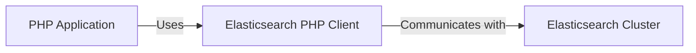
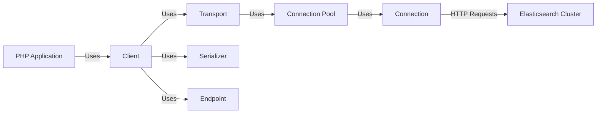

# BUSINESS POSTURE

Business Priorities and Goals:

The elasticsearch-php project aims to provide a community-driven, officially supported PHP client for Elasticsearch. This enables PHP developers to easily integrate with Elasticsearch for search and analytics capabilities within their applications. Key priorities include:

*   Providing a stable, reliable, and well-maintained client library.
*   Ensuring compatibility with various Elasticsearch versions.
*   Offering a user-friendly API that simplifies interaction with Elasticsearch.
*   Fostering a strong community around the client library.
*   Enabling efficient data indexing, searching, and analysis for PHP applications.

Business Risks:

*   Incompatibility with future Elasticsearch releases, breaking existing integrations.
*   Security vulnerabilities in the client library that could expose sensitive data or compromise applications.
*   Performance bottlenecks that limit the scalability of applications using the client.
*   Lack of community support and maintenance, leading to an outdated and unreliable client.
*   Bugs or errors in the client library that cause data loss or corruption.

# SECURITY POSTURE

Existing Security Controls:

*   security control: The project uses GitHub for version control and issue tracking, which provides some level of access control and auditability. (Described in GitHub repository)
*   security control: The project is open-source, allowing for community review and contributions, which can help identify and address security vulnerabilities. (Described in GitHub repository)
*   security control: The project includes unit and integration tests, which can help detect bugs and regressions that could lead to security issues. (Described in /tests directory)
*   security control: Composer is used for dependency management, allowing for tracking and updating of external libraries. (Described in composer.json)
*   security control: The client communicates with Elasticsearch, which itself has security features like authentication, authorization, and encryption. (Relies on Elasticsearch deployment configuration)

Accepted Risks:

*   accepted risk: The client library relies on the security configuration of the Elasticsearch cluster it connects to. Misconfiguration of Elasticsearch could expose data.
*   accepted risk: The client library may have undiscovered vulnerabilities that could be exploited.
*   accepted risk: Dependencies on external libraries could introduce vulnerabilities.

Recommended Security Controls:

*   security control: Implement static code analysis (SAST) to identify potential vulnerabilities during development.
*   security control: Implement dynamic application security testing (DAST) to test the running client for vulnerabilities.
*   security control: Conduct regular security audits and penetration testing.
*   security control: Establish a clear vulnerability disclosure and response process.
*   security control: Provide security documentation and guidance for users of the client library.
*   security control: Implement Software Composition Analysis (SCA) to identify and manage vulnerabilities in third-party dependencies.

Security Requirements:

*   Authentication:
    *   The client should support various authentication mechanisms provided by Elasticsearch, such as API keys, basic authentication, and token-based authentication.
    *   Sensitive credentials should be handled securely and not exposed in logs or error messages.

*   Authorization:
    *   The client should respect the authorization rules configured in Elasticsearch.
    *   The client should not attempt to bypass or circumvent Elasticsearch's security mechanisms.

*   Input Validation:
    *   The client should validate all user-provided input to prevent injection attacks, such as cross-site scripting (XSS) or Elasticsearch query injection.
    *   The client should sanitize data before sending it to Elasticsearch.

*   Cryptography:
    *   The client should use secure communication protocols (HTTPS) to encrypt data in transit.
    *   The client should support encryption at rest if required by the Elasticsearch cluster configuration.
    *   Cryptographic keys and certificates should be managed securely.

# DESIGN

## C4 CONTEXT

Element Descriptions:

*   Element 1:
    *   Name: PHP Application
    *   Type: Software System
    *   Description: A PHP application that utilizes the Elasticsearch PHP Client to interact with Elasticsearch.
    *   Responsibilities:
        *   Sending requests to Elasticsearch via the client library.
        *   Processing responses from Elasticsearch.
        *   Handling user interactions and data.
    *   Security controls:
        *   Input validation.
        *   Output encoding.
        *   Authentication and authorization mechanisms.

*   Element 2:
    *   Name: Elasticsearch PHP Client
    *   Type: Software System
    *   Description: The official PHP client library for Elasticsearch.
    *   Responsibilities:
        *   Providing an API for interacting with Elasticsearch.
        *   Handling communication with the Elasticsearch cluster.
        *   Serializing and deserializing data.
    *   Security controls:
        *   Secure communication (HTTPS).
        *   Support for Elasticsearch authentication mechanisms.

*   Element 3:
    *   Name: Elasticsearch Cluster
    *   Type: Software System
    *   Description: A cluster of Elasticsearch nodes that store and manage data.
    *   Responsibilities:
        *   Storing and indexing data.
        *   Handling search and aggregation requests.
        *   Providing data management and analysis capabilities.
    *   Security controls:
        *   Authentication and authorization.
        *   Encryption in transit and at rest.
        *   Access control and auditing.

## C4 CONTAINER

Element Descriptions:

*   Element 1:
    *   Name: Client
    *   Type: Container
    *   Description: The main entry point for interacting with Elasticsearch. Provides a high-level API for common operations.
    *   Responsibilities:
        *   Managing the connection to Elasticsearch.
        *   Providing methods for indexing, searching, and managing data.
        *   Handling errors and retries.
    *   Security controls:
        *   Uses secure transport.
        *   Supports authentication mechanisms.

*   Element 2:
    *   Name: Transport
    *   Type: Container
    *   Description: Handles the communication with the Elasticsearch cluster.
    *   Responsibilities:
        *   Sending requests to Elasticsearch.
        *   Receiving responses from Elasticsearch.
        *   Managing connections and retries.
    *   Security controls:
        *   Uses secure communication protocols (HTTPS).

*   Element 3:
    *   Name: Connection Pool
    *   Type: Container
    *   Description: Manages a pool of connections to Elasticsearch nodes.
    *   Responsibilities:
        *   Selecting the appropriate connection for a request.
        *   Handling connection failures and retries.
    *   Security controls:
        *   Monitors connection health.

*   Element 4:
    *   Name: Connection
    *   Type: Container
    *   Description: Represents a single connection to an Elasticsearch node.
    *   Responsibilities:
        *   Sending HTTP requests to Elasticsearch.
        *   Receiving HTTP responses from Elasticsearch.
    *   Security controls:
        *   Uses secure communication protocols (HTTPS).

*   Element 5:
    *   Name: Elasticsearch Cluster
    *   Type: Software System
    *   Description: A cluster of Elasticsearch nodes.
    *   Responsibilities:
        *   Storing and indexing data.
        *   Handling search and aggregation requests.
    *   Security controls:
        *   Authentication and authorization.
        *   Encryption in transit and at rest.

*   Element 6:
    *   Name: Serializer
    *   Type: Container
    *   Description: Handles the serialization and deserialization of data between PHP objects and JSON.
    *   Responsibilities:
        *   Converting PHP objects to JSON for sending to Elasticsearch.
        *   Converting JSON responses from Elasticsearch to PHP objects.
    *   Security controls:
        *   Uses a secure JSON library.

*   Element 7:
    *   Name: Endpoint
    *   Type: Container
    *   Description: Represents a specific Elasticsearch API endpoint.
    *   Responsibilities:
        *   Defining the request format for a specific API endpoint.
        *   Validating request parameters.
    *   Security controls:
        *   Input validation.

## DEPLOYMENT

Possible deployment solutions:

1.  Traditional LAMP/LEMP stack: PHP application and Elasticsearch client deployed on a server running Apache/Nginx, MySQL, and PHP.
2.  Dockerized deployment: PHP application, Elasticsearch client, and Elasticsearch cluster deployed as Docker containers.
3.  Cloud-based deployment: PHP application and Elasticsearch client deployed on a cloud platform like AWS, Google Cloud, or Azure, using managed services for Elasticsearch (e.g., Amazon OpenSearch Service).

Chosen deployment solution (Dockerized deployment):

```mermaid
graph LR
    Developer["Developer"] -- "Commits code" --> Git["Git Repository"]
    Git -- "Triggers build" --> CI["CI/CD Pipeline"]
    CI -- "Builds Docker image" --> DockerImage["Docker Image"]
    DockerImage -- "Pushed to" --> Registry["Docker Registry"]
    Registry -- "Pulled by" --> Orchestrator["Orchestrator (e.g., Kubernetes)"]
    Orchestrator -- "Deploys" --> PHPAppContainer["PHP Application Container"]
    Orchestrator -- "Deploys" --> ESContainer["Elasticsearch Container"]
    PHPAppContainer -- "Connects to" --> ESContainer

```

Element Descriptions:

*   Element 1:
    *   Name: Developer
    *   Type: Person
    *   Description: A developer working on the PHP application or the Elasticsearch client.
    *   Responsibilities: Writing code, committing changes, and testing.
    *   Security controls: Access controls to the Git repository.

*   Element 2:
    *   Name: Git Repository
    *   Type: System
    *   Description: A version control system storing the code for the PHP application and the Elasticsearch client.
    *   Responsibilities: Storing code, tracking changes, and managing versions.
    *   Security controls: Access controls, audit logs.

*   Element 3:
    *   Name: CI/CD Pipeline
    *   Type: System
    *   Description: An automated pipeline for building, testing, and deploying the application.
    *   Responsibilities: Running tests, building Docker images, and pushing images to a registry.
    *   Security controls: Secure access to the pipeline, vulnerability scanning.

*   Element 4:
    *   Name: Docker Image
    *   Type: Artifact
    *   Description: A packaged version of the PHP application and the Elasticsearch client.
    *   Responsibilities: Containing all necessary dependencies and configurations.
    *   Security controls: Image signing, vulnerability scanning.

*   Element 5:
    *   Name: Docker Registry
    *   Type: System
    *   Description: A repository for storing Docker images.
    *   Responsibilities: Storing and distributing Docker images.
    *   Security controls: Access controls, vulnerability scanning.

*   Element 6:
    *   Name: Orchestrator (e.g., Kubernetes)
    *   Type: System
    *   Description: A system for managing and orchestrating containers.
    *   Responsibilities: Deploying, scaling, and managing containers.
    *   Security controls: Network policies, access controls, resource quotas.

*   Element 7:
    *   Name: PHP Application Container
    *   Type: Container
    *   Description: A running instance of the PHP application and the Elasticsearch client.
    *   Responsibilities: Handling requests, interacting with Elasticsearch.
    *   Security controls: Network isolation, resource limits.

*   Element 8:
    *   Name: Elasticsearch Container
    *   Type: Container
    *   Description: A running instance of Elasticsearch.
    *   Responsibilities: Storing and managing data, handling search requests.
    *   Security controls: Authentication, authorization, encryption.

## BUILD

```mermaid
graph LR
    Developer["Developer"] -- "Commits code" --> Git["Git Repository"]
    Git -- "Webhook trigger" --> CI_Server["CI Server (e.g., GitHub Actions)"]
    CI_Server -- "Clone repository" --> Workspace["Workspace"]
    Workspace -- "Install dependencies (Composer)" --> Dependencies["Dependencies"]
    Dependencies -- "Run tests (PHPUnit)" --> TestResults["Test Results"]
    TestResults -- "If passed" --> BuildArtifact["Build Artifact (Composer Package)"]
    BuildArtifact -- "Publish to" --> PackageRepository["Package Repository (Packagist)"]
    PackageRepository -- "Available for" --> Application["Application Deployment"]
    Workspace -- "Run SAST" --> SAST_Results["SAST Results"]
    SAST_Results -- "Report" --> Security_Dashboard["Security Dashboard"]
```

Build Process Description:

1.  A developer commits code changes to the Git repository.
2.  A webhook triggers the CI server (e.g., GitHub Actions).
3.  The CI server clones the repository into a workspace.
4.  Composer is used to install project dependencies.
5.  PHPUnit is used to run unit and integration tests.
6.  If the tests pass, a build artifact (Composer package) is created.
7.  The build artifact is published to a package repository (Packagist).
8.  SAST tools are executed to scan code for security vulnerabilities.
9.  SAST results are reported to a security dashboard.

Security Controls:

*   security control: Composer.lock file ensures consistent and reproducible builds, reducing the risk of dependency-related vulnerabilities.
*   security control: Automated testing (PHPUnit) helps identify bugs and regressions that could lead to security issues.
*   security control: SAST tools (e.g., Psalm, Phan) are integrated into the build process to detect potential vulnerabilities.
*   security control: The build process is automated, reducing the risk of manual errors and ensuring consistency.
*   security control: Build artifacts are published to a trusted package repository (Packagist).

# RISK ASSESSMENT

Critical Business Processes:

*   Data indexing: Ensuring that data is correctly and efficiently indexed in Elasticsearch.
*   Data searching: Providing accurate and fast search results to users.
*   Data analysis: Enabling users to perform complex analysis and aggregations on their data.
*   Application availability: Maintaining the uptime and responsiveness of applications that rely on Elasticsearch.

Data Sensitivity:

The sensitivity of the data handled by the Elasticsearch PHP client depends on the specific application and the data it stores in Elasticsearch. The data could range from:

*   Publicly available information (low sensitivity).
*   Internal business data (medium sensitivity).
*   Personally identifiable information (PII) or sensitive personal information (SPI) (high sensitivity).
*   Financial data or other highly regulated data (very high sensitivity).

The client itself doesn't inherently define data sensitivity; it's a conduit. The connected Elasticsearch cluster and the application using the client determine the sensitivity.

# QUESTIONS & ASSUMPTIONS

Questions:

*   What specific versions of Elasticsearch are targeted for support?
*   What are the performance requirements for the client library?
*   What are the expected usage patterns (e.g., high-volume indexing, complex queries)?
*   Are there any specific security certifications or compliance requirements (e.g., GDPR, HIPAA)?
*   What is the process for handling security vulnerabilities reported by the community?
*   What level of logging and monitoring is required for the client library?
*   Are there any plans to support asynchronous operations?

Assumptions:

*   BUSINESS POSTURE: The project prioritizes stability, reliability, and community support over rapid feature development.
*   BUSINESS POSTURE: The project aims to be compatible with a wide range of Elasticsearch versions.
*   SECURITY POSTURE: The Elasticsearch cluster is properly secured and configured.
*   SECURITY POSTURE: Developers using the client library are aware of basic security best practices.
*   DESIGN: The client library will be used in a variety of PHP applications and environments.
*   DESIGN: The primary use case is for synchronous operations.
*   DESIGN: The client will rely on Elasticsearch's built-in features for data security (encryption, access control).