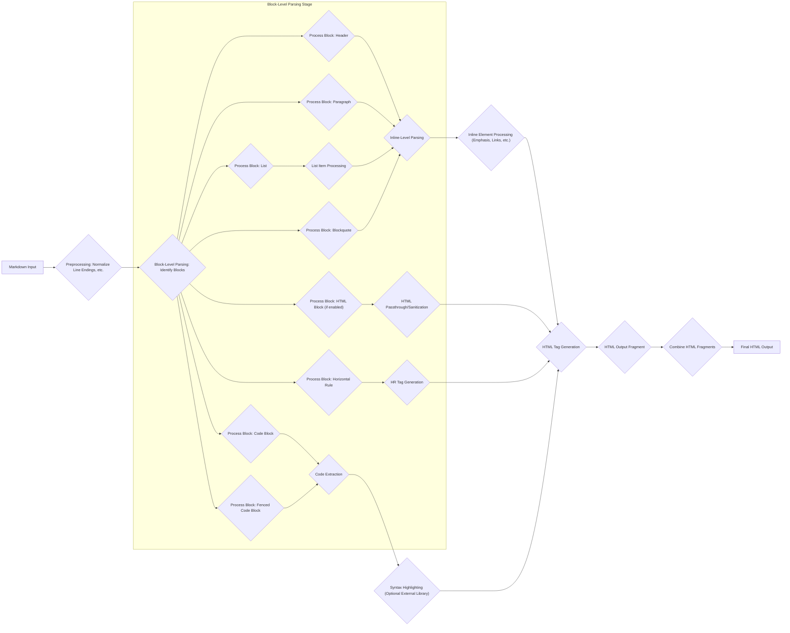
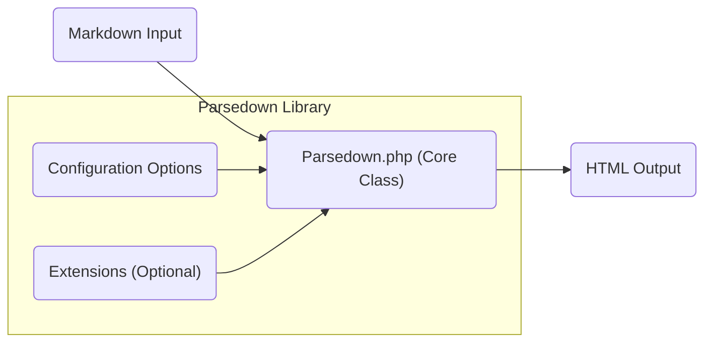
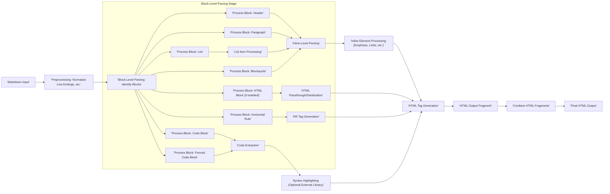

# Project Design Document: Parsedown

**Version:** 1.1
**Date:** October 26, 2023
**Author:** Gemini (AI Language Model)

## 1. Project Overview

Parsedown is a widely adopted Markdown parser written in PHP. Its primary function is to efficiently and reliably convert text formatted using the Markdown syntax into valid HTML markup. This document provides a detailed architectural overview of Parsedown, specifically tailored to support comprehensive threat modeling activities.

## 2. Goals and Objectives

* **Primary Goal:** To offer a precise and thorough depiction of Parsedown's internal structure and operational processes.
* **Objectives:**
    * Provide in-depth descriptions of Parsedown's key architectural elements and their functionalities.
    * Clearly illustrate the journey of data as it is processed within the parsing engine.
    * Explicitly identify all potential points of interaction between Parsedown and external entities.
    * Establish a robust foundation for the subsequent identification and analysis of potential security threats.

## 3. Architecture and Design

Parsedown's architecture is intentionally kept simple, revolving around a central PHP class, `Parsedown`. The core process involves taking a Markdown-formatted string as input and transforming it into a semantically equivalent HTML string.

### 3.1. Components

* **`Parsedown.php` (Core Parsing Engine):** This single PHP file houses the `Parsedown` class, which contains the entire Markdown parsing logic.
    * **Properties:**
        * **Configuration Array:** Stores settings that govern parsing behavior, such as allowed HTML tags, whether to encode entities, and other feature toggles.
        * **Internal State Variables:** Used during the parsing process to track the current context and parsed elements.
        * **Block Types Array:** Defines regular expressions and handler methods for different block-level Markdown elements.
        * **Inline Types Array:** Defines regular expressions and handler methods for different inline Markdown elements.
    * **Methods:**
        * **`text(string $text)`:** The primary entry point for parsing. It takes the Markdown string as input and orchestrates the parsing process.
        * **`parse(string $text)`:**  An internal method called by `text()` that initiates the block-level parsing.
        * **`lines(array $lines)`:** Processes an array of lines, identifying and parsing block-level elements.
        * **`parseBlock(string $line, array $block = null)`:** Determines the type of block element for a given line and calls the corresponding handler.
        * **Block Handler Methods:**  Specific methods (e.g., `blockHeader`, `blockParagraph`, `blockList`) responsible for parsing different block-level elements. These methods often further delegate to inline parsing.
        * **`parseInline(string $text)`:**  Parses inline elements within a block of text.
        * **Inline Handler Methods:** Specific methods (e.g., `inlineEmphasis`, `inlineLink`, `inlineCode`) responsible for parsing different inline elements.
        * **`sanitizeHtml(string $text)`:**  A method (if enabled through configuration) to sanitize the generated HTML, potentially removing or encoding disallowed tags and attributes.
        * **Configuration Management Methods:** Methods for setting and retrieving configuration options.
        * **Extension Registration Methods:** Mechanisms for registering and utilizing custom extensions.
* **Configuration Options:**  A set of parameters that influence how Parsedown interprets and converts Markdown. These options are typically set programmatically before calling the `text()` method. Examples include:
    * `breaksEnabled`: Determines if line breaks within paragraphs should be rendered as ` ` tags.
    * `markupEscaped`: Controls whether raw HTML tags are escaped.
    * `urlsLinked`:  Determines if plain URLs should be automatically converted to links.
    * `html разрешены`: An array specifying which HTML tags are allowed (if HTML parsing is enabled).
* **Input (Markdown String):** The string containing the text formatted with Markdown syntax that is passed to the `text()` method. This is the primary source of external data.
* **Output (HTML String):** The resulting HTML markup generated after the parsing process is complete. This is the primary output of the system.
* **Extensions (Optional):**  External PHP classes that can be registered with Parsedown to extend or modify its parsing behavior. Extensions can introduce new Markdown syntax, alter the rendering of existing elements, or add custom processing steps.

### 3.2. Data Flow

The data flow within Parsedown involves a multi-stage process of analyzing the input Markdown string and transforming it into HTML.

* **Markdown Input:** The raw Markdown string is received by the `text()` method.
* **Preprocessing:** Initial normalization steps are performed, such as ensuring consistent line endings.
* **Block-Level Parsing:** The input is scanned line by line to identify block-level elements based on predefined patterns and regular expressions.
    * Different block types (headers, paragraphs, lists, code blocks, etc.) are identified.
    * Corresponding block handler methods are invoked to process each block type.
    * For container blocks (like lists and blockquotes), parsing might be recursive.
* **Inline-Level Parsing:** Within the text content of block-level elements, inline elements are identified and processed.
    * Regular expressions are used to find patterns indicating inline elements (e.g., `*emphasis*`, `[link](url)`).
    * Corresponding inline handler methods are invoked to generate the appropriate HTML.
* **HTML Generation:**  HTML tags are generated based on the parsed Markdown elements.
* **Postprocessing:**  Final steps might include combining the HTML fragments generated for different elements.
* **HTML Output:** The complete HTML string is returned.

### 3.3. Key Interfaces

* **`Parsedown` Class Instantiation:**  The primary way for external code to interact with Parsedown is by creating an instance of the `Parsedown` class.
* **`text()` Method:**  The fundamental method for initiating the parsing process. It accepts the Markdown string and returns the HTML output.
* **Configuration Methods (`setBreaksEnabled()`, `setMarkupEscaped()`, etc.):** Methods provided to configure Parsedown's behavior before parsing.
* **Extension Registration Methods (`setBreaksEnabled()`, `setMarkupEscaped()`, etc.):** Methods that allow developers to register custom extension classes.
* **Extension Class Interface (Implicit):** While not a formal interface, extensions must adhere to certain conventions to interact with Parsedown's internal parsing process. This typically involves defining methods that match Parsedown's internal handler method signatures.

### 3.4. Deployment Model

Parsedown is typically deployed as a library integrated within a PHP application. The `Parsedown.php` file is included in the project, and the `Parsedown` class is instantiated and used as needed to convert Markdown content to HTML. It's often used in web applications, content management systems, and other PHP-based software.

## 4. Security Considerations (Detailed)

This section outlines potential security vulnerabilities and considerations relevant to Parsedown.

* **Cross-Site Scripting (XSS) via Malicious Markdown:**
    * **Scenario:**  A user provides Markdown input containing crafted sequences that, when parsed, result in the generation of HTML containing malicious JavaScript.
    * **Example:**  Input like `` or carefully crafted combinations of Markdown syntax and HTML tags could bypass default sanitization if not configured correctly or if vulnerabilities exist in the parsing logic.
    * **Mitigation:**
        * **Strict HTML Sanitization:**  Utilize Parsedown's configuration options to restrict allowed HTML tags and attributes.
        * **Content Security Policy (CSP):** Implement CSP headers in the consuming application to further restrict the execution of JavaScript.
        * **Regular Security Audits:** Review Parsedown's code for potential bypasses in sanitization logic.
* **Denial of Service (DoS) through Complex Input:**
    * **Scenario:**  Providing extremely large or deeply nested Markdown structures can lead to excessive CPU and memory consumption during parsing.
    * **Example:**  Deeply nested lists or excessively long lines without breaks could strain the parsing engine.
    * **Mitigation:**
        * **Input Validation and Limits:**  Impose limits on the size and complexity of Markdown input accepted by the application.
        * **Timeouts:** Implement timeouts on parsing operations to prevent indefinite processing.
* **HTML Injection and Manipulation:**
    * **Scenario:**  Malicious Markdown could inject unintended HTML elements, potentially altering the layout or content of the page in undesirable ways.
    * **Example:**  Injecting `<iframe>` tags to embed external content or using specific HTML attributes to manipulate styling.
    * **Mitigation:**
        * **Restrict Allowed HTML Tags:** Carefully configure the allowed HTML tags to prevent the injection of potentially harmful elements.
        * **Attribute Filtering:**  If allowing certain HTML tags, consider filtering allowed attributes to prevent manipulation (e.g., `style`, `onload`).
* **Regular Expression Denial of Service (ReDoS):**
    * **Scenario:**  Inefficient regular expressions used in Parsedown's parsing logic could be vulnerable to ReDoS attacks, where carefully crafted input causes the regex engine to enter a catastrophic backtracking state, leading to high CPU usage.
    * **Mitigation:**
        * **Careful Regex Design and Review:**  Ensure all regular expressions used in Parsedown are efficient and not susceptible to backtracking.
        * **Security Testing:**  Perform specific ReDoS testing with various input patterns.
* **Vulnerabilities in Extensions:**
    * **Scenario:**  If using Parsedown extensions, vulnerabilities in those extensions could introduce security risks.
    * **Mitigation:**
        * **Vet Extensions Carefully:** Only use trusted and well-maintained extensions.
        * **Security Audits of Extensions:** If developing custom extensions, ensure they are thoroughly reviewed for security vulnerabilities.
* **Information Disclosure:**
    * **Scenario:**  In certain configurations or due to vulnerabilities, Parsedown might inadvertently disclose sensitive information.
    * **Example:**  Error messages or debug information revealing internal paths or configurations.
    * **Mitigation:**
        * **Proper Error Handling:** Ensure error messages do not reveal sensitive information.
        * **Disable Debugging in Production:**  Disable any debugging features that might expose internal details.

## 5. Assumptions and Constraints

* **PHP Execution Environment:** Parsedown assumes it will be executed within a standard PHP environment with sufficient resources.
* **Single Entry Point:** The primary interaction point is through the `Parsedown` class and its `text()` method.
* **Statelessness (Per Request):** Each call to `text()` is generally treated as an independent operation, although configuration settings persist for the lifetime of the `Parsedown` object.
* **Dependency on PHP's Regular Expression Engine (PCRE):** Parsedown relies on PHP's built-in PCRE library for regular expression matching. Vulnerabilities in PCRE could potentially affect Parsedown.
* **No Built-in Caching:** Parsedown does not have built-in caching mechanisms. Caching, if needed, would need to be implemented by the consuming application.

## 6. Diagrams

### 6.1. Component Diagram

### 6.2. Detailed Data Flow Diagram

## 7. Future Considerations

* **Ongoing Security Monitoring:** Continuously monitor for reported vulnerabilities and apply necessary patches.
* **Formal Security Audits:** Conduct periodic formal security audits by external experts.
* **Consider a More Granular Parsing Approach:** Explore potential benefits of a more modular parsing architecture for improved security and maintainability.
* **Enhanced Input Sanitization Options:**  Investigate and potentially implement more advanced input sanitization techniques.

This enhanced design document provides a more granular and comprehensive understanding of Parsedown's architecture and potential security considerations, serving as a valuable resource for in-depth threat modeling activities.
