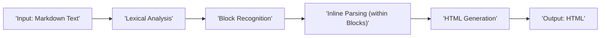
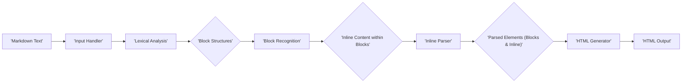

# Project Design Document: Parsedown

**Version:** 1.1
**Date:** October 26, 2023
**Author:** AI Software Architect

## 1. Project Overview

Parsedown is a fast, secure, and standards-compliant Markdown parser written in PHP. It converts Markdown formatted text into HTML. This document provides a detailed architectural overview of the Parsedown library, specifically designed to facilitate comprehensive threat modeling and security analysis.

## 2. Goals

*   Provide an in-depth architectural description of the Parsedown library's components and their interactions.
*   Clearly delineate the data flow and transformations within the library.
*   Identify potential security vulnerabilities and attack vectors based on the design.
*   Serve as a foundational document for subsequent threat modeling exercises and security assessments.
*   Offer insights into deployment considerations and best practices for secure integration.

## 3. Non-Goals

*   Detailed examination of the specific PHP code implementation within Parsedown's functions.
*   Performance benchmarking or optimization strategies for the parsing process.
*   Comparative analysis with other Markdown parsing libraries or their security profiles.
*   Specific implementation details of individual applications that utilize Parsedown.

## 4. Architecture Overview

Parsedown operates as a stateless, procedural library. It receives Markdown text as input and processes it through a series of defined steps to generate HTML output. The core mechanism involves iterating through the input text, identifying Markdown syntax elements using regular expressions and conditional logic, and then constructing the corresponding HTML tags.



## 5. Component Details

*   **Input Handler:** The initial entry point where the raw Markdown text string is received by the library. This component is responsible for accepting the input.
*   **Lexical Analysis:** This stage involves the initial processing of the input text, breaking it down into meaningful units or tokens. This might include:
    *   Normalization of line endings (e.g., converting `\r\n` to `\n`).
    *   Basic character encoding handling (assuming UTF-8).
    *   Potentially identifying the start of different Markdown elements based on initial characters or patterns.
*   **Block Recognition:**  The core of the parsing logic where the library identifies and categorizes block-level Markdown elements. This involves:
    *   Iterating through the lines of the input.
    *   Using regular expressions and conditional checks to identify elements like:
        *   Setext and atx headers (`=`, `-`, `#`).
        *   Paragraphs (default block type).
        *   Blockquotes (`>`).
        *   Ordered and unordered lists (`*`, `-`, `+`, `1.`).
        *   Fenced code blocks (` ``` `).
        *   Thematic breaks (`---`, `***`, `___`).
        *   HTML blocks (depending on configuration).
*   **Inline Parsing (within Blocks):** Once block elements are identified, this component processes the text *within* those blocks to identify and convert inline Markdown elements. This includes:
    *   Scanning the text within a block for patterns indicating:
        *   Emphasis and strong emphasis (`*`, `_`).
        *   Links (`[text](url)`, `[text][ref]`).
        *   Images (``, `![alt][ref]`).
        *   Code spans (`` ` ``).
        *   Line breaks (two or more trailing spaces).
        *   Escaped characters (`\`).
        *   Auto-links (`<http://...>`).
*   **HTML Generation:** This component takes the identified block and inline elements and constructs the corresponding HTML tags and attributes. This involves:
    *   Creating HTML elements based on the parsed Markdown structure.
    *   Escaping potentially unsafe characters in the content (e.g., `<`, `>`, `&`).
    *   Applying any configured HTML attributes or classes.
*   **Output Handler:** The final stage where the generated HTML string is returned by the library.
*   **Configuration Options:** Parsedown offers various configuration options to customize its behavior, including:
    *   `setBreaksEnabled()`: Controls whether line breaks should be converted to `<br />`.
    *   `setMarkupEscaped()`: Controls whether raw HTML markup should be escaped.
    *   `setUrlsLinked()`: Controls whether plain URLs should be automatically converted to links.
    *   `setSafeMode()`: A more aggressive escaping mode to prevent potentially harmful HTML.
    *   Custom extension registration for adding or modifying parsing rules.
*   **Error Handling:** While Parsedown aims for resilience, it handles potential issues by:
    *   Silently ignoring malformed Markdown syntax in many cases.
    *   Providing configuration options like `setSafeMode()` for stricter handling.
    *   Not throwing exceptions for most parsing errors, instead focusing on producing valid (though potentially unexpected) output.

## 6. Data Flow

The data flows sequentially through the Parsedown library, transforming the input Markdown text into HTML.

*   Raw Markdown text is received by the **Input Handler**.
*   The text is then passed to **Lexical Analysis** for initial processing and tokenization.
*   The tokenized input is processed by the **Block Recognition** component to identify block-level elements.
*   The content within each identified block is then passed to the **Inline Parsing** component to identify and process inline elements.
*   The identified block and inline elements are used by the **HTML Generation** component to construct the HTML structure.
*   Finally, the generated HTML string is returned by the **Output Handler**.



## 7. Security Considerations (Detailed)

Based on the design and functionality of Parsedown, the following security considerations are paramount:

*   **Cross-Site Scripting (XSS) via Malicious Markdown:**
    *   **Attack Vector:**  An attacker could inject Markdown syntax that, when parsed, results in the generation of malicious HTML (e.g., `<script>` tags, event handlers like `onload`).
    *   **Impact:**  Execution of arbitrary JavaScript in the user's browser, leading to session hijacking, data theft, or defacement.
    *   **Mitigation:**  Proper HTML escaping of user-provided content is crucial. Parsedown's `setSafeMode()` offers a more aggressive approach, but understanding its limitations is important. Contextual output encoding in the application using Parsedown is also vital.
*   **Denial of Service (DoS) through Complex Markdown:**
    *   **Attack Vector:**  Crafting Markdown input with deeply nested structures (e.g., many levels of lists or blockquotes) or extremely long lines can consume excessive server resources during parsing.
    *   **Impact:**  Slowdown or complete unavailability of the application due to resource exhaustion.
    *   **Mitigation:**  Implementing timeouts for parsing operations, limiting the size of input Markdown, and potentially using more efficient parsing algorithms or techniques.
*   **HTML Injection (Beyond Script Tags):**
    *   **Attack Vector:**  Even if `<script>` tags are escaped, attackers might inject other potentially harmful HTML elements or attributes (e.g., `<iframe>`, `<a>` with `rel="noopener"` missing, form elements).
    *   **Impact:**  Embedding external content, potentially leading to clickjacking or other forms of manipulation.
    *   **Mitigation:**  Careful filtering or sanitization of HTML output, potentially using an HTML sanitizer library in conjunction with Parsedown, especially when `setSafeMode()` is not sufficient or desired.
*   **Regular Expression Denial of Service (ReDoS):**
    *   **Attack Vector:**  If the regular expressions used for parsing are not carefully designed, attackers can craft input that causes excessive backtracking in the regex engine, leading to performance degradation or DoS.
    *   **Impact:**  Similar to DoS through complex Markdown, but specifically targeting the regex engine.
    *   **Mitigation:**  Thorough review and testing of regular expressions used in Parsedown to ensure they are not vulnerable to ReDoS.
*   **Security of Custom Extensions:**
    *   **Attack Vector:**  If Parsedown is extended with custom parsing rules, vulnerabilities in these extensions could introduce new attack vectors.
    *   **Impact:**  Depends on the nature of the vulnerability in the extension, potentially leading to XSS, code execution, or other issues.
    *   **Mitigation:**  Rigorous security review and testing of any custom Parsedown extensions. Clear guidelines and secure coding practices for extension development are essential.
*   **Configuration Vulnerabilities:**
    *   **Attack Vector:**  If the application using Parsedown allows user control over configuration options without proper validation, attackers might be able to bypass security measures (e.g., disabling safe mode).
    *   **Impact:**  Increased risk of XSS or other vulnerabilities.
    *   **Mitigation:**  Securely manage and validate Parsedown configuration options within the application. Avoid exposing these options directly to untrusted users.

## 8. Dependencies

*   **PHP:** Parsedown is written entirely in PHP and requires a compatible PHP interpreter to execute. The specific PHP version requirements should be considered for both functionality and security updates. It does not have any external library dependencies beyond the standard PHP library.

## 9. Deployment Considerations

Secure deployment of applications using Parsedown requires careful attention to how user input is handled and how the generated HTML is used.

*   **Secure Input Handling:**  Always treat user-provided Markdown as untrusted input. Implement robust input validation and sanitization *before* passing it to Parsedown.
*   **Contextual Output Encoding:**  The HTML generated by Parsedown should be properly encoded based on the context where it will be displayed (e.g., HTML escaping for web pages, different encoding for email).
*   **Regular Updates:** Keep Parsedown updated to the latest version to benefit from bug fixes, security patches, and potential improvements to its security mechanisms.
*   **Consider `setSafeMode()`:**  Evaluate whether Parsedown's `setSafeMode()` is appropriate for the application's security requirements. Understand its limitations and what HTML constructs it allows and disallows.
*   **Content Security Policy (CSP):**  Implement a strong Content Security Policy to mitigate the impact of potential XSS vulnerabilities, even if Parsedown and the application have taken precautions.
*   **HTML Sanitization as a Defense in Depth:**  Consider using a dedicated HTML sanitization library (like HTMLPurifier) on the output of Parsedown as an additional layer of security, especially if `setSafeMode()` is not sufficient or if more fine-grained control over allowed HTML is needed.
*   **Resource Limits:**  Implement resource limits (e.g., execution time, memory usage) for the parsing process to mitigate potential DoS attacks.

## 10. Future Considerations

*   **Formal Security Audits:**  Regular, independent security audits of the Parsedown codebase are crucial for identifying and addressing potential vulnerabilities proactively.
*   **Improved ReDoS Protection:**  Investigate and implement more robust techniques to prevent ReDoS attacks, potentially through more efficient regex design or alternative parsing strategies.
*   **Granular Control over Allowed HTML:**  Explore options for more fine-grained control over the HTML elements and attributes allowed by Parsedown, beyond the basic `setSafeMode()`.
*   **Standardized Extension Security API:**  If Parsedown continues to support extensions, a more formalized and secure API for extension development could help prevent vulnerabilities in custom extensions.
*   **Integration with Security Analysis Tools:**  Consider how Parsedown could be better integrated with static and dynamic security analysis tools to automate vulnerability detection.

This revised document provides a more detailed and nuanced understanding of Parsedown's architecture and security considerations, offering a stronger foundation for effective threat modeling and secure application development.