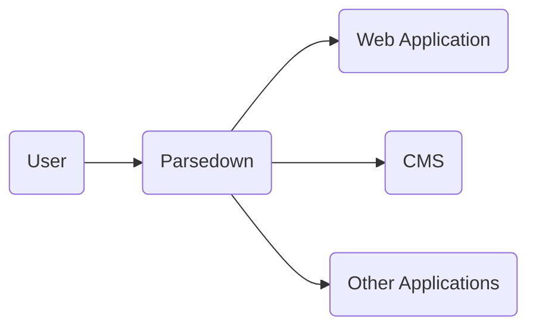
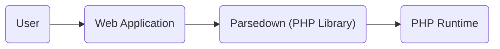
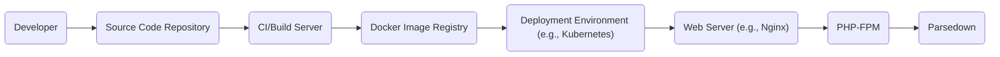
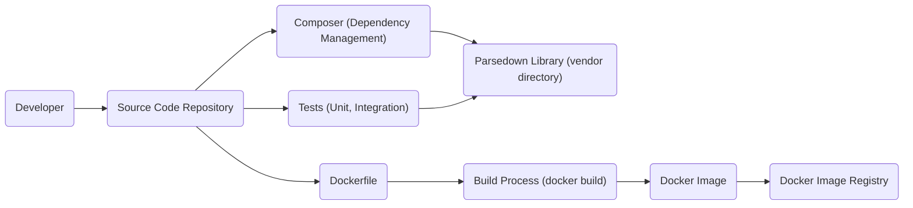

Okay, let's create a design document for the Parsedown project.

# BUSINESS POSTURE

Parsedown is a Markdown parser library written in PHP.  It's designed for speed and extensibility.  The primary business goal is to provide a reliable and fast way to convert Markdown text into HTML.  It's used in a wide variety of applications, from content management systems to simple websites.  Given its open-source nature and wide adoption, the following business priorities and risks are identified:

Priorities:

*   Maintainability:  The project must be easy to maintain and update, given its reliance by many other projects.
*   Performance:  Speed of parsing is a key selling point, so performance regressions must be avoided.
*   Extensibility:  The ability to extend Parsedown with custom functionality is important for its user base.
*   Compatibility:  Maintaining broad compatibility with different PHP versions and environments is crucial.
*   Community:  Foster a healthy open-source community to encourage contributions and bug reports.

Business Risks:

*   Security Vulnerabilities:  As a parser, vulnerabilities like XSS (Cross-Site Scripting) could have significant consequences for applications using Parsedown. This is the most critical risk.
*   Reputation Damage:  Security vulnerabilities or major bugs could damage the reputation of the library and lead to users switching to alternatives.
*   Maintenance Burden:  If the codebase becomes difficult to maintain, it could lead to slow response times for bug fixes and security updates.
*   Dependency Issues:  Reliance on outdated or vulnerable dependencies could introduce security risks.
*   Lack of Adoption: While currently popular, a decline in adoption could lead to a decrease in community support and maintenance.

# SECURITY POSTURE

Existing Security Controls:

*   security control: Input Validation: Parsedown performs input validation to prevent common Markdown-related vulnerabilities. (Implemented in the Parsedown code itself.)
*   security control: Escaping: Parsedown escapes HTML entities to prevent XSS attacks. (Implemented in the Parsedown code itself.)
*   security control: Regular Updates: The project maintainer releases updates to address bugs and security vulnerabilities. (Evidenced by the GitHub repository's commit history and releases.)
*   security control: Community Scrutiny: Being open-source, the code is subject to scrutiny by the community, which can help identify vulnerabilities. (Evidenced by the GitHub issues and pull requests.)
*   security control: Safe by default: Parsedown escapes HTML by default. (Implemented in the Parsedown code itself.)

Accepted Risks:

*   accepted risk: Limited Sanitization of Custom Extensions: While Parsedown itself is secure, custom extensions created by users might introduce vulnerabilities. This is a responsibility of the extension developers.
*   accepted risk: Reliance on PHP's Security: Parsedown relies on the underlying security of the PHP environment. Vulnerabilities in PHP itself could impact Parsedown.

Recommended Security Controls:

*   security control: Content Security Policy (CSP) Guidance: Provide clear documentation and examples on how to use CSP with Parsedown to mitigate XSS risks further. This should be included in the project's README or documentation.
*   security control: Regular Security Audits: Conduct periodic security audits, either internally or by a third-party, to identify potential vulnerabilities.
*   security control: Dependency Scanning: Implement automated dependency scanning to identify and address vulnerabilities in third-party libraries.
*   security control: Fuzz Testing: Integrate fuzz testing into the development process to discover unexpected vulnerabilities.

Security Requirements:

*   Authentication: Not applicable, as Parsedown is a library and does not handle authentication.
*   Authorization: Not applicable, as Parsedown is a library and does not handle authorization.
*   Input Validation:
    *   Must sanitize all Markdown input to prevent XSS vulnerabilities.
    *   Must handle potentially malicious Markdown constructs safely.
    *   Must provide mechanisms for users to customize input sanitization if needed (with appropriate warnings).
*   Cryptography: Not directly applicable, but if Parsedown is used to process encrypted data, it should not interfere with the encryption/decryption process. Parsedown should treat encrypted data as plain text and not attempt to interpret it.
*   Output Encoding:
    *   Must properly escape HTML output to prevent XSS.
    *   Should provide options for different escaping strategies (e.g., HTML entities, attribute encoding).

# DESIGN

## C4 CONTEXT

Element Descriptions:

*   Element:
    *   Name: User
    *   Type: Person
    *   Description: A person interacting with an application that uses Parsedown.
    *   Responsibilities: Provides Markdown input, views HTML output.
    *   Security controls: None (relies on application-level security).

*   Element:
    *   Name: Parsedown
    *   Type: Software System
    *   Description: The Parsedown Markdown parser library.
    *   Responsibilities: Converts Markdown text to HTML.
    *   Security controls: Input validation, HTML escaping, safe by default.

*   Element:
    *   Name: Web Application
    *   Type: Software System
    *   Description: A web application that utilizes Parsedown.
    *   Responsibilities: Integrates Parsedown, handles user input and output, implements application-specific logic.
    *   Security controls: Application-level security controls (e.g., authentication, authorization, CSP).

*   Element:
    *   Name: CMS
    *   Type: Software System
    *   Description: A Content Management System that uses Parsedown.
    *   Responsibilities: Manages content, uses Parsedown for Markdown rendering.
    *   Security controls: CMS-specific security controls, plus those inherited from using Parsedown.

*   Element:
    *   Name: Other Applications
    *   Type: Software System
    *   Description: Other types of applications that might use Parsedown (e.g., command-line tools, desktop applications).
    *   Responsibilities: Varies depending on the application.
    *   Security controls: Application-specific security controls.

## C4 CONTAINER

Since Parsedown is a single library, the container diagram is essentially the same as the context diagram, with the addition of the PHP runtime.

Element Descriptions:

*   Element:
    *   Name: User
    *   Type: Person
    *   Description: A person interacting with a web application.
    *   Responsibilities: Provides input, views output.
    *   Security controls: None (relies on application-level security).

*   Element:
    *   Name: Web Application
    *   Type: Software System
    *   Description: A web application that utilizes Parsedown.
    *   Responsibilities: Integrates Parsedown, handles user input and output.
    *   Security controls: Application-level security controls (e.g., authentication, authorization, CSP).

*   Element:
    *   Name: Parsedown (PHP Library)
    *   Type: Container (Library)
    *   Description: The Parsedown library code.
    *   Responsibilities: Parses Markdown input, generates HTML output.
    *   Security controls: Input validation, HTML escaping.

*   Element:
    *   Name: PHP Runtime
    *   Type: Container (Runtime Environment)
    *   Description: The PHP runtime environment.
    *   Responsibilities: Executes the Parsedown code.
    *   Security controls: PHP's built-in security features, server configuration.

## DEPLOYMENT

Parsedown, being a PHP library, is typically deployed as part of a larger PHP application.  There are several deployment models:

1.  **Traditional Web Server:**  The application (including Parsedown) is deployed to a web server like Apache or Nginx, with PHP configured as a module (e.g., mod_php) or via FastCGI (e.g., PHP-FPM).
2.  **Cloud Platforms (PaaS):** Platforms like Heroku, AWS Elastic Beanstalk, or Google App Engine provide managed environments where the application can be deployed.  PHP is typically configured as a buildpack or runtime environment.
3.  **Containers (Docker):** The application and its dependencies (including Parsedown and PHP) are packaged into a Docker container, which can be deployed to various container orchestration platforms (e.g., Kubernetes, Docker Swarm, AWS ECS).
4.  **Serverless:** While less common for traditional PHP applications, it's possible to use Parsedown within a serverless function (e.g., AWS Lambda with a PHP layer).

We'll describe the **Containers (Docker)** deployment model in detail, as it offers good isolation and portability:

Element Descriptions:

*   Element:
    *   Name: Developer
    *   Type: Person
    *   Description: Develops the application code that uses Parsedown.
    *   Responsibilities: Writes code, commits to the repository.
    *   Security controls: Code review, secure coding practices.

*   Element:
    *   Name: Source Code Repository
    *   Type: System
    *   Description: Stores the application's source code (e.g., GitHub, GitLab).
    *   Responsibilities: Version control, access control.
    *   Security controls: Access controls, branch protection rules.

*   Element:
    *   Name: CI/Build Server
    *   Type: System
    *   Description: Builds the Docker image (e.g., Jenkins, GitLab CI, GitHub Actions).
    *   Responsibilities: Runs tests, builds the image, pushes to the registry.
    *   Security controls: Secure build environment, dependency scanning.

*   Element:
    *   Name: Docker Image Registry
    *   Type: System
    *   Description: Stores the built Docker image (e.g., Docker Hub, AWS ECR).
    *   Responsibilities: Image storage, access control.
    *   Security controls: Access controls, image scanning.

*   Element:
    *   Name: Deployment Environment (e.g., Kubernetes)
    *   Type: System
    *   Description: Orchestrates the deployment of the Docker container.
    *   Responsibilities: Manages container lifecycle, scaling, networking.
    *   Security controls: Network policies, resource quotas, RBAC.

*   Element:
    *   Name: Web Server (e.g., Nginx)
    *   Type: Container
    *   Description: Serves the web application.
    *   Responsibilities: Handles HTTP requests, forwards requests to PHP-FPM.
    *   Security controls: Web server configuration, TLS encryption.

*   Element:
    *   Name: PHP-FPM
    *   Type: Container
    *   Description: Executes the PHP code.
    *   Responsibilities: Processes PHP requests, interacts with Parsedown.
    *   Security controls: PHP configuration, resource limits.

*   Element:
    *   Name: Parsedown
    *   Type: Library
    *   Description: The Parsedown library.
    *   Responsibilities: Parses Markdown.
    *   Security controls: Input validation, HTML escaping.

## BUILD

The build process for an application using Parsedown typically involves the following steps:

1.  **Dependency Management:**  Composer is used to manage PHP dependencies, including Parsedown.  The `composer.json` file specifies the required version of Parsedown.  `composer install` downloads Parsedown and its dependencies into the `vendor` directory.
2.  **Code Integration:** The application code includes Parsedown using `require_once 'vendor/autoload.php';` or similar.
3.  **Testing:** Unit tests and integration tests are run to verify the functionality of Parsedown and its integration with the application.
4.  **Containerization (if applicable):** A Dockerfile is used to create a Docker image.  This file typically includes instructions to:
    *   Use a base PHP image (e.g., `php:fpm`).
    *   Copy the application code and the `vendor` directory into the image.
    *   Configure the web server (e.g., Nginx) and PHP-FPM.
5.  **Image Building:** The Docker image is built using `docker build`.
6.  **Image Pushing:** The Docker image is pushed to a container registry (e.g., Docker Hub, AWS ECR) using `docker push`.

Security Controls in the Build Process:

*   security control: Dependency Management with Composer: Using Composer helps ensure that the correct version of Parsedown is used and that dependencies are managed securely.
*   security control: Composer.lock: The `composer.lock` file locks the dependencies to specific versions, preventing unexpected updates that could introduce vulnerabilities.
*   security control: Automated Testing: Running unit and integration tests helps identify bugs and vulnerabilities early in the development process.
*   security control: Secure Dockerfile: The Dockerfile should be written securely, using minimal base images, avoiding unnecessary packages, and setting appropriate user permissions.
*   security control: Image Scanning: Docker images should be scanned for vulnerabilities before being pushed to the registry. Tools like Trivy, Clair, or Anchore can be used for this purpose.
*   security control: Supply Chain Security: Consider using tools and practices to ensure the integrity of the software supply chain, such as signing Docker images and verifying the provenance of dependencies.

# RISK ASSESSMENT

Critical Business Processes:

*   Rendering Markdown content reliably and securely.
*   Maintaining the availability and performance of applications that rely on Parsedown.
*   Protecting the reputation of the Parsedown project.

Data to Protect:

*   **User-provided Markdown content:** Sensitivity varies depending on the application. Could range from public blog posts to private internal documents. The primary concern is preventing XSS attacks through malicious Markdown.
*   **Application data:** Parsedown itself doesn't store application data, but vulnerabilities in Parsedown could be exploited to gain access to application data.
*   **Source code:** The Parsedown source code itself is publicly available, but unauthorized modifications could introduce vulnerabilities.

# QUESTIONS & ASSUMPTIONS

Questions:

*   Are there any specific compliance requirements (e.g., PCI DSS, HIPAA) that apply to applications using Parsedown?
*   What is the expected volume of Markdown content to be processed? This can impact performance considerations.
*   Are there any specific security concerns or past incidents related to the use of Markdown parsers in the organization?
*   What is the process for reporting and handling security vulnerabilities in Parsedown?

Assumptions:

*   BUSINESS POSTURE: The primary goal is to provide a fast and secure Markdown parser. The project has a moderate risk appetite, balancing security with ease of use and extensibility.
*   SECURITY POSTURE: The existing security controls are adequate for basic protection, but additional measures (CSP guidance, security audits, dependency scanning) are recommended.
*   DESIGN: The deployment model will likely involve a web server and PHP, with containerization being a preferred option for modern deployments. The build process will use Composer for dependency management.