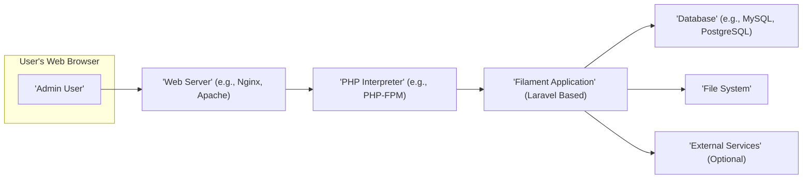
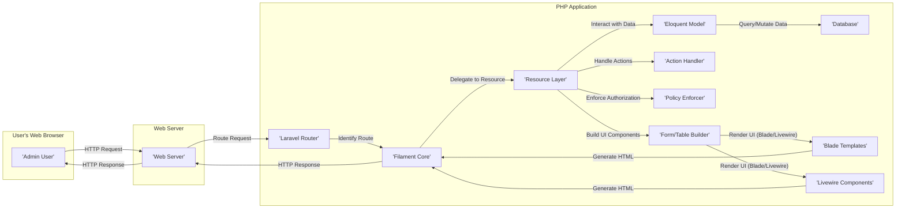
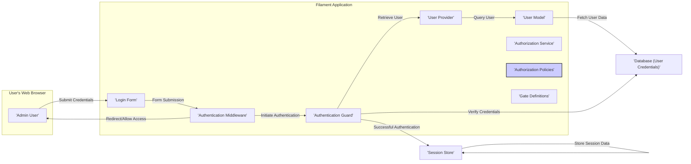

## Project Design Document: Filament Admin Panel Framework (Improved)

**1. Introduction**

This document provides an enhanced architectural design of the Filament admin panel framework (referenced from [https://github.com/filamentphp/filament](https://github.com/filamentphp/filament)). This improved design aims to offer a more granular understanding of the system's components, interactions, and data flow, specifically tailored for effective threat modeling. This document is intended for a diverse audience including developers, security engineers, DevOps personnel, and anyone involved in the lifecycle of applications built using Filament.

**2. Project Overview**

Filament is a rapid application development (RAD) framework built on Laravel, specifically designed for creating sophisticated admin panels. It abstracts away common UI complexities, allowing developers to concentrate on defining data structures and business logic. Filament provides a rich set of pre-built components and a flexible architecture for customization and extension.

**3. System Architecture**

Filament adheres to the Model-View-Controller (MVC) pattern inherited from Laravel, while introducing its own layers of abstraction and specialized components for admin panel development.

**3.1. High-Level Architecture Diagram**

**3.2. Component Breakdown (Detailed)**

*   **Admin User:** The human actor interacting with the Filament admin panel through a web browser. This user is assumed to have specific roles and permissions within the application.
*   **Web Browser:** The client-side application (e.g., Chrome, Firefox, Safari) used by the admin user to access and interact with the admin panel's user interface.
*   **Web Server:**  Handles incoming HTTP/HTTPS requests from the web browser and routes them to the appropriate backend process, typically the PHP interpreter.
*   **PHP Interpreter:** Executes the PHP code of the Filament application. This often involves a process manager like PHP-FPM for improved performance and stability.
*   **Filament Application (Laravel Based):** The core of the admin panel, built upon the Laravel framework and extended with Filament's specific packages and functionalities. Key sub-components include:
    *   **Core Laravel Framework:** Provides fundamental features like routing, middleware, service providers, dependency injection, and the Eloquent ORM.
    *   **Filament Packages:** A modular suite of packages providing the core Filament experience:
        *   **Admin Panel Core:** The central package that orchestrates the admin interface, navigation, and overall structure.
        *   **Forms:**  A powerful system for building dynamic forms with various field types, validation rules, and custom components.
        *   **Tables:** Components for displaying and managing data in interactive tables with features like sorting, filtering, searching, and bulk actions.
        *   **Notifications:** A system for displaying real-time notifications to users within the admin panel.
        *   **Actions:** Reusable units of logic that can be triggered from tables, forms, or other parts of the interface to perform specific operations.
        *   **Infolists:** Components for displaying read-only information in a structured and organized manner.
        *   **Widgets:** Customizable dashboard components that can display key metrics, charts, or other relevant information.
        *   **Navigation:**  Manages the structure and rendering of the admin panel's navigation menu, often based on user roles and permissions.
        *   **Authentication & Authorization:**  Handles user login, logout, session management, and integrates with Laravel's authorization features (gates and policies).
        *   **Resources:**  A central concept in Filament that defines how data models are presented and managed within the admin panel, encompassing forms, tables, and relationships.
    *   **Application Logic:** Custom PHP code developed by the application developer to implement specific business requirements and extend Filament's functionality:
        *   **Models:**  Eloquent models representing database tables and their relationships, providing an interface for data interaction.
        *   **Resources (Customized):** Developers extend Filament's base Resource class to define the specific forms, tables, and actions for their application's data.
        *   **Policies:**  Classes defining authorization rules for accessing and manipulating specific models and resources, ensuring granular control over user permissions.
        *   **Custom Components (Blade Components, Livewire Components):** Developers can create reusable UI components using Blade or Livewire to extend Filament's built-in components.
        *   **Service Providers:**  Used to register custom services, bindings, and event listeners within the Laravel application.
        *   **Middleware:**  Custom middleware can be implemented to intercept requests and perform actions like logging, authentication checks, or request modification.
*   **Database:**  The persistent data store for the application, typically a relational database like MySQL, PostgreSQL, or SQLite. Stores user credentials, application data, and potentially session information.
*   **File System:** Used for storing application code, configuration files, uploaded files, temporary files, and potentially cached data. Access to the file system should be carefully controlled.
*   **External Services (Optional):**  The Filament application might interact with external services via APIs. Examples include:
    *   **Email Services (e.g., SendGrid, Mailgun):** For sending transactional emails or notifications.
    *   **Payment Gateways (e.g., Stripe, PayPal):** For processing payments.
    *   **Third-party APIs:** For integrating with other systems or data sources.

**4. Detailed Design**

**4.1. Request Flow (Enhanced)**

*   **User Interaction:** The admin user initiates an action within the Filament interface, triggering an HTTP request (GET, POST, PUT, DELETE, etc.).
*   **Web Server Handling:** The web server receives the request and forwards it to the PHP interpreter.
*   **Laravel Routing:** Laravel's router matches the incoming request URL to a defined route. Filament extends this with specific routes for its admin panel functionalities.
*   **Filament Core Processing:** Filament's core components intercept the request and determine the appropriate handler based on the route and the context (e.g., which resource is being accessed).
*   **Resource Layer:** The Resource layer acts as an intermediary, orchestrating the logic for displaying and managing data. It determines which forms, tables, and actions are available for a given model.
*   **Form/Table Builder:** Filament's form and table builders dynamically generate the UI components based on the resource definitions and the current request.
*   **Action Handler:** When an action is triggered (e.g., submitting a form, clicking a button), the Action Handler processes the request, performs the necessary logic, and potentially interacts with the model.
*   **Policy Enforcer:** Before any data is accessed or modified, Filament leverages Laravel's authorization policies to ensure the current user has the necessary permissions.
*   **Eloquent Model Interaction:** Resources and actions interact with Eloquent models to retrieve, create, update, or delete data in the database.
*   **Database Interaction:** Eloquent models use database drivers to communicate with the underlying database system.
*   **UI Rendering (Blade/Livewire):** Filament utilizes Blade templates for server-side rendering and Livewire components for dynamic, interactive elements within the admin panel.
*   **Response Generation:** The rendered HTML (or JSON for API requests) is sent back to the web server, which then delivers it to the user's browser.

**4.2. Authentication and Authorization Flow (Detailed)**

*   **Login Request:** The admin user submits their login credentials through the login form.
*   **Authentication Middleware:**  Laravel's authentication middleware intercepts the request and checks if the user is already authenticated. If not, it redirects them to the login page.
*   **Authentication Guard:** Filament utilizes Laravel's authentication guards (e.g., `web`) to manage the authentication process.
*   **User Provider:** The authentication guard uses a user provider (typically EloquentUserProvider) to retrieve user data from the database.
*   **User Model:** The user provider interacts with the User model to query the database for the user's record based on the provided credentials.
*   **Credential Verification:** The authentication guard verifies the provided password against the hashed password stored in the database.
*   **Session Management:** Upon successful authentication, a session is created for the user, and a session ID is stored in a cookie in the user's browser. The session data is typically stored in a session store (e.g., database, Redis, file system).
*   **Authorization Service:** Before allowing access to resources or performing actions, Filament uses Laravel's authorization service, which checks the defined policies and gates.
*   **Authorization Policies:** Policies define the rules for who can perform what actions on specific models.
*   **Gate Definitions:** Gates provide a simpler, closure-based way to define authorization logic.

**4.3. Data Flow Examples (More Specific)**

*   **Creating a new User:**
    1. Admin user fills out the "Create User" form in Filament.
    2. Upon submission, the request is routed to the appropriate Filament resource controller.
    3. Filament's form validation rules are applied to the submitted data.
    4. The `Authorization Service` checks if the logged-in user has permission to create users (based on defined policies).
    5. If authorized, the validated data is used to create a new `User` model instance.
    6. The `User` model interacts with the database to insert the new user record.
    7. Filament displays a success notification and potentially redirects the user to the user listing page.
*   **Editing an existing Post:**
    1. Admin user navigates to the edit page for a specific `Post` record.
    2. Filament retrieves the `Post` model from the database based on the route parameters.
    3. The `Authorization Service` checks if the logged-in user has permission to update this specific `Post` (e.g., based on ownership or roles).
    4. Filament renders the edit form, pre-populated with the `Post` data.
    5. The admin user modifies the form fields and submits the changes.
    6. Filament validates the updated data.
    7. If valid and authorized, the `Post` model's attributes are updated with the new data.
    8. The `Post` model interacts with the database to persist the changes.
    9. Filament displays a success notification.

**5. Deployment Considerations (Expanded)**

*   **Server Environment:**  A robust web server (Nginx or Apache recommended) configured to handle PHP requests efficiently. Ensure proper configuration for security headers (e.g., HSTS, Content-Security-Policy).
*   **PHP Configuration:**  Ensure PHP is configured with necessary extensions (e.g., PDO, database drivers, XML, JSON). Optimize PHP-FPM settings for performance and security.
*   **Database Server:**  A properly secured and performant database server. Implement database backups and replication strategies.
*   **Caching:**  Leverage Laravel's caching mechanisms (Redis or Memcached) to cache frequently accessed data and reduce database load. Configure appropriate cache invalidation strategies.
*   **Queue Workers:**  For asynchronous tasks (e.g., sending emails, processing large datasets), configure Laravel queue workers (e.g., using Supervisor) to process jobs in the background.
*   **Session Management:**  Choose a secure session driver (database or Redis recommended over file-based sessions in production). Configure session timeouts and consider using HTTP Only and Secure flags for session cookies.
*   **File Storage:**  Configure secure file storage (local or cloud-based like AWS S3). Implement access controls and prevent direct access to uploaded files.
*   **Security Best Practices:**
    *   **HTTPS:** Enforce HTTPS for all communication using TLS certificates.
    *   **Regular Updates:** Keep the operating system, web server, PHP, database, and all dependencies (including Laravel and Filament packages) updated to patch security vulnerabilities.
    *   **Firewall:** Implement a firewall to restrict access to the server and database.
    *   **Input Validation:**  Thoroughly validate all user inputs on both the client-side and server-side.
    *   **Output Encoding:**  Properly encode output to prevent XSS vulnerabilities.
    *   **CSRF Protection:** Ensure Laravel's CSRF protection is enabled for all state-changing requests.
    *   **Rate Limiting:** Implement rate limiting to protect against brute-force attacks.
    *   **Security Headers:** Configure security headers like Content-Security-Policy, X-Content-Type-Options, and Referrer-Policy.
    *   **Logging and Monitoring:** Implement comprehensive logging and monitoring to detect suspicious activity.

**6. Security Considerations (In-Depth)**

*   **Authentication Vulnerabilities:**
    *   **Brute-force attacks:** Implement rate limiting and account lockout mechanisms.
    *   **Credential stuffing:** Monitor for suspicious login attempts from different IPs.
    *   **Weak password policies:** Enforce strong password requirements.
    *   **Session fixation/hijacking:** Use secure session management practices.
*   **Authorization Vulnerabilities:**
    *   **Insecure direct object references (IDOR):** Ensure proper authorization checks before accessing or modifying resources based on user-provided IDs.
    *   **Privilege escalation:**  Carefully design and test authorization policies to prevent users from gaining unauthorized access.
    *   **Missing authorization checks:** Ensure all critical actions and data access points are protected by authorization checks.
*   **Input Validation Vulnerabilities:**
    *   **SQL Injection:** Sanitize and parameterize database queries. Use Eloquent's query builder to prevent raw SQL injection.
    *   **Cross-Site Scripting (XSS):** Encode output data properly. Be cautious with user-generated content.
    *   **Command Injection:** Avoid executing system commands based on user input.
    *   **Path Traversal:**  Sanitize file paths to prevent access to unauthorized files.
*   **Output Encoding Vulnerabilities:**
    *   **Reflected XSS:**  Ensure proper encoding of data reflected back to the user in responses.
    *   **Stored XSS:**  Sanitize user-generated content before storing it in the database and encode it when displaying it.
*   **Cross-Site Request Forgery (CSRF):** Ensure CSRF protection is enabled for all state-changing requests (POST, PUT, DELETE).
*   **Mass Assignment Vulnerability:**  Use `$fillable` or `$guarded` properties on Eloquent models to control which attributes can be mass-assigned.
*   **File Upload Vulnerabilities:**
    *   **Unrestricted file uploads:** Validate file types, sizes, and content.
    *   **Malicious file execution:** Store uploaded files outside the webroot or configure the web server to prevent execution of uploaded files.
*   **Dependency Vulnerabilities:** Regularly scan dependencies for known vulnerabilities and update them promptly.
*   **Insecure Configuration:** Review and harden server and application configurations. Disable unnecessary features and services.

**7. Assumptions and Constraints**

*   The underlying Laravel framework is assumed to be configured and secured according to Laravel's best practices.
*   This design focuses on the core architectural components and common use cases of Filament. Specific customizations and third-party packages are not exhaustively covered.
*   The specific database system and deployment environment are assumed to be chosen and configured with security in mind.
*   It is assumed that developers using Filament are aware of general web application security principles and best practices.

This improved document provides a more detailed and nuanced understanding of the Filament admin panel framework's architecture, specifically tailored for threat modeling activities. By elaborating on the components, data flows, and security considerations, this document aims to facilitate a more comprehensive and effective security assessment of applications built with Filament.