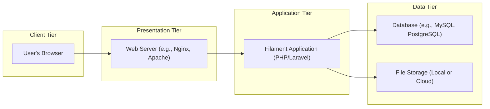
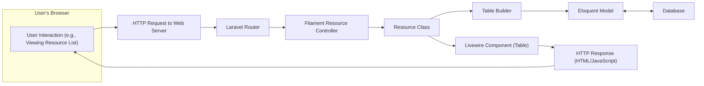

# Project Design Document: Filament Admin Panel Builder

**Version:** 1.1
**Date:** October 26, 2023
**Author:** AI Software Architect

## 1. Introduction

This document provides a detailed architectural design of the Filament admin panel builder, an open-source project for rapidly building admin interfaces in PHP using the Laravel framework. This document aims to provide a comprehensive understanding of the system's components, interactions, data flow, and security considerations, specifically tailored for subsequent threat modeling activities. This revision incorporates feedback and expands upon the initial design.

## 2. Goals and Objectives

The primary goals of Filament are to:

* **Accelerated Development:** Empower developers to swiftly construct sophisticated admin panels with minimal boilerplate code.
* **Robust Extensibility:** Offer a highly adaptable architecture that supports customization and the addition of new features through packages and custom components.
* **Intuitive User Experience:** Deliver a refined and user-friendly interface for efficient management of application data.
* **Sustainable Maintainability:** Be built upon established PHP frameworks and sound architectural principles, ensuring long-term maintainability and evolution.

This design document aims to achieve the following objectives:

* Clearly define the major architectural components of the Filament platform.
* Illustrate the interactions and data flow between these components in various scenarios.
* Identify key security considerations, potential vulnerabilities, and built-in safeguards.
* Provide a robust foundation for conducting thorough and effective threat modeling exercises.

## 3. System Architecture

Filament is architected as a Laravel package, adhering to the Model-View-Controller (MVC) pattern inherent in Laravel. It provides a rich set of pre-built UI components, abstractions, and conventions to streamline admin panel development.

### 3.1. High-Level Architecture

* **Client Tier:** Represents the user's web browser, the point of interaction with the Filament admin panel.
* **Presentation Tier:**  Consists of the web server responsible for handling incoming HTTP requests and serving the Filament application.
* **Application Tier:** The core of the system, encompassing the Filament application built with PHP and Laravel. This tier handles business logic, data processing, and rendering the user interface.
* **Data Tier:**  Comprises the persistent storage mechanisms used by the application, including the database for structured data and file storage for assets.

### 3.2. Detailed Component Architecture

The Filament application can be further decomposed into the following key components, reflecting its modular design:

* **Core Framework Components:**
    * **Filament Core Package:** Provides the foundational classes, interfaces, and service providers that underpin the entire Filament ecosystem.
    * **Admin Panel Engine:**  The central component responsible for orchestrating the display and functionality of admin panels.
    * **Plugin System:**  Allows for extending Filament's capabilities through isolated and reusable packages.
    * **Theme Engine:** Enables customization of the visual appearance of admin panels.
    * **Authentication & Authorization Layer:** Built upon Laravel's security features, managing user authentication, session management, and access control.
    * **Event System:**  Utilizes Laravel's event system for decoupling components and enabling event-driven functionality.
* **User Interface (UI) Building Blocks:**
    * **Resource Management:**  The primary abstraction for managing data entities. Each resource encapsulates:
        * **Model:** The underlying Eloquent model representing the data.
        * **Form Builder:**  Defines the structure and validation rules for data input forms.
        * **Table Builder:** Configures the display and actions for data tables.
        * **Relation Managers:**  Handles relationships between different resources.
        * **Pages:**  Customizable pages associated with the resource (e.g., index, create, edit).
    * **Form Components:** A library of pre-built UI elements for creating forms (e.g., text inputs, select boxes, checkboxes).
    * **Table Components:**  Components for displaying data in tabular format with features like sorting, searching, and pagination.
    * **Action System:**  A mechanism for defining reusable actions that can be performed on resources or within forms and tables.
    * **Notification System:**  Provides a way to display feedback and alerts to users.
    * **Navigation System:**  Manages the structure and display of the admin panel navigation menu.
    * **Livewire Components:**  Extensive use of Laravel Livewire for building reactive and dynamic UI elements, enhancing user experience without full page reloads.
* **Extension Points:**
    * **Custom Fields:**  Allows developers to create bespoke form field types.
    * **Custom Actions:** Enables the creation of application-specific actions.
    * **Widgets:**  Reusable UI components that can be placed on dashboard pages.
    * **Global Search:**  Provides a centralized search functionality across different resources.
* **External Integrations (Potential):**
    * **Mail Services:** Integration with email providers for sending notifications or password reset links.
    * **Third-Party APIs:**  Potential integration with external services for data enrichment or other functionalities.

## 4. Data Flow

The following diagram illustrates a common data flow scenario within the Filament application when a user interacts with a resource listing page:

1. **User Interaction:** The user navigates to a resource listing page in the admin panel.
2. **HTTP Request:** The browser sends an HTTP request to the web server.
3. **Laravel Router:** The Laravel router maps the request to the appropriate Filament resource controller.
4. **Filament Resource Controller:** The controller receives the request and interacts with the relevant `Resource` class to fetch data.
5. **Resource Class:** The `Resource` class defines how to retrieve and present data for the requested resource. It interacts with the `Table Builder`.
6. **Table Builder:**  Configures the data to be displayed in the table, including columns, sorting, and filtering. It uses the Eloquent model to query the database.
7. **Eloquent Model:** The Eloquent model constructs and executes database queries.
8. **Database:** The database retrieves the requested data.
9. **Livewire Component (Table):** The Livewire component responsible for rendering the data table receives the data and dynamically updates the UI.
10. **HTTP Response:** The controller sends an HTTP response containing HTML and JavaScript to the browser, rendering the resource list.

## 5. User Roles and Permissions

Filament leverages Laravel's robust authentication and authorization system. Common user roles and permission considerations include:

* **Super Administrator:** Possesses unrestricted access to all features, resources, and settings within the Filament admin panel. Typically responsible for system-wide configurations.
* **Administrator:**  Has broad access to manage various resources and configurations, but may have some restrictions compared to the Super Administrator. For example, they might not be able to manage user roles.
* **Editor:**  Can create, read, update, and potentially delete specific types of resources. Their access is typically limited to certain data entities. For instance, an editor might manage blog posts but not user accounts.
* **Viewer:**  Has read-only access to specific resources. They can view data but cannot modify it. An example would be a role that can view sales reports but not edit customer information.

Filament allows for fine-grained permission control. Developers can define specific abilities (e.g., `create`, `view`, `update`, `delete`) for each resource and assign these abilities to roles or individual users using Laravel's policies and gates. This enables highly customized access control tailored to the application's needs.

## 6. Security Considerations

Security is a paramount concern in Filament's design. Key security aspects and considerations include:

* **Secure Authentication:**
    * **Username/Password Authentication:**  Leverages Laravel's built-in authentication system, encouraging the use of strong password policies.
    * **Session Management:** Securely manages user sessions using HTTP-only and secure cookies to prevent session hijacking.
    * **Two-Factor Authentication (2FA):** Filament can be integrated with 2FA packages to enhance login security.
* **Robust Authorization:**
    * **Role-Based Access Control (RBAC):**  Facilitates the implementation of RBAC through Laravel's authorization features.
    * **Policy-Based Authorization:**  Allows developers to define granular access control rules based on user roles and specific resource attributes.
    * **Gate-Based Authorization:** Provides a simple way to define authorization logic using closures.
* **Input Validation and Output Encoding:**
    * **Form Validation:** Filament's form builder provides a declarative way to define validation rules, preventing invalid data from being processed.
    * **Output Escaping:**  Blade templating engine automatically escapes output to prevent Cross-Site Scripting (XSS) attacks.
* **Protection Against Common Web Vulnerabilities:**
    * **Cross-Site Request Forgery (CSRF) Protection:** Laravel's built-in CSRF protection is automatically enabled in Filament forms.
    * **Mass Assignment Protection:** Eloquent's `$fillable` and `$guarded` properties help prevent unintended modification of model attributes.
    * **SQL Injection Prevention:**  Eloquent ORM uses parameterized queries, mitigating the risk of SQL injection vulnerabilities.
* **File Upload Security:**
    * **File Type Validation:**  Developers can implement validation rules to restrict uploaded file types.
    * **File Size Limits:**  Limiting the size of uploaded files can help prevent denial-of-service attacks.
    * **Secure File Storage:**  Storing uploaded files in a secure location with appropriate access controls.
* **Dependency Management:**
    * **Composer:**  Utilizes Composer for managing dependencies, allowing for easy updates and vulnerability patching.
    * **Regular Updates:**  Encouraging developers to keep Filament and its dependencies up-to-date.
* **Security Headers:**
    * **Content Security Policy (CSP):**  Developers can configure CSP headers to mitigate XSS attacks.
    * **HTTP Strict Transport Security (HSTS):**  Encouraging the use of HTTPS and HSTS headers.
* **Rate Limiting:** Laravel's rate limiting features can be applied to login routes and other sensitive endpoints to prevent brute-force attacks.
* **Regular Security Audits:**  Recommending periodic security assessments and code reviews to identify potential vulnerabilities.

## 7. Deployment

Filament applications, being Laravel applications, can be deployed using various methods:

* **Traditional Server Deployment:** Deploying the application on a web server (e.g., Nginx, Apache) running PHP and a database (e.g., MySQL, PostgreSQL). This involves manual configuration and management of the server environment.
* **Containerization (Docker):** Packaging the application and its dependencies into Docker containers for consistent and reproducible deployments. This simplifies deployment across different environments and improves scalability.
* **Platform as a Service (PaaS):** Utilizing cloud-based platforms like:
    * **Laravel Vapor:** A serverless deployment platform specifically designed for Laravel applications.
    * **Heroku:** A general-purpose PaaS that supports PHP applications.
    * **AWS Elastic Beanstalk:** An AWS service for deploying and scaling web applications.
    * **DigitalOcean App Platform:** A PaaS offering from DigitalOcean.
* **Serverless Deployment:**  Leveraging serverless functions (e.g., AWS Lambda with Bref) for specific parts of the application, although this is less common for full Filament admin panels.

Deployment typically involves configuring the web server to point to the application's public directory, setting up environment variables (especially database credentials and application keys), and running database migrations.

## 8. Assumptions and Constraints

The following assumptions and constraints are relevant to this design document:

* **Laravel Dependency:**  Filament is tightly coupled with the Laravel framework and assumes familiarity with Laravel's concepts and conventions.
* **PHP Environment:**  The application requires a compatible PHP version and necessary PHP extensions.
* **Database Requirement:**  A relational database (e.g., MySQL, PostgreSQL) is required for storing application data.
* **Web Server Requirement:** A web server (e.g., Nginx, Apache) is necessary to serve the application.
* **Open Source Nature:** Filament's source code is publicly available, which can be beneficial for transparency but also requires careful attention to security best practices.
* **Community-Driven Development:**  Filament's development is driven by the open-source community, which can lead to rapid innovation but also potential inconsistencies.

## 9. Future Considerations

* **Advanced Security Features:**
    * **Integration with Security Scanning Tools:**  Automated vulnerability scanning during development and deployment.
    * **Web Application Firewall (WAF) Integration:**  Adding a WAF for enhanced protection against web attacks.
    * **Content Security Policy (CSP) Management UI:**  A more user-friendly interface for configuring CSP headers.
* **Scalability and Performance Enhancements:**
    * **Caching Strategies:** Implementing more sophisticated caching mechanisms for database queries and UI components.
    * **Queueing Systems:**  Utilizing queues for handling long-running tasks asynchronously.
    * **Database Optimization:**  Strategies for optimizing database performance.
* **Improved Accessibility:**  Ongoing efforts to ensure the admin panel is fully accessible to users with disabilities, adhering to accessibility standards (e.g., WCAG).
* **Enhanced Testing and Quality Assurance:**  Expanding the test suite and implementing more rigorous testing processes.
* **More Granular Permission Management UI:**  Providing a more intuitive interface for managing user roles and permissions within the admin panel itself.

This revised document provides a more detailed and comprehensive architectural overview of the Filament admin panel builder, specifically tailored for threat modeling purposes. It clarifies component interactions, expands on security considerations, and provides a more robust foundation for identifying potential vulnerabilities.
