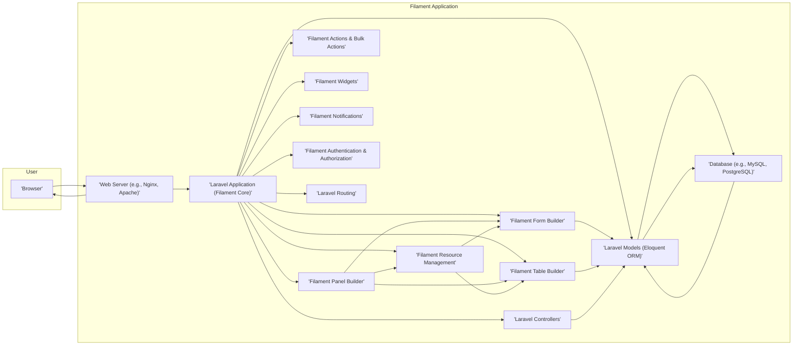

# Project Design Document: Filament Admin Panel Framework

**Project Link:** https://github.com/filamentphp/filament

**Document Version:** 1.1
**Date:** October 26, 2023
**Author:** AI Software Architect

## 1. Introduction

This document provides an enhanced architectural design of the Filament admin panel framework, building upon the previous version. It offers a more detailed breakdown of key components, their interactions, data flow, and security considerations. This refined document aims to provide a stronger foundation for understanding the system's structure and will serve as a more comprehensive input for subsequent threat modeling activities.

Filament is a rapid application development (RAD) framework built on top of Laravel, specifically designed to streamline the creation of elegant and functional admin panels. It offers a rich ecosystem of pre-built, customizable components and high-level abstractions, empowering developers to efficiently construct interfaces for managing application data and settings. This document targets developers and security professionals seeking a deep understanding of Filament's architecture.

## 2. Goals and Objectives

The primary goals of Filament are to:

*   Empower developers with an intuitive and efficient interface for building sophisticated admin panels rapidly.
*   Offer a diverse and highly customizable suite of UI components to meet varied application needs.
*   Abstract away the complexities of common admin panel development tasks, allowing developers to focus on core business logic.
*   Ensure seamless integration within the Laravel ecosystem, leveraging its features and conventions.
*   Prioritize security and adhere to industry best practices throughout its design and implementation.

This design document aims to:

*   Clearly and comprehensively define the architectural components that constitute the Filament framework.
*   Illustrate the intricate interactions and dependencies between these components.
*   Provide a detailed description of the data flow within the framework for various user interactions.
*   Highlight specific security considerations, potential vulnerabilities, and built-in safeguards.
*   Serve as a robust and detailed reference for conducting thorough threat modeling exercises.

## 3. System Architecture

Filament adopts a layered architecture, deeply integrated with Laravel's Model-View-Controller (MVC) pattern. It introduces its own specialized abstractions and components that extend and enhance Laravel's core functionalities for admin panel development.

### 3.1. High-Level Architecture

**Components:**

*   **User (Browser):** The end-user who interacts with the Filament admin panel through a web browser interface.
*   **Web Server:**  Software (e.g., Nginx, Apache) responsible for handling incoming HTTP requests and serving the Filament application's assets and responses.
*   **Laravel Application (Filament Core):** The central part of the application, built upon the Laravel framework, which integrates and orchestrates Filament's components. It manages request handling, routing, and core application logic.
*   **Filament Panel Builder:**  Provides the tools and APIs for developers to define and customize the overall structure, branding, and navigation of their admin panels.
*   **Filament Resource Management:**  A core feature for managing database records, providing a standardized interface for CRUD (Create, Read, Update, Delete) operations. It defines how data is presented, edited, and manipulated.
*   **Filament Form Builder:**  Enables developers to construct dynamic and interactive forms for data input and editing within resources, settings pages, and other contexts.
*   **Filament Table Builder:**  Facilitates the creation of interactive and feature-rich data tables for displaying collections of records, including functionalities like sorting, searching, and filtering.
*   **Filament Actions & Bulk Actions:**  Provides mechanisms for executing specific operations on individual records (Actions) or on multiple selected records simultaneously (Bulk Actions).
*   **Filament Widgets:**  Reusable UI components that can be placed on dashboard pages to display key information, statistics, or provide quick access to specific functionalities.
*   **Filament Notifications:**  A system for displaying in-application notifications to users, providing feedback or alerts about events within the system.
*   **Filament Authentication & Authorization:**  Manages user authentication (login, logout) and authorization (access control), determining what actions users are permitted to perform based on their roles and permissions. It often leverages Laravel's built-in authentication features.
*   **Laravel Routing:**  The component responsible for mapping incoming HTTP requests to the appropriate controllers and actions within the Filament application.
*   **Laravel Controllers:**  Handle the specific business logic associated with different routes and user interactions within the Filament admin panel.
*   **Laravel Models (Eloquent ORM):**  Represent database tables as PHP objects, providing an intuitive interface for querying and manipulating data within the database.
*   **Database:**  The persistent storage system (e.g., MySQL, PostgreSQL) where the application's data is stored and managed.

### 3.2. Detailed Component Breakdown

*   **Filament Panel Builder:**
    *   Defines the overall layout, theme, and branding of the admin panel.
    *   Allows registration of:
        *   **Resources:**  Represent entities managed within the admin panel.
        *   **Pages:**  Custom standalone pages for specific functionalities or information display.
        *   **Widgets:**  Reusable components for dashboard displays.
        *   **Menu Items:**  Defines the navigation structure of the admin panel.
    *   Manages global search functionality across resources.
*   **Filament Resource Management:**
    *   Provides a structured way to manage data associated with Eloquent models.
    *   Key elements include:
        *   **List Page:** Displays a tabular view of records with features like sorting, filtering, and searching.
        *   **Create Page:** Presents a form for creating new records.
        *   **Edit Page:**  Provides a form for modifying existing records.
        *   **View Page:**  Displays detailed information about a specific record.
        *   **Relation Managers:**  Allows managing relationships between different resources directly within a resource's view.
*   **Filament Form Builder:**
    *   Offers a fluent and expressive API for building forms.
    *   Supports a wide range of field types (e.g., text inputs, select boxes, checkboxes, file uploads).
    *   Includes features for:
        *   **Validation Rules:** Defining constraints on user input.
        *   **Field Customization:**  Modifying field labels, hints, and other attributes.
        *   **Conditional Logic:**  Showing or hiding fields based on the values of other fields.
        *   **Custom Components:**  Integrating custom form field components.
*   **Filament Table Builder:**
    *   Enables the creation of dynamic and interactive data tables.
    *   Features include:
        *   **Column Definitions:**  Specifying which model attributes to display and how.
        *   **Sorting:**  Allowing users to sort data by different columns.
        *   **Searching:**  Providing a search interface to filter records.
        *   **Filtering:**  Enabling users to filter records based on specific criteria.
        *   **Pagination:**  Breaking down large datasets into manageable pages.
        *   **Custom Columns:**  Displaying calculated values or custom content.
        *   **Column Toggling:**  Allowing users to show or hide specific columns.
*   **Filament Actions & Bulk Actions:**
    *   **Actions:**  Trigger specific operations on individual records, often leading to state changes or external interactions. Examples include: "Approve," "Download Report," "Send Email."
    *   **Bulk Actions:**  Apply the same action to multiple selected records simultaneously, improving efficiency for batch operations. Examples include: "Delete Selected," "Export Selected."
    *   Actions can be customized with confirmation modals and form inputs.
*   **Filament Widgets:**
    *   Self-contained UI components designed for dashboard display.
    *   Can fetch and display data from various sources, including the database or external APIs.
    *   Examples: Statistic cards displaying key metrics, charts visualizing data trends, lists of recent activity.
*   **Filament Notifications:**
    *   Provides a system for displaying non-blocking notifications to users within the admin panel.
    *   Notifications can be triggered by various events, such as successful form submissions, background task completion, or system alerts.
    *   Supports different notification levels (e.g., success, error, warning).
*   **Filament Authentication & Authorization:**
    *   Handles user login and logout functionality, typically integrating with Laravel's authentication guards.
    *   Provides mechanisms for defining user roles and permissions, allowing for granular control over access to resources and actions.
    *   Often utilizes Laravel's policies to define authorization logic for specific models and actions.

## 4. Data Flow

A typical user interaction within a Filament admin panel involves the following data flow:

1. **User Initiates Action:** The user interacts with the admin panel through their web browser, for example, by clicking a link, submitting a form, or triggering an action.
2. **HTTP Request Sent:** The browser sends an HTTP request to the web server, specifying the requested resource or action.
3. **Laravel Routing Directs Request:** The Laravel router analyzes the incoming request and matches it to a defined route within the Filament application's routing configuration.
4. **Controller Action Invoked:** The matched route triggers the execution of a corresponding controller action, which may reside within Filament's core controllers or custom application controllers.
5. **Filament Components Process Request:** The controller action interacts with relevant Filament components (e.g., Resource Management, Form Builder, Table Builder) to handle the specific request. This might involve:
    *   **Form Generation:** Using the Form Builder to construct forms for data input.
    *   **Data Retrieval:** Utilizing Eloquent models to fetch data from the database.
    *   **Data Manipulation:**  Creating, updating, or deleting records through Eloquent models.
    *   **Action Execution:**  Triggering custom logic defined within Filament Actions or Bulk Actions.
6. **Eloquent ORM Interacts with Database:** Filament components leverage Laravel's Eloquent ORM to generate and execute database queries, abstracting away the complexities of raw SQL.
7. **Database Operations Performed:** The database system executes the queries, retrieving or modifying the requested data.
8. **Response Data Prepared:** The controller action, in conjunction with Filament components, prepares the data to be sent back to the user's browser.
9. **Livewire Components Rendered:** Filament utilizes Livewire components to dynamically render the user interface. Data is passed to these components, which handle the rendering of HTML, CSS, and JavaScript.
10. **HTTP Response Sent:** The web server sends an HTTP response back to the user's browser, containing the rendered UI updates or the results of the requested action.
11. **Browser Updates UI:** The browser receives the response and updates the displayed admin panel interface accordingly, providing feedback to the user.

**Example: Filtering records in a resource list:**

1. User interacts with the filter controls in the resource's list page.
2. Browser sends an AJAX request to the server with the filter parameters.
3. Laravel routing directs the request to the resource's index method or a specific filtering endpoint.
4. The controller action utilizes the Filament Table Builder's filtering capabilities to modify the Eloquent query.
5. Eloquent ORM executes a database query with the applied filters.
6. The database returns the filtered set of records.
7. The controller prepares the filtered data.
8. Livewire components re-render the table with the filtered results.
9. The browser updates the displayed table.

## 5. Key Security Considerations

Filament, built upon the robust foundation of Laravel, inherits many of its inherent security features. However, specific considerations within the Filament context are crucial for comprehensive threat modeling:

*   **Authentication and Authorization Vulnerabilities:**
    *   **Weak Password Policies:**  Failure to enforce strong password requirements can lead to compromised accounts.
    *   **Insufficient Role-Based Access Control (RBAC):**  Improperly configured roles and permissions can grant unauthorized access to sensitive data or functionalities.
    *   **Authorization Bypass:**  Vulnerabilities in authorization logic could allow users to perform actions they are not permitted to.
    *   **Session Hijacking:**  Exploiting vulnerabilities in session management to gain unauthorized access to user accounts.
*   **Input Validation and Sanitization Weaknesses:**
    *   **SQL Injection:**  Malicious SQL code injected through user inputs can compromise the database. Filament's use of Eloquent helps mitigate this, but raw queries or improper use of `DB::raw()` can introduce risks.
    *   **Cross-Site Scripting (XSS):**  Injecting malicious scripts into web pages viewed by other users. Filament's Livewire components provide some protection, but developers must still sanitize user-generated content.
    *   **Cross-Site Request Forgery (CSRF):**  Tricking authenticated users into performing unintended actions. Laravel's built-in CSRF protection must be correctly implemented in all forms.
    *   **Mass Assignment Exploits:**  Unprotected model attributes can be maliciously modified through unexpected input. Proper use of `$fillable` and `$guarded` properties is essential.
*   **Insecure File Handling:**
    *   **Unrestricted File Uploads:**  Allowing users to upload any type of file without proper validation can lead to security risks.
    *   **Path Traversal:**  Exploiting vulnerabilities in file upload or access mechanisms to access files outside the intended directories.
    *   **Malicious File Execution:**  Uploading and executing malicious scripts or executables.
*   **Dependency Vulnerabilities:**
    *   Outdated or vulnerable dependencies can introduce security flaws. Regularly updating Filament and its dependencies is crucial.
*   **Information Disclosure:**
    *   Exposing sensitive information in error messages, debug logs, or publicly accessible files.
*   **Insecure Direct Object References (IDOR):**
    *   Allowing users to access resources directly by manipulating IDs without proper authorization checks.
*   **Third-Party Package Risks:**
    *   Using insecure or poorly maintained third-party packages can introduce vulnerabilities. Thoroughly vetting external dependencies is important.

## 6. Deployment Considerations

Deploying Filament applications involves standard PHP web server configurations, but security best practices are paramount:

*   **Secure Server Configuration:**
    *   **Operating System Hardening:**  Securing the underlying operating system.
    *   **Web Server Hardening:**  Configuring web servers (Nginx, Apache) with security in mind, disabling unnecessary modules, and setting appropriate permissions.
    *   **PHP Configuration:**  Securing the PHP environment by disabling dangerous functions and setting appropriate limits.
*   **HTTPS Enforcement:**  Always use HTTPS to encrypt communication between the client and server, protecting sensitive data in transit.
*   **Firewall Configuration:**  Implement firewalls to restrict network access to only necessary ports and services.
*   **Database Security:**
    *   **Strong Database Credentials:**  Using strong, unique passwords for database access.
    *   **Restricted Database Access:**  Limiting database access to only authorized users and applications.
    *   **Regular Database Backups:**  Ensuring data can be recovered in case of an incident.
*   **Regular Security Audits and Penetration Testing:**  Periodically assess the deployed application for vulnerabilities.
*   **Environment Variable Management:**  Securely manage sensitive configuration data (e.g., API keys, database credentials) using environment variables and avoid hardcoding them in the codebase.
*   **Content Security Policy (CSP):**  Implement CSP headers to mitigate XSS attacks by controlling the sources from which the browser is allowed to load resources.

## 7. Technologies Used

*   **PHP:** The core server-side scripting language.
*   **Laravel:** The foundational PHP framework providing structure and features.
*   **Livewire:** A full-stack framework for Laravel enabling dynamic, reactive interfaces using PHP.
*   **Alpine.js:** A lightweight JavaScript framework for enhancing front-end interactivity.
*   **Tailwind CSS:** A utility-first CSS framework for styling the user interface.
*   **Eloquent ORM:** Laravel's object-relational mapper for database interactions.
*   **Blade Templating Engine:** Laravel's templating engine for creating dynamic views.
*   **Composer:** The dependency manager for PHP.
*   **Node.js and npm/yarn:** Required for compiling front-end assets (CSS and JavaScript).
*   **Database (e.g., MySQL, PostgreSQL, SQLite):** For persistent data storage.

## 8. Conclusion

This enhanced design document provides a more granular and detailed understanding of the Filament admin panel framework's architecture, data flow, and security considerations. It serves as a valuable and more comprehensive resource for developers and security professionals involved in building and securing applications with Filament. This detailed information is crucial for conducting thorough threat modeling, identifying potential vulnerabilities, and implementing appropriate security measures to build robust and secure admin panel solutions.