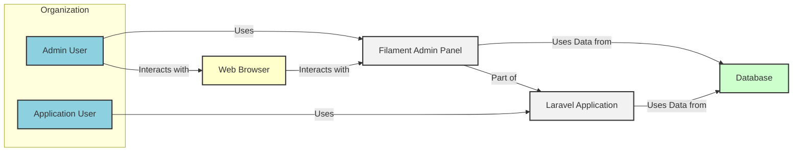
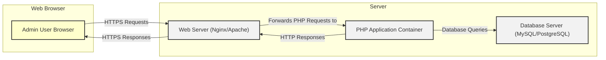
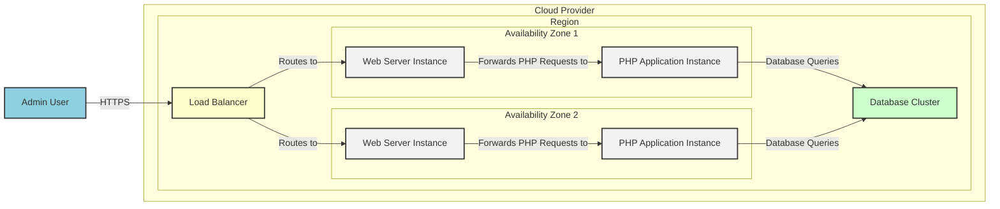
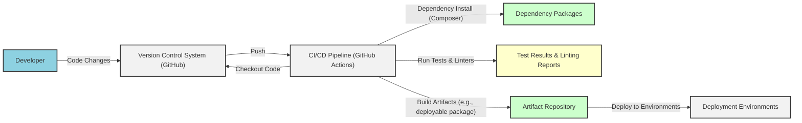

# BUSINESS POSTURE

- Business Priorities and Goals:
 - Rapid development of administrative interfaces for Laravel applications.
 - Simplified and user-friendly interface for managing application data and functionalities.
 - Reusable components and features to accelerate development workflows.
 - Extensibility and customization to adapt to specific project requirements.
 - Lowering the barrier to entry for building complex admin panels.

- Business Risks:
 - Security vulnerabilities in generated admin panels due to misconfiguration or insecure coding practices by developers using Filament.
 - Dependency on the Filament project and its maintainers for ongoing support and security updates.
 - Potential for performance bottlenecks if Filament is not used efficiently or if the underlying Laravel application is not optimized.
 - Risk of data breaches if access control and data validation are not properly implemented in Filament-based admin panels.
 - Compatibility issues with future versions of Laravel or other dependencies, requiring maintenance and updates.

# SECURITY POSTURE

- Existing Security Controls:
 - security control: Laravel framework security features (CSRF protection, protection against SQL injection, etc.) - Implemented by Laravel framework.
 - security control: Authentication and authorization mechanisms provided by Laravel and Filament - Implemented within the application code and Filament framework.
 - security control: Input validation and sanitization practices within Laravel applications - Implemented by developers using Filament and Laravel features.
 - security control: Secure coding practices awareness among Laravel developers - Relies on developer training and best practices.
 - security control: Dependency management using Composer to manage and update PHP packages - Implemented using Composer tool.
 - security control: Version control system (Git) for code management and tracking changes - Implemented using Git and GitHub.

- Accepted Risks:
 - accepted risk: Security vulnerabilities in third-party packages used by Filament and Laravel - Mitigated by regular dependency updates and security audits.
 - accepted risk: Misconfiguration of server environment leading to security issues - Mitigated by following security best practices for server configuration.
 - accepted risk: Human error in development and deployment leading to security vulnerabilities - Mitigated by code reviews, testing, and automation.
 - accepted risk: Open-source nature of Filament means vulnerabilities might be publicly disclosed before patches are available - Mitigated by active community and prompt security response from maintainers.

- Recommended Security Controls:
 - security control: Implement automated security scanning (SAST/DAST) in the development pipeline to identify potential vulnerabilities early.
 - security control: Conduct regular security audits and penetration testing of Filament-based applications to identify and address security weaknesses.
 - security control: Enforce strong password policies and multi-factor authentication for administrative users.
 - security control: Implement rate limiting and brute-force protection for login endpoints.
 - security control: Regularly update Filament and Laravel dependencies to patch known security vulnerabilities.
 - security control: Provide security training for developers using Filament to promote secure coding practices.

- Security Requirements:
 - Authentication:
  - Requirement: Secure authentication mechanism for administrative users.
  - Requirement: Support for strong password policies (complexity, rotation, lockout).
  - Requirement: Option for multi-factor authentication (MFA) for enhanced security.
  - Requirement: Protection against brute-force attacks on login endpoints.

 - Authorization:
  - Requirement: Role-based access control (RBAC) to manage user permissions and access to different features and data.
  - Requirement: Granular permission management to control access at the resource level.
  - Requirement: Secure session management to prevent session hijacking.
  - Requirement: Principle of least privilege should be applied to user roles and permissions.

 - Input Validation:
  - Requirement: Comprehensive input validation for all user inputs to prevent injection attacks (SQL injection, XSS, etc.).
  - Requirement: Server-side validation should be enforced for all critical data inputs.
  - Requirement: Proper sanitization and encoding of user inputs before displaying or storing them.
  - Requirement: Protection against mass assignment vulnerabilities.

 - Cryptography:
  - Requirement: Secure storage of sensitive data (passwords, API keys, etc.) using strong encryption algorithms.
  - Requirement: Use of HTTPS for all communication to protect data in transit.
  - Requirement: Secure generation and management of cryptographic keys.
  - Requirement: Protection of sensitive data at rest and in transit.

# DESIGN

## C4 CONTEXT

- Context Diagram Elements:
 - - Name: "Admin User"
   - Type: Person
   - Description: Internal users who manage the application through the Filament Admin Panel.
   - Responsibilities: Managing application data, configuring system settings, user management.
   - Security controls: Authentication via Filament Admin Panel, Role-Based Access Control within the application.

 - - Name: "Application User"
   - Type: Person
   - Description: End-users who interact with the public-facing Laravel Application (not the admin panel).
   - Responsibilities: Using the application's features and functionalities.
   - Security controls: Authentication and authorization mechanisms defined within the Laravel Application.

 - - Name: "Filament Admin Panel"
   - Type: Software System
   - Description: Administrative interface built using Filament PHP, providing tools for managing the Laravel Application.
   - Responsibilities: Data management, user administration, system configuration, reporting.
   - Security controls: Authentication, Authorization, Input Validation, Session Management, HTTPS.

 - - Name: "Laravel Application"
   - Type: Software System
   - Description: The core web application built using the Laravel framework, which Filament extends to provide an admin panel.
   - Responsibilities: Serving application functionalities to end-users, data processing, business logic.
   - Security controls: Laravel's built-in security features, custom security implementations, database access controls.

 - - Name: "Database"
   - Type: Database
   - Description: Persistent storage for application data, used by both the Laravel Application and Filament Admin Panel.
   - Responsibilities: Storing and retrieving application data, ensuring data integrity and availability.
   - Security controls: Database access controls, encryption at rest (optional), regular backups.

 - - Name: "Web Browser"
   - Type: Browser
   - Description: User interface for interacting with the Filament Admin Panel and the Laravel Application.
   - Responsibilities: Rendering user interfaces, sending user requests, displaying application responses.
   - Security controls: Browser security features, HTTPS support, Content Security Policy (CSP) from the application.

## C4 CONTAINER

- Container Diagram Elements:
 - - Name: "Web Server (Nginx/Apache)"
   - Type: Container
   - Description: Web server responsible for handling HTTP/HTTPS requests, serving static files, and proxying requests to the PHP Application Container.
   - Responsibilities: Request routing, SSL termination, static content serving, load balancing (optional).
   - Security controls: HTTPS configuration, firewall rules, web server hardening, rate limiting.

 - - Name: "PHP Application Container"
   - Type: Container
   - Description: Container running the PHP application (Laravel and Filament), responsible for application logic, handling requests, and interacting with the database.
   - Responsibilities: Application logic execution, request handling, data processing, authentication and authorization, input validation.
   - Security controls: Application-level security controls (Laravel/Filament security features), input validation, secure coding practices, dependency management, session management.

 - - Name: "Database Server (MySQL/PostgreSQL)"
   - Type: Container
   - Description: Database server responsible for storing and managing application data.
   - Responsibilities: Data persistence, data retrieval, data integrity, database access control.
   - Security controls: Database access controls, database hardening, encryption at rest (optional), regular backups, firewall rules.

 - - Name: "Admin User Browser"
   - Type: Container
   - Description: Web browser used by admin users to access the Filament Admin Panel.
   - Responsibilities: Rendering the admin panel UI, sending requests to the web server, displaying responses.
   - Security controls: Browser security features, adherence to web security standards.

## DEPLOYMENT

Deployment Architecture: Cloud-based deployment using a cloud provider like AWS, Azure, or Google Cloud.

- Deployment Diagram Elements:
 - - Name: "Load Balancer"
   - Type: Load Balancer
   - Description: Distributes incoming HTTPS traffic across multiple Web Server Instances for high availability and scalability.
   - Responsibilities: Traffic distribution, health checks, SSL termination, DDoS protection (cloud provider managed).
   - Security controls: SSL/TLS configuration, access control lists, DDoS protection, security monitoring.

 - - Name: "Web Server Instance"
   - Type: Instance (VM/Container)
   - Description: Virtual machines or containers running the Web Server (Nginx/Apache) software. Deployed in multiple availability zones for redundancy.
   - Responsibilities: Handling HTTP/HTTPS requests, serving static content, proxying requests to PHP Application Instances.
   - Security controls: Operating system hardening, web server hardening, firewall rules, intrusion detection system (IDS), security updates.

 - - Name: "PHP Application Instance"
   - Type: Instance (VM/Container)
   - Description: Virtual machines or containers running the PHP Application Container (Laravel/Filament). Deployed in multiple availability zones for redundancy.
   - Responsibilities: Executing application logic, handling requests, interacting with the database.
   - Security controls: Application-level security controls, runtime environment security, security updates, container security (if using containers).

 - - Name: "Database Cluster"
   - Type: Database Cluster
   - Description: Managed database service (e.g., AWS RDS, Azure Database for PostgreSQL) providing high availability and scalability.
   - Responsibilities: Data persistence, data replication, automated backups, database management.
   - Security controls: Database access controls, encryption at rest and in transit, automated backups, security monitoring, vulnerability scanning (cloud provider managed).

 - - Name: "Admin User"
   - Type: User
   - Description: Administrator accessing the Filament Admin Panel through their web browser.
   - Responsibilities: Managing the application through the admin panel.
   - Security controls: Strong passwords, multi-factor authentication, secure workstation.

## BUILD

- Build Process Elements:
 - - Name: "Developer"
   - Type: Person
   - Description: Software developer writing and modifying the application code.
   - Responsibilities: Writing code, committing changes, running local tests, initiating build process.
   - Security controls: Secure development environment, code review, secure coding practices training.

 - - Name: "Version Control System (GitHub)"
   - Type: VCS
   - Description: Central repository for source code, tracking changes and enabling collaboration.
   - Responsibilities: Code storage, version control, branch management, access control.
   - Security controls: Access control (authentication and authorization), branch protection, audit logs, secure communication (HTTPS).

 - - Name: "CI/CD Pipeline (GitHub Actions)"
   - Type: CI/CD
   - Description: Automated pipeline for building, testing, and deploying the application.
   - Responsibilities: Automated build process, running tests, static analysis, security scans, deployment automation.
   - Security controls: Secure pipeline configuration, secret management, access control, audit logs, vulnerability scanning of pipeline components.

 - - Name: "Dependency Packages (Composer)"
   - Type: Package Repository
   - Description: Repository for PHP dependencies managed by Composer (e.g., Packagist).
   - Responsibilities: Providing necessary libraries and packages for the application.
   - Security controls: Dependency vulnerability scanning, using trusted package sources, dependency pinning.

 - - Name: "Test Results & Linting Reports"
   - Type: Artifact
   - Description: Output from automated tests and code linters, providing feedback on code quality and potential issues.
   - Responsibilities: Reporting test status, identifying code quality issues, highlighting potential vulnerabilities.
   - Security controls: Secure storage of test results, access control to reports.

 - - Name: "Artifact Repository"
   - Type: Artifact Repository
   - Description: Repository for storing build artifacts (e.g., deployable packages, container images).
   - Responsibilities: Storing and versioning build artifacts, providing artifacts for deployment.
   - Security controls: Access control, secure storage, artifact integrity verification, vulnerability scanning of artifacts.

 - - Name: "Deployment Environments"
   - Type: Environment
   - Description: Target environments where the application is deployed (e.g., staging, production).
   - Responsibilities: Running the application, serving users, providing application functionalities.
   - Security controls: Environment isolation, security configurations, access control, monitoring and logging.

# RISK ASSESSMENT

- Critical Business Processes:
 - User management (creating, updating, deleting admin users).
 - Data management (creating, reading, updating, deleting application data through the admin panel).
 - System configuration management (managing application settings and parameters).
 - Access control management (defining roles and permissions for admin users).

- Data Sensitivity:
 - User credentials (passwords, API keys) - Highly sensitive, require strong encryption and access control.
 - Application data (depending on the application domain) - Sensitivity varies, may include personally identifiable information (PII), financial data, or confidential business information. Requires appropriate data protection measures based on sensitivity.
 - System configuration data - Potentially sensitive, may contain secrets or configuration details that could be exploited if exposed. Requires secure storage and access control.
 - Audit logs - Sensitive, contain records of user activities and system events, important for security monitoring and incident response. Requires secure storage and access control.

# QUESTIONS & ASSUMPTIONS

- Questions:
 - What is the specific sensitivity level of the data managed by the Filament Admin Panel?
 - What are the compliance requirements (e.g., GDPR, HIPAA, PCI DSS) that the application needs to adhere to?
 - What is the organization's risk appetite regarding security vulnerabilities?
 - Are there any specific security tools or technologies already in use within the organization that should be integrated?
 - What is the expected user base and traffic volume for the application?

- Assumptions:
 - The target environment is a cloud-based infrastructure.
 - Security is a high priority for the project.
 - The organization has a development team familiar with Laravel and PHP.
 - Standard web application security best practices are applicable.
 - The application will handle some level of sensitive data, requiring appropriate security measures.
 - The organization is looking for a comprehensive design document that can be used for threat modeling and security planning.