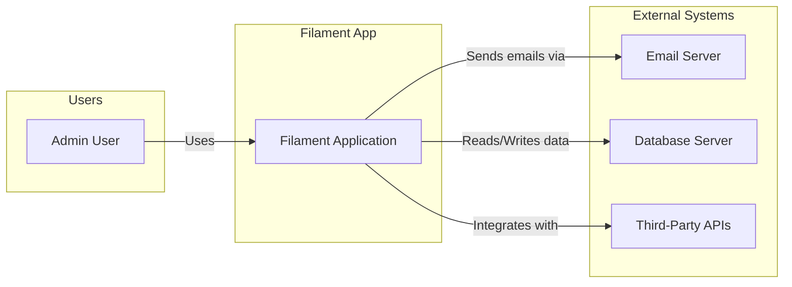
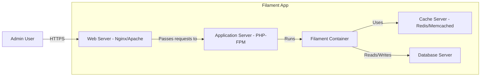
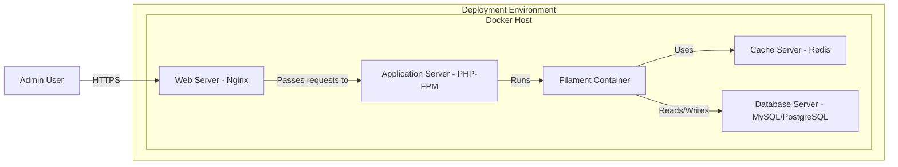
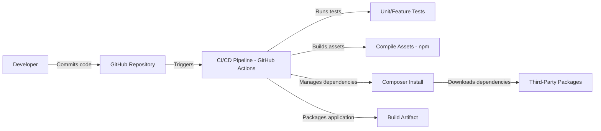

Okay, let's create a design document for the FilamentPHP project.

# BUSINESS POSTURE

FilamentPHP is an open-source collection of tools for rapidly building TALL stack apps (Tailwind, Alpine.js, Laravel, and Livewire). It appears to be targeted at individual developers and small to medium-sized teams who want to build admin panels, dashboards, and other web applications quickly and efficiently using the Laravel ecosystem.  The primary business goal is to provide a developer-friendly, feature-rich, and customizable framework that accelerates development and reduces the time to market for web applications.

Business Priorities:

*   Rapid Development: Enable developers to build applications quickly.
*   Developer Experience: Provide a clean, intuitive, and enjoyable development experience.
*   Customizability: Allow developers to easily customize and extend the framework.
*   Community Growth: Foster a strong and active community around the project.
*   Maintainability: Ensure the codebase is well-structured and maintainable.

Business Risks:

*   Security Vulnerabilities:  As a popular open-source project, Filament is a potential target for attackers. Vulnerabilities in the framework could compromise applications built with it.
*   Dependency Management:  Reliance on multiple third-party libraries (Tailwind, Alpine.js, Laravel, Livewire) introduces risks related to the security and maintenance of those dependencies.
*   Breaking Changes:  Major updates to underlying technologies (e.g., Laravel, Livewire) could introduce breaking changes that require significant effort to address.
*   Lack of Adoption: If the project fails to gain sufficient traction, it may become difficult to maintain and support in the long term.
*   Data Breaches: Applications built with Filament will likely handle sensitive data, making data breaches a significant risk.

# SECURITY POSTURE

Existing Security Controls:

*   security control: Authentication: Filament provides built-in authentication features, likely leveraging Laravel's authentication system. (Described in Filament documentation and Laravel documentation).
*   security control: Authorization: Filament offers authorization capabilities, probably using Laravel's authorization mechanisms (gates and policies). (Described in Filament documentation and Laravel documentation).
*   security control: Input Validation: Filament likely uses Laravel's validation features to validate user input. (Described in Filament documentation and Laravel documentation).
*   security control: CSRF Protection: Filament, through Laravel, includes CSRF protection to prevent cross-site request forgery attacks. (Described in Laravel documentation).
*   security control: Database Security: Filament uses Laravel's Eloquent ORM, which, when used correctly, helps prevent SQL injection vulnerabilities. (Described in Laravel documentation).
*   security control: XSS Protection: Livewire, used by Filament, has built-in mechanisms to escape output and prevent cross-site scripting (XSS) attacks. (Described in Livewire documentation).
*   security control: Dependency Management: The project uses Composer for dependency management, allowing for regular updates and security patches. (Described in `composer.json` file).

Accepted Risks:

*   accepted risk: Third-Party Dependency Vulnerabilities: While Composer helps manage dependencies, there's an inherent risk of vulnerabilities in third-party packages.
*   accepted risk: Configuration Errors: The security of applications built with Filament ultimately depends on the correct configuration and secure coding practices of the developers using it.
*   accepted risk: Zero-Day Exploits: There's always a risk of zero-day exploits in any software, including Filament and its dependencies.

Recommended Security Controls:

*   security control: Regular Security Audits: Conduct regular security audits of the Filament codebase and its dependencies.
*   security control: Penetration Testing: Perform regular penetration testing on applications built with Filament.
*   security control: Content Security Policy (CSP): Implement a strong CSP to mitigate the impact of XSS vulnerabilities.
*   security control: Security Headers: Enforce the use of security headers (e.g., HSTS, X-Frame-Options, X-Content-Type-Options) to enhance browser security.
*   security control: Rate Limiting: Implement rate limiting to protect against brute-force attacks and denial-of-service attacks.
*   security control: Two-Factor Authentication (2FA): Encourage or require the use of 2FA for user accounts.
*   security control: Automated Security Scanning: Integrate SAST (Static Application Security Testing) and DAST (Dynamic Application Security Testing) tools into the CI/CD pipeline.
*   security control: Software Composition Analysis (SCA): Use SCA tools to identify and track vulnerabilities in third-party dependencies.

Security Requirements:

*   Authentication:
    *   Support for strong password policies.
    *   Protection against brute-force attacks.
    *   Option for multi-factor authentication.
    *   Secure session management.

*   Authorization:
    *   Role-based access control (RBAC).
    *   Fine-grained permission management.
    *   Ability to restrict access to specific resources and actions.

*   Input Validation:
    *   Validate all user input on the server-side.
    *   Use a whitelist approach to define allowed input.
    *   Sanitize input to prevent XSS and other injection attacks.

*   Cryptography:
    *   Use strong, industry-standard cryptographic algorithms.
    *   Securely store sensitive data (e.g., passwords, API keys).
    *   Use HTTPS for all communication.
    *   Properly manage cryptographic keys.

# DESIGN

## C4 CONTEXT

Element Descriptions:

*   Element:
    *   Name: Admin User
    *   Type: Person
    *   Description: A user who interacts with the Filament application to manage resources.
    *   Responsibilities: Managing data, configuring the application, performing administrative tasks.
    *   Security controls: Authentication, Authorization, Session Management.

*   Element:
    *   Name: Filament Application
    *   Type: Software System
    *   Description: The web application built using the Filament framework.
    *   Responsibilities: Providing an interface for managing resources, handling user requests, interacting with external systems.
    *   Security controls: Input Validation, Output Encoding, CSRF Protection, Authentication, Authorization.

*   Element:
    *   Name: Email Server
    *   Type: Software System
    *   Description: An external system used for sending emails (e.g., notifications, password resets).
    *   Responsibilities: Delivering emails to recipients.
    *   Security controls: Secure communication (TLS), Authentication.

*   Element:
    *   Name: Database Server
    *   Type: Software System
    *   Description: The database server used to store application data.
    *   Responsibilities: Storing and retrieving data.
    *   Security controls: Access Control, Encryption at Rest, Auditing.

*   Element:
    *   Name: Third-Party APIs
    *   Type: Software System
    *   Description: External APIs that the Filament application integrates with.
    *   Responsibilities: Providing specific functionalities (e.g., payment processing, social media integration).
    *   Security controls: API Keys, OAuth, Secure Communication (TLS).

## C4 CONTAINER

Element Descriptions:

*   Element:
    *   Name: Admin User
    *   Type: Person
    *   Description: A user who interacts with the Filament application.
    *   Responsibilities: Managing data, configuring the application, performing administrative tasks.
    *   Security controls: Authentication, Authorization, Session Management.

*   Element:
    *   Name: Web Server (Nginx/Apache)
    *   Type: Container
    *   Description: The web server that receives incoming requests.
    *   Responsibilities: Handling HTTP requests, serving static content, forwarding requests to the application server.
    *   Security controls: TLS Encryption, Security Headers, Rate Limiting.

*   Element:
    *   Name: Application Server (PHP-FPM)
    *   Type: Container
    *   Description: The application server that runs the PHP code.
    *   Responsibilities: Executing PHP code, processing requests, interacting with the Filament container.
    *   Security controls: Secure Configuration, File Permissions.

*   Element:
    *   Name: Filament Container
    *   Type: Container
    *   Description: The core Filament application code.
    *   Responsibilities: Handling business logic, interacting with the database and cache, generating responses.
    *   Security controls: Input Validation, Output Encoding, CSRF Protection, Authentication, Authorization.

*   Element:
    *   Name: Cache Server (Redis/Memcached)
    *   Type: Container
    *   Description: A caching server used to improve performance.
    *   Responsibilities: Storing frequently accessed data in memory.
    *   Security controls: Access Control, Authentication (if applicable).

*   Element:
    *   Name: Database Server
    *   Type: Container
    *   Description: The database server used to store application data.
    *   Responsibilities: Storing and retrieving data.
    *   Security controls: Access Control, Encryption at Rest, Auditing.

## DEPLOYMENT

Possible Deployment Solutions:

1.  Traditional VPS (Virtual Private Server): Deploying on a VPS like DigitalOcean, Linode, or AWS EC2.
2.  Managed Laravel Hosting: Using a platform like Laravel Forge, Ploi.io, or Heroku.
3.  Containerized Deployment (Docker): Using Docker and Docker Compose, or Kubernetes.
4.  Serverless Deployment: Using AWS Lambda, Azure Functions, or Google Cloud Functions (less likely, given the nature of Filament and Livewire).

Chosen Solution: Containerized Deployment (Docker)

Element Descriptions:

*   Element:
    *   Name: Admin User
    *   Type: Person
    *   Description: A user who interacts with the deployed Filament application.
    *   Responsibilities: Managing data, configuring the application, performing administrative tasks.
    *   Security controls: Authentication, Authorization, Session Management.

*   Element:
    *   Name: Docker Host
    *   Type: Infrastructure Node
    *   Description: The server or virtual machine that hosts the Docker containers.
    *   Responsibilities: Running the Docker engine and managing the containers.
    *   Security controls: OS Hardening, Firewall, SSH Access Control.

*   Element:
    *   Name: Web Server (Nginx)
    *   Type: Container
    *   Description: The web server container.
    *   Responsibilities: Handling HTTP requests, serving static content, forwarding requests to the application server.
    *   Security controls: TLS Encryption, Security Headers, Rate Limiting, Container Isolation.

*   Element:
    *   Name: Application Server (PHP-FPM)
    *   Type: Container
    *   Description: The application server container.
    *   Responsibilities: Executing PHP code, processing requests, interacting with the Filament container.
    *   Security controls: Secure Configuration, File Permissions, Container Isolation.

*   Element:
    *   Name: Filament Container
    *   Type: Container
    *   Description: The core Filament application code container.
    *   Responsibilities: Handling business logic, interacting with the database and cache, generating responses.
    *   Security controls: Input Validation, Output Encoding, CSRF Protection, Authentication, Authorization, Container Isolation.

*   Element:
    *   Name: Cache Server (Redis)
    *   Type: Container
    *   Description: The caching server container.
    *   Responsibilities: Storing frequently accessed data in memory.
    *   Security controls: Access Control, Authentication (if applicable), Container Isolation.

*   Element:
    *   Name: Database Server (MySQL/PostgreSQL)
    *   Type: Container
    *   Description: The database server container.
    *   Responsibilities: Storing and retrieving data.
    *   Security controls: Access Control, Encryption at Rest, Auditing, Container Isolation.

## BUILD

The Filament project uses Composer for dependency management and likely employs a combination of manual and automated build steps.

Build Process Description:

1.  Developer commits code to the GitHub repository.
2.  GitHub Actions (or a similar CI/CD system) is triggered.
3.  The CI/CD pipeline runs unit and feature tests.
4.  The pipeline compiles assets (e.g., CSS, JavaScript) using npm.
5.  Composer installs project dependencies.
6.  The application is packaged into a build artifact (e.g., a Docker image, a deployment package).

Security Controls:

*   security control: Dependency Management: Composer.lock ensures consistent dependency versions.
*   security control: Automated Testing: Unit and feature tests help identify bugs early.
*   security control: Static Code Analysis: Linters and static analysis tools (potentially integrated into the CI/CD pipeline) can identify potential security vulnerabilities.
*   security control: Software Composition Analysis (SCA): Tools like Dependabot (integrated with GitHub) can identify vulnerable dependencies.

# RISK ASSESSMENT

Critical Business Processes:

*   User Authentication and Authorization: Ensuring only authorized users can access and modify data.
*   Data Management: Protecting the integrity and confidentiality of data stored and processed by applications built with Filament.
*   Application Availability: Maintaining the availability of applications built with Filament.

Data Sensitivity:

*   User Data: Personally identifiable information (PII), such as names, email addresses, and potentially more sensitive data depending on the application. Sensitivity: High.
*   Application Data: Data specific to the application built with Filament, which could range from low to high sensitivity depending on the application's purpose.
*   Configuration Data: API keys, database credentials, and other sensitive configuration information. Sensitivity: High.

# QUESTIONS & ASSUMPTIONS

Questions:

*   What specific security scanning tools are currently used (if any)?
*   Are there any existing security policies or guidelines that developers using Filament are expected to follow?
*   What is the process for reporting and addressing security vulnerabilities in Filament?
*   Are there plans to implement any of the recommended security controls in the near future?
*   What is the expected level of security expertise of developers using Filament?

Assumptions:

*   BUSINESS POSTURE: Assumes that Filament is primarily targeted at developers and small to medium-sized teams.
*   SECURITY POSTURE: Assumes that developers using Filament have a basic understanding of web security principles. Assumes that Laravel's built-in security features are used correctly.
*   DESIGN: Assumes a standard Laravel deployment architecture. Assumes that Docker is a viable deployment option. Assumes that GitHub Actions is used for CI/CD (although other CI/CD systems could be used).