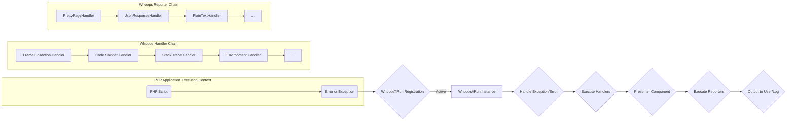
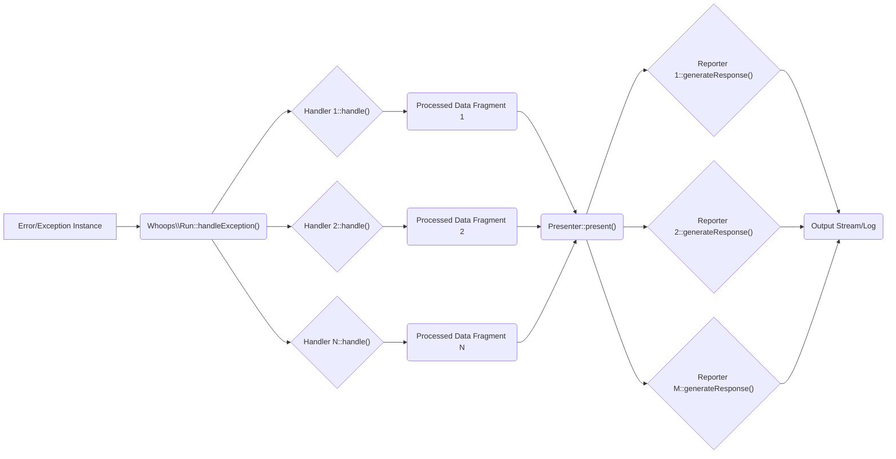

# Project Design Document: Whoops - PHP Error Handler

**Version:** 1.1
**Date:** October 26, 2023
**Author:** AI Software Architect

## 1. Introduction

This document provides a detailed design overview of the `whoops` library, a popular PHP error handler. `whoops` offers a structured and informative alternative to PHP's default error handling, significantly improving the debugging experience for developers. This document serves as the foundation for subsequent threat modeling activities.

## 2. Goals

*   Clearly and comprehensively describe the architecture and key components of the `whoops` library.
*   Illustrate the flow of error and exception data within the library.
*   Identify and detail external dependencies and their roles.
*   Provide sufficient technical detail to enable effective and targeted threat modeling.

## 3. Scope

This document focuses on the core mechanisms of the `whoops` library, specifically:

*   The process of registering and activating `whoops` as the PHP error handler.
*   The handling of uncaught PHP errors (warnings, notices, fatals) and exceptions.
*   The internal processing and formatting of error and exception information.
*   The rendering of error details in various output formats (primarily HTML, but also JSON, plain text, etc.).
*   The integration patterns of `whoops` within different PHP application contexts (web requests, command-line scripts).

This document explicitly excludes:

*   The specific implementation details of individual, contributed handlers or reporters beyond the core set.
*   The low-level workings of the PHP engine's internal error handling.
*   Performance benchmarking or optimization strategies for `whoops`.

## 4. Architecture Overview

`whoops` employs a modular architecture, centered around the interception of PHP errors and exceptions. It processes these events through a chain of handlers that gather information, followed by reporters that format and output this information.

**Key Architectural Elements:**

*   **PHP Error/Exception:** The triggering event that initiates the `whoops` error handling process.
*   **`Whoops\Run` Registration:** The act of registering an instance of `Whoops\Run` with PHP's error and exception handling functions.
*   **`Whoops\Run` Instance:** The central orchestrator, managing handlers and reporters.
*   **Handler Chain:** A sequence of individual handler components responsible for extracting and processing specific aspects of the error or exception.
*   **Presenter Component:**  An internal component that prepares the data collected by handlers for use by the reporters.
*   **Reporter Chain:** A sequence of reporter components responsible for formatting and outputting the processed error information.

## 5. Component Description

*   **`Whoops\Run`:**
    *   The core class responsible for initializing and managing the error handling process.
    *   Registers itself with PHP functions like `set_error_handler` and `set_exception_handler`.
    *   Holds the collection of registered handlers and reporters.
    *   Provides methods to add, configure, and execute handlers and reporters.
    *   Determines the appropriate reporter to use based on the environment (e.g., web request, CLI).
*   **Handlers (Examples):**
    *   **`Whoops\Handler\PrettyPageHandler`:** Generates an interactive HTML page displaying detailed error information, including stack frames, code snippets, and request/response details. It also acts as a reporter.
    *   **`Whoops\Handler\JsonResponseHandler`:** Formats the error details as a JSON response, suitable for APIs. It also acts as a reporter.
    *   **`Whoops\Handler\PlainTextHandler`:** Outputs a simple, plain-text representation of the error. It also acts as a reporter.
    *   **`Whoops\Handler\CallbackHandler`:** Allows developers to inject custom error handling logic via a callable.
    *   **`Whoops\Handler\FrameCollectionHandler`:**  Collects and organizes the stack frames associated with the error or exception.
    *   **`Whoops\Handler\CodeSnippetHandler`:** Extracts relevant lines of code surrounding the point of error from the source file.
    *   **`Whoops\Handler\StackTraceHandler`:** Provides access to the raw stack trace information.
    *   **`Whoops\Handler\EnvironmentHandler`:** Gathers details about the PHP environment, including loaded extensions and PHP settings.
*   **Reporters (Examples):**
    *   As noted above, `PrettyPageHandler`, `JsonResponseHandler`, and `PlainTextHandler` often function as both handlers and reporters.
    *   Custom reporters can be implemented to send error information to logging services, monitoring systems, or other destinations.
*   **`Whoops\Exception\Inspector`:**
    *   A utility class used to introspect exception objects and extract relevant data.
    *   Provides methods to access the exception message, code, file, line number, and stack trace.
    *   Used internally by handlers to gather information.
*   **`Whoops\Util\SystemFacade`:**
    *   An abstraction layer over certain PHP global functions (e.g., `header`, `ob_start`).
    *   Improves testability by allowing for mocking of these functions.
*   **`Whoops\Exception\FrameCollection`:**
    *   Represents a collection of `Whoops\Exception\Frame` objects.
    *   Provides methods for iterating through and manipulating the stack frames.
*   **`Whoops\Exception\Frame`:**
    *   Represents a single frame in the call stack.
    *   Contains information about the function, file, line number, arguments, and object context of the frame.

## 6. Data Flow

When a PHP error or exception occurs and `whoops` is active, the data flows through the following stages:

1. A PHP script encounters an error condition (e.g., division by zero, undefined variable) or throws an exception.
2. PHP's internal error/exception handling mechanism is bypassed, and control is passed to the registered `Whoops\Run` instance.
3. The `Whoops\Run` instance receives the error level and message (for errors) or the exception object.
4. `Whoops\Run` iterates through its registered handlers. Each handler receives the error/exception information.
5. Handlers process the information. For example:
    *   `FrameCollectionHandler` analyzes the backtrace.
    *   `CodeSnippetHandler` reads the relevant source code file.
    *   `EnvironmentHandler` gathers environment variables.
6. The collected and processed data is passed to the Presenter component.
7. The Presenter prepares the data in a format suitable for the reporters.
8. `Whoops\Run` then iterates through its registered reporters.
9. Each reporter receives the processed data from the Presenter.
10. Reporters format the data for output. For instance:
    *   `PrettyPageHandler` renders an HTML page.
    *   `JsonResponseHandler` creates a JSON response.
11. The formatted output is sent to the user (e.g., displayed in the browser) or logged, depending on the reporter and configuration.

## 7. External Dependencies

*   **PHP:** The fundamental runtime environment for the library.
*   **Composer:**  The standard PHP package manager, typically used for installing and managing `whoops` as a dependency.
*   Potentially other third-party libraries if custom handlers or reporters are implemented that rely on them for specific functionalities (e.g., a logging library for a custom logging reporter).

## 8. Deployment Considerations

`whoops` is generally integrated into PHP projects by requiring it as a dependency via Composer. The library needs to be initialized and registered as the error and exception handler early in the application's bootstrap process.

*   **Web Applications:**  `whoops` is commonly used in development environments to provide detailed error pages directly in the browser, facilitating rapid debugging. It is crucial to disable or configure it to use less verbose reporting (e.g., logging errors instead of displaying them) in production environments for security and user experience reasons.
*   **Command-Line Interface (CLI) Applications:** `whoops` can provide structured and informative error output directly in the terminal, improving the debugging experience for CLI tools and scripts.
*   **API Applications:**  `whoops` can be configured to return error information in structured formats like JSON, making it easier for API clients to handle errors programmatically. The `JsonResponseHandler` is particularly relevant in this context.

## 9. Security Considerations (Initial)

This section provides an initial overview of security considerations related to the `whoops` library. A dedicated threat modeling exercise, informed by this design document, will provide a more in-depth analysis.

*   **Information Disclosure:** The primary security concern with `whoops` is the potential for exposing sensitive information through its detailed error reports. This information can include:
    *   **File Paths:** Revealing the internal structure of the application.
    *   **Source Code Snippets:** Exposing potentially vulnerable code.
    *   **Environment Variables:**  Potentially leaking API keys, database credentials, or other sensitive configuration details.
    *   **Stack Traces:**  Providing insights into the application's execution flow and internal function calls, which could aid attackers in understanding the system.
    This risk is particularly high if `whoops` is inadvertently left enabled in production environments.
*   **Cross-Site Scripting (XSS):** If user-provided data is included in error messages or file paths and the `PrettyPageHandler` does not properly sanitize this data before rendering it in HTML, it could create an XSS vulnerability. An attacker could potentially inject malicious scripts that would be executed in the context of a developer's browser viewing the error page.
*   **Remote Code Execution (Indirect):** While `whoops` itself does not directly execute arbitrary code, vulnerabilities in custom handlers or reporters could potentially lead to indirect code execution. For example, a poorly implemented custom handler that processes user-supplied input without proper sanitization could be exploited.
*   **Path Traversal:** If error messages or other data processed by `whoops` contain unsanitized file paths, this could potentially be exploited to access files outside the intended scope, particularly if custom handlers or reporters interact with the filesystem based on this data.
*   **Denial of Service (DoS):**  In scenarios where errors are frequent or involve very deep call stacks, the process of generating detailed error reports could consume significant server resources (CPU, memory). If an attacker can intentionally trigger numerous errors, they might be able to cause a denial of service by overloading the server with error reporting tasks.

This design document offers a solid foundation for understanding the architecture and functionality of the `whoops` library. This understanding is crucial for conducting a thorough threat model to identify and mitigate potential security vulnerabilities.
