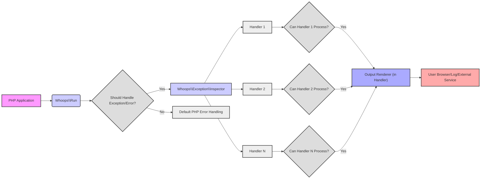

# Project Design Document: Whoops - PHP Error Handler

**Version:** 1.1
**Date:** October 26, 2023
**Author:** Gemini (AI Language Model)
**Project Repository:** https://github.com/filp/whoops

## 1. Introduction

This document provides an enhanced and detailed design overview of the `whoops` PHP error handler library. It aims to clearly describe the system's architecture, components, and data flow to facilitate a comprehensive threat modeling exercise. This document serves as a reference point for developers, security engineers, and anyone seeking to understand the inner workings of `whoops` and identify potential security vulnerabilities.

## 2. Goals

*   Provide a clear, comprehensive, and improved description of the `whoops` library's architecture and functionality.
*   Clearly identify key components and explain their interactions in detail.
*   Thoroughly outline the data flow within the system, including specific data points.
*   Serve as a robust and reliable foundation for conducting a detailed threat model of the `whoops` library.
*   Highlight potential security considerations and areas of concern.

## 3. System Overview

`whoops` is a standalone PHP library designed to provide a more informative and developer-friendly error and exception handling experience compared to PHP's default error reporting mechanisms. When an uncaught exception or error occurs in a PHP application integrated with `whoops`, it intercepts the error and presents a detailed diagnostic interface. This interface typically includes:

*   A clear and concise error message explaining the issue.
*   A detailed stack trace, illustrating the sequence of function calls leading to the error, including file paths and line numbers.
*   Contextual code snippets surrounding the line where the error occurred, aiding in immediate debugging.
*   Information about the request environment, such as GET parameters, POST data, Cookies, and Session variables, providing valuable context for debugging.

The library is designed with extensibility in mind, allowing developers to customize error presentation and handling through the use of various "handlers." This flexibility makes `whoops` adaptable to different environments and application needs.

### 3.1. High-Level Architecture



## 4. Detailed Design

### 4.1. Key Components

*   **`Whoops\Run`:** This is the core orchestrator of the error handling process.
    *   It is responsible for registering itself with PHP's error handling mechanisms (`set_error_handler`, `set_exception_handler`).
    *   It manages a collection of `HandlerInterface` instances, which are responsible for processing and displaying error information.
    *   It determines if an error or exception should be handled by `whoops` based on configured settings.
*   **`Whoops\Handler\HandlerInterface`:** This interface defines the contract for all error handlers within `whoops`.
    *   The primary method is `handle()`, which is invoked when an error or exception needs to be processed by the handler.
    *   Handlers receive an instance of `Whoops\Exception\Inspector` to access error details.
*   **`Whoops\Handler\PrettyPageHandler`:** A built-in handler designed for development environments.
    *   It renders a visually appealing HTML page containing detailed error information.
    *   This includes the error message, a formatted stack trace with clickable frames, and code snippets surrounding the error line.
    *   It also displays request information (GET, POST, Cookies, Session) and server/environment variables.
*   **`Whoops\Handler\JsonResponseHandler`:** A handler suitable for API responses.
    *   It formats the error information into a JSON structure.
    *   This allows for programmatic access to error details by client applications.
*   **`Whoops\Handler\CallbackHandler`:** Provides a mechanism for developers to define custom error handling logic using a PHP callable.
    *   This offers maximum flexibility in how errors are processed and reported.
*   **`Whoops\Handler\PlainTextHandler`:** A simple handler that outputs error information as plain text.
    *   Useful for logging errors to files or for basic command-line output.
*   **`Whoops\Exception\Inspector`:** A utility class that encapsulates the details of the caught exception or error.
    *   It provides methods to access the error message, error code, file path, line number, and the complete stack trace.
    *   It also offers methods to retrieve context code snippets around specific lines in the stack trace.
*   **`Whoops\Util\TemplateHelper`:**  Used internally by handlers like `PrettyPageHandler` to generate HTML output.
    *   It provides functions for escaping data to prevent XSS vulnerabilities and for formatting information for display.

### 4.2. Data Flow

1. **Error/Exception Triggered:** An uncaught exception or a PHP error (depending on error reporting level) occurs within the PHP application's execution.
2. **`Whoops\Run` Interception:** Because `Whoops\Run` has been registered as the error and exception handler, it intercepts the triggered event.
3. **Should Handle Determination:** `Whoops\Run` evaluates if the current error or exception should be handled by `whoops`. This might involve checking the error reporting level or other configured criteria.
4. **`Whoops\Exception\Inspector` Creation:** An instance of `Whoops\Exception\Inspector` is created. This object encapsulates all the relevant details of the error or exception, such as the error message, code, file, line, and the stack trace.
5. **Handler Iteration and Selection:** `Whoops\Run` iterates through the registered handlers in the order they were added.
6. **Handler Processing:** For each handler, its `handle()` method is invoked. The `Inspector` instance is passed as an argument to the `handle()` method, providing the handler with access to the error details.
7. **Data Extraction and Formatting:** Within the `handle()` method, the handler uses the `Inspector` to extract the necessary information about the error.
    *   `PrettyPageHandler`: Extracts the error message, stack frames (including file paths and line numbers), and potentially retrieves code snippets using the `Inspector`. It then uses `TemplateHelper` to format this data into HTML, ensuring proper escaping of potentially malicious content. Request and environment data are also extracted and formatted.
    *   `JsonResponseHandler`: Extracts the error message, code, file, line, and stack trace and formats them into a JSON structure.
    *   `CallbackHandler`: The provided callable receives the `Inspector` instance and can implement custom logic to process the error information.
    *   `PlainTextHandler`: Extracts basic error information and formats it as plain text.
8. **Output Generation:** The chosen handler generates the output based on its specific logic.
9. **Output Delivery:** The generated output is then delivered.
    *   For `PrettyPageHandler`, the HTML output is typically sent to the user's browser.
    *   For `JsonResponseHandler`, the JSON response is returned as part of an API request.
    *   For `PlainTextHandler`, the output might be written to a log file or displayed in the command line.

### 4.3. Configuration

`whoops` offers several configuration options:

*   **Adding Handlers:** Multiple handlers can be added to the `Whoops\Run` instance using the `pushHandler()` method. Handlers are executed in the order they are added.
    ```php
    $whoops = new \Whoops\Run;
    $whoops->pushHandler(new \Whoops\Handler\PrettyPageHandler);
    $whoops->pushHandler(new \Whoops\Handler\JsonResponseHandler);
    $whoops->register();
    ```
*   **Setting a Default Handler:** While not a direct configuration, the order of handlers acts as a priority. The first handler that can process the error will typically handle it.
*   **Registering the Run Instance:** The `register()` method of the `Whoops\Run` instance must be called to activate `whoops` as the error and exception handler.
*   **Environment Mode (Implicit):**  The behavior of `whoops` is often adjusted based on the environment. For example, displaying detailed error pages in development and logging errors in production. This is typically managed by the application's logic when setting up `whoops`.

## 5. Security Considerations

This section details potential security considerations relevant to threat modeling the `whoops` library.

*   **Information Disclosure:**
    *   The `PrettyPageHandler` displays extensive information, including file paths, code snippets, environment variables (potentially containing API keys or database credentials), GET/POST parameters (which might include sensitive user data), Cookies, and Session data. If enabled in a production environment or accessible to unauthorized users, this can lead to significant information leakage.
    *   Stack traces themselves can reveal internal application logic and file structures, aiding attackers in understanding the system.
*   **Cross-Site Scripting (XSS):**
    *   If error messages, data within stack frames, or displayed request parameters contain user-supplied input that is not properly sanitized by the rendering handler (especially `PrettyPageHandler`), it can lead to XSS vulnerabilities. An attacker could craft malicious input that, when an error occurs, gets displayed and executed in another user's browser.
*   **Path Traversal:**
    *   The display of file paths in stack traces, while helpful for debugging, could expose the internal directory structure of the application to an attacker. This information can be used to identify potential configuration files or other sensitive resources.
*   **Remote Code Execution (Indirect):**
    *   While `whoops` itself doesn't directly execute arbitrary code, vulnerabilities in custom handlers (`CallbackHandler`) or in the application's logic surrounding how `whoops` is integrated could potentially lead to indirect code execution. A poorly implemented custom handler might execute code based on error information.
*   **Denial of Service (DoS):**
    *   If an attacker can trigger numerous errors, the generation and rendering of detailed error pages by `whoops`, especially `PrettyPageHandler`, can consume significant server resources (CPU, memory, I/O), potentially leading to a Denial of Service.
*   **Dependency Vulnerabilities:**
    *   `whoops` relies on other PHP libraries. Vulnerabilities in these dependencies could indirectly affect the security of `whoops`. Keeping dependencies up-to-date is crucial.
*   **Configuration Errors:**
    *   Enabling `PrettyPageHandler` in production environments without proper access controls is a significant security risk.
    *   Incorrectly configuring custom handlers could introduce vulnerabilities.

## 6. Deployment Considerations

*   **Environment Differentiation:** It is paramount to configure `whoops` differently for development and production environments.
    *   **Development:** `PrettyPageHandler` is generally acceptable for providing detailed debugging information to developers.
    *   **Production:** `PrettyPageHandler` should be disabled or replaced with handlers that log errors securely (e.g., `PlainTextHandler` writing to a secure log file) without exposing sensitive information to end-users.
*   **Handler Selection Based on Context:** Choose handlers appropriate for the application's context.
    *   For web applications intended for human users in development, `PrettyPageHandler` is suitable.
    *   For APIs, `JsonResponseHandler` is the appropriate choice for providing structured error information to clients.
    *   For background processes or production environments, logging handlers like `PlainTextHandler` are recommended.
*   **Secure Error Logging in Production:** In production, errors should be logged securely to prevent unauthorized access. Ensure log files have appropriate permissions and are not publicly accessible.
*   **Access Control for Development Tools:** If `PrettyPageHandler` is used in staging or development environments accessible over a network, ensure proper authentication and authorization mechanisms are in place to restrict access to authorized developers.
*   **Input Sanitization:** While `whoops` provides some basic escaping, the application itself should sanitize user input to prevent malicious data from appearing in error messages or request parameters that `whoops` might display.
*   **PHP Error Reporting Levels:** Configure PHP's `error_reporting` level appropriately in conjunction with `whoops`. This determines which types of errors will be caught and handled by `whoops`.

## 7. Future Considerations

*   **Enhanced Sanitization in `PrettyPageHandler`:** Implement more robust and context-aware sanitization of data displayed by `PrettyPageHandler` to further mitigate XSS risks. This could involve automatically detecting and escaping potentially harmful content.
*   **Rate Limiting for Error Handling:** Introduce optional rate limiting mechanisms within `Whoops\Run` to prevent excessive error page generation, which could be exploited for DoS attacks.
*   **Content Security Policy (CSP) Headers:** Explore the possibility of `PrettyPageHandler` setting appropriate CSP headers to further restrict the execution of potentially malicious scripts.
*   **Security Audits and Best Practices Documentation:** Regularly conduct security audits of the `whoops` codebase and provide clear documentation on security best practices for its configuration and usage.
*   **Integration with Security Monitoring Tools:** Consider ways to integrate `whoops` with security monitoring tools to facilitate the detection and analysis of potential security incidents triggered by errors.

This improved document provides a more detailed and comprehensive design overview of the `whoops` PHP error handler library, offering a stronger foundation for conducting thorough threat modeling and understanding the security implications of its use.