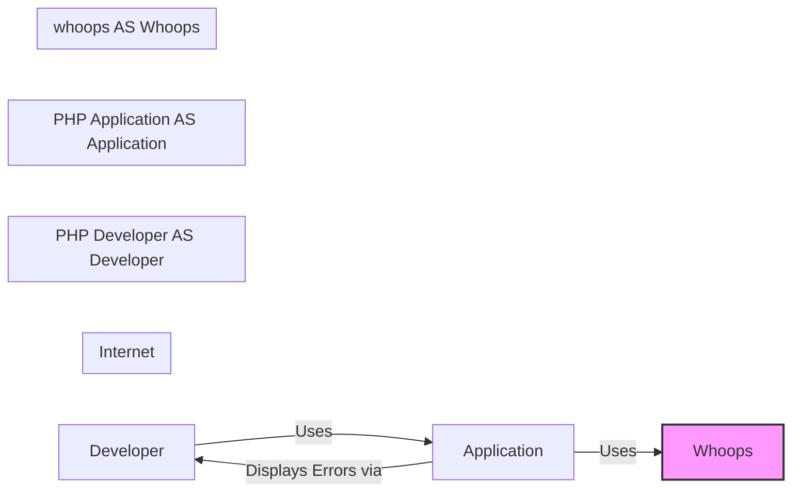
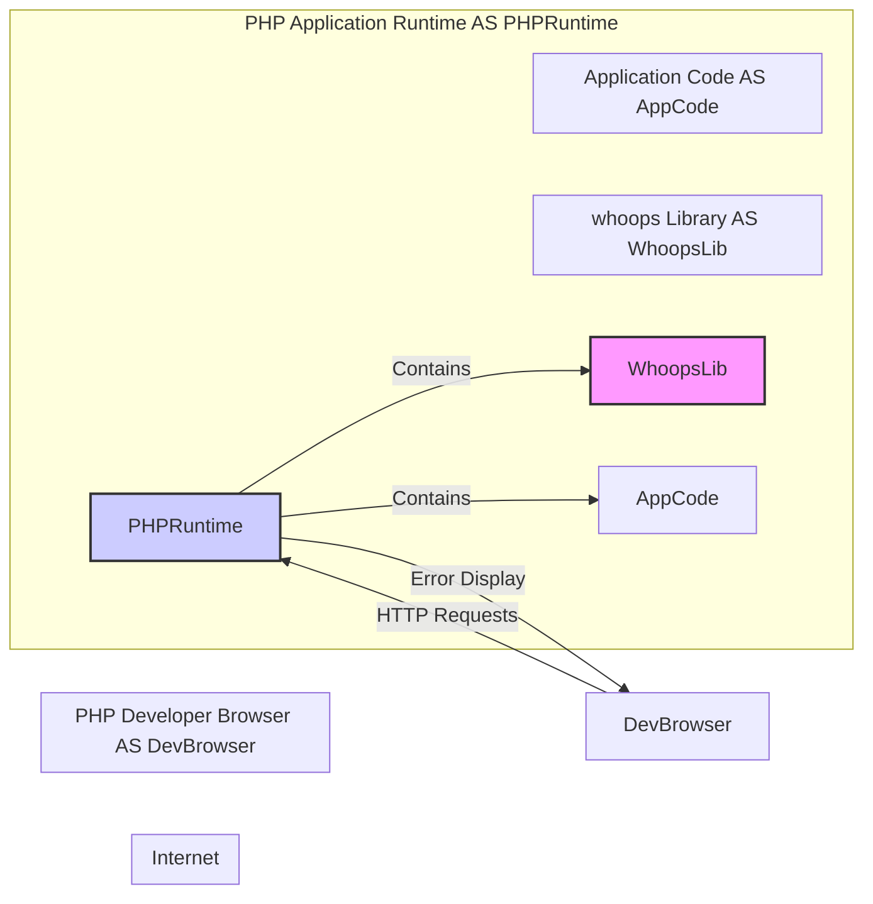
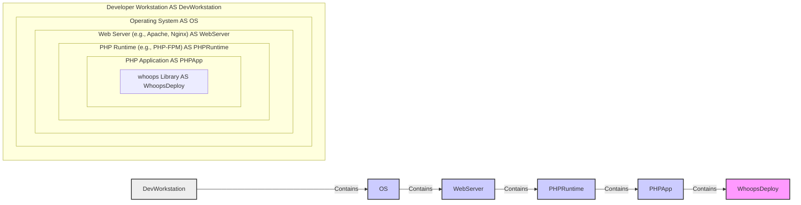

# BUSINESS POSTURE

- Business priorities and goals:
  - Improve developer experience during PHP application development.
  - Provide detailed and user-friendly error reporting to facilitate debugging.
  - Reduce development time by quickly identifying and resolving errors.
- Most important business risks:
  - Accidental exposure of sensitive application data or internal system information in production environments if whoops is not properly disabled or configured for production.
  - Potential information leakage to unauthorized users if error pages are accessible in production.
  - Risk of developers relying on detailed error messages in production, potentially masking underlying issues or performance problems.

# SECURITY POSTURE

- Existing security controls:
  - security control: Project is open-source, allowing for community review and contributions to identify and fix potential security vulnerabilities. Described in: GitHub repository visibility.
  - security control:  Uses standard PHP practices and relies on the security of the underlying PHP environment. Described in: Implicitly assumed by using PHP ecosystem.
- Accepted risks:
  - accepted risk:  Reliance on developers to properly configure and disable whoops in production environments.
  - accepted risk:  Potential for information disclosure if developers misconfigure or forget to disable whoops in production.
- Recommended security controls:
  - recommended security control: Implement automated checks in deployment pipelines to ensure whoops is disabled or configured for production environments.
  - recommended security control: Provide clear documentation and examples on how to securely configure whoops for different environments (development, staging, production).
  - recommended security control:  Consider adding a built-in mechanism to automatically disable detailed error reporting based on environment detection (e.g., checking environment variables).
- Security requirements:
  - Authentication: Not applicable for whoops itself, as it's an error handler library. Authentication is handled by the application using whoops.
  - Authorization: Not applicable for whoops itself. Authorization is handled by the application using whoops.
  - Input validation: whoops should handle error data safely and avoid introducing new vulnerabilities through its error handling logic. Input validation is relevant to how whoops processes error information, ensuring it doesn't become a vector for attacks (e.g., Cross-Site Scripting in error messages).
  - Cryptography: Not directly applicable to whoops core functionality. However, if whoops were to log or transmit error data, cryptography might be relevant for securing that data in transit or at rest (though this is outside the scope of the current project).

# DESIGN

## C4 CONTEXT



- Context Diagram Elements:
  - - Name: PHP Developer
    - Type: Person
    - Description: Software developer using PHP to build web applications.
    - Responsibilities: Develops and debugs PHP applications. Uses whoops to improve error reporting during development.
    - Security controls:  Developer workstations should be secured according to company policies.
  - - Name: PHP Application
    - Type: Software System
    - Description:  A web application built using PHP. It integrates the whoops library for error handling.
    - Responsibilities:  Executes application logic, potentially encounters errors, and uses whoops to handle and display these errors.
    - Security controls: Standard web application security controls, including input validation, output encoding, authentication, authorization, and secure configuration.
  - - Name: whoops
    - Type: Software System
    - Description:  An error handler library for PHP. It provides a user-friendly interface for displaying PHP errors and exceptions.
    - Responsibilities:  Intercepts PHP errors and exceptions, formats them into a readable and informative error page, and displays them to the developer.
    - Security controls:  Configuration options to control verbosity and enable/disable in different environments. Should not expose sensitive information in production.

## C4 CONTAINER



- Container Diagram Elements:
  - - Name: PHP Developer Browser
    - Type: Container
    - Description: Web browser used by the PHP developer to access and interact with the PHP application during development.
    - Responsibilities: Sends HTTP requests to the PHP application and renders the HTML response, including error pages generated by whoops.
    - Security controls: Browser security controls, such as protection against Cross-Site Scripting (XSS).
  - - Name: PHP Application Runtime
    - Type: Container
    - Description:  The PHP runtime environment (e.g., PHP-FPM, mod_php) executing the PHP application code.
    - Responsibilities:  Executes PHP code, handles HTTP requests, and manages the application lifecycle. Includes the whoops library for error handling.
    - Security controls: Web server security configuration, PHP runtime security configuration, and operating system security controls.
  - - Name: whoops Library
    - Type: Container
    - Description:  The whoops PHP library integrated into the PHP application.
    - Responsibilities:  Provides error handling functionality within the PHP application. Intercepts errors and generates error pages.
    - Security controls: Configuration to control error reporting level and environment detection to disable in production.
  - - Name: Application Code
    - Type: Container
    - Description: The custom PHP code of the web application, developed by the PHP developer.
    - Responsibilities: Implements the business logic and functionality of the web application. May generate errors that are handled by whoops.
    - Security controls: Secure coding practices, input validation, output encoding, and application-level security logic.

## DEPLOYMENT

- Deployment Architecture Options:
  - Local Development Environment (Developer Machine): PHP application and whoops running on the developer's local machine (e.g., using XAMPP, Docker).
  - Development/Staging Server: PHP application and whoops deployed to a shared development or staging server.
  - Production Server: PHP application deployed to a production server. (whoops should be disabled or securely configured in production).

- Detailed Deployment Architecture (Local Development Environment):



- Deployment Diagram Elements:
  - - Name: Developer Workstation
    - Type: Infrastructure Node
    - Description: The physical or virtual machine used by the PHP developer for development.
    - Responsibilities: Hosts the development environment, including the web server, PHP runtime, and PHP application.
    - Security controls: Workstation security policies, operating system security hardening, and endpoint security software.
  - - Name: Operating System
    - Type: Infrastructure Node
    - Description:  The operating system running on the developer workstation (e.g., Windows, macOS, Linux).
    - Responsibilities: Provides the base environment for running the web server and PHP runtime.
    - Security controls: Operating system security updates, access control, and security configurations.
  - - Name: Web Server (e.g., Apache, Nginx)
    - Type: Infrastructure Node
    - Description:  The web server software used to serve the PHP application.
    - Responsibilities:  Handles HTTP requests, serves static files, and forwards PHP requests to the PHP runtime.
    - Security controls: Web server security configuration, access control, and security modules (e.g., mod_security).
  - - Name: PHP Runtime (e.g., PHP-FPM)
    - Type: Infrastructure Node
    - Description:  The PHP runtime environment responsible for executing PHP code.
    - Responsibilities:  Executes PHP scripts, manages PHP processes, and interacts with the web server.
    - Security controls: PHP runtime security configuration, disabled functions, and extensions.
  - - Name: PHP Application
    - Type: Software Deployment Unit
    - Description:  The deployed PHP application code, including the whoops library.
    - Responsibilities:  Runs the application logic and uses whoops for error handling.
    - Security controls: Application-level security configurations, secure dependencies, and regular security updates.
  - - Name: whoops Library
    - Type: Software Deployment Unit
    - Description: The deployed whoops library as part of the PHP application.
    - Responsibilities: Provides error handling within the deployed application.
    - Security controls: Configuration management to ensure it's disabled or securely configured in production deployments.

## BUILD

```mermaid
flowchart LR
    subgraph "Developer Workstation" AS DevWorkstation
        "Developer Code Changes" --> "Git Repository (e.g., GitHub)"
    end
    subgraph "Git Repository (e.g., GitHub)" AS GitRepo
        "Git Repository (e.g., GitHub)" --> "Build System (e.g., Local Composer)"
    end
    subgraph "Build System (e.g., Local Composer)" AS BuildSystem
        "Build System (e.g., Local Composer)" --> "Build Artifacts (PHP Application with whoops)"
    end
    subgraph "Build Artifacts (PHP Application with whoops)" AS BuildArtifacts
    end
    style BuildArtifacts fill:#eee,stroke:#333,stroke-width:2px
    style BuildSystem fill:#eee,stroke:#333,stroke-width:2px
    style GitRepo fill:#eee,stroke:#333,stroke-width:2px
    style DevWorkstation fill:#eee,stroke:#333,stroke-width:2px
```

- Build Process Description:
  - Developer makes code changes on their workstation.
  - Code changes are committed and pushed to a Git repository (e.g., GitHub).
  - For local development, developers typically use Composer to manage PHP dependencies, including whoops.
  - Composer downloads and installs whoops and other dependencies into the project's vendor directory.
  - The build artifact is the PHP application code along with the vendor directory containing whoops and other dependencies.
- Build Process Security Controls:
  - security control:  Use of Composer's lock file (`composer.lock`) to ensure consistent dependency versions and mitigate supply chain risks. Described in: Composer documentation and best practices.
  - security control:  Code review process for developer code changes before merging into the main branch. Described in: Company's software development process.
  - security control:  Developer workstation security controls to prevent malware injection into the development environment. Described in: Company's workstation security policies.
  - recommended security control: Implement automated dependency scanning to identify known vulnerabilities in whoops and other dependencies.
  - recommended security control: Consider using a private or mirrored Composer repository to control and audit dependencies.

# RISK ASSESSMENT

- Critical business processes:
  - Software development and debugging of PHP applications.
- Data we are trying to protect:
  - Potentially sensitive application data that might be exposed in error messages generated by whoops. This could include database credentials, API keys, user data, or internal system paths.
- Data sensitivity:
  - High sensitivity in production environments. Exposure of this data in production could lead to security breaches, data leaks, and reputational damage.
  - Lower sensitivity in development environments, but still important to avoid accidental exposure of credentials or sensitive configurations even in development.

# QUESTIONS & ASSUMPTIONS

- BUSINESS POSTURE:
  - Question: Is whoops intended to be used only in development and staging environments, or are there use cases for production environments?
  - Assumption: Primarily intended for development and staging environments to improve developer productivity.
- SECURITY POSTURE:
  - Question: Are there existing security guidelines or policies regarding the use of error reporting tools in different environments within the organization?
  - Assumption: Standard security practices apply, requiring disabling detailed error reporting in production.
  - Question: Are there specific requirements for handling sensitive data within error messages (e.g., data masking or redaction)?
  - Assumption: Sensitive data should not be exposed in error messages, especially in production. Developers are responsible for preventing sensitive data from being included in error outputs.
- DESIGN:
  - Question: Are there specific deployment environments (e.g., cloud platforms, containerized environments) that need to be considered?
  - Assumption: Deployment is flexible and can be adapted to various PHP hosting environments, but the primary focus is on typical web server deployments.
  - Question: Is there an existing CI/CD pipeline that the build process should integrate with?
  - Assumption: Build process is currently assumed to be developer-driven using local tools like Composer, but could be integrated into a CI/CD pipeline for automated builds and deployments in the future.